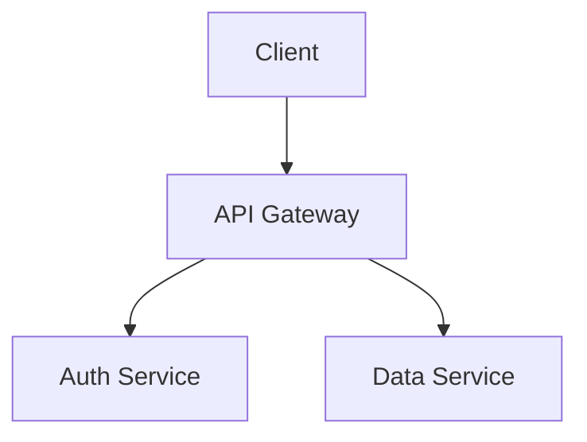
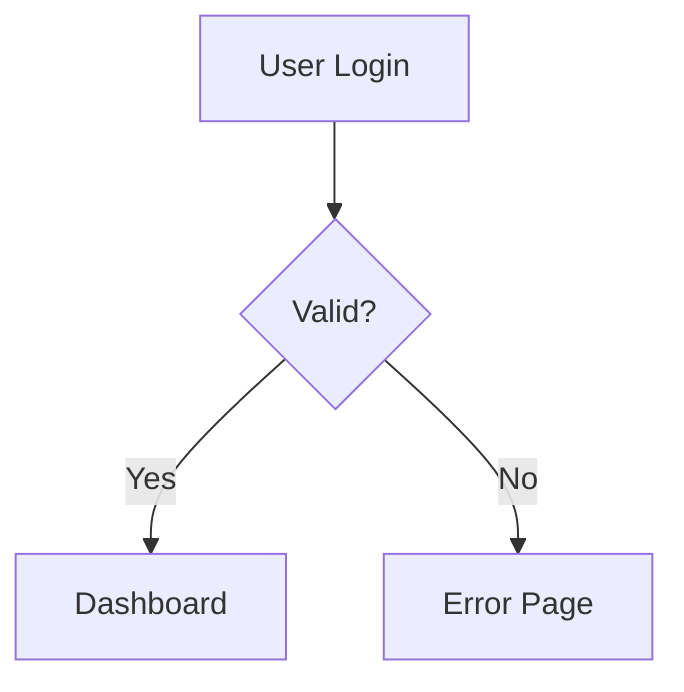
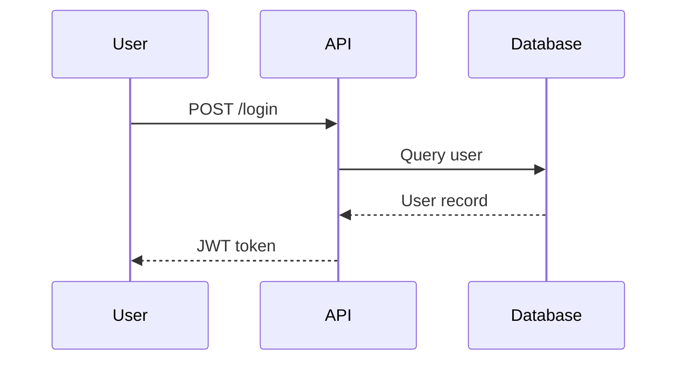
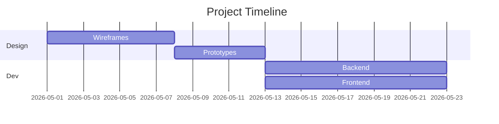

# Mermaid Chat

Generate Mermaid diagrams embedded in Markdown files with live VS Code preview.

## When to use

- User asks to create a diagram, flowchart, sequence diagram, or any visual chart
- User wants to document architecture, workflows, or data relationships visually
- User needs a Gantt chart, mindmap, or state diagram in a Markdown file
- User mentions "mermaid", "diagram", "flowchart", "sequence diagram", "Gantt", "mindmap"

## When NOT to use

- User wants an image file (PNG/SVG) — Mermaid renders inline in Markdown
- User wants D3.js interactive visualizations — use `d3js` skill instead
- User wants a hand-drawn sketch — use a design tool

## Inputs required

1. **Diagram type** — flowchart, sequence, class, Gantt, pie, ER, state, git graph, journey, mindmap
2. **Content description** — what the diagram should show
3. **Output path** — Markdown file path (default: `diagrams/diagram-name.md`)

## Workflow

### 1. Confirm diagram type and content

Ask the user for:
- What should the diagram show?
- Which diagram type fits best (suggest if unsure)
- Where to save the Markdown file

### 2. Generate Mermaid code

Write valid Mermaid syntax. Refer to [`references/mermaid-syntax.md`](references/mermaid-syntax.md) for syntax details.

**Rules:**
- Wrap Mermaid code in ````mermaid ... ```` fenced code blocks
- Use `graph TD` or `flowchart TD` for top-down flowcharts
- Use descriptive node labels: `A["Node Label"]`
- Avoid special characters in unquoted labels
- Keep diagrams readable — use subgraphs for grouping

### 3. Write Markdown file

Create the Markdown file with:
- A heading describing the diagram
- The Mermaid code block
- Optional: explanatory text before or after

Example structure:

```markdown
# Architecture Diagram

High-level system architecture showing component interactions.


```

### 4. Verify VS Code preview compatibility

The diagram renders automatically in VS Code when:
- The file has a `.md` extension
- VS Code has a Mermaid preview extension installed (see Prerequisites below)

To preview:
1. Open the Markdown file in VS Code
2. Run `Ctrl+Shift+V` (or `Cmd+Shift+V` on macOS) for side-by-side preview
3. Or right-click → "Open Preview to the Side"

## Prerequisites

Install a Mermaid extension in VS Code for live preview:
- **Mermaid Preview** by qichengzhengxiao
- **Markdown Preview Mermaid Support** by ms-vscode

## Diagram type quick reference

| Diagram | Block start | Use case |
|---------|-------------|----------|
| Flowchart | `flowchart TD` | Architecture, workflows |
| Sequence | `sequenceDiagram` | API calls, user flows |
| Class | `classDiagram` | OOP structure |
| Gantt | `gantt` | Project timelines |
| Pie | `pie` | Data distribution |
| ER | `erDiagram` | Database schemas |
| State | `stateDiagram-v2` | State machines |
| Git graph | `gitGraph` | Branch strategies |
| Journey | `journey` | User journeys |
| Mindmap | `mindmap` | Topic breakdowns |

## Examples

### Flowchart

```markdown

```

### Sequence Diagram

```markdown

```

### Gantt Chart

```markdown

```

## Troubleshooting

| Issue | Fix |
|-------|-----|
| Diagram not rendering in VS Code | Install a Mermaid preview extension |
| Syntax error in diagram | Check for unquoted special characters in node labels |
| Nodes overlapping | Use `subgraph` blocks or switch to `flowchart LR` for left-right layout |
| Preview shows raw code | Ensure code block language is `mermaid`, not `text` or empty |

## Files

- [`references/mermaid-syntax.md`](references/mermaid-syntax.md) — Complete syntax reference for all diagram types
