# Mermaid Syntax Reference

Complete syntax guide for all Mermaid diagram types.

## Table of Contents

- [Flowchart](#flowchart)
- [Sequence Diagram](#sequence-diagram)
- [Class Diagram](#class-diagram)
- [State Diagram](#state-diagram)
- [ER Diagram](#er-diagram)
- [Gantt Chart](#gantt-chart)
- [Pie Chart](#pie-chart)
- [Git Graph](#git-graph)
- [User Journey](#user-journey)
- [Mindmap](#mindmap)
- [Quadrant Chart](#quadrant-chart)
- [Timeline](#timeline)
- [Block Diagram](#block-diagram)
- [General Syntax Rules](#general-syntax-rules)

---

## Flowchart

### Syntax

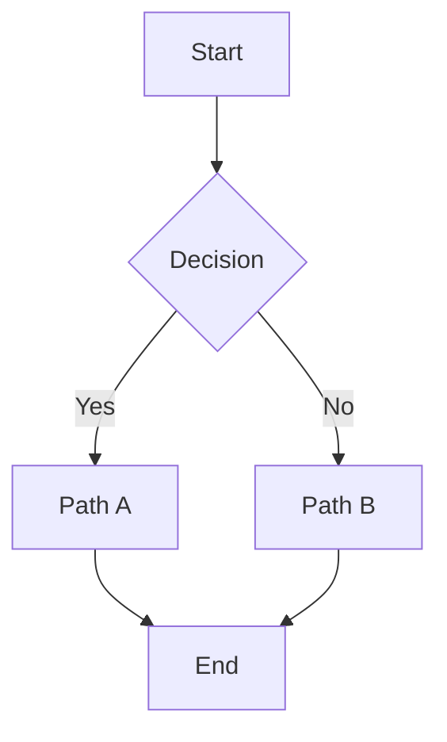

### Node types

| Syntax | Type |
|--------|------|
| `A["Label"]` | Rectangle (default) |
| `A{{"Label"}}` | Stadium/rounded |
| `A[["Label"]]` | Subroutine |
| `A[("Label")]` | Circle |
| `A[/"Label"/]` | Parallelogram |
| `A[(Label)]` | Database/cylinder |
| `A{{{"Label"}}}` | Hexagon |
| `A[("Label")]` | Diamond (decision) |

### Directions

- `TD` — Top to bottom
- `BT` — Bottom to top
- `LR` — Left to right
- `RL` — Right to left

### Links

| Syntax | Type |
|--------|------|
| `-->` | Solid line |
| `-.-` | Dashed line |
| `==>` | Thick line |
| `~~>` | Wavy line |
| `---` | No arrow |

### Styling

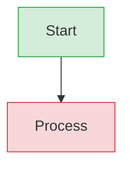

### Subgraphs

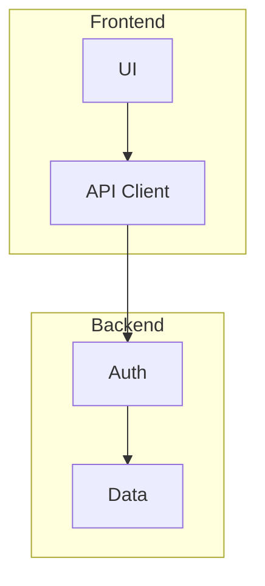

---

## Sequence Diagram

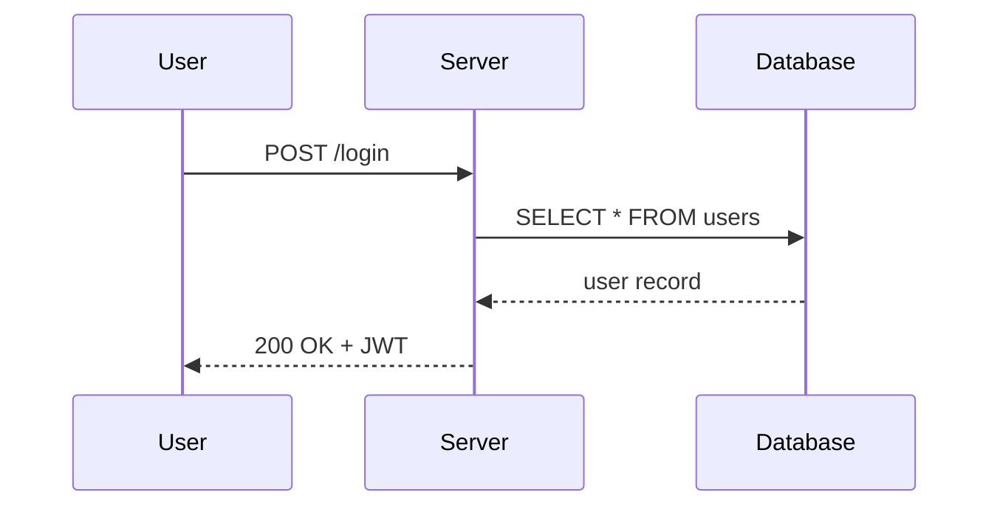

### Arrow types

| Syntax | Type |
|--------|------|
| `->>` | Solid arrow |
| `->` | Dashed arrow |
| `>>` | Solid (no tail) |
| `-->>` | Solid return |
| `--` | Dashed return |

### Notes and activations

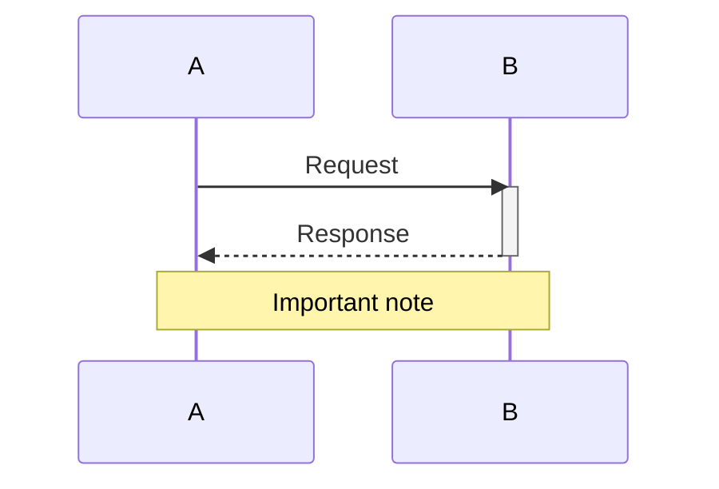

---

## Class Diagram

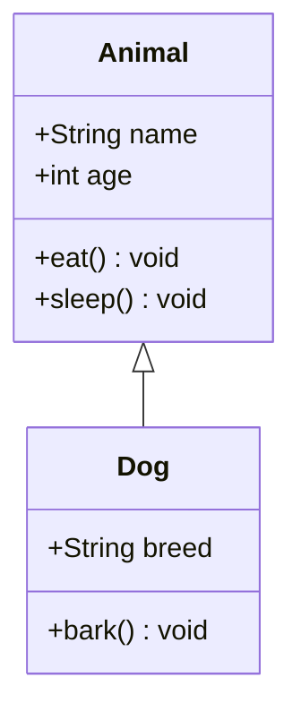

### Relationships

| Syntax | Type |
|--------|------|
| `<|--` | Inheritance |
| *-- | Composition |
| o-- | Aggregation |
| ..> | Dependency |
| <-> | Association |

---

## State Diagram

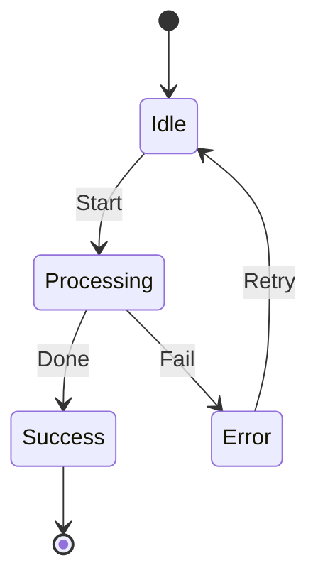

---

## ER Diagram

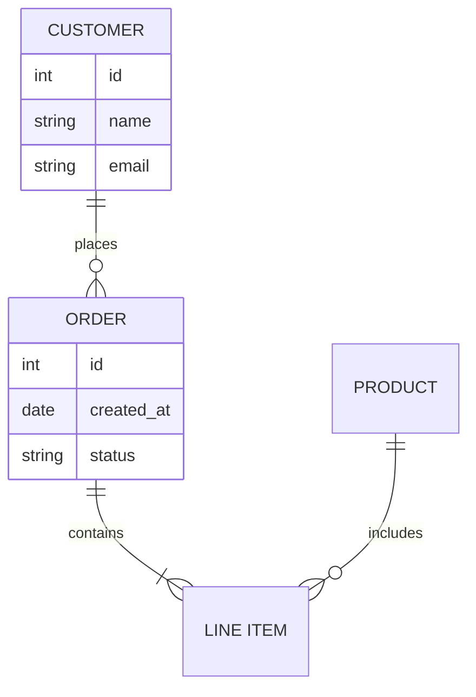

---

## Gantt Chart

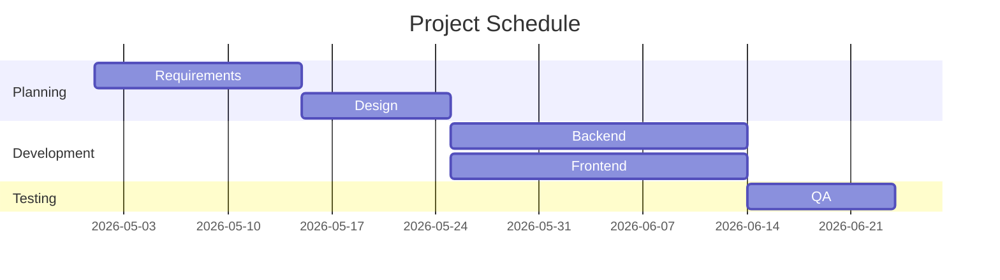

### Sections

- `section <name>` — Group tasks
- `dateFormat` — Date format (YYYY-MM-DD)
- `excludes` — Exclude weekends: `excludes weekends`

---

## Pie Chart

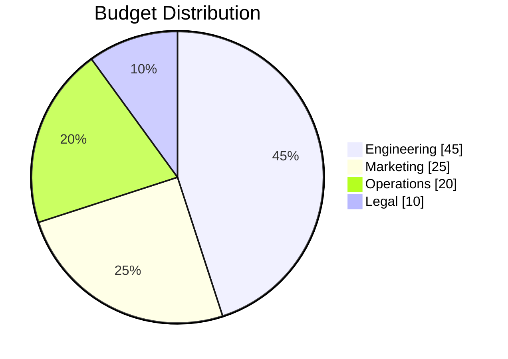

---

## Git Graph

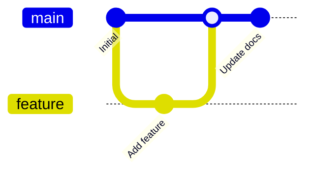

---

## User Journey

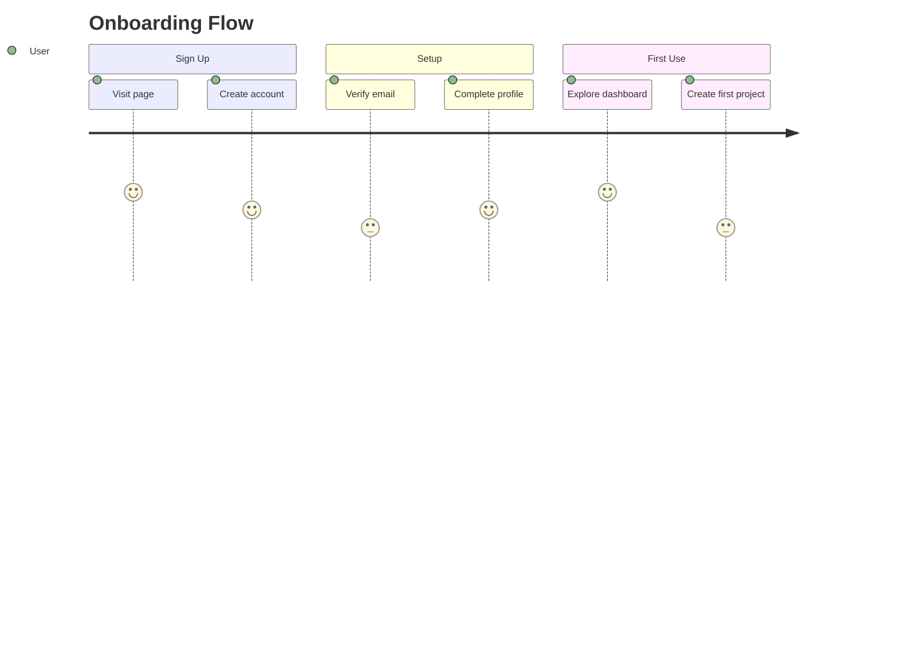

---

## Mindmap

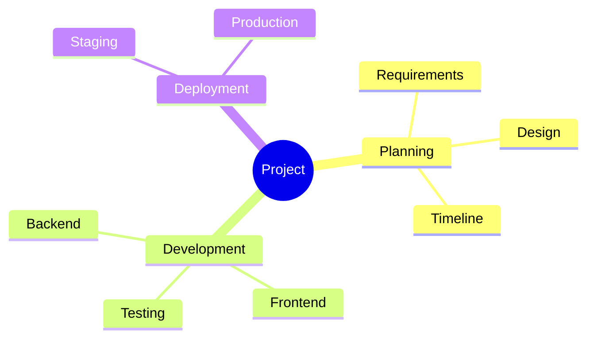

---

## Quadrant Chart

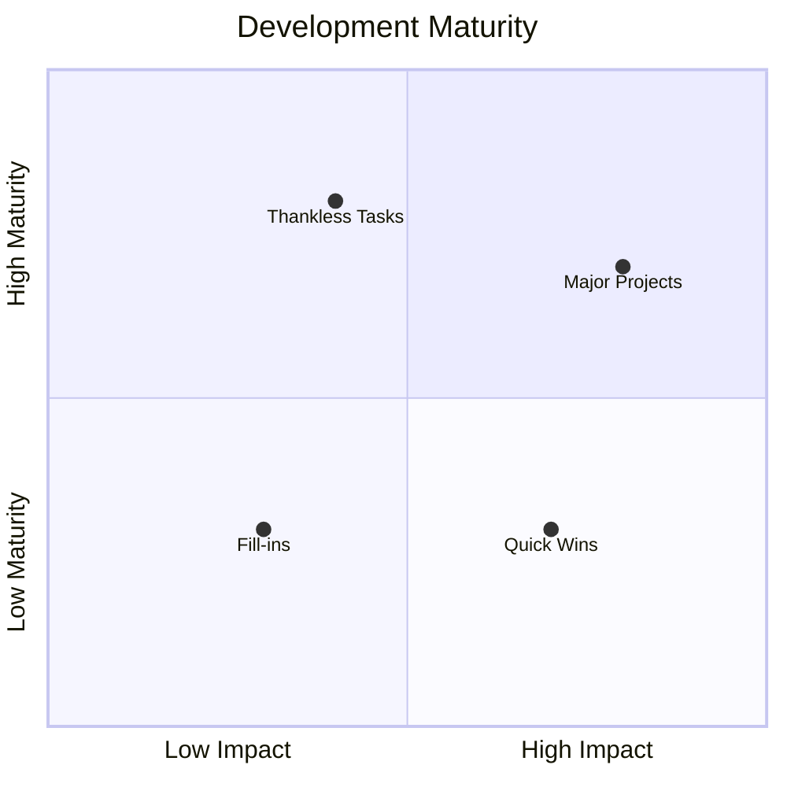

---

## Timeline

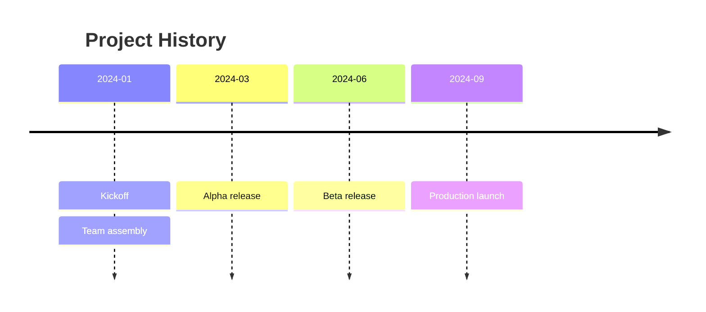

---

## Block Diagram

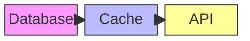

---

## General Syntax Rules

1. **Node labels with special characters** must be quoted: `A["Label (with parens)"]`
2. **Spaces in IDs** require quotes: `A["My Node"]`
3. **Comments**: `%% This is a comment`
4. **Theme**: `%%{init: {'theme': 'dark'}}%%` at the top
5. **Direction**: `flowchart TD` or `graph TD` (graph is legacy, flowchart is preferred)
6. **Styling**: Use `classDef` + `class` for consistent styling
7. **Links with labels**: `A -->|label| B`
