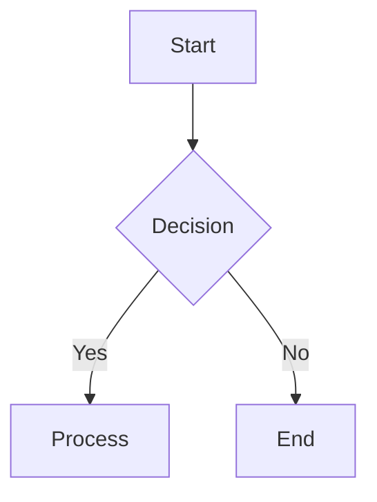
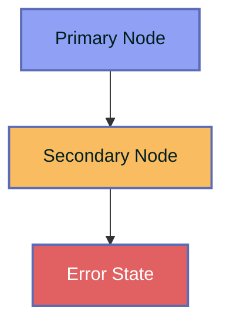
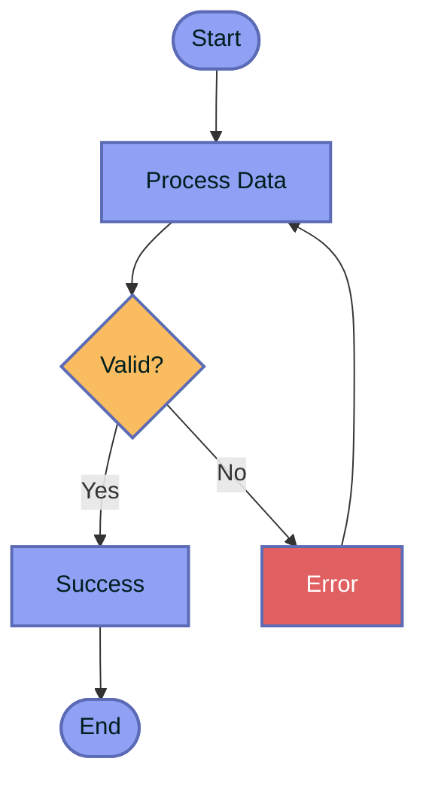
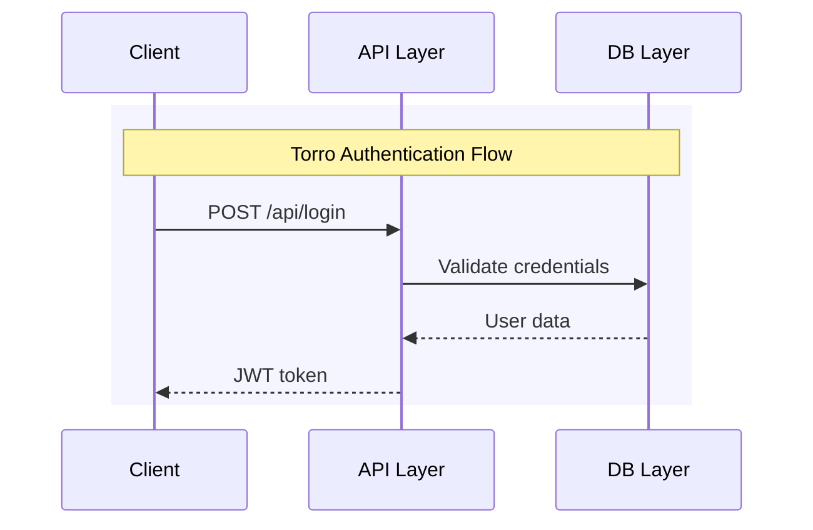
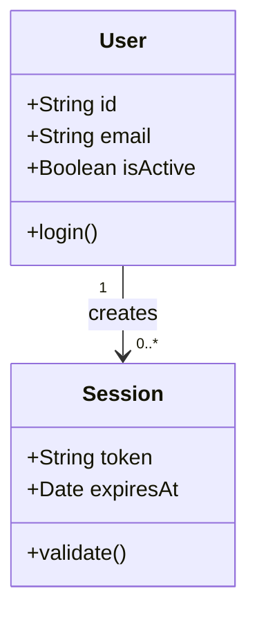

# Mermaid Diagrams - Torro Brand Compliance

## When to Use This Skill

Use this skill when you need to create Mermaid diagrams that match Torro's enterprise visual identity:

- **Flowcharts** for API flows, data pipelines, user journeys
- **Sequence diagrams** for authentication flows, service interactions
- **Class diagrams** for domain models, database schemas
- **ER diagrams** for database relationships
- **State diagrams** for workflow states, lifecycle management
- **Gantt charts** for project timelines, sprint planning
- **Architecture diagrams** for system topology, component relationships

## When NOT to Use This Skill

- For interactive data visualizations → Use [`d3js`](../d3js/SKILL.md) or [`recharts`](../recharts/SKILL.md) skills
- For node-based workflow editors → Use [`reactflow`](../reactflow/SKILL.md) skill
- For static images only → Consider exporting to SVG/PNG after rendering

## Torro Visual Standards

### Color Palette (MANDATORY)

All Mermaid diagrams MUST use these Torro colors from [`UI/src/shared/theme/tokens.ts`](UI/src/shared/theme/tokens.ts):

| Token | Hex | Usage |
|-------|-----|-------|
| `torro.primary` | `#8fa0f5` | Primary nodes, active states |
| `torro.secondary` | `#f9bc60` | Secondary nodes, highlights |
| `torro.accent` | `#e16162` | Error states, warnings |
| `torro.header` | `#5c6bb5` | Headers, navigation elements |
| `torro.text` | `#001e1d` | Primary text |
| `torro.muted` | `#9fa7ae` | Secondary text, labels |

### Contrast Compliance (CRITICAL)

Follow the [Contrast Compliance Rules](references/torro-theme.md#contrast-compliance) for all text/background combinations:

| Scenario | Background | Text/Icon Color |
|----------|------------|-----------------|
| Header Default | Purple (#5c6bb5) | White/70% |
| Header Hover | Purple (#5c6bb5) | White |
| Selected Item | White (#ffffff) | Dark Purple (#5c6bb5) |
| Inactive Item | White (#ffffff) | Grey (#9fa7ae) |

### Apple Liquid Glass Aesthetic

Apply these visual pillars to all diagrams:

| Pillar | Implementation |
|--------|----------------|
| **High-Refraction Surfaces** | Use semi-transparent fills (`fill-opacity="0.8"`) |
| **Aura Borders** | Thin borders with low opacity (`stroke-width="2"`) |
| **Depth Perception** | Layered colors for depth (darker borders) |
| **Squircle Roundness** | Rounded corners where supported (`rx="14"`) |

## Workflow

### Step 1: Define Diagram Type

Identify the diagram type and select the appropriate Mermaid syntax:



### Step 2: Apply Torro Theme Configuration

Configure Mermaid with Torro-compliant theme variables. See [Theme Configuration Reference](references/torro-theme.md#theme-configuration) for complete variable list.

**Example Configuration:**

```javascript
mermaid.initialize({
  theme: 'base',
  themeVariables: {
    primaryColor: '#8fa0f5',
    primaryBorderColor: '#5c6bb5',
    primaryTextColor: '#001e1d',
    secondaryColor: '#f9bc60',
    tertiaryColor: '#e16162',
    noteBkgColor: '#fff5ad',
    noteTextColor: '#001e1d',
    fontFamily: 'Inter, sans-serif',
    fontSize: '16px'
  }
});
```

### Step 3: Write Diagram Definition

Create the Mermaid diagram with proper styling classes:



### Step 4: Validate Contrast

Ensure all text has sufficient contrast against backgrounds:

- **Light backgrounds** (#8fa0f5, #f9bc60, #fff5ad) → Use **dark text** (#001e1d)
- **Dark backgrounds** (#5c6bb5) → Use **white text** (#ffffff)
- **Error states** (#e16162) → Use **white text** for readability

### Step 5: Test Rendering

Render the diagram and verify:

1. All colors match Torro tokens
2. Text is readable with proper contrast
3. Diagram follows Apple Liquid Glass aesthetic
4. Layout is clear and uncluttered

## Examples

### Example 1: Flowchart with Torro Theme



### Example 2: Sequence Diagram with Torro Theme



### Example 3: Class Diagram with Torro Theme



## Troubleshooting

### Issue: Colors Don't Match Torro Brand

**Solution:** Ensure you're using the exact hex values from [`UI/src/shared/theme/tokens.ts`](UI/src/shared/theme/tokens.ts):

- Primary: `#8fa0f5` (NOT `#8FA0F5` or `rgb(143, 160, 245)`)
- Secondary: `#f9bc60`
- Accent: `#e16162`

### Issue: Text is Hard to Read

**Solution:** Check contrast ratios:

- Light background → Dark text (#001e1d)
- Dark background → White text (#ffffff)
- Never use muted text (#9fa7ae) on light backgrounds

### Issue: Diagram Looks Cluttered

**Solution:** Apply Apple Liquid Glass principles:

1. Use consistent spacing between nodes
2. Limit color palette to 3-4 colors max
3. Use semi-transparent fills for grouping
4. Add clear section dividers

## Files

- [`references/torro-theme.md`](references/torro-theme.md) - Complete theme variable reference
- [`assets/example-mermaid.md`](assets/example-mermaid.md) - Additional diagram examples

## References

- [Mermaid Official Docs](https://mermaid.js.org/)
- [Torro UI Standards](agentic/standard/UI.md)
- [Design System Tokens](agentic/standard/ui/02-design-system-tokens.md)
