# Mermaid Diagram Examples - Torro Brand

## Table of Contents

1. [Flowcharts](#flowcharts)
2. [Sequence Diagrams](#sequence-diagrams)
3. [Class Diagrams](#class-diagrams)
4. [ER Diagrams](#er-diagrams)
5. [State Diagrams](#state-diagrams)
6. [Gantt Charts](#gantt-charts)
7. [Pie Charts](#pie-charts)
8. [Quadrant Charts](#quadrant-charts)
9. [Requirement Diagrams](#requirement-diagrams)
10. [Architecture Diagrams](#architecture-diagrams)

---

## Flowcharts

### Example 1: API Authentication Flow

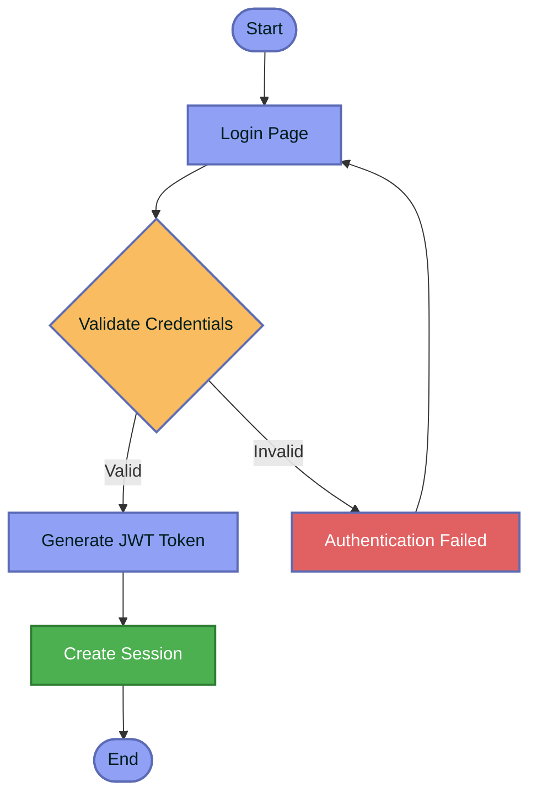

### Example 2: Data Pipeline Flow

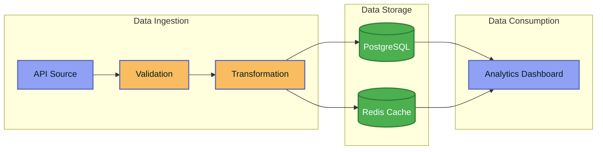

### Example 3: User Journey Map

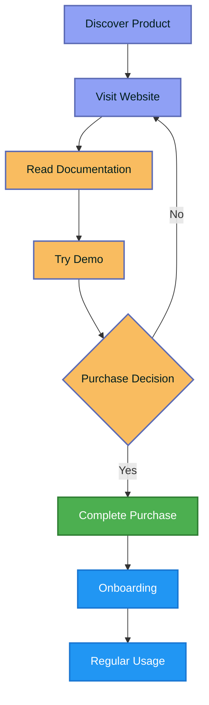

---

## Sequence Diagrams

### Example 1: LDAP Authentication Flow

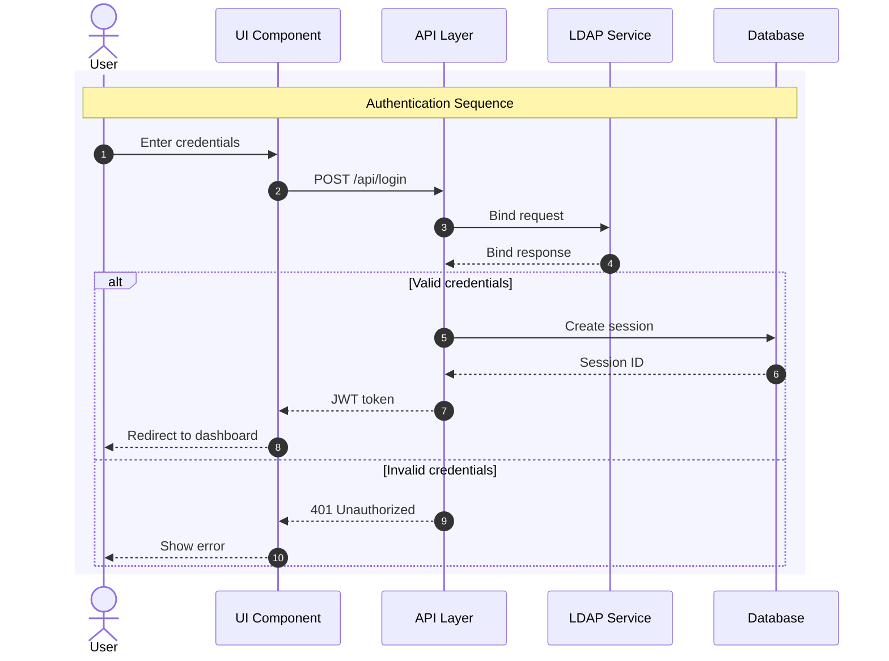

### Example 2: Data Ingestion Pipeline

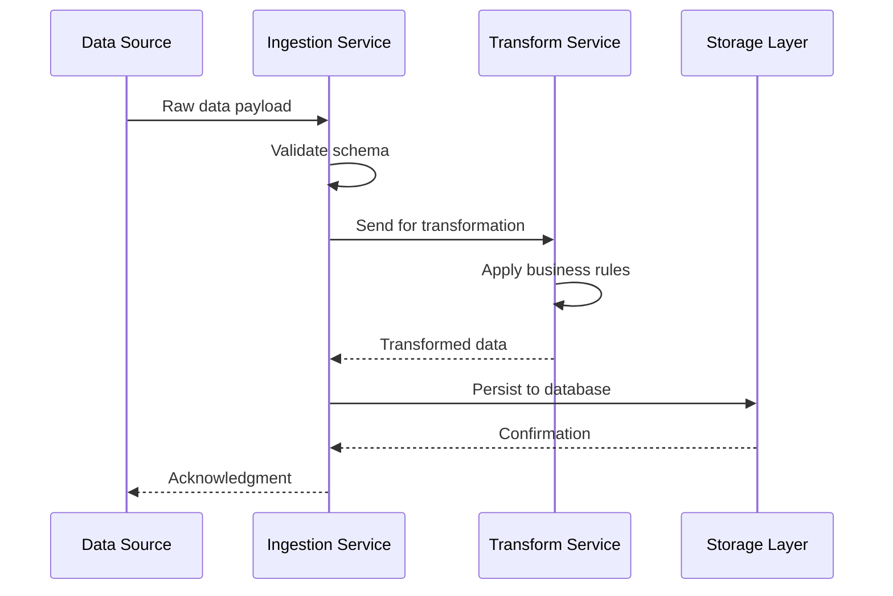

---

## Class Diagrams

### Example 1: User Management Domain

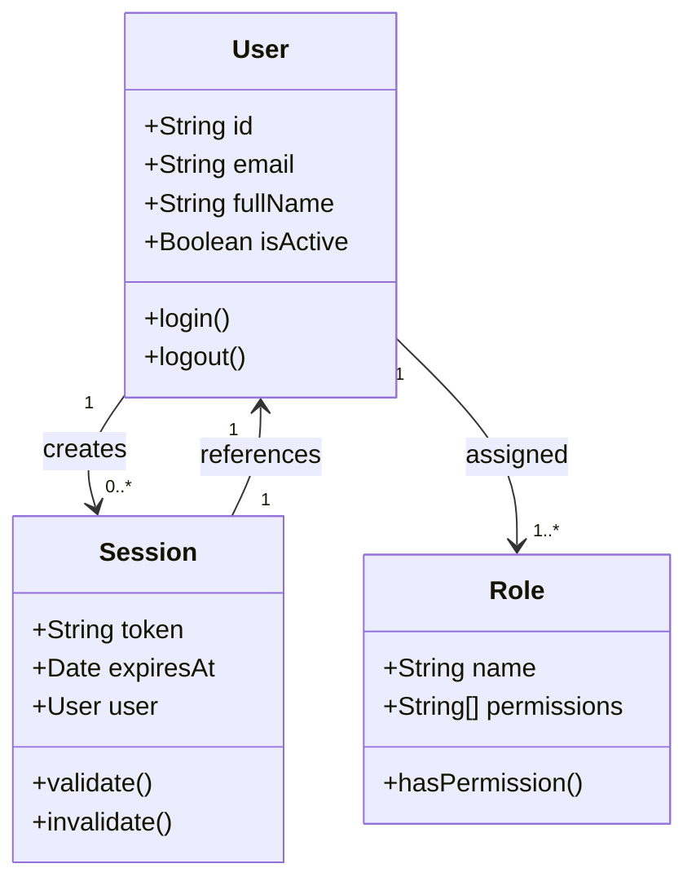

### Example 2: Workspace Management

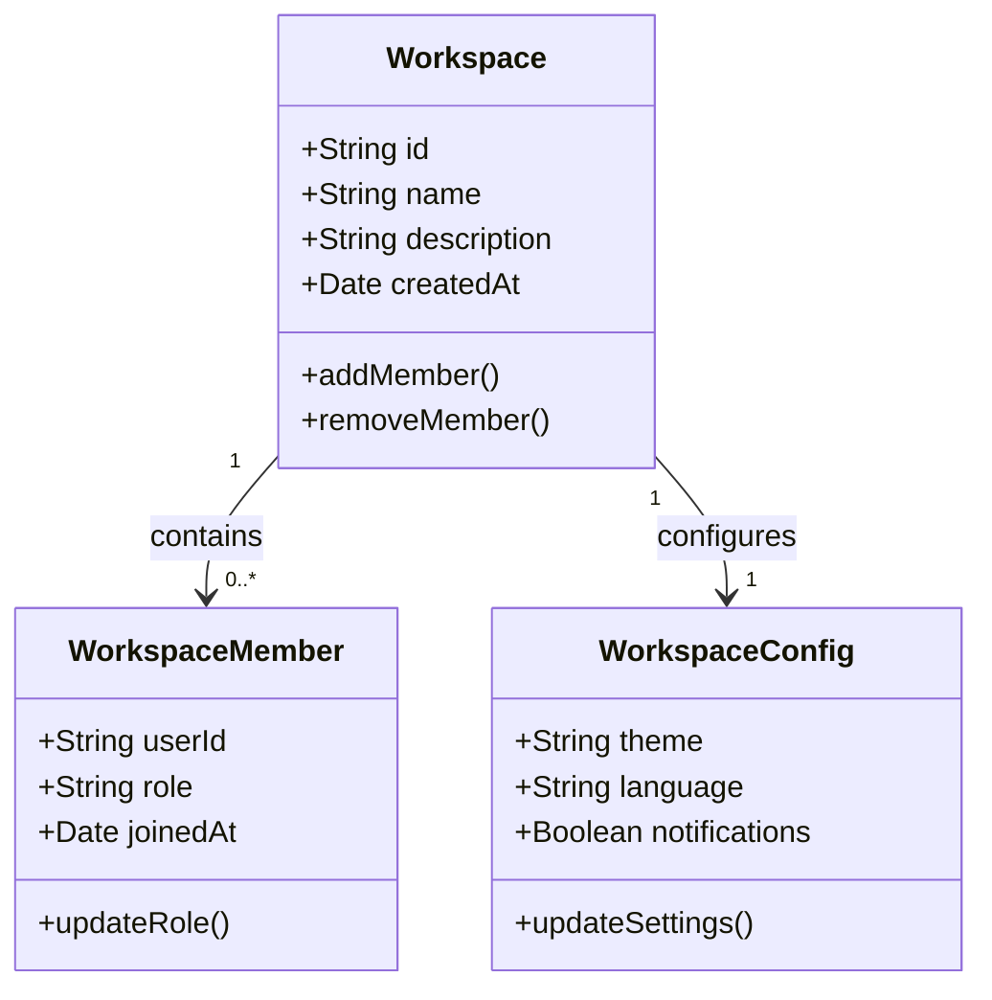

---

## ER Diagrams

### Example 1: User and Workspace Schema

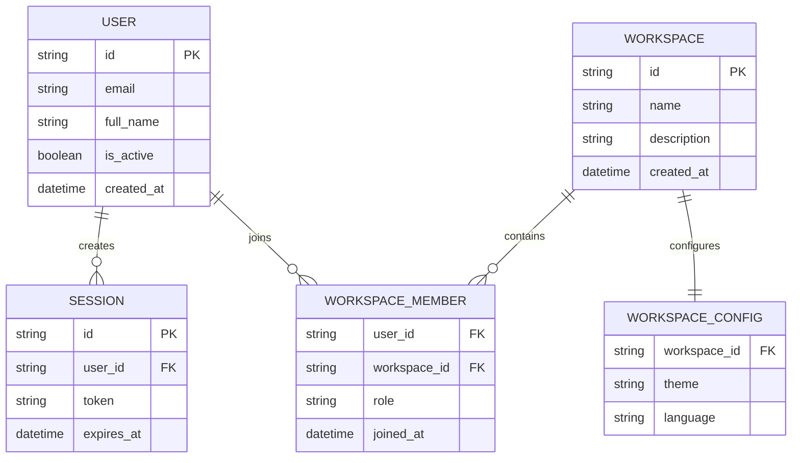

---

## State Diagrams

### Example 1: Document Lifecycle

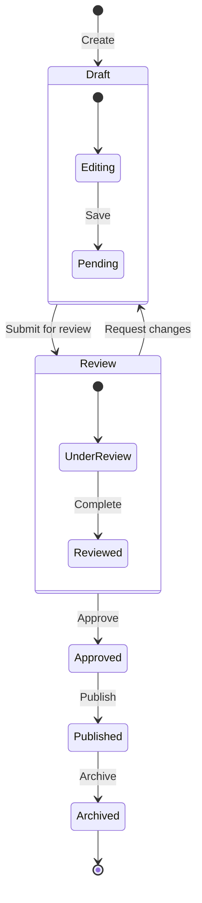

### Example 2: Order Processing State Machine

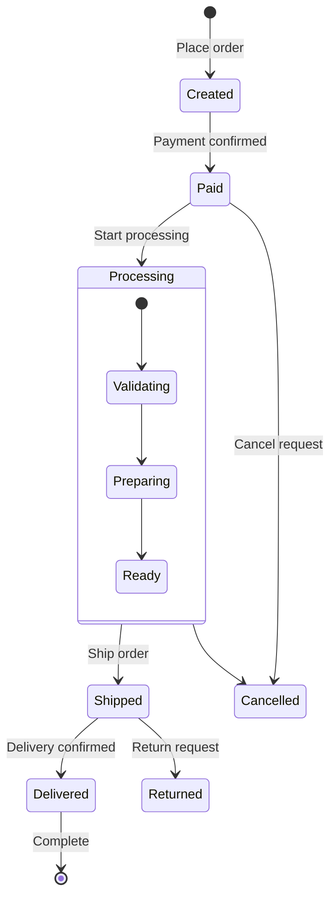

---

## Gantt Charts

### Example 1: Project Timeline

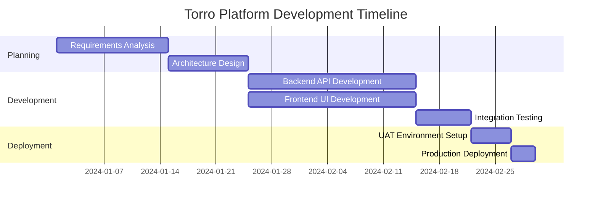

### Example 2: Sprint Planning

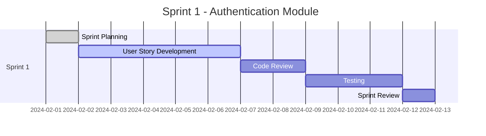

---

## Pie Charts

### Example 1: User Role Distribution

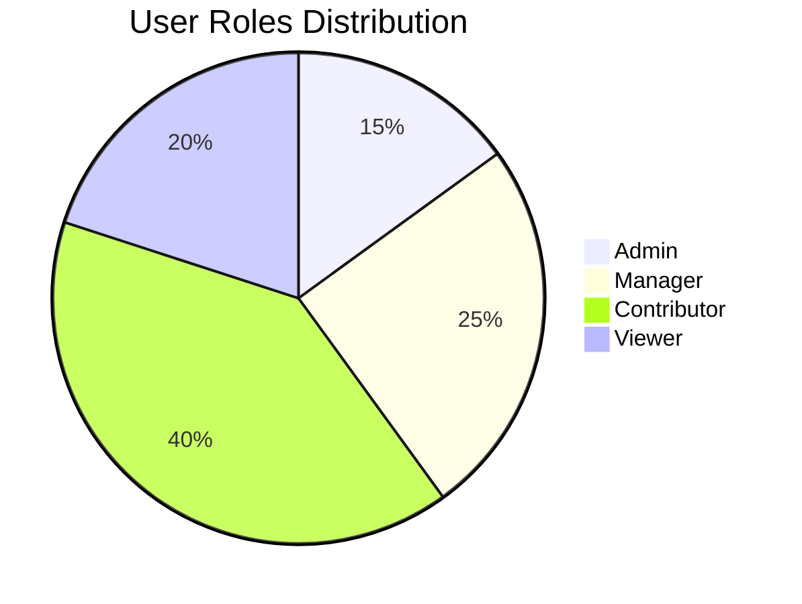

### Example 2: Project Status Overview

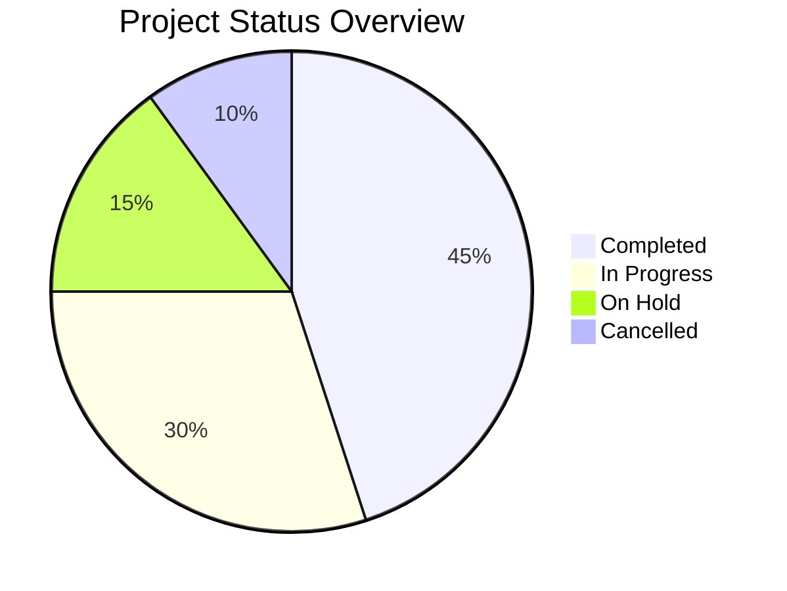

---

## Quadrant Charts

### Example 1: Feature Priority Matrix

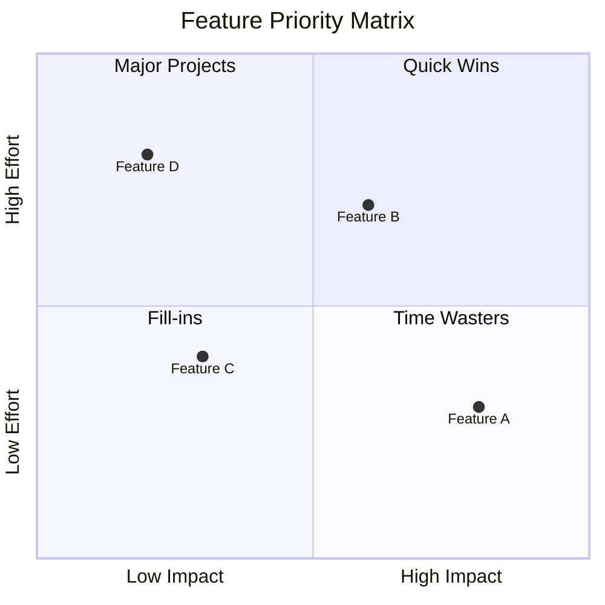

---

## Requirement Diagrams

### Example 1: Authentication Requirements

```mermaid
requirementDiagram
    requirement AuthRequirement {
        id: AUTH-001
        text: "System shall support LDAP authentication"
        risk: High
        verifymethod: Test
    }
    
    requirement SessionRequirement {
        id: AUTH-002
        text: "System shall implement JWT-based sessions"
        risk: Medium
        verifymethod: Inspection
    }
    
    functionalRequirement TokenRequirement {
        id: AUTH-003
        text: "Tokens shall expire after 24 hours"
        risk: Low
        verifymethod: Test
    }
    
    AuthRequirement - contains -> TokenRequirement
    SessionRequirement - contains -> TokenRequirement
```

---

## Architecture Diagrams

### Example 1: Torro Platform Architecture

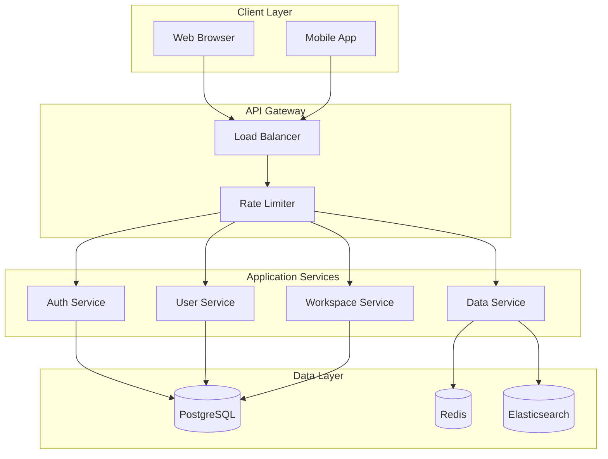

### Example 2: Microservices Topology

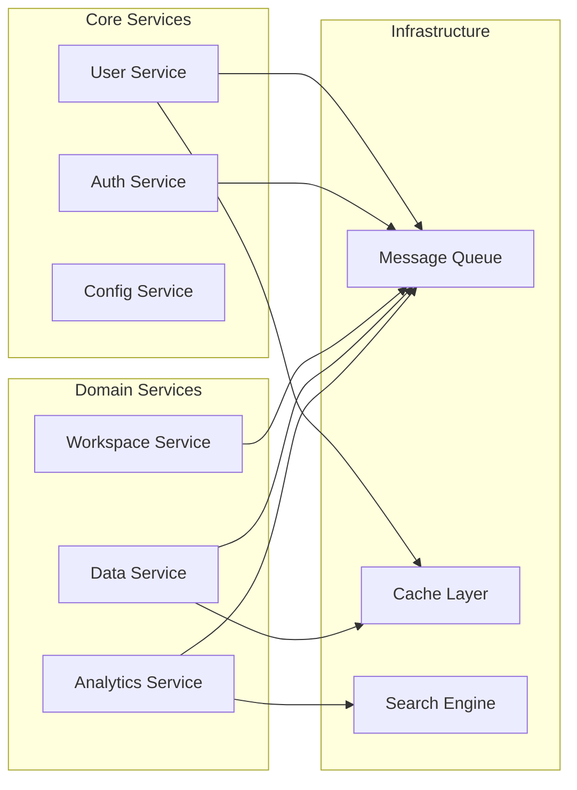

---

## Color Reference

### Torro Color Palette

| Color | Hex | Usage |
|-------|-----|-------|
| Primary | `#8fa0f5` | Main nodes, active states |
| Secondary | `#f9bc60` | Secondary nodes, highlights |
| Accent | `#e16162` | Error states, warnings |
| Success | `#4caf50` | Success states, completion |
| Info | `#2196f3` | Information, tips |
| Text Dark | `#001e1d` | Primary text |
| Text Light | `#ffffff` | Text on dark backgrounds |

### Class Definitions

```mermaid
graph TD
    classDef primary fill:#8fa0f5,stroke:#5c6bb5,stroke-width:2px,color:#001e1d
    classDef secondary fill:#f9bc60,stroke:#5c6bb5,stroke-width:2px,color:#001e1d
    classDef accent fill:#e16162,stroke:#5c6bb5,stroke-width:2px,color:#ffffff
    classDef success fill:#4caf50,stroke:#2e7d32,stroke-width:2px,color:#ffffff
    classDef info fill:#2196f3,stroke:#1976d2,stroke-width:2px,color:#ffffff
```
