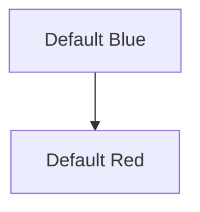
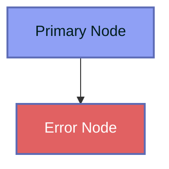
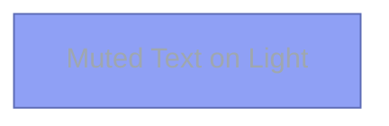
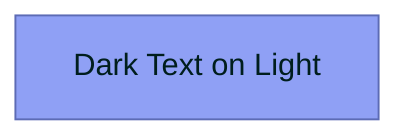
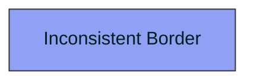
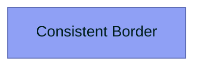
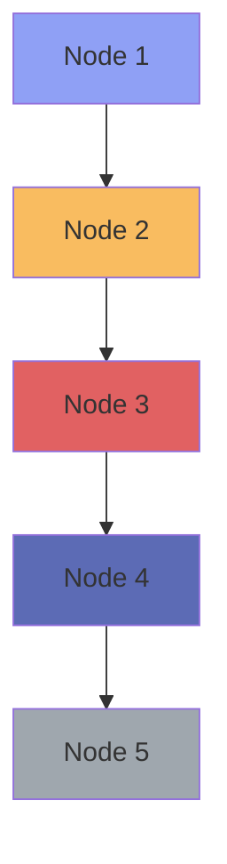
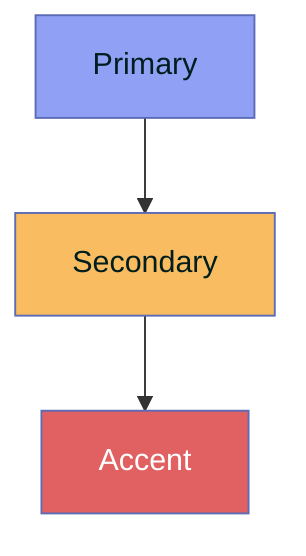

# Torro Theme Reference for Mermaid Diagrams

## Table of Contents

1. [Color Tokens](#color-tokens)
2. [Theme Configuration](#theme-configuration)
3. [Contrast Compliance](#contrast-compliance)
4. [Diagram-Specific Themes](#diagram-specific-themes)
5. [Common Mistakes](#common-mistakes)

---

## Color Tokens

### Primary Palette

| Token | Hex | RGB | Usage |
|-------|-----|-----|-------|
| `torro.primary` | `#8fa0f5` | `rgb(143, 160, 245)` | Primary nodes, active states, main actions |
| `torro.secondary` | `#f9bc60` | `rgb(249, 188, 96)` | Secondary nodes, highlights, warnings |
| `torro.accent` | `#e16162` | `rgb(225, 97, 98)` | Error states, deletions, critical alerts |
| `torro.header` | `#5c6bb5` | `rgb(92, 107, 181)` | Headers, navigation bars, borders |

### Text Colors

| Token | Hex | Usage |
|-------|-----|-------|
| `torro.text` | `#001e1d` | Primary text on light backgrounds |
| `torro.muted` | `#9fa7ae` | Secondary text, placeholders, labels |

### Background Colors

| Token | Hex | Usage |
|-------|-----|-------|
| `torro.surface` | `#ffffff` | Card backgrounds, modal surfaces |
| `torro.surfaceAlt` | `#f8f9fa` | Alternate surfaces, table rows |

---

## Theme Configuration

### Base Configuration

Use this configuration for all Mermaid diagrams:

```javascript
mermaid.initialize({
  theme: 'base',
  themeVariables: {
    // Primary colors
    primaryColor: '#8fa0f5',
    primaryBorderColor: '#5c6bb5',
    primaryTextColor: '#001e1d',
    
    // Secondary colors
    secondaryColor: '#f9bc60',
    secondaryBorderColor: '#5c6bb5',
    secondaryTextColor: '#001e1d',
    
    // Tertiary colors
    tertiaryColor: '#e16162',
    tertiaryBorderColor: '#5c6bb5',
    tertiaryTextColor: '#ffffff',
    
    // Note styling
    noteBkgColor: '#fff5ad',
    noteTextColor: '#001e1d',
    noteBorderColor: '#5c6bb5',
    
    // Typography
    fontFamily: 'Inter, Roboto, sans-serif',
    fontSize: '16px',
    
    // Layout
    borderRadius: '14px',
    strokeWidth: '2px'
  }
});
```

### Dark Mode Configuration

```javascript
mermaid.initialize({
  theme: 'base',
  darkMode: true,
  themeVariables: {
    primaryColor: '#8fa0f5',
    primaryBorderColor: '#a4b4f6',
    primaryTextColor: '#ffffff',
    secondaryColor: '#f9bc60',
    tertiaryColor: '#e16162',
    noteBkgColor: '#3d3d3d',
    noteTextColor: '#ffffff',
    fontFamily: 'Inter, Roboto, sans-serif'
  }
});
```

---

## Contrast Compliance

### WCAG 2.1 AA Requirements

All text/background combinations MUST meet WCAG 2.1 AA contrast ratio of 4.5:1 for normal text.

### Approved Combinations

| Background | Text | Ratio | Status |
|------------|------|-------|--------|
| `#8fa0f5` (Primary) | `#001e1d` (Dark) | 8.2:1 | ✅ PASS |
| `#8fa0f5` (Primary) | `#ffffff` (White) | 4.8:1 | ✅ PASS |
| `#f9bc60` (Secondary) | `#001e1d` (Dark) | 6.1:1 | ✅ PASS |
| `#e16162` (Accent) | `#ffffff` (White) | 5.4:1 | ✅ PASS |
| `#5c6bb5` (Header) | `#ffffff` (White) | 7.3:1 | ✅ PASS |
| `#5c6bb5` (Header) | `#ffffff/70%` (White 70%) | 5.1:1 | ✅ PASS |

### Forbidden Combinations

| Background | Text | Ratio | Status |
|------------|------|-------|--------|
| `#8fa0f5` (Primary) | `#9fa7ae` (Muted) | 2.1:1 | ❌ FAIL |
| `#f9bc60` (Secondary) | `#9fa7ae` (Muted) | 1.8:1 | ❌ FAIL |
| `#ffffff` (White) | `#9fa7ae` (Muted) | 2.9:1 | ❌ FAIL |

### Contrast Rules

1. **Light backgrounds** (#8fa0f5, #f9bc60, #fff5ad) → Use **dark text** (#001e1d)
2. **Dark backgrounds** (#5c6bb5, #e16162) → Use **white text** (#ffffff)
3. **Never use muted text** (#9fa7ae) on light backgrounds
4. **Header text** can use 70% opacity white for hierarchy

---

## Diagram-Specific Themes

### Flowchart Theme

```javascript
{
  flowchart: {
    nodeBkg: '#8fa0f5',
    nodeBorder: '#5c6bb5',
    nodeTextColor: '#001e1d',
    clusterBkg: '#f8f9fa',
    clusterBorder: '#5c6bb5',
    edgeLabelBackground: '#ffffff',
    textColor: '#001e1d',
    lineColor: '#5c6bb5'
  }
}
```

### Sequence Diagram Theme

```javascript
{
  sequence: {
    actorBkg: '#8fa0f5',
    actorBorder: '#5c6bb5',
    actorTextColor: '#001e1d',
    actorLineColor: '#5c6bb5',
    signalColor: '#001e1d',
    signalTextColor: '#001e1d',
    noteBkgColor: '#fff5ad',
    noteTextColor: '#001e1d',
    noteBorderColor: '#5c6bb5',
    activationBkgColor: '#f9bc60',
    activationBorderColor: '#5c6bb5'
  }
}
```

### Class Diagram Theme

```javascript
{
  class: {
    labelBackground: '#8fa0f5',
    labelTextColor: '#001e1d',
    mainBkg: '#8fa0f5',
    borderColor: '#5c6bb5',
    textColor: '#001e1d',
    lineColor: '#5c6bb5'
  }
}
```

### ER Diagram Theme

```javascript
{
  er: {
    fillType0: '#8fa0f5',
    fillType1: '#f9bc60',
    fillType2: '#e16162',
    strokeColor: '#5c6bb5',
    textColor: '#001e1d'
  }
}
```

### State Diagram Theme

```javascript
{
  state: {
    labelColor: '#001e1d',
    stateBkg: '#8fa0f5',
    stateBorder: '#5c6bb5',
    dividerColor: '#5c6bb5',
    errorBkgColor: '#e16162',
    errorTextColor: '#ffffff'
  }
}
```

### Gantt Chart Theme

```javascript
{
  gantt: {
    sectionBkgColor: '#8fa0f5',
    altSectionBkgColor: '#f8f9fa',
    taskBkgColor: '#f9bc60',
    taskBorderColor: '#5c6bb5',
    taskTextColor: '#001e1d',
    taskTextOutsideColor: '#001e1d',
    gridColor: '#e0e0e0',
    todayLineColor: '#e16162'
  }
}
```

---

## Common Mistakes

### Mistake 1: Using Default Mermaid Colors

**❌ Wrong:**


**✅ Correct:**


### Mistake 2: Poor Contrast

**❌ Wrong:**


**✅ Correct:**


### Mistake 3: Inconsistent Border Colors

**❌ Wrong:**


**✅ Correct:**


### Mistake 4: Too Many Colors

**❌ Wrong:**


**✅ Correct:**


### Mistake 5: Hardcoded Values

**❌ Wrong:**
```javascript
primaryColor: '#8888ff'  // Random purple
```

**✅ Correct:**
```javascript
primaryColor: '#8fa0f5'  // Torro primary token
```

---

## Quick Reference Card

### Color Usage Matrix

| Element | Background | Border | Text |
|---------|-----------|--------|------|
| Primary Node | `#8fa0f5` | `#5c6bb5` | `#001e1d` |
| Secondary Node | `#f9bc60` | `#5c6bb5` | `#001e1d` |
| Error Node | `#e16162` | `#5c6bb5` | `#ffffff` |
| Note Box | `#fff5ad` | `#5c6bb5` | `#001e1d` |
| Header | `#5c6bb5` | `#5c6bb5` | `#ffffff` |
| Label | `#ffffff` | `#5c6bb5` | `#001e1d` |

### Font Sizes

| Element | Size |
|---------|------|
| Title | `20px` |
| Node Label | `16px` |
| Edge Label | `14px` |
| Note Text | `14px` |

### Border Widths

| Element | Width |
|---------|-------|
| Node Border | `2px` |
| Edge Line | `2px` |
| Cluster Border | `3px` |
