# Hermes Agent — Architecture Analysis & Design Document

> **Version:** 1.0  
> **Last Updated:** 2026-04-30  
> **Status:** Reference Architecture  
> **License:** MIT (Nous Research)

---

## Table of Contents

1. [Executive Summary](#1-executive-summary)
2. [System Overview](#2-system-overview)
3. [Architecture Layers](#3-architecture-layers)
4. [Agent Layer — Deep Dive](#4-agent-layer--deep-dive)
5. [Solution Layer — Deep Dive](#5-solution-layer--deep-dive)
6. [Data Flow & Communication Patterns](#6-data-flow--communication-patterns)
7. [Design Principles & Patterns](#7-design-principles--patterns)
8. [Security Architecture](#8-security-architecture)
9. [Extensibility Model](#9-extensibility-model)
10. [Deployment Architecture](#10-deployment-architecture)
11. [Performance Characteristics](#11-performance-characteristics)
12. [Testing & Quality Assurance](#12-testing--quality-assurance)
13. [File Structure & Metrics](#13-file-structure--metrics)
14. [Comparison with Similar Projects](#14-comparison-with-similar-projects)
15. [Future Roadmap](#15-future-roadmap)

---

## 1. Executive Summary

Hermes Agent is a **production-grade, self-improving AI agent platform** engineered for multi-modal interaction across CLI, messaging platforms, and IDEs. It represents a convergence of:

- **Autonomous agent reasoning** with closed-loop learning
- **Multi-platform messaging** with 22+ platform adapters
- **Enterprise-grade security** with prompt injection protection and credential isolation
- **Research-ready tooling** with RL environments and trajectory compression

The architecture follows a **layered, plugin-driven design** with strict separation between the agent core (reasoning, tool orchestration, context management) and the solution layer (platform adapters, state management, execution environments). This separation enables:

- **Platform independence**: The same agent core serves CLI, gateway, TUI, and ACP interfaces
- **Provider agnosticism**: 10+ LLM providers through a unified transport abstraction
- **Zero vendor lock-in**: Switch models with `hermes model` — no code changes
- **Self-improvement**: Built-in learning loop creates and refines skills from experience

---

## 2. System Overview

### 2.1 Entry Points

Hermes exposes three distinct entry points, all sharing the same agent core:

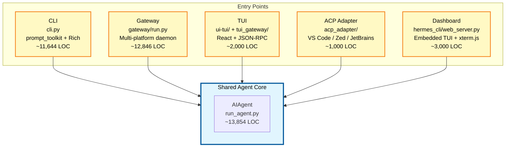

### 2.2 High-Level Component Map

```mermaid
flowchart LR
    subgraph ClientLayer["Client Layer"]
        CLI
        GW
        TUI
        ACP
        DASH
    end

    subgraph AgentLayer["Agent Layer (agent/)"]
        AIAgent
        Transports["Provider Transports"]
        ContextMgr["Context Management"]
        MemoryMgr["Memory Manager"]
        CredentialPool["Credential Pool"]
    end

    subgraph ToolLayer["Tool Layer (tools/)"]
        Registry["Tool Registry"]
        TerminalTools["Terminal / Code Exec"]
        BrowserTools["Browser Automation"]
        FileTools["File Operations"]
        WebTools["Web Tools"]
        EnvBackends["Execution Backends"]
    end

    subgraph SolutionLayer["Solution Layer (gateway/, hermes_state.py)"]
        GatewayRunner["Gateway Runner"]
        PlatformAdapters["22+ Platform Adapters"]
        StateDB["SQLite State Store"]
        ConfigMgr["Configuration Manager"]
        PluginSystem["Plugin System"]
        CronScheduler["Cron Scheduler"]
    end

    ClientLayer --> AgentLayer
    AgentLayer --> ToolLayer
    AgentLayer --> SolutionLayer
    SolutionLayer --> ToolLayer

    style AgentLayer fill:#e8f5e9,stroke:#2e7d32,stroke-width:3px,color:#000000
    style ToolLayer fill:#fff9c4,stroke:#f57f17,stroke-width:2px,color:#000000
    style SolutionLayer fill:#f3e5f5,stroke:#7b1fa2,stroke-width:2px,color:#000000
```

---

## 3. Architecture Layers

### 3.1 Layer Responsibilities

| Layer | Responsibility | Key Modules | LOC |
|-------|---------------|-------------|-----|
| **Client Layer** | User interaction, input/output formatting | `cli.py`, `tui_gateway/`, `acp_adapter/`, `hermes_cli/web_server.py` | ~28,000 |
| **Agent Layer** | AI reasoning, tool orchestration, context management | `run_agent.py`, `agent/`, `model_tools.py` | ~35,000 |
| **Tool Layer** | External capability execution | `tools/`, `tools/environments/`, `tools/browser_providers/` | ~30,000 |
| **Solution Layer** | Platform integration, state persistence, scheduling | `gateway/`, `hermes_state.py`, `cron/`, `plugins/` | ~30,000 |

### 3.2 Dependency Graph

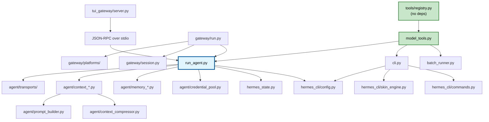

---

## 4. Agent Layer — Deep Dive

### 4.1 AIAgent Class Architecture

The [`AIAgent`](run_agent.py) class is the central orchestrator (~13,854 LOC) with ~60 constructor parameters organized into five configuration domains:

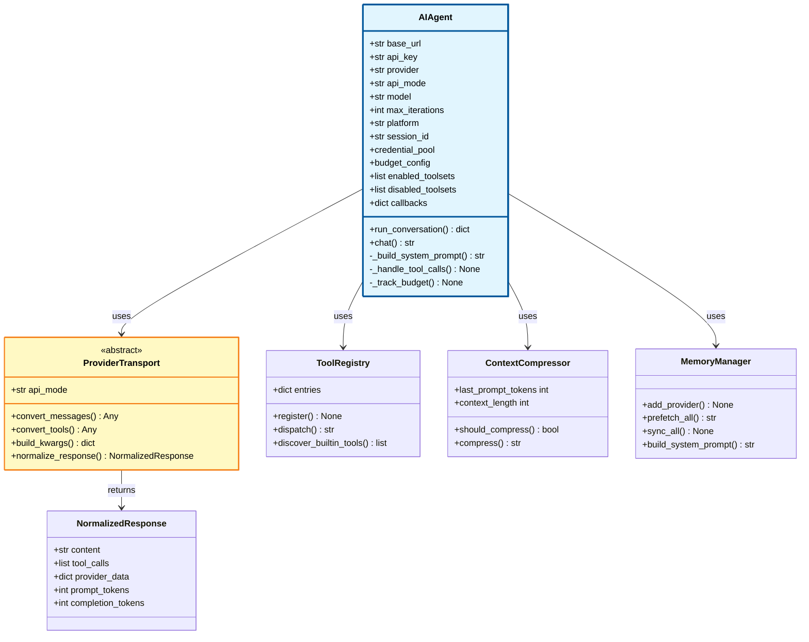

### 4.2 Provider Transport Abstraction

The transport layer provides a **unified interface** across 10+ LLM providers through the `ProviderTransport` abstract base class:

| Transport | API Mode | Provider | Key Features |
|-----------|----------|----------|--------------|
| [`anthropic.py`](agent/transports/anthropic.py) | `anthropic_messages` | Anthropic | Messages API v1, system prompt separation |
| [`chat_completions.py`](agent/transports/chat_completions.py) | `chat_completions` | OpenAI-compatible | Universal adapter for any OpenAI-compatible endpoint |
| [`codex.py`](agent/transports/codex.py) | `codex_responses` | OpenAI Codex | Responses API with structured output |
| [`bedrock.py`](agent/transports/bedrock.py) | `bedrock` | AWS Bedrock | Bedrock runtime client, region-aware |
| [`anthropic_adapter.py`](agent/anthropic_adapter.py) | — | Anthropic | Anthropic-specific formatting and tool conversion |
| [`gemini_native_adapter.py`](agent/gemini_native_adapter.py) | — | Google Gemini | Gemini API native format |
| [`gemini_cloudcode_adapter.py`](agent/gemini_cloudcode_adapter.py) | — | Google Cloud Code | Cloud Code integration |
| [`bedrock_adapter.py`](agent/bedrock_adapter.py) | — | AWS Bedrock | Bedrock-specific model routing |
| [`codex_responses_adapter.py`](agent/codex_responses_adapter.py) | — | OpenAI Codex | Codex Responses format |
| [`copilot_acp_client.py`](agent/copilot_acp_client.py) | — | GitHub Copilot ACP | Subprocess-based ACP protocol |

**Transport Contract** (`agent/transports/base.py`):
```python
class ProviderTransport(ABC):
    @property
    @abstractmethod
    def api_mode(self) -> str: ...
    
    @abstractmethod
    def convert_messages(self, messages, **kwargs) -> Any: ...
    
    @abstractmethod
    def convert_tools(self, tools) -> Any: ...
    
    @abstractmethod
    def build_kwargs(self, model, messages, tools, **params) -> Dict[str, Any]: ...
    
    @abstractmethod
    def normalize_response(self, response, **kwargs) -> NormalizedResponse: ...
```

### 4.3 Tool Orchestration

**Discovery Chain** (strict dependency order, circular-import safe):
```
tools/registry.py (no deps — AST-based discovery)
       ↑ imports
tools/*.py (each calls registry.register() at module level)
       ↑ imported by
model_tools.py (orchestration layer — triggers discovery)
       ↑ imported by
run_agent.py, cli.py, batch_runner.py, environments/
```

**Tool Registry** (`tools/registry.py` — 538 LOC):
- **AST-based auto-discovery**: Scans `tools/*.py` for `registry.register()` calls without importing them first
- **ToolEntry dataclass**: `name`, `toolset`, `schema`, `handler`, `check_fn`, `requires_env`, `is_async`, `description`, `emoji`, `max_result_size_chars`
- **Async bridging**: Persistent event loops per-thread prevent "Event loop is closed" errors with cached async clients (httpx, AsyncOpenAI)
- **Error wrapping**: `tool_error()` provides structured error responses

**Toolsets** (`toolsets.py` — 806 LOC):
- `_HERMES_CORE_TOOLS`: Shared tool list for CLI + all messaging platforms (60+ tools)
- `TOOLSETS` dict: Named toolset definitions with includes/composition
- Dynamic resolution via `resolve_toolset()` — composes nested toolsets

### 4.4 Context Management

| Module | Purpose | LOC | Key Features |
|--------|---------|-----|--------------|
| [`prompt_builder.py`](agent/prompt_builder.py) | System prompt assembly | ~1,123 | Context file scanning, 15+ prompt injection patterns, git root detection |
| [`context_compressor.py`](agent/context_compressor.py) | Conversation compaction | ~1,415 | Auxiliary model summarization, head/tail protection, tool output pruning |
| [`context_engine.py`](agent/context_engine.py) | Pluggable context interface | ~207 | ABC for third-party engines (LCM, etc.) |
| [`memory_manager.py`](agent/memory_manager.py) | Memory orchestration | ~558 | Builtin + 1 external plugin, streaming context scrubber |
| [`memory_provider.py`](agent/memory_provider.py) | MemoryProvider ABC | — | Plugin interface for honcho, mem0, supermemory, etc. |
| [`curator.py`](agent/curator.py) | Skill maintenance | ~927 | Auto-archive (90 days), consolidate, inactivity-triggered |
| [`skill_utils.py`](agent/skill_utils.py) | Skill loading | — | Condition evaluation, platform gating, frontmatter parsing |
| [`skill_commands.py`](agent/skill_commands.py) | Skill slash commands | — | Injected as user messages (preserves prompt caching) |
| [`context_references.py`](agent/context_references.py) | Context references | — | Reference management for compressed context |

**Context Compression Flow**:
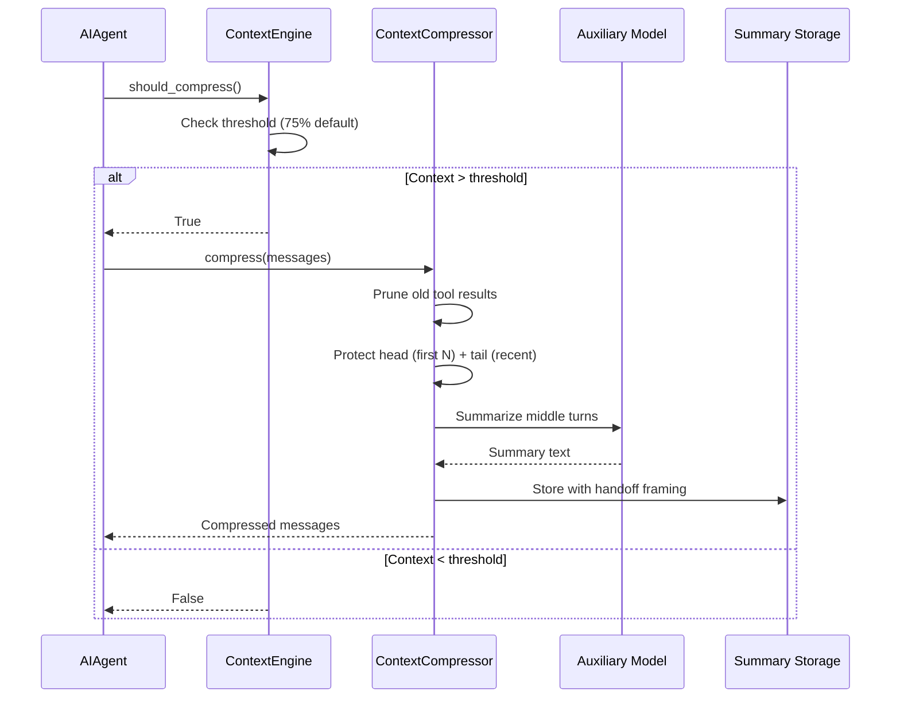

### 4.5 Credential Management

[`credential_pool.py`](agent/credential_pool.py) — ~1,574 LOC:

**Features**:
- **Multi-credential pool**: Same-provider failover with multiple API keys/tokens
- **Strategies**: `fill_first`, `round_robin`, `random`
- **Auth types**: OAuth (Codex access tokens with auto-refresh) + API key
- **Provider registry**: Dynamic blocklist derivation from `PROVIDER_REGISTRY` and `OPTIONAL_ENV_VARS`
- **Persistent state**: Auth store with per-provider state tracking

**Environment Variable Isolation** (from [`tools/environments/local.py`](tools/environments/local.py)):
```python
# Providers blocklist derived from config:
# OPENAI_API_KEY, ANTHROPIC_API_KEY, GOOGLE_API_KEY, etc.
# Tool/messaging category vars, password-type setting vars
# _HERMES_FORCE_* prefix vars
```

---

## 5. Solution Layer — Deep Dive

### 5.1 Gateway Architecture

[`gateway/run.py`](gateway/run.py) — ~12,846 LOC:

**GatewayRunner** manages the full gateway lifecycle:
- **Platform initialization**: Concurrent adapter startup with configurable timeouts
- **Session management**: Context tracking, PII redaction, reset policies
- **Agent cache**: LRU eviction (128 max) + idle TTL (1 hour)
- **Auto-continue**: Freshness window (1 hour) for interrupted turns
- **Message delivery**: Retry logic, pending event queue, session state cleanup

**Session Management** (`gateway/session.py`):
- **PII redaction**: Deterministic hashing (`user_<12hex>`, `telegram:<hash>`)
- **Session reset policies**: Configurable reset triggers
- **Dynamic system prompt injection**: Platform-specific context
- **Message persistence**: Coordination with `hermes_state.py`

### 5.2 Platform Adapters

[`gateway/platforms/`](gateway/platforms/) — 22+ platforms:

| Platform | File | Key Features |
|----------|------|--------------|
| **Telegram** | [`telegram.py`](gateway/platforms/telegram.py) | Bot API, voice messages, stickers, group gating, UTF-16 length |
| **Discord** | [`discord.py`](gateway/platforms/discord.py) | Slash commands, reactions, channel controls, skill injection |
| **Slack** | [`slack.py`](gateway/platforms/slack.py) | Block kit, slash commands, interactive buttons, subcommand map |
| **WhatsApp** | [`whatsapp.py`](gateway/platforms/whatsapp.py) | WA Business API, media handling, sticker cache |
| **Matrix** | [`matrix.py`](gateway/platforms/matrix.py) | Element, homeserver, E2EE |
| **Signal** | [`signal.py`](gateway/platforms/signal.py) | Signal CLI, rate limiting |
| **Webhook** | [`webhook.py`](gateway/platforms/webhook.py) | Generic webhook receiver, job support |
| **API Server** | [`api_server.py`](gateway/platforms/api_server.py) | REST API, toolset filtering |
| **WeChat** | [`weixin.py`](gateway/platforms/weixin.py) | WeChat Work integration |
| **Feishu** | [`feishu.py`](gateway/platforms/feishu.py) | Lark/Feishu, comment rules |
| **Yuanbao** | [`yuanbao.py`](gateway/platforms/yuanbao.py) | ByteDance Yuanbao, media, sticker |
| **QQ Bot** | [`qqbot/`](gateway/platforms/qqbot/) | QQ Bot platform, crypto, onboard |
| **DingTalk** | [`dingtalk.py`](gateway/platforms/dingtalk.py) | Alibaba DingTalk |
| **Home Assistant** | [`homeassistant.py`](gateway/platforms/homeassistant.py) | Smart home control |
| **Email** | [`email.py`](gateway/platforms/email.py) | Email gateway |
| **SMS** | [`sms.py`](gateway/platforms/sms.py) | SMS gateway |
| **BlueBubbles** | [`bluebubbles.py`](gateway/platforms/bluebubbles.py) | iMessage bridge |
| **Wecom** | [`wecom.py`](gateway/platforms/wecom.py) | WeChat Work callback, crypto |
| **Mattermost** | [`mattermost.py`](gateway/platforms/mattermost.py) | Mattermost integration |

**Base Platform Adapter** (`gateway/platforms/base.py` — 3,158 LOC):
- Abstract interface with common utilities
- **UTF-16 length calculation**: Telegram's 4,096 char limit (surrogate pairs count as 2)
- **Audio format routing**: MP3/M4A for sendAudio, Opus/OGG for sendVoice
- **Message queuing**: `_pending_messages` for concurrent session handling
- **Session lifecycle**: Active session tracking, disconnect handling
- **Security**: IP validation, proxy detection, URL sanitization

### 5.3 Tool Layer

[`tools/`](tools/) — 70+ tools across 10 categories:

| Category | Files | LOC | Description |
|----------|-------|-----|-------------|
| **Terminal/Execution** | `terminal_tool.py`, `code_execution_tool.py`, `delegate_tool.py` | ~7,000 | Command execution, subagent spawning, RPC |
| **Browser** | `browser_tool.py`, `browser_cdp_tool.py`, `browser_supervisor.py` | ~4,500 | Chromium automation, CDP, session management |
| **File Operations** | `file_tools.py`, `file_operations.py`, `patch_parser.py` | ~2,500 | Read, write, patch, search, fuzzy match |
| **Web** | `web_tools.py`, `fuzzy_match.py`, `url_safety.py` | ~1,500 | Search, extract, URL validation |
| **Vision** | `vision_tools.py`, `image_generation_tool.py` | ~1,000 | Image analysis, DALL-E/Midjourney |
| **Communication** | `send_message_tool.py`, `discord_tool.py`, `feishu_doc_tool.py` | ~1,000 | Cross-platform messaging |
| **Memory/Planning** | `memory_tool.py`, `todo_tool.py`, `clarify_tool.py` | ~800 | Persistent memory, task tracking |
| **MCP** | `mcp_tool.py`, `mcp_oauth.py` | ~600 | Model Context Protocol |
| **Environments** | `tools/environments/` (10 files) | ~3,500 | Local, Docker, Modal, Daytona, SSH, Singularity, Vercel |
| **Browser Providers** | `tools/browser_providers/` (4 files) | ~1,500 | Browser Use, Browserbase, Firecrawl, local |

**Code Execution Tool** (`tools/code_execution_tool.py` — ~1,622 LOC):
- **Local backend**: Unix domain socket (UDS) RPC for tool calls — 7 sandbox-allowed tools
- **Remote backend**: File-based RPC for Docker/SSH/Modal environments
- **Security**: Intermediate results never enter context window
- **Platform**: Linux/macOS only (UDS requires POSIX)

**Delegate Tool** (`tools/delegate_tool.py` — ~2,532 LOC):
- Spawns child `AIAgent` instances with isolated context
- **Blocked tools**: `delegate_task`, `clarify`, `memory`, `send_message`, `execute_code`
- **Modes**: Single-task and batch (parallel) via `ThreadPoolExecutor`
- **Approval propagation**: Callbacks forwarded to worker threads

**Browser Tool** (`tools/browser_tool.py` — ~2,992 LOC):
- **Backends**: Browser Use (cloud), Browserbase (cloud), local Chromium
- **Representation**: Accessibility tree (ariaSnapshot) for text-based page understanding
- **Session isolation**: Per task ID
- **Interaction**: Element ref selectors (@e1, @e2, etc.)

### 5.4 Execution Environment Backends

[`tools/environments/`](tools/environments/) — 10 backends:

| Backend | File | Description | Persistence |
|---------|------|-------------|-------------|
| **Local** | [`local.py`](tools/environments/local.py) | Direct host execution | Session snapshot |
| **Docker** | [`docker.py`](tools/environments/docker.py) | Containerized, security-hardened | Bind mounts |
| **Modal** | [`modal.py`](tools/environments/modal.py) | Serverless cloud, hibernates when idle | Snapshot store |
| **Daytona** | [`daytona.py`](tools/environments/daytona.py) | Cloud IDE environments | Workspace |
| **SSH** | [`ssh.py`](tools/environments/ssh.py) | Remote server execution | Remote filesystem |
| **Singularity** | [`singularity.py`](tools/environments/singularity.py) | HPC cluster support | Shared filesystem |
| **Vercel Sandbox** | [`vercel_sandbox.py`](tools/environments/vercel_sandbox.py) | Vercel edge sandboxes | Edge KV |
| **Managed Modal** | [`managed_modal.py`](tools/environments/managed_modal.py) | Gateway-managed Modal | Gateway state |
| **Base** | [`base.py`](tools/environments/base.py) | ABC + common utilities | — |
| **File Sync** | [`file_sync.py`](tools/environments/file_sync.py) | Cross-backend file synchronization | — |

**Base Environment** (`tools/environments/base.py` — 786 LOC):
- **Spawn-per-call model**: Fresh `bash -c` process per command
- **Session snapshot**: Env vars, functions, aliases captured at init, re-sourced per command
- **CWD persistence**: In-band stdout markers (remote) or temp file (local)
- **Activity callback**: Thread-local liveness reporting for gateway
- **Interrupt handling**: Poll-based with configurable debug tracing

### 5.5 State Management

**SQLite State Store** (`hermes_state.py` — ~2,095 LOC):
- **WAL mode**: Concurrent readers + single writer
- **FTS5**: Full-text search across all session messages
- **Schema versioning**: v11 with migration support
- **Session metadata**: Model, tokens, cost, billing provider, pricing version
- **Message history**: Tool call tracking, reasoning content, Codex message items
- **Compression chains**: `parent_session_id` for split sessions

**Schema**:
```sql
sessions (
    id TEXT PRIMARY KEY, source TEXT, user_id TEXT, model TEXT,
    system_prompt TEXT, parent_session_id TEXT,
    started_at REAL, ended_at REAL, end_reason TEXT,
    message_count INTEGER, tool_call_count INTEGER,
    input_tokens INTEGER, output_tokens INTEGER,
    cache_read_tokens INTEGER, cache_write_tokens INTEGER,
    reasoning_tokens INTEGER,
    billing_provider TEXT, billing_base_url TEXT, billing_mode TEXT,
    estimated_cost_usd REAL, actual_cost_usd REAL,
    cost_status TEXT, cost_source TEXT, pricing_version TEXT,
    title TEXT, api_call_count INTEGER
)

messages (
    id INTEGER PRIMARY KEY AUTOINCREMENT,
    session_id TEXT REFERENCES sessions(id),
    role TEXT, content TEXT,
    tool_call_id TEXT, tool_calls TEXT, tool_name TEXT,
    timestamp REAL, token_count INTEGER, finish_reason TEXT,
    reasoning TEXT, reasoning_content TEXT, reasoning_details TEXT,
    codex_reasoning_items TEXT, codex_message_items TEXT
)
```

**Configuration Manager** (`hermes_cli/config.py`):
- `DEFAULT_CONFIG`: Master config dictionary with `_config_version`
- `load_cli_config()`: CLI-specific (CLI defaults + user YAML)
- `load_config()`: General purpose (DEFAULT_CONFIG + user YAML)
- **Profile-aware**: `HERMES_HOME` environment variable scoping

### 5.6 Plugin System

[`plugins/`](plugins/) — Multi-surface extensibility:

| Plugin Type | Directory | Built-in Providers | Interface |
|-------------|-----------|-------------------|-----------|
| **Memory** | `plugins/memory/` | honcho, mem0, supermemory, byterover, hindsight, holographic, openviking, retaindb | `MemoryProvider` ABC + `sync_turn()`, `prefetch()`, `post_setup()` |
| **Context Engine** | `plugins/context_engine/` | Pluggable compression (LCM, etc.) | `ContextEngine` ABC + `compress()`, `should_compress()` |
| **Image Generation** | `plugins/image_gen/` | Alternative providers | `ImageGenProvider` ABC |
| **Dashboard** | `plugins/example-dashboard/` | Dashboard widgets | CLI command registration |
| **Observability** | `plugins/observability/` | Monitoring, metrics | Lifecycle hooks |
| **Spotify** | `plugins/spotify/` | Spotify integration | CLI command registration |

**General Plugin Lifecycle Hooks** (registered via `PluginManager.register()`):
- `pre_tool_call`, `post_tool_call`
- `pre_llm_call`, `post_llm_call`
- `on_session_start`, `on_session_end`

**Discovery**: `~/.hermes/plugins/`, `./.hermes/plugins/`, pip entry points

### 5.7 Scheduling

[`cron/`](cron/) — Built-in cron scheduler:

| Module | Purpose |
|--------|---------|
| [`jobs.py`](cron/jobs.py) | Scheduled task definitions with platform delivery |
| [`scheduler.py`](cron/scheduler.py) | Cron daemon for periodic task execution |

### 5.8 CLI Interface

[`cli.py`](cli.py) — ~11,644 LOC:
- **Rich**: Banner panels, formatted output
- **prompt_toolkit**: Input with multiline editing, autocomplete, history
- **KawaiiSpinner** (`agent/display.py`): Animated faces during API calls
- **Skin engine** (`hermes_cli/skin_engine.py`): Data-driven CLI theming (default, ares, mono, slate, custom)
- **Slash command registry** (`hermes_cli/commands.py`): Central `COMMAND_REGISTRY` with aliases, categories, CLI/gateway gating
- **Process management**: Background task support, interrupt handling

### 5.9 TUI Architecture

[`ui-tui/`](ui-tui/) + [`tui_gateway/`](tui_gateway/) — React-based terminal UI:

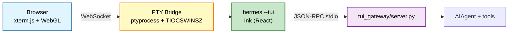

**Transport**: Newline-delimited JSON-RPC over stdio.

**Key Surfaces**:

| Surface | Ink Component | Gateway Method |
|---------|---------------|----------------|
| Chat streaming | `app.tsx` + `messageLine.tsx` | `prompt.submit` → `message.delta/complete` |
| Tool activity | `thinking.tsx` | `tool.start/progress/complete` |
| Approvals | `prompts.tsx` | `approval.respond` ← `approval.request` |
| Clarify/sudo/secret | `prompts.tsx`, `maskedPrompt.tsx` | `clarify/sudo/secret.respond` |
| Session picker | `sessionPicker.tsx` | `session.list/resume` |
| Slash commands | Local handler + fallthrough | `slash.exec` → `_SlashWorker` |
| Completions | `useCompletion` hook | `complete.slash`, `complete.path` |
| Theming | `theme.ts` + `branding.tsx` | `gateway.ready` with skin data |

### 5.10 ACP Adapter

[`acp_adapter/`](acp_adapter/) — Agent Client Protocol server:

| Module | Purpose |
|--------|---------|
| [`entry.py`](acp_adapter/entry.py) | CLI entry point, benign probe filtering |
| [`server.py`](acp_adapter/server.py) | ACP JSON-RPC server implementation |
| [`session.py`](acp_adapter/session.py) | ACP session management |
| [`tools.py`](acp_adapter/tools.py) | Tool schema conversion for ACP |
| [`events.py`](acp_adapter/events.py) | Event forwarding |
| [`permissions.py`](acp_adapter/permissions.py) | Permission model |
| [`auth.py`](acp_adapter/auth.py) | Authentication |
| [`agents.json`](acp_registry/agent.json) | ACP agent registry |

---

## 6. Data Flow & Communication Patterns

### 6.1 CLI Conversation Flow

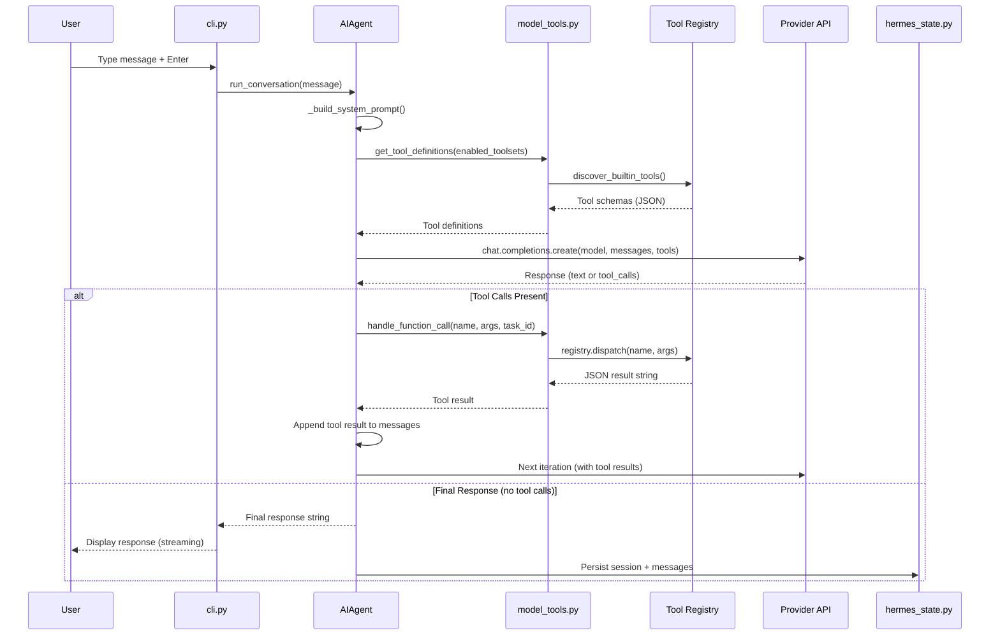

### 6.2 Gateway Message Flow

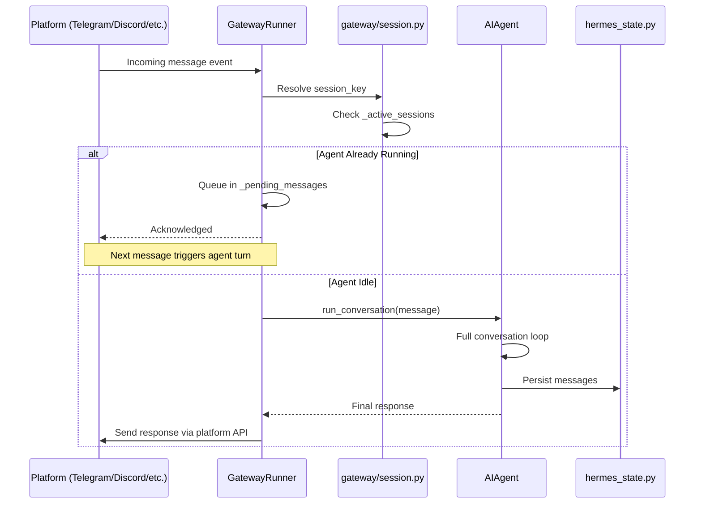

### 6.3 Subagent Delegation Flow

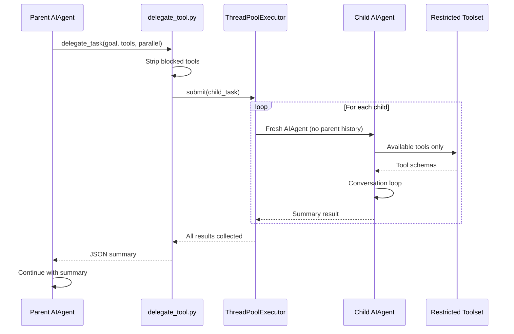

---

## 7. Design Principles & Patterns

### 7.1 Core Architectural Principles

| Principle | Implementation | Benefit |
|-----------|---------------|---------|
| **Self-Registering Tools** | `registry.register()` at module import time | Zero central tool list maintenance |
| **Transport Abstraction** | `ProviderTransport` ABC → `NormalizedResponse` | Add providers without touching agent core |
| **Context Firewalling** | Subagents with restricted toolsets | Parent never sees child's intermediate calls |
| **Profile-Aware Paths** | `get_hermes_home()` everywhere | Multi-instance profiles, no `~/.hermes` hardcoding |
| **Async Bridging** | Persistent event loops per-thread | No "Event loop is closed" with cached clients |
| **Plugin Lifecycle Hooks** | `pre/post_tool_call`, `pre/post_llm_call` | Extend without modifying core files |
| **Session-First CRUD** | `session: Session` as first parameter | Consistent DB access pattern |
| **Zero Raw SQL** | SQLModel `select()` only | Agent-readable, type-safe queries |

### 7.2 Anti-Patterns (Enforced)

| Anti-Pattern | Enforcement | Rationale |
|--------------|-------------|-----------|
| `Path.home() / ".hermes"` | `get_hermes_home()` mandatory | Breaks profiles |
| `session.execute(text(...))` | Compliance check scripts | Opaque to agents, injection risk |
| `session.query()` | Auto-detect + refactor mandate | Deprecated SQLAlchemy pattern |
| `print()` statements | `logger.debug` mandatory | Structured logging, traceability |
| Hardcoded secrets | `.env` + `config.ini` only | Security, portability |
| Skip decorators in tests | `--pr-check` real mode | Honest test results |

### 7.3 Security-by-Design

| Layer | Mechanism | Protection |
|-------|-----------|------------|
| **Prompt** | 15+ regex patterns in `prompt_builder.py` | Prompt injection, deception, sys prompt override |
| **Path** | `tools/path_security.py` | Symlink attacks, unauthorized file access |
| **URL** | `tools/url_safety.py` | Protocol restriction (no `file://`, `data://`) |
| **Credential** | Multi-pool with failover, profile isolation | Key compromise, cross-profile leakage |
| **Environment** | Env var blocklist in execution backends | Provider key leakage to child processes |
| **Context** | PII hashing in gateway sessions | User/chat ID exposure |
| **Tool** | Blocked tool lists for subagents | Recursive delegation, cross-platform side effects |

---

## 8. Extensibility Model

### 8.1 Extension Points

| Extension Type | Mechanism | Example |
|---------------|-----------|---------|
| **New Tool** | Create `tools/my_tool.py` with `registry.register()` | Custom API integration |
| **New Platform** | Create `gateway/platforms/my_platform.py` extending `BasePlatformAdapter` | New messaging platform |
| **New Memory Provider** | Create `plugins/memory/my_provider/` implementing `MemoryProvider` ABC | Custom memory backend |
| **New Context Engine** | Create `plugins/context_engine/my_engine/` implementing `ContextEngine` ABC | LCM, custom compression |
| **New Image Gen** | Create `plugins/image_gen/my_provider/` implementing `ImageGenProvider` ABC | Custom image generation |
| **New Skin** | Drop YAML in `~/.hermes/skins/` or add to `_BUILTIN_SKINS` | Custom CLI theme |
| **New Slash Command** | Add to `COMMAND_REGISTRY` in `hermes_cli/commands.py` | Custom CLI command |
| **Plugin Hook** | Register `pre/post_tool_call`, `pre/post_llm_call` | Observability, audit logging |

### 8.2 Plugin Discovery

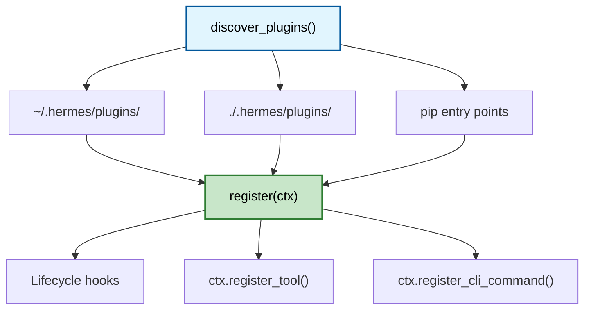

---

## 9. Deployment Architecture

### 9.1 Deployment Topologies

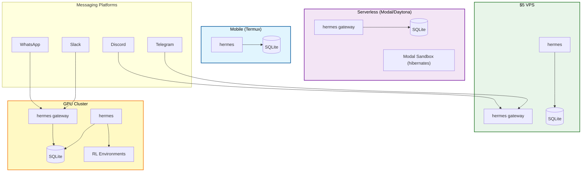

### 9.2 Installation Paths

| Platform | Method | Details |
|----------|--------|---------|
| **Linux/macOS** | `curl -fsSL install.sh \| bash` | Handles venv, deps, CLI symlink |
| **Termux (Android)** | Manual path with `.[termux]` extra | Android-incompatible voice deps excluded |
| **WSL2 (Windows)** | Same as Linux | Native Windows not supported |
| **Nix** | `nix develop` | Flake-based development environment |
| **Manual** | `./setup-hermes.sh` | For cloned repos |

---

## 10. Performance Characteristics

### 10.1 Cold Start Optimization

| Module | Optimization | Impact |
|--------|--------------|--------|
| `run_agent.py` | Lazy `OpenAI` import via `_OpenAIProxy` | ~240ms saved on library import |
| `gateway/run.py` | `account_usage` imported at module top (daemon, boot cost acceptable) | Preserves test-patch surface |
| `model_tools.py` | Persistent event loops (not `asyncio.run()` per call) | Prevents "Event loop is closed" |

### 10.2 Resource Limits

| Resource | Limit | Configuration |
|----------|-------|---------------|
| Agent cache | 128 sessions (LRU) | `_AGENT_CACHE_MAX_SIZE` |
| Agent idle TTL | 1 hour | `_AGENT_CACHE_IDLE_TTL_SECS` |
| Gateway auto-continue freshness | 1 hour | `_AUTO_CONTINUE_FRESHNESS_SECS_DEFAULT` |
| Context compression threshold | 75% | `threshold_percent` |
| Summary token ceiling | 12,000 tokens | `_SUMMARY_TOKENS_CEILING` |
| Test workers | 4 (CI parity) | `scripts/run_tests.sh` |

---

## 11. Testing & Quality Assurance

### 11.1 Test Architecture

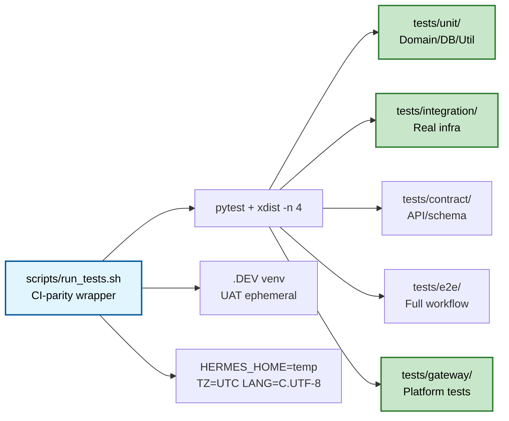

### 11.2 Test Metrics

| Metric | Value |
|--------|-------|
| Total tests | ~15,000 |
| Test files | ~700 |
| Test directories | `tests/unit/`, `tests/integration/`, `tests/contract/`, `tests/e2e/`, `tests/gateway/` |
| CI parity | 4 xdist workers, UTC, C.UTF-8, unset credential vars |
| Real service detection | PostgreSQL (5432), Redis (6379), Airflow (8080), LDAP (389) |

---

## 12. File Structure & Metrics

### 12.1 Component Breakdown

| Component | Path | Files | LOC (approx) | Description |
|-----------|------|-------|--------------|-------------|
| **Agent Core** | `run_agent.py` | 1 | ~13,854 | AIAgent class, conversation loop |
| **Agent Module** | `agent/` | 45 | ~15,000 | Transports, context, memory, skills |
| **Tool Orchestration** | `model_tools.py` | 1 | ~812 | Tool discovery, dispatch, async bridging |
| **Toolsets** | `toolsets.py` | 1 | ~806 | Tool definitions, composition |
| **CLI** | `cli.py` | 1 | ~11,644 | Interactive terminal interface |
| **Gateway** | `gateway/run.py` | 1 | ~12,846 | Multi-platform daemon |
| **Gateway Module** | `gateway/` | 30 | ~18,000 | Platform adapters, session management |
| **Tools** | `tools/` | 70+ | ~25,000 | Tool implementations, environments, providers |
| **State Store** | `hermes_state.py` | 1 | ~2,095 | SQLite + FTS5 |
| **Credential Pool** | `agent/credential_pool.py` | 1 | ~1,574 | Multi-credential failover |
| **Context Compressor** | `agent/context_compressor.py` | 1 | ~1,415 | Conversation compaction |
| **Curator** | `agent/curator.py` | 1 | ~927 | Skill maintenance |
| **TUI Gateway** | `tui_gateway/` | 8 | ~2,000 | JSON-RPC server for TUI |
| **ACP Adapter** | `acp_adapter/` | 8 | ~1,000 | Agent Client Protocol server |
| **Dashboard** | `hermes_cli/web_server.py` | 1 | ~3,000 | Web dashboard with embedded TUI |
| **Tests** | `tests/` | 700+ | ~15,000 | Test suite |
| **Frontend** | `ui-tui/src/` | 50+ | ~10,000 | React/Ink components |

**Total**: ~100+ Python files, ~100,000+ LOC, ~700 test files

### 12.2 Directory Structure

```
hermes-agent/
├── run_agent.py              # AIAgent class — core conversation loop
├── model_tools.py            # Tool orchestration, discover_builtin_tools()
├── toolsets.py               # Toolset definitions, _HERMES_CORE_TOOLS
├── cli.py                    # HermesCLI — interactive CLI orchestrator
├── hermes_state.py           # SQLite session store with FTS5
├── hermes_constants.py       # Profile-aware path utilities
├── hermes_logging.py         # Structured logging setup
├── agent/                    # Agent internals (~45 files)
│   ├── transports/           # Provider transport implementations
│   ├── credential_pool.py    # Multi-credential failover
│   ├── context_compressor.py # Conversation compaction
│   ├── memory_manager.py     # Memory provider orchestration
│   └── curator.py            # Background skill maintenance
├── gateway/                  # Messaging gateway (~30 files)
│   ├── platforms/            # 22+ platform adapters
│   └── builtin_hooks/        # Extension point for hooks
├── tools/                    # Tool implementations (70+ files)
│   ├── environments/         # 10 execution backends
│   └── browser_providers/    # 4 browser backends
├── ui-tui/                   # React TUI frontend
│   └── src/                  # Ink components
├── tui_gateway/              # JSON-RPC server for TUI
├── acp_adapter/              # Agent Client Protocol server
├── plugins/                  # Plugin system
│   ├── memory/               # Memory provider plugins
│   └── context_engine/       # Context engine plugins
├── cron/                     # Built-in cron scheduler
├── skills/                   # Built-in skills
├── optional-skills/          # Niche/heavy skills
├── tests/                    # Test suite (~700 files)
├── scripts/                  # Build, test, release scripts
└── website/                  # Docusaurus documentation
```

---

## 13. Comparison with Similar Projects

| Feature | Hermes Agent | OpenClaw | ChatDev | AutoGPT |
|---------|-------------|----------|---------|---------|
| **Multi-platform** | 22+ platforms | CLI only | CLI only | CLI only |
| **Self-improvement** | Built-in learning loop | No | No | Limited |
| **Subagent delegation** | Yes (isolated context) | No | Yes | Yes |
| **Execution backends** | 10 (local, Docker, Modal, etc.) | Local only | Local only | Local only |
| **Browser automation** | Multi-backend (Browser Use, Browserbase, local) | No | No | Limited |
| **Memory system** | 8+ providers (honcho, mem0, etc.) | No | No | No |
| **RL training** | Atropos environments | No | No | No |
| **Trajectory compression** | Yes (for model training) | No | No | No |
| **ACP integration** | Full ACP server | No | No | No |
| **Plugin system** | Lifecycle hooks, memory, context engines | No | No | No |
| **License** | MIT | MIT | Apache 2.0 | MIT |
| **Test coverage** | ~15,000 tests | Limited | Limited | Limited |

---

## 14. Future Roadmap

### 14.1 Near-Term Priorities

| Priority | Description | Status |
|----------|-------------|--------|
| **Provider expansion** | Add more transport adapters (Mistral, Cohere, etc.) | Ongoing |
| **Platform growth** | New platform adapters (Teams, IRC, etc.) | Community-driven |
| **Memory provider plugins** | Additional memory backends | Open |
| **Context engine plugins** | LCM integration, custom compression | Open |
| **Dashboard enhancement** | Richer React UI around embedded TUI | Open |

### 14.2 Long-Term Vision

| Vision | Description |
|--------|-------------|
| **Multi-agent orchestration** | Hierarchical agent teams with shared state |
| **Distributed execution** | Cross-machine agent coordination |
| **Model training pipeline** | Full trajectory → fine-tuning pipeline |
| **Enterprise features** | SSO, RBAC, audit logging |
| **Mobile native** | Native iOS/Android apps |

---

## Appendix A: Glossary

| Term | Definition |
|------|------------|
| **ACP** | Agent Client Protocol — standard for AI agent communication |
| **CDP** | Chrome DevTools Protocol — browser automation interface |
| **FTS5** | Full-Text Search version 5 — SQLite extension |
| **LCM** | LLM Context Management — third-party context compression |
| **LOC** | Lines of Code |
| **OCI** | Open Container Initiative — container standard |
| **PTC** | Programmatic Tool Calling — code that calls tools via RPC |
| **UDS** | Unix Domain Socket — local IPC mechanism |
| **WAL** | Write-Ahead Logging — SQLite concurrency mode |

## Appendix B: Configuration Reference

| Config Key | Default | Description |
|------------|---------|-------------|
| `model` | Resolved from provider | Active model |
| `max_iterations` | 90 | Max tool-calling iterations |
| `gateway_timeout` | 30 min | Gateway turn timeout |
| `gateway_auto_continue_freshness` | 1 hour | Auto-continue window |
| `context.threshold_percent` | 0.75 | Compression trigger threshold |
| `context.protect_first_n` | 3 | Messages protected during compression |
| `memory.provider` | builtin | Active memory provider |
| `terminal.env` | {} | Environment variables for terminal |
| `display.skin` | default | CLI skin name |

---

*Document generated: 2026-04-30 by Qwen3.6-35B-A3B-FP8 via Roo Code Agentic Planner*
