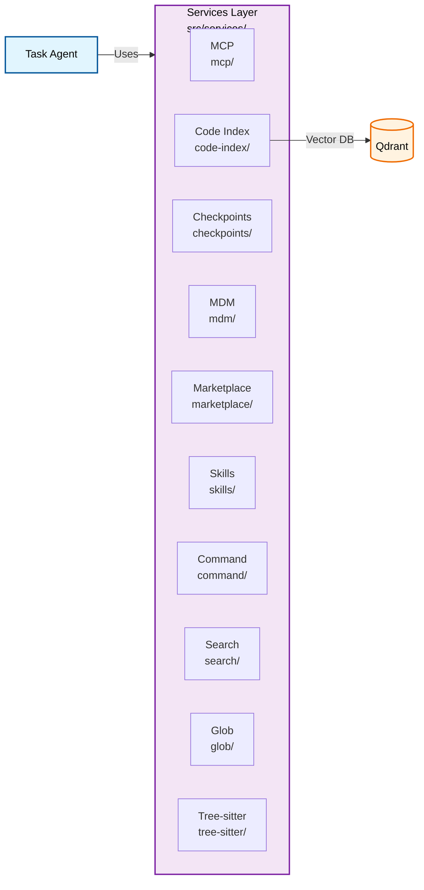
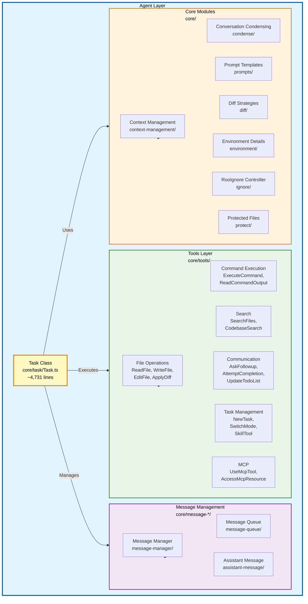

# Roo-Code Repository Architecture Analysis

## Reference Standards

This analysis follows the Torro Agentic Harness standards defined in [`agentic/standard/AGENT.md`](../standard/AGENT.md).

## Executive Summary

Roo-Code is a VS Code extension (AI coding assistant) built as a TypeScript monorepo using pnpm workspaces. It provides AI-powered coding assistance through multiple AI provider integrations, with a sophisticated agent architecture built around the `Task` class.

---

## Repository Structure

```
Roo-Code/
├── src/                          # VS Code extension (main codebase)
│   ├── api/                      # AI Provider layer (Solution Layer)
│   ├── core/                     # Agent core (Agent Layer)
│   ├── extension/                # VS Code extension host
│   ├── integrations/             # VS Code integrations
│   ├── services/                 # Backend services
│   ├── shared/                   # Shared utilities/types
│   └── utils/                    # Utility functions
├── packages/                     # Shared packages
│   ├── cloud/                    # Cloud service
│   ├── core/                     # Core utilities (CLI headless)
│   ├── evals/                    # Evaluation framework
│   ├── ipc/                      # IPC communication
│   ├── telemetry/                # Telemetry service
│   ├── types/                    # Shared TypeScript types
│   └── vscode-shim/              # VS Code API shim
├── apps/                         # Applications
│   ├── cli/                      # CLI application
│   ├── web-evals/                # Web evals dashboard
│   └── web-roo-code/             # Marketing website
└── webview-ui/                   # React webview UI
```

---

## Architecture Solution Layer

The solution layer handles AI model integration, API communication, and data transformation.

### 1. Provider Layer (`src/api/providers/`)

**Purpose:** Abstract interface to multiple AI model providers

**Key Providers:**
- `anthropic.ts` - Anthropic Claude models
- `openai.ts` / `openai-native.ts` - OpenAI models
- `bedrock.ts` - AWS Bedrock
- `vertex.ts` / `anthropic-vertex.ts` - Google Vertex AI
- `gemini.ts` - Google Gemini
- `openrouter.ts` - OpenRouter proxy
- `lite-llm.ts` - LiteLLM proxy
- `vscode-lm.ts` - VS Code Language Model API
- `roo.ts` / `router-provider.ts` - Roo Code Router

**Provider Architecture:**
```
BaseProvider (abstract)
├── BaseOpenAiCompatibleProvider
│   ├── OpenAICompatibleProvider
│   ├── OpenAIProvider
│   ├── BedrockProvider
│   └── ...
├── AnthropicProvider
├── GeminiProvider
└── ...
```

**Key Files:**
- [`src/api/index.ts`](src/api/index.ts) - Provider factory (`buildApiHandler`)
- [`src/api/providers/base-provider.ts`](src/api/providers/base-provider.ts) - Abstract base
- [`src/api/providers/index.ts`](src/api/providers/index.ts) - Provider exports

### 2. Transform Layer (`src/api/transform/`)

**Purpose:** Data transformation between provider-specific formats and internal representations

**Key Transforms:**
- `stream.ts` - Stream processing
- `anthropic-filter.ts` - Anthropic message filtering
- `bedrock-converse-format.ts` - Bedrock format conversion
- `gemini-format.ts` - Gemini format conversion
- `openai-format.ts` - OpenAI format conversion
- `reasoning.ts` - Reasoning content handling
- `responses-api-*.ts` - OpenAI Responses API support

**Caching Strategies:**
- `transform/cache-strategy/` - Prompt caching strategies
- `transform/caching/` - Provider-specific caching (Anthropic, Gemini, Vertex)

### 3. Services Layer (`src/services/`)

**Purpose:** Backend services supporting the agent



**Key Services:**
| Service | Path | Purpose |
|---------|------|---------|
| MCP | `mcp/` | Model Context Protocol server management |
| Code Index | `code-index/` | Vector codebase indexing with Qdrant |
| Checkpoints | `checkpoints/` | Task state snapshots |
| MDM | `mdm/` | Mobile Device Management |
| Marketplace | `marketplace/` | Extension marketplace |
| Skills | `skills/` | Skill management |
| Command | `command/` | Custom command handling |
| Search | `search/` | File search |
| Glob | `glob/` | File pattern matching |
| Tree-sitter | `tree-sitter/` | Code parsing |

---

## Agent Layer

The agent layer implements the core AI agent functionality.

### Agent Layer Architecture Diagram



The agent layer implements the core AI agent functionality.

### 1. Task Core (`src/core/task/`)

**Purpose:** Main agent orchestration

**Key Files:**
- [`Task.ts`](src/core/task/Task.ts) (~4,731 lines) - **The main agent class**
- [`build-tools.ts`](src/core/task/build-tools.ts) - Tool configuration
- [`validateToolResultIds.ts`](src/core/task/validateToolResultIds.ts) - Tool validation

**Task Class Architecture:**
```typescript
class Task extends EventEmitter<TaskEvents> implements TaskLike {
    // Identity
    taskId: string
    parentTaskId?: string
    childTaskId?: string
    
    // Configuration
    apiConfiguration: ProviderSettings
    api: ApiHandler
    _taskMode: string
    
    // State
    apiConversationHistory: ApiMessage[]
    clineMessages: ClineMessage[]
    todoList?: TodoItem[]
    
    // Services
    messageQueueService: MessageQueueService
    autoApprovalHandler: AutoApprovalHandler
    toolRepetitionDetector: ToolRepetitionDetector
    diffViewProvider: DiffViewProvider
    checkpointService?: RepoPerTaskCheckpointService
    
    // Streaming
    isStreaming: boolean
    assistantMessageContent: AssistantMessageContent[]
}
```

### 2. Tools (`src/core/tools/`)

**Purpose:** Tool implementations for the agent

**Tool Categories:**

| Category | Tools |
|----------|-------|
| File Operations | `ReadFileTool`, `WriteToFileTool`, `EditFileTool`, `ApplyDiffTool`, `SearchReplaceTool` |
| Command Execution | `ExecuteCommandTool`, `ReadCommandOutputTool` |
| Search | `SearchFilesTool`, `CodebaseSearchTool` |
| Communication | `AskFollowupQuestionTool`, `AttemptCompletionTool`, `UpdateTodoListTool` |
| Task Management | `NewTaskTool`, `SwitchModeTool`, `SkillTool` |
| MCP | `UseMcpToolTool`, `AccessMcpResourceTool` |
| Other | `GenerateImageTool`, `RunSlashCommandTool`, `ListFilesTool` |

**Base Class:** [`BaseTool`](src/core/tools/BaseTool.ts)

### 3. Message Management (`src/core/message-*/`)

**Purpose:** Message handling and presentation

**Key Modules:**
- `message-manager/` - Message coordination
- `message-queue/` - Message queuing service
- `assistant-message/` - Message presentation/parsing
  - `NativeToolCallParser.ts` - Native tool call parsing
  - `presentAssistantMessage.ts` - Message presentation

### 4. Core Modules (`src/core/`)

**Purpose:** Core agent functionality

| Module | Purpose |
|--------|---------|
| `context-management/` | Context window management |
| `condense/` | Conversation condensing/summarization |
| `prompts/` | Prompt templates and building |
| `diff/` | Diff strategies |
| `environment/` | Environment details |
| `ignore/` | .rooignore handling |
| `mentions/` | @-mention processing |
| `protect/` | Protected file handling |
| `context-tracking/` | File context tracking |
| `checkpoints/` | Checkpoint management |
| `webview/` | Webview communication |

---

## Data Flow

```
┌─────────────────────────────────────────────────────────────┐
│                        UI Layer                              │
│  ┌─────────────┐    ┌──────────────┐    ┌───────────────┐  │
│  │  webview-ui │    │ ClineProvider│    │  Extension Host│  │
│  │  (React)    │◄──►│  (State Mgmt)│◄──►│               │  │
│  └─────────────┘    └──────────────┘    └───────────────┘  │
└─────────────────────────────────────────────────────────────┘
                            │
                            ▼
┌─────────────────────────────────────────────────────────────┐
│                      Agent Layer                             │
│  ┌──────────────────────────────────────────────────────┐   │
│  │                    Task (Agent)                       │   │
│  │  ┌──────────┐ ┌──────────┐ ┌─────────────────────┐  │   │
│  │  │  Tools   │ │ Messages │ │  Context Management │  │   │
│  │  └──────────┘ └──────────┘ └─────────────────────┘  │   │
│  └──────────────────────────────────────────────────────┘   │
└─────────────────────────────────────────────────────────────┘
                            │
                            ▼
┌─────────────────────────────────────────────────────────────┐
│                    Solution Layer                            │
│  ┌──────────┐    ┌──────────┐    ┌─────────────────────┐   │
│  │ Providers│───►│ Transforms│───►│   External APIs     │   │
│  └──────────┘    └──────────┘    └─────────────────────┘   │
└─────────────────────────────────────────────────────────────┘
```

---

## Key Architectural Patterns

### 1. Provider Abstraction
All AI providers implement a common interface through `ApiHandler`, allowing seamless switching between providers.

### 2. Event-Driven Architecture
`Task` extends `EventEmitter<TaskEvents>` for reactive state management.

### 3. Layered Services
Services are organized by concern (MCP, code-index, checkpoints, etc.) with clear interfaces.

### 4. Monorepo Structure
Shared types and utilities in `packages/` enable code reuse across extension, CLI, and web apps.

---

## Technology Stack

| Component | Technology |
|-----------|------------|
| Language | TypeScript |
| Package Manager | pnpm (v10.8.1) |
| Node.js | v20.19.2 |
| Build Tool | Turborepo |
| UI Framework | React (webview) |
| VS Code API | @types/vscode |
| AI SDK | ai-sdk (various providers) |
| Vector DB | Qdrant (code indexing) |
| Testing | Vitest |

---

## Summary

Roo-Code implements a sophisticated AI coding assistant with:
- **Solution Layer**: Multi-provider AI integration with format transformation
- **Agent Layer**: Event-driven task orchestration with tool execution
- **Service Layer**: Supporting services (MCP, code indexing, checkpoints)
- **UI Layer**: React-based webview with VS Code integration

The architecture emphasizes modularity, with clear separation between provider abstraction, agent logic, and supporting services.
