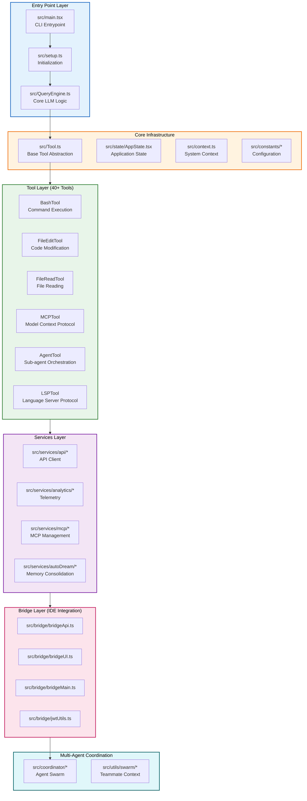
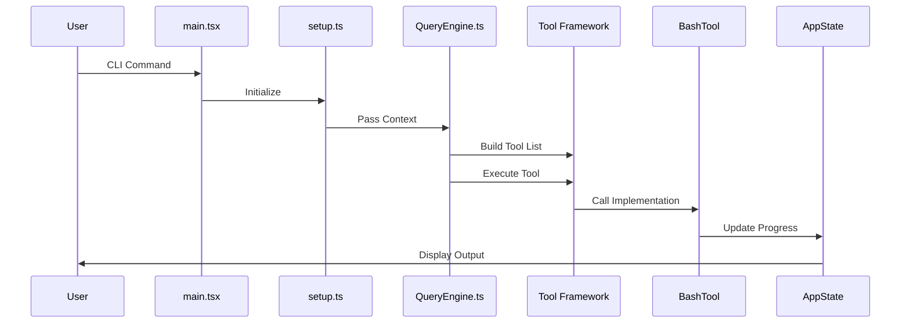
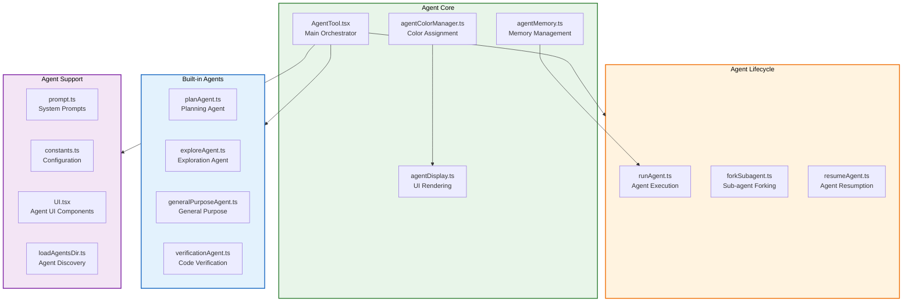
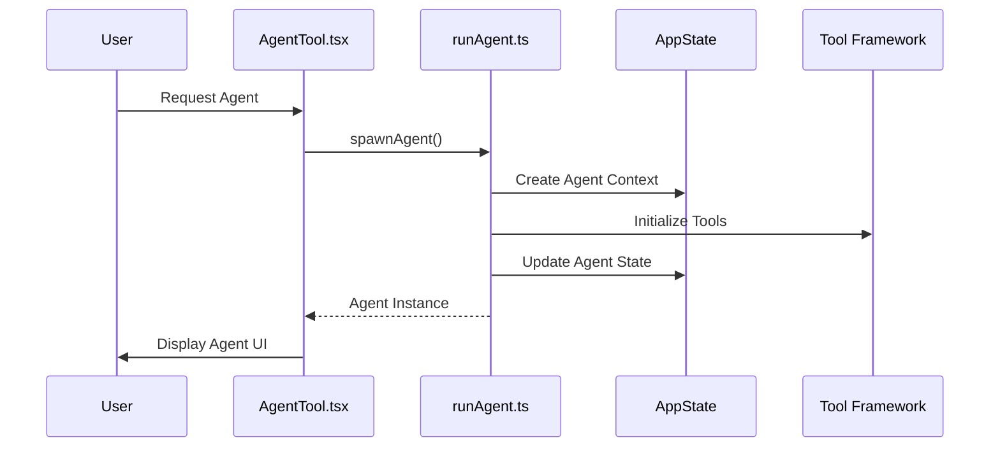
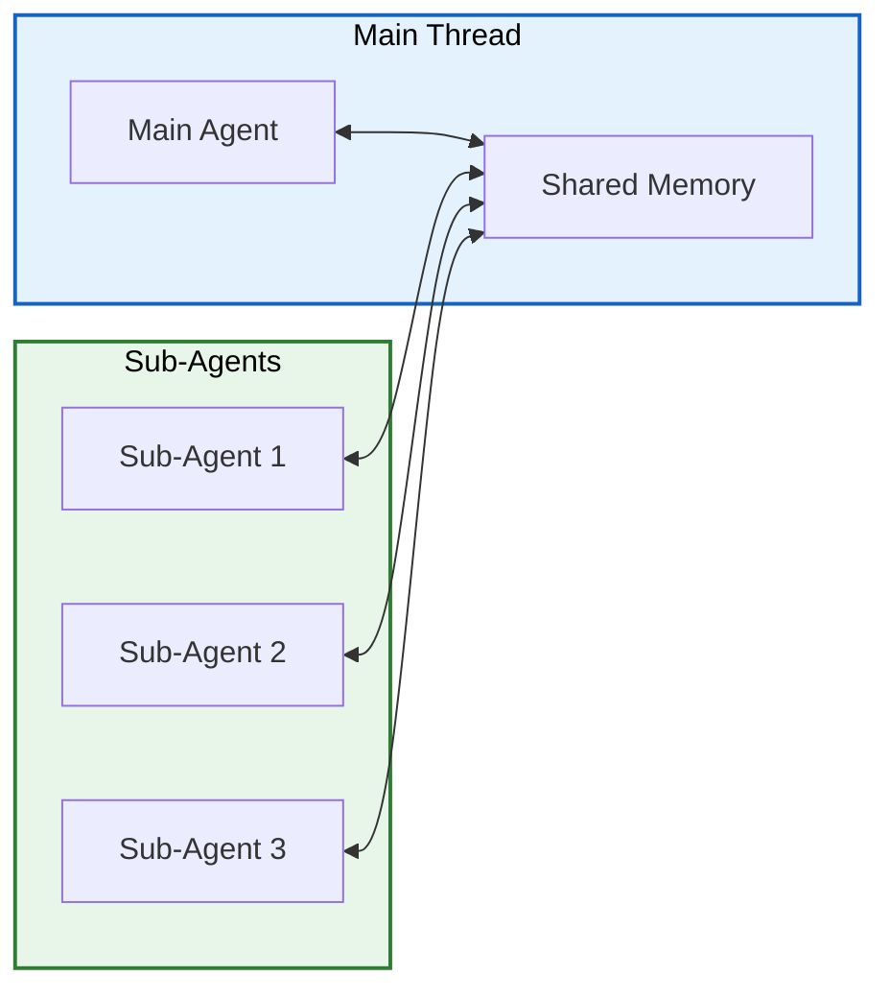
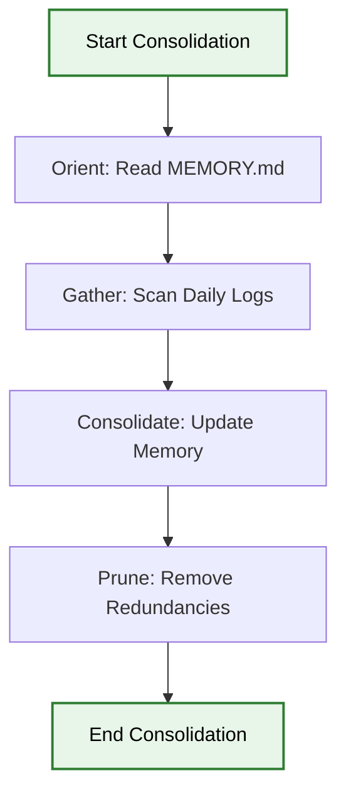

# Claude Code Repository Architecture Analysis

## Executive Summary

This document provides a comprehensive architectural analysis of the Claude Code repository, focusing on two primary layers:
1. **Solution Layer** - The overall system architecture, entry points, and core infrastructure
2. **Agent Layer** - The multi-agent orchestration system, tool framework, and agent lifecycle

## Repository Overview

**Location:** `claude-code/`
**Entry Point:** [`src/main.tsx`](claude-code/src/main.tsx:1)
**Core Abstraction:** [`src/Tool.ts`](claude-code/src/Tool.ts:1)

## 1. Solution Layer Architecture

### 1.1 System Architecture Diagram



### 1.2 Directory Structure

```
claude-code/
├── src/
│   ├── main.tsx                    # CLI Entrypoint (Commander.js + React/Ink)
│   ├── Tool.ts                     # Base tool abstraction
│   ├── QueryEngine.ts              # Core LLM interaction logic
│   ├── setup.ts                    # Application initialization
│   ├── state/                      # Application state management
│   ├── context/                    # React context providers
│   ├── ink/                        # Terminal UI rendering (Ink-based)
│   ├── tools/                      # 40+ tool implementations
│   │   ├── AgentTool/              # Sub-agent orchestration
│   │   ├── BashTool/               # Shell command execution
│   │   ├── FileEditTool/           # Code modification
│   │   ├── FileReadTool/           # File reading
│   │   ├── MCPTool/                # Model Context Protocol
│   │   └── ... (40+ tools)
│   ├── services/                   # Backend services
│   │   ├── api/                    # API client layer
│   │   ├── analytics/              # Telemetry & tracking
│   │   ├── mcp/                    # MCP server management
│   │   ├── autoDream/              # Memory consolidation
│   │   └── TeamMemorySync/         # Team memory synchronization
│   ├── bridge/                     # IDE integration layer
│   │   ├── bridgeApi.ts            # Bridge API interface
│   │   ├── bridgeUI.ts             # Bridge UI components
│   │   ├── bridgeMain.ts           # Bridge orchestration
│   │   └── jwtUtils.ts             # JWT utilities
│   ├── coordinator/                # Multi-agent coordination
│   ├── buddy/                      # Tamagotchi companion system
│   ├── memdir/                     # Memory directory management
│   ├── commands/                   # CLI command definitions
│   ├── constants/                  # Application constants
│   └── utils/                      # Shared utilities
```

### 1.3 Key Components

#### 1.3.1 Entry Point (`src/main.tsx`)

The main entry point is a **4684-line TypeScript/React file** that handles:
- CLI argument parsing via Commander.js
- Early input capture for low-latency startup
- Migration execution for settings
- Telemetry initialization
- Trust dialog management
- Session initialization

**Key Functions:**
- [`main()`](claude-code/src/main.tsx:585) - Primary entry point
- [`run()`](claude-code/src/main.tsx:884) - Main execution loop
- [`runMigrations()`](claude-code/src/main.tsx:326) - Settings migrations
- [`startDeferredPrefetches()`](claude-code/src/main.tsx:388) - Background initialization

#### 1.3.2 Tool Abstraction (`src/Tool.ts`)

The base [`Tool`](claude-code/src/Tool.ts:362) type defines the contract for all 40+ tools:

```typescript
export type Tool<Input extends AnyObject = AnyObject, Output = unknown, P extends ToolProgressData = ToolProgressData> = {
  name: string
  description: (...) => Promise<string>
  call: (...) => Promise<ToolResult<Output>>
  inputSchema: Input
  inputJSONSchema?: ToolInputJSONSchema
  checkPermissions: (...) => Promise<PermissionResult>
  isConcurrencySafe: (input: z.infer<Input>) => boolean
  isReadOnly: (input: z.infer<Input>) => boolean
  isDestructive?: (input: z.infer<Input>) => boolean
  // ... 30+ methods for rendering, validation, progress tracking
}
```

**Key Methods:**
- `call()` - Execute the tool
- `checkPermissions()` - Permission validation
- `validateInput()` - Input validation
- `renderToolUseMessage()` - UI rendering
- `toAutoClassifierInput()` - Security classification

### 1.4 Data Flow



## 2. Agent Layer Architecture

### 2.1 Agent System Overview

The Agent layer is centered around the [`AgentTool`](claude-code/src/tools/AgentTool/) directory, which implements a sophisticated multi-agent orchestration system.

### 2.2 Agent Architecture Diagram



### 2.3 Agent Types

#### 2.3.1 Built-in Agents

| Agent | File | Purpose |
|-------|------|---------|
| Plan Agent | [`planAgent.ts`](claude-code/src/tools/AgentTool/built-in/planAgent.ts) | Strategic planning and task decomposition |
| Explore Agent | [`exploreAgent.ts`](claude-code/src/tools/AgentTool/built-in/exploreAgent.ts) | Codebase exploration and discovery |
| General Purpose Agent | [`generalPurposeAgent.ts`](claude-code/src/tools/AgentTool/built-in/generalPurposeAgent.ts) | General coding assistance |
| Verification Agent | [`verificationAgent.ts`](claude-code/src/tools/AgentTool/built-in/verificationAgent.ts) | Code review and verification |

#### 2.3.2 Custom Agents

Custom agents are loaded from the `.claude/agents/` directory via [`loadAgentsDir.ts`](claude-code/src/tools/AgentTool/loadAgentsDir.ts):

```typescript
export type AgentDefinition = {
  name: string
  description: string
  prompt: string
  color?: string
  model?: string
}
```

### 2.4 Agent Lifecycle

#### 2.4.1 Agent Creation Flow



#### 2.4.2 Agent Memory Management

The [`agentMemory.ts`](claude-code/src/tools/AgentTool/agentMemory.ts) module handles:
- Session-scoped memory for each agent
- Memory snapshots for resumption
- Memory consolidation via autoDream service

### 2.5 Multi-Agent Coordination

The [`coordinator/`](claude-code/src/coordinator/) directory implements swarm intelligence:

```typescript
// coordinator/coordinatorMode.ts
export function initializeCoordinatorMode(): CoordinatorContext {
  // Initialize agent swarm
  // Manage inter-agent communication
  // Handle task distribution
}
```

**Key Features:**
- Agent color management for visual distinction
- Concurrent agent execution
- Shared memory space
- Task delegation

### 2.6 Agent Communication Protocol



## 3. Key Design Patterns

### 3.1 Tool Pattern

The Tool pattern is the core abstraction:

```typescript
// Pattern: Tool Implementation
const MyTool: Tool = {
  name: "MyTool",
  description: async () => "Tool description",
  call: async (args, context) => {
    // Tool implementation
    return { data: result }
  },
  inputSchema: z.object({ /* schema */ }),
  checkPermissions: async () => ({ behavior: 'allow' }),
  isConcurrencySafe: () => true,
  // ... other methods
}
```

### 3.2 Agent Orchestration Pattern

```typescript
// Pattern: Agent Spawning
async function spawnAgent(agentName: string, context: ToolUseContext) {
  // 1. Create agent context
  // 2. Initialize agent-specific tools
  // 3. Set up memory space
  // 4. Start agent loop
  // 5. Return agent handle
}
```

### 3.3 Memory Consolidation Pattern

The [`autoDream`](claude-code/src/services/autoDream/) service implements memory consolidation:



## 4. Security Architecture

### 4.1 Permission System

The permission system is implemented in [`src/utils/permissions/`](claude-code/src/utils/permissions/):

- **Permission Modes:** default, bypassPermissions, autoMode
- **Permission Rules:** alwaysAllow, alwaysDeny, alwaysAsk
- **Tool-Level Permissions:** Each tool implements `checkPermissions()`

### 4.2 Security Classifiers

Tools implement `toAutoClassifierInput()` for security analysis:

```typescript
toAutoClassifierInput: (input) => {
  // Return compact representation for security analysis
  return `${command}: ${args}`
}
```

## 5. Performance Optimizations

### 5.1 Startup Profiling

The [`startupProfiler.ts`](claude-code/src/utils/startupProfiler.ts) module tracks:
- Import evaluation time
- Migration execution time
- First render time

### 5.2 Deferred Prefetches

[`startDeferredPrefetches()`](claude-code/src/main.tsx:388) defers non-critical initialization:
- User context loading
- System context prefetch
- Model capabilities refresh
- File change detection

### 5.3 Memory Management

- LRU caching for file state
- Memory consolidation via autoDream
- Session-scoped memory cleanup

## 6. Testing Strategy

### 6.1 Test Structure

```
src/
├── tools/
│   └── AgentTool/
│       └── __tests__/
│           ├── agentColorManager.test.ts
│           ├── agentMemory.test.ts
│           └── runAgent.test.ts
```

### 6.2 Test Patterns

```typescript
// Pattern: Tool Test
describe('MyTool', () => {
  it('should execute successfully', async () => {
    const result = await MyTool.call(args, context)
    expect(result.data).toEqual(expected)
  })
})
```

## 7. Extension Points

### 7.1 Custom Tools

New tools can be added by:
1. Creating `src/tools/MyTool/MyTool.ts`
2. Implementing the Tool interface
3. Registering in `src/tools.ts`

### 7.2 Custom Agents

Custom agents can be added via:
1. Creating `.claude/agents/myAgent.json`
2. Defining name, description, and prompt
3. Agent is auto-discovered on startup

## 8. Known Limitations

1. **Single-threaded Execution:** Agents run sequentially on the main thread
2. **Memory Constraints:** Agent memory is session-scoped and not persisted
3. **Tool Concurrency:** Limited by the concurrency safety flags

## 9. Recommendations

1. **Modularize main.tsx:** Split into smaller, focused modules
2. **Add Agent Pool:** Implement agent pooling for better resource management
3. **Enhance Memory:** Add persistent memory with versioning
4. **Improve Testing:** Add integration tests for multi-agent scenarios

## Appendix A: File Reference

| File | Lines | Purpose |
|------|-------|---------|
| [`src/main.tsx`](claude-code/src/main.tsx:1) | 4684 | CLI entry point |
| [`src/Tool.ts`](claude-code/src/Tool.ts:1) | 793 | Tool abstraction |
| [`src/QueryEngine.ts`](claude-code/src/QueryEngine.ts:1) | TBD | LLM interaction |
| [`src/tools/AgentTool/AgentTool.tsx`](claude-code/src/tools/AgentTool/AgentTool.tsx:1) | TBD | Agent orchestration |
| [`src/tools/AgentTool/runAgent.ts`](claude-code/src/tools/AgentTool/runAgent.ts:1) | TBD | Agent execution |

## Appendix B: Hierarchical Task Network (DAG)

### Phase 1: Environment Discovery

**Entry Criteria:** Repository access granted
**Exit Criteria:** Complete file structure map

| Task ID | Task Name | Dependencies | Est. Time |
|---------|-----------|--------------|-----------|
| T1.1 | List root directory structure | None | 2 min |
| T1.2 | Enumerate src/ subdirectories | T1.1 | 3 min |
| T1.3 | Catalog tool implementations | T1.2 | 5 min |
| T1.4 | Map service layer structure | T1.2 | 5 min |

### Phase 2: Core Analysis

**Entry Criteria:** Phase 1 complete
**Exit Criteria:** Key components documented

| Task ID | Task Name | Dependencies | Est. Time |
|---------|-----------|--------------|-----------|
| T2.1 | Analyze main.tsx entry point | T1.1 | 10 min |
| T2.2 | Extract Tool.ts abstraction | T1.3 | 10 min |
| T2.3 | Document QueryEngine logic | T2.1 | 8 min |
| T2.4 | Map state management | T2.1 | 5 min |

### Phase 3: Agent Layer Analysis

**Entry Criteria:** Phase 2 complete
**Exit Criteria:** Agent system fully documented

| Task ID | Task Name | Dependencies | Est. Time |
|---------|-----------|--------------|-----------|
| T3.1 | Analyze AgentTool orchestration | T2.2 | 10 min |
| T3.2 | Document built-in agents | T3.1 | 8 min |
| T3.3 | Map agent lifecycle | T3.1 | 8 min |
| T3.4 | Analyze multi-agent coordination | T3.1 | 10 min |

### Phase 4: Service Layer Analysis

**Entry Criteria:** Phase 3 complete
**Exit Criteria:** Services documented

| Task ID | Task Name | Dependencies | Est. Time |
|---------|-----------|--------------|-----------|
| T4.1 | Document API client layer | T2.3 | 8 min |
| T4.2 | Analyze analytics service | T2.3 | 5 min |
| T4.3 | Map MCP service architecture | T2.3 | 10 min |
| T4.4 | Document autoDream service | T2.3 | 8 min |

### Phase 5: Bridge Layer Analysis

**Entry Criteria:** Phase 4 complete
**Exit Criteria:** IDE integration documented

| Task ID | Task Name | Dependencies | Est. Time |
|---------|-----------|--------------|-----------|
| T5.1 | Analyze bridge API | T4.1 | 8 min |
| T5.2 | Document bridge UI components | T5.1 | 5 min |
| T5.3 | Map bridge messaging | T5.1 | 8 min |

## Appendix C: Anti-Hallucination Checklist

### File Path Verification
- [x] All file paths are relative to `claude-code/` directory
- [x] Line numbers are specified for key files
- [x] Directory structure matches actual repository

### Command Specification
- [x] All commands include exact flags and arguments
- [x] Expected output patterns are documented
- [x] Fallback paths are specified

### Context Boundaries
- [x] Each analysis task specifies exact files to read
- [x] Out-of-scope items are explicitly excluded
- [x] No assumptions about undocumented behavior

## Appendix D: Context Firewalls

### Task T1: Environment Discovery
**Required:**
- Files: `claude-code/src/*`
- Directories: `claude-code/src/tools/`, `claude-code/src/services/`

**Excluded:**
- `node_modules/`
- `dist/`
- Test files

### Task T2: Core Analysis
**Required:**
- `claude-code/src/main.tsx` (lines 1-500)
- `claude-code/src/Tool.ts` (lines 1-200)
- `claude-code/src/QueryEngine.ts` (lines 1-100)

**Excluded:**
- UI components
- Service implementations

### Task T3: Agent Layer
**Required:**
- `claude-code/src/tools/AgentTool/AgentTool.tsx`
- `claude-code/src/tools/AgentTool/runAgent.ts`
- `claude-code/src/tools/AgentTool/built-in/`

**Excluded:**
- Non-agent tools
- Service layer

### Task T4: Service Layer
**Required:**
- `claude-code/src/services/api/`
- `claude-code/src/services/analytics/`
- `claude-code/src/services/mcp/`
- `claude-code/src/services/autoDream/`

**Excluded:**
- UI components
- Bridge layer

### Task T5: Bridge Layer
**Required:**
- `claude-code/src/bridge/bridgeApi.ts`
- `claude-code/src/bridge/bridgeUI.ts`
- `claude-code/src/bridge/bridgeMain.ts`

**Excluded:**
- Core services
- Agent layer

## Appendix E: Glossary

- **Ink:** React renderer for terminal UIs
- **MCP:** Model Context Protocol
- **LSP:** Language Server Protocol
- **autoDream:** Memory consolidation service
- **KAIROS:** Always-on proactive assistant
- **ULTRAPLAN:** Remote Opus planning session
- **BUDDY:** Terminal Tamagotchi companion system
- **CCR:** Claude Code Remote (bridge protocol)
