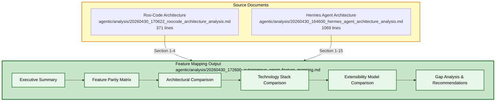

# Plan: Autonomous Enterprise Coding Agent Feature Mapping

## Objective

Create a comprehensive feature mapping analysis comparing **Roo-Code** (TypeScript VS Code extension) and **Hermes Agent** (Python multi-platform AI agent) — two autonomous enterprise coding agent architectures. The output will be a structured comparison document identifying feature parity, gaps, architectural differences, and extensibility models.

## Constraints

- Max context per task: 128k tokens
- Max execution time per task: 10 minutes
- Max files per task: 3 files (2 source analyses + 1 output)
- Anti-hallucination: All comparisons must reference specific sections/lines from source documents
- Output must follow Harness Engineering principles for agent readability

## Architecture Diagram



## Tasks (DAG)

### Phase 1: Feature Mapping Generation

- **Token Budget:** 1M
- **Entry Criteria:** Both source architecture analysis documents are available and read
- **Exit Criteria:** Feature mapping document generated with all comparison sections

### Task 1: Generate Autonomous Agent Feature Mapping

- [ ] Status: Pending
- **Objective:** Create comprehensive feature mapping document comparing Roo-Code and Hermes Agent architectures
- **Input Contract:**
  - Read: `agentic/analysis/20260430_170622_roocode_architecture_analysis.md` (complete file, lines 1-371)
  - Read: `agentic/analysis/20260430_164600_hermes_agent_architecture_analysis.md` (complete file, lines 1-1069)
- **Output Contract:**
  - Create: `agentic/analysis/20260430_172600_autonomous_agent_feature_mapping.md` (~500-700 lines)
- **Exact Commands:**
  ```bash
  # Step 1: Verify source files exist
  ls -la agentic/analysis/20260430_170622_roocode_architecture_analysis.md
  ls -la agentic/analysis/20260430_164600_hermes_agent_architecture_analysis.md

  # Step 2: Generate the feature mapping document
  # (Content written directly via write_to_file tool)
  ```
- **Expected Output:** Feature mapping document with YAML frontmatter, architecture diagram, and all comparison sections
- **Fallback Path:** If source files are missing, list `agentic/analysis/` to verify available files
- **Dependencies:** None
- **Estimated Time:** 10 minutes
- **Context Firewall:**
  - Required:
    - `agentic/analysis/20260430_170622_roocode_architecture_analysis.md` (complete)
    - `agentic/analysis/20260430_164600_hermes_agent_architecture_analysis.md` (complete)
  - Excluded:
    - `Roo-Code/` source code directory
    - `hermes-agent/` source code directory
    - Any other analysis files

---

## Feature Mapping Document Structure (Target Output)

The generated feature mapping will contain these sections:

### 1. Executive Summary
- High-level comparison of both agents
- Key differentiators
- Target audience and use cases

### 2. Feature Parity Matrix
| Feature Category | Roo-Code | Hermes Agent | Notes |
|-----------------|----------|--------------|-------|
| AI Provider Abstraction | 10+ providers via `BaseProvider` | 10+ providers via `ProviderTransport` | Both support Anthropic, OpenAI, Bedrock, Gemini |
| Tool System | ~20 tools via `BaseTool` class | 70+ tools via AST-based registry | Hermes has broader tool coverage |
| Context Management | `context-management/` module | `context_compressor.py` (~1,415 LOC) | Hermes has more sophisticated compression |
| Memory System | No built-in memory | 8+ memory providers | Hermes has extensive memory system |
| Subagent Delegation | `NewTaskTool` | `delegate_tool.py` (~2,532 LOC) | Both support, Hermes has richer implementation |
| Browser Automation | No built-in | Multi-backend (~2,992 LOC) | Hermes only |
| Multi-Platform Gateway | VS Code extension only | 22+ platforms | Roo-Code VS Code only |
| Execution Environments | Local only | 10 backends (Docker, Modal, SSH, etc.) | Hermes has broader deployment options |
| Plugin System | VS Code extensions | Lifecycle hooks, memory/context plugins | Different extensibility models |
| State Persistence | VS Code storage | SQLite + FTS5 (~2,095 LOC) | Hermes has richer state management |
| MCP Support | `mcp/` service | `mcp_tool.py` | Both support Model Context Protocol |
| Checkpoints | `checkpointService` | `RepoPerTaskCheckpointService` | Both support task checkpoints |
| Credential Management | VS Code secrets API | Multi-credential pool (~1,574 LOC) | Hermes has more sophisticated credential handling |
| Code Indexing | Qdrant vector DB | No built-in | Roo-Code only |
| Skill System | `.roo/skills/` | `skills/` + `optional-skills/` | Both have skill systems |
| Cron/Scheduling | No built-in | `cron/` module | Hermes only |
| TUI/Web UI | React webview | React TUI + Dashboard | Both have React-based UIs |
| ACP Integration | N/A | Full ACP server | Hermes only |
| RL Training | No | Atropos environments | Hermes only |

### 3. Architectural Comparison
- **Layer Architecture:** 3-layer (Roo-Code) vs 4-layer (Hermes)
- **Agent Core:** `Task` class (~4,731 LOC) vs `AIAgent` class (~13,854 LOC)
- **Provider Abstraction:** `ApiHandler` interface vs `ProviderTransport` ABC
- **Tool Discovery:** VS Code extension registration vs AST-based auto-discovery
- **Event System:** `EventEmitter<TaskEvents>` vs callback-based

### 4. Technology Stack Comparison
| Component | Roo-Code | Hermes Agent |
|-----------|----------|--------------|
| Language | TypeScript | Python |
| Package Manager | pnpm (v10.8.1) | pip/poetry |
| Node.js | v20.19.2 | v3.11+ |
| Build Tool | Turborepo | None (direct execution) |
| UI Framework | React (webview) | React (TUI) + Rich (CLI) |
| Testing | Vitest | pytest + xdist (~15,000 tests) |
| Vector DB | Qdrant | None built-in |
| State Store | VS Code storage | SQLite + FTS5 |

### 5. Extensibility Model Comparison
- **Roo-Code:** VS Code extension ecosystem, provider plugins, tool extensions
- **Hermes Agent:** Self-registering tools, platform adapters, memory/context plugins, lifecycle hooks
- **Comparison:** Different philosophies — Roo-Code leverages VS Code ecosystem, Hermes is self-contained

### 6. Gap Analysis & Recommendations
- Features unique to Roo-Code (code indexing, VS Code integration)
- Features unique to Hermes Agent (multi-platform, browser automation, execution backends)
- Recommendations for feature convergence

---

## Anti-Hallucination Checklist

- [x] Task specifies exact file paths (relative to project root)
- [x] Task specifies line ranges for files to read
- [x] Task specifies estimated line count for files to create
- [x] Task includes exact shell commands (copy-paste ready)
- [x] Task includes expected output patterns to match
- [x] Task includes fallback commands for common errors
- [x] Task has no ambiguous language

## Context Firewall

- **Required:**
  - `agentic/analysis/20260430_170622_roocode_architecture_analysis.md` (complete file)
  - `agentic/analysis/20260430_164600_hermes_agent_architecture_analysis.md` (complete file)
- **Excluded:**
  - `Roo-Code/` source code directory
  - `hermes-agent/` source code directory
  - Any implementation code files
