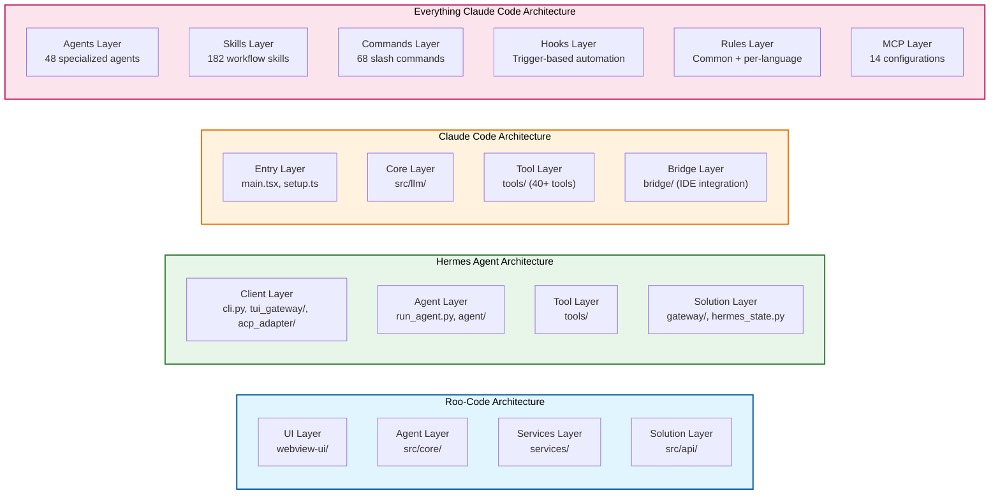

# Autonomous Enterprise Coding Agent Feature Mapping

## Roo-Code vs Hermes Agent vs Claude Code vs Everything Claude Code — Comprehensive Architecture Comparison

> **Version:** 3.0  
> **Last Updated:** 2026-04-30  
> **Status:** Feature Mapping Analysis  
> **Methodology:** Section-by-section comparison with Harness Engineering principles

---

## Table of Contents

1. [Executive Summary](#1-executive-summary)
2. [Feature Parity Matrix](#2-feature-parity-matrix)
3. [Architectural Comparison](#3-architectural-comparison)
4. [Technology Stack Comparison](#4-technology-stack-comparison)
5. [Extensibility Model Comparison](#5-extensibility-model-comparison)
6. [Security Architecture Comparison](#6-security-architecture-comparison)
7. [State Management Comparison](#7-state-management-comparison)
8. [Agent Orchestration Comparison](#8-agent-orchestration-comparison)
9. [Gap Analysis & Recommendations](#9-gap-analysis--recommendations)
10. [AI Agent Deep-Dive Analysis](#10-ai-agent-deep-dive-analysis)
11. [Conclusion](#11-conclusion)

---

## 1. Executive Summary

This document provides a comprehensive feature mapping comparison between four autonomous enterprise coding agent architectures:

| Dimension | Roo-Code | Hermes Agent | Claude Code | Everything Claude Code (ECC) |
|-----------|----------|--------------|-------------|------------------------------|
| **Primary Platform** | VS Code Extension | Multi-Platform (22+ platforms) | CLI + IDE (Ink/React) | VS Code Extension + CLI |
| **Language** | TypeScript | Python | TypeScript | TypeScript |
| **Architecture** | 3-Layer (Solution/Agent/Services) | 4-Layer (Client/Agent/Tool/Solution) | 5-Layer (Entry/Core/Tools/Services/Bridge) | 7-Layer (Agents/Skills/Commands/Hooks/Rules/MCP/Core) |
| **Agent Core Size** | ~4,731 LOC (`Task.ts`) | ~13,854 LOC (`run_agent.py`) | ~4,684 LOC (`main.tsx`) + AgentTool | 48 Markdown agents + AGENTS.md |
| **Tool Count** | ~20 tools | 70+ tools | 40+ tools | 182 skills + 68 commands |
| **AI Providers** | 10+ providers | 10+ providers | Anthropic-focused (Claude) | Claude, OpenAI, Ollama |
| **Execution Environments** | Local only | 10 backends (Docker, Modal, SSH, etc.) | Local only | Local only |
| **Browser Automation** | No built-in | Multi-backend (~2,992 LOC) | No built-in | No built-in |
| **Memory System** | No built-in | 8+ memory providers | Session-scoped + autoDream | Session persistence hooks |
| **Test Coverage** | Vitest | ~15,000 tests (pytest) | Unit tests (AgentTool) | 80% minimum coverage |
| **License** | Proprietary (VS Code extension) | MIT (Nous Research) | Proprietary (Anthropic) | Proprietary |
| **Multi-Agent** | `NewTaskTool` | `delegate_tool.py` (~2,532 LOC) | `AgentTool` + Coordinator | 48 specialized agents |
| **Hooks/Automation** | N/A | Plugin lifecycle hooks | N/A | Pre/post tool hooks |

### Key Differentiators

**Roo-Code Strengths:**
- Deep VS Code integration with native webview UI
- Built-in code indexing with Qdrant vector database
- Turborepo monorepo structure for build optimization
- MCP service integration for model context protocol
- Provider-agnostic (10+ AI providers)

**Hermes Agent Strengths:**
- Platform independence (22+ messaging platforms)
- Extensive execution environment support (10 backends)
- Sophisticated memory system with 8+ providers
- Browser automation with multi-backend support
- Subagent delegation with isolated context
- Built-in cron scheduling
- RL training environments for self-improvement
- MIT licensed
- Comprehensive agent module architecture (40+ modules in `/hermes-agent/agent/`)

**Claude Code Strengths:**
- Sophisticated multi-agent orchestration (AgentTool + Coordinator)
- 40+ tools with comprehensive permission system
- Memory consolidation via autoDream service
- IDE integration via bridge layer (CCR protocol)
- Custom agent discovery (`.claude/agents/`)
- Team memory synchronization
- Tamagotchi companion system (BUDDY)
- Startup profiling and deferred prefetches

**Everything Claude Code Strengths:**
- 48 specialized Markdown-based agents with YAML frontmatter
- 182 workflow skills with standardized format
- 68 slash commands for user-facing entry points
- Hook-based automation (pre-tool, post-tool, session persistence)
- 14 MCP configurations for external integrations
- Language-specific agents (Rust, Python, Java, Go, TypeScript, Kotlin, C++, C#, Dart/Flutter)
- Domain-specific agents (database, healthcare, performance, debugging)
- Open-source agent ecosystem (forking, packaging, sanitization)
- Comprehensive rules layer (common + per-language)
- TDD workflow integration
- Harness configuration optimizer

---

## 2. Feature Parity Matrix

### 2.1 Core Agent Features

| Feature | Roo-Code | Hermes Agent | Claude Code | Everything Claude Code | Implementation Detail |
|---------|----------|--------------|-------------|------------------------|----------------------|
| **AI Provider Abstraction** | `BaseProvider` abstract class | `ProviderTransport` ABC | Anthropic-focused (Claude) | Claude, OpenAI, Ollama providers | Roo-Code and Hermes are provider-agnostic |
| **Provider Count** | 10+ providers | 10+ transports | 1 (Claude) | 3 (Claude, OpenAI, Ollama) | Roo-Code has most providers |
| **Tool System** | `BaseTool` class (~20 tools) | AST-based registry (70+ tools) | `Tool` type (40+ tools) | 182 skills + 68 commands | Hermes has most tools, ECC has most skills |
| **Tool Discovery** | VS Code extension registration | AST-based auto-discovery | Static registration in `src/tools.ts` | Markdown agent files + skill registry | Different philosophies |
| **Event-Driven Architecture** | `EventEmitter<TaskEvents>` | Callback-based system | React/Ink state management | Hook-based triggers | All use different patterns |
| **Streaming Support** | Native streaming | Native streaming | Native streaming (Ink) | N/A (skill-based) | All support real-time output |
| **Multi-Iteration** | Yes (`isStreaming` flag) | Yes (`max_iterations` config) | Yes (QueryEngine loop) | Yes (agent loops) | All support multi-turn conversations |

### 2.2 Context Management

| Feature | Roo-Code | Hermes Agent | Claude Code | Everything Claude Code | Implementation Detail |
|---------|----------|--------------|-------------|------------------------|----------------------|
| **Context Window Management** | `context-management/` module | `context_compressor.py` (~1,415 LOC) | Implicit (Claude API managed) | Avoid last 20% of context window | Hermes has most sophisticated compression |
| **Conversation Condensing** | `condense/` module | Auxiliary model summarization | N/A (API-managed) | N/A (skill-based) | Roo-Code and Hermes handle locally |
| **Compression Threshold** | Configurable | 75% default | N/A | N/A | Hermes and Roo-Code configurable |
| **Head/Tail Protection** | Implicit | Explicit (`protect_first_n: 3`) | N/A | N/A | Hermes has explicit protection |
| **Context Engine** | Built-in | Pluggable (`ContextEngine` ABC) | N/A | N/A | Hermes supports third-party engines |
| **Prompt Templates** | `prompts/` module | `prompt_builder.py` (~1,123 LOC) | `prompt.ts` in AgentTool | Agent YAML frontmatter + SKILL.md | All have template systems |

### 2.3 Memory & Persistence

| Feature | Roo-Code | Hermes Agent | Claude Code | Everything Claude Code | Implementation Detail |
|---------|----------|--------------|-------------|------------------------|----------------------|
| **Built-in Memory** | No | Yes (8+ providers) | Yes (session-scoped + autoDream) | Yes (session persistence hooks) | Hermes has most extensive memory |
| **Memory Providers** | N/A | honcho, mem0, supermemory, etc. | autoDream service | Session persistence hooks | Hermes has plugin-based memory |
| **Session Persistence** | VS Code storage | SQLite + FTS5 (~2,095 LOC) | Session-scoped + daily logs | Auto-save state hooks | Hermes has richest state management |
| **Message History** | In-memory + VS Code | SQLite with FTS5 search | Daily logs + MEMORY.md | N/A (skill-based) | Different persistence strategies |
| **Checkpoint System** | `checkpointService` | `RepoPerTaskCheckpointService` | Memory snapshots | N/A (agent-based) | All support state resumption |
| **Skill/Agent System** | `.roo/skills/` | `skills/` + `optional-skills/` | `.claude/agents/` + built-in agents | 48 agents + 182 skills + 68 commands | ECC has most comprehensive system |
| **Memory Consolidation** | N/A | `curator.py` (~927 LOC) | `autoDream` service | N/A (agent-based) | Hermes and Claude Code have consolidation |

### 2.4 Tool Capabilities

| Feature | Roo-Code | Hermes Agent | Claude Code | Everything Claude Code | Implementation Detail |
|---------|----------|--------------|-------------|------------------------|----------------------|
| **File Operations** | Read, Write, Edit, ApplyDiff | Read, write, patch, search | FileEditTool, FileReadTool | Skill-based file operations | Similar file tool coverage |
| **Command Execution** | `ExecuteCommandTool` | `terminal_tool.py` (~7,000 LOC) | BashTool | Command-based execution | Hermes has most sophisticated execution |
| **Codebase Search** | `CodebaseSearchTool` | `SearchFilesTool` | LSPTool | Skill-based search | All support code search |
| **Browser Automation** | No built-in | Multi-backend (~2,992 LOC) | No built-in | No built-in | Hermes only |
| **Image Generation** | `GenerateImageTool` | `image_generation_tool.py` | N/A | N/A | Roo-Code and Hermes support |
| **MCP Support** | `mcp/` service | `mcp_tool.py` (~600 LOC) | `MCPTool` | 14 MCP configurations | All support Model Context Protocol |
| **Subagent Delegation** | `NewTaskTool` | `delegate_tool.py` (~2,532 LOC) | `AgentTool` + Coordinator | 48 specialized agents | All support multi-agent |
| **LSP Integration** | N/A | N/A | `LSPTool` | N/A | Claude Code only |

### 2.5 Platform & Deployment

| Feature | Roo-Code | Hermes Agent | Claude Code | Everything Claude Code | Implementation Detail |
|---------|----------|--------------|-------------|------------------------|----------------------|
| **Primary Interface** | VS Code Extension | CLI + Gateway + TUI | CLI (Ink/React) | VS Code Extension + CLI | Different primary interfaces |
| **Platform Support** | VS Code only | 22+ platforms | CLI + IDE (via bridge) | VS Code + CLI | Hermes has broadest platform coverage |
| **Execution Environments** | Local only | 10 backends | Local only | Local only | Hermes only supports multiple environments |
| **Web UI** | React webview | React TUI + Dashboard | Ink (React terminal UI) | VS Code webview | All have React-based UIs |
| **Dashboard** | VS Code panel | Embedded TUI + xterm.js | N/A (CLI only) | VS Code panel | Hermes has dedicated dashboard |
| **ACP Integration** | N/A | Full ACP server | CCR (Claude Code Remote) | N/A | Hermes and Claude Code have remote protocols |
| **Cron/Scheduling** | No built-in | `cron/` module | N/A | N/A | Hermes only |
| **IDE Bridge** | N/A | N/A | Bridge layer (CCR) | N/A | Claude Code only |

### 2.6 Security

| Feature | Roo-Code | Hermes Agent | Claude Code | Everything Claude Code | Implementation Detail |
|---------|----------|--------------|-------------|------------------------|----------------------|
| **File Protection** | `protect/` module | `path_security.py` | Permission modes | Rules layer (common + per-language) | All have file protection |
| **Ignore Patterns** | `.rooignore` | Similar patterns | N/A | Rules layer | Roo-Code and Hermes have ignore patterns |
| **Prompt Injection** | Implicit | 15+ regex patterns | Auto-classifier | Security reviewer agent | All have protection mechanisms |
| **URL Safety** | Implicit | `url_safety.py` | N/A | Rules layer | Hermes has explicit URL validation |
| **Credential Management** | VS Code secrets API | Multi-credential pool (~1,574 LOC) | API key management | Environment variables | Hermes has most sophisticated handling |
| **Environment Isolation** | Implicit | Env var blocklist | N/A | N/A | Hermes has explicit isolation |
| **PII Protection** | N/A | Deterministic hashing | N/A | N/A | Hermes only |
| **Permission System** | Implicit | Blocked tool lists | 3 modes (default, bypass, auto) | Security reviewer agent | Claude Code has most sophisticated permissions |

---

## 3. Architectural Comparison

### 3.1 Layer Architecture



| Aspect | Roo-Code | Hermes Agent | Claude Code | Everything Claude Code |
|--------|----------|--------------|-------------|------------------------|
| **Layer Count** | 3 layers | 4 layers | 5 layers | 7 layers |
| **Agent Core** | `Task` class (~4,731 LOC) | `AIAgent` class (~13,854 LOC) | `main.tsx` (~4,684 LOC) + AgentTool | 48 Markdown agents + AGENTS.md |
| **Tool Organization** | `src/core/tools/` | `tools/` (separate layer) | `src/tools/` (40+ tools) | 182 skills + 68 commands |
| **Service Layer** | `src/services/` (MCP, code-index, etc.) | Part of Solution Layer | `services/` (API, analytics, MCP, autoDream) | MCP layer (14 configs) |
| **UI Layer** | React webview | React TUI + CLI + Gateway | Ink (React terminal UI) | VS Code webview | All have React-based UIs |
| **Bridge Layer** | N/A | N/A | Bridge layer (CCR protocol) | N/A | Claude Code only |
| **Hook Layer** | N/A | Plugin lifecycle hooks | N/A | Pre/post tool hooks | ECC only |
| **Rules Layer** | N/A | Anti-patterns | N/A | Common + per-language rules | ECC only |

### 3.2 Agent Core Comparison

| Component | Roo-Code (`Task.ts`) | Hermes Agent (`run_agent.py`) | Claude Code (`main.tsx` + AgentTool) | Everything Claude Code (48 agents) |
|-----------|---------------------|------------------------------|-------------------------------------|-------------------------------------|
| **Lines of Code** | ~4,731 | ~13,854 | ~4,684 + AgentTool | Variable (Markdown agents) |
| **Identity** | `taskId`, `parentTaskId`, `childTaskId` | `session_id`, `platform` | Agent color management | Agent name (YAML frontmatter) |
| **Configuration** | `apiConfiguration`, `_taskMode` | 60+ constructor parameters | Commander.js args + settings | YAML frontmatter (name, description, tools, model) |
| **State** | `apiConversationHistory`, `clineMessages`, `todoList` | Similar conversation state | AppState (React state) | Session-scoped (hooks) |
| **Services** | `MessageQueueService`, `AutoApprovalHandler` | `credential_pool`, `budget_config` | QueryEngine, Tool Framework | LLM interface (src/llm/) |
| **Streaming** | `isStreaming`, `assistantMessageContent` | Similar streaming support | Ink streaming | N/A (skill-based) |
| **Event System** | `EventEmitter<TaskEvents>` | Callback-based system | React state management | Hook-based triggers |

### 3.3 Provider Abstraction Comparison

| Aspect | Roo-Code | Hermes Agent | Claude Code | Everything Claude Code |
|--------|----------|--------------|-------------|------------------------|
| **Base Class** | `BaseProvider` (abstract) | `ProviderTransport` (ABC) | Anthropic-focused | LLM interface (src/llm/core/interface.py) |
| **Factory Pattern** | `buildApiHandler()` in `src/api/index.ts` | Direct transport instantiation | QueryEngine.ts | Provider registry |
| **Format Transformation** | `src/api/transform/` module | Built into transport adapters | N/A (Claude API) | N/A |
| **Caching Support** | `transform/cache-strategy/` | Built into transports | N/A | N/A |
| **Provider Examples** | Anthropic, OpenAI, Bedrock, Vertex, Gemini | Same providers + Codex | Claude only | Claude, OpenAI, Ollama |

### 3.4 Tool System Comparison

| Aspect | Roo-Code | Hermes Agent | Claude Code | Everything Claude Code |
|--------|----------|--------------|-------------|------------------------|
| **Base Class** | `BaseTool` | Registry-based with `ToolEntry` dataclass | `Tool` type (793 LOC) | SKILL.md format |
| **Discovery** | VS Code extension registration | AST-based auto-discovery | Static registration in `src/tools.ts` | Markdown agent files + skill registry |
| **Tool Count** | ~20 tools | 70+ tools | 40+ tools | 182 skills + 68 commands |
| **Tool Categories** | File Ops, Commands, Search, Communication, Task Mgmt, MCP | Terminal, Browser, File, Web, Vision, Communication, Memory, MCP | Bash, FileEdit, FileRead, MCP, Agent, LSP, etc. | Core, Language, Workflow, Domain skills |
| **Async Support** | Native TypeScript async | Async bridging with persistent event loops | Native TypeScript async | N/A (skill-based) |
| **Permission System** | Implicit | Blocked tool lists | 3 modes + per-tool `checkPermissions()` | Security reviewer agent |
| **Concurrency Safety** | N/A | N/A | `isConcurrencySafe()` method | N/A |

---

## 4. Technology Stack Comparison

| Component | Roo-Code | Hermes Agent | Claude Code | Everything Claude Code |
|-----------|----------|--------------|-------------|------------------------|
| **Language** | TypeScript | Python | TypeScript | TypeScript |
| **Package Manager** | pnpm (v10.8.1) | pip/poetry | npm/yarn | npm/yarn |
| **Node.js Version** | v20.19.2 | v3.11+ | v18+ | v18+ |
| **Build Tool** | Turborepo | None (direct execution) | Vite/esbuild | N/A |
| **UI Framework** | React (webview) | React (TUI) + Rich (CLI) | Ink (React terminal UI) | VS Code webview |
| **Testing Framework** | Vitest | pytest + xdist | Jest/Vitest | Node.js test runner |
| **Test Count** | Not specified | ~15,000 tests | Unit tests (AgentTool) | 80% minimum coverage |
| **Vector Database** | Qdrant (code indexing) | None built-in | None built-in | None built-in |
| **State Store** | VS Code storage | SQLite + FTS5 | Session-scoped + daily logs | Session persistence hooks |
| **IPC Mechanism** | VS Code API | JSON-RPC over stdio | CCR (Claude Code Remote) | VS Code API |
| **Monorepo Structure** | Yes (packages/, apps/) | No (flat structure) | No | No |
| **License** | Proprietary | MIT | Proprietary | Proprietary |

---

## 5. Extensibility Model Comparison

### 5.1 Extension Mechanisms

| Extension Type | Roo-Code | Hermes Agent | Claude Code | Everything Claude Code |
|---------------|----------|--------------|-------------|------------------------|
| **New Tools** | VS Code command registration | Create `tools/my_tool.py` with `registry.register()` | Create `src/tools/MyTool/MyTool.ts` + register in `src/tools.ts` | Create `skills/skill-name/SKILL.md` |
| **New Providers** | Add to `src/api/providers/` | Create transport in `agent/transports/` | N/A (Claude-only) | Add to `src/llm/providers/` |
| **New Platforms** | N/A (VS Code only) | Create `gateway/platforms/my_platform.py` | N/A (CLI/IDE only) | N/A (VS Code only) |
| **New Memory** | N/A | Create `plugins/memory/my_provider/` | autoDream configuration | Session persistence hooks |
| **New Context Engine** | N/A | Create `plugins/context_engine/my_engine/` | N/A | N/A |
| **New Skills/Agents** | Add to `.roo/skills/` | Add to `skills/` or `optional-skills/` | Add to `.claude/agents/` or built-in agents | Add to `agents/` or `skills/` |
| **Plugin Hooks** | VS Code extension hooks | `pre/post_tool_call`, `pre/post_llm_call` | N/A (limited extensibility) | Pre/post tool hooks |
| **Commands** | VS Code commands | CLI commands | N/A | 68 slash commands |
| **Rules** | N/A | Anti-patterns | N/A | Common + per-language rules |

### 5.2 Plugin Discovery

| Aspect | Roo-Code | Hermes Agent | Claude Code | Everything Claude Code |
|--------|----------|--------------|-------------|------------------------|
| **Discovery Method** | VS Code extension manifest | File system + pip entry points | `.claude/agents/` directory | Agent files + skill registry |
| **Plugin Locations** | VS Code extensions directory | `~/.hermes/plugins/`, `./.hermes/plugins/` | `.claude/agents/` | `agents/`, `skills/`, `commands/` |
| **Lifecycle Hooks** | VS Code lifecycle | Custom lifecycle hooks | N/A | Hook-based triggers |
| **Entry Points** | `package.json` | `register(ctx)` function | JSON definition files | YAML frontmatter |

### 5.3 Custom Agent Support

| Feature | Roo-Code | Hermes Agent | Claude Code | Everything Claude Code |
|---------|----------|--------------|-------------|------------------------|
| **Custom Agents** | Via `NewTaskTool` | Via `delegate_tool.py` | Via `.claude/agents/` | Via `agents/` directory |
| **Built-in Agents** | N/A | N/A | Plan, Explore, General Purpose, Verification | 48 specialized agents |
| **Agent Discovery** | Runtime | Runtime | Startup discovery from `.claude/agents/` | Startup discovery from `agents/` |
| **Agent Definition** | N/A | N/A | JSON: name, description, prompt, color, model | YAML: name, description, tools, model |
| **Multi-Agent Coordination** | `NewTaskTool` | `delegate_tool.py` | `AgentTool` + Coordinator + swarm intelligence | 48 agents + AGENTS.md orchestration |
| **Agent Categories** | N/A | N/A | Built-in + custom | Core, Development, Language, Domain, Open Source |
| **Language-Specific Agents** | N/A | N/A | N/A | Rust, Python, Java, Go, TypeScript, Kotlin, C++, C#, Dart/Flutter |
| **Domain-Specific Agents** | N/A | N/A | N/A | Database, Healthcare, Performance, Debugging |

### 5.4 Skills and Commands

| Feature | Roo-Code | Hermes Agent | Claude Code | Everything Claude Code |
|---------|----------|--------------|-------------|------------------------|
| **Skills Count** | ~10+ | ~20+ | N/A | 182 |
| **Commands Count** | N/A | N/A | N/A | 68 |
| **Skill Format** | Markdown files | Markdown files | N/A | SKILL.md with When/How/Examples |
| **Command Format** | N/A | CLI commands | N/A | Slash commands with agent linkage |
| **Hook System** | N/A | Plugin lifecycle | N/A | Pre/post tool hooks with JSON config |
| **Rules System** | N/A | Anti-patterns | N/A | Common + per-language rules |

---

## 6. Security Architecture Comparison

### 6.1 Security Layers

| Security Layer | Roo-Code | Hermes Agent | Claude Code | Everything Claude Code |
|---------------|----------|--------------|-------------|------------------------|
| **File Protection** | `protect/` module | `path_security.py` | Permission modes | Rules layer (security.md) |
| **Ignore Patterns** | `.rooignore` | Similar patterns | N/A | Rules layer |
| **Prompt Injection** | Implicit | 15+ regex patterns | Auto-classifier | Security reviewer agent |
| **URL Safety** | Implicit | `url_safety.py` | N/A | Rules layer |
| **Credential Isolation** | VS Code secrets API | Multi-credential pool with failover | API key management | Environment variables |
| **Environment Isolation** | Implicit | Env var blocklist in execution backends | N/A | N/A |
| **PII Protection** | N/A | Deterministic hashing in gateway sessions | N/A | N/A |
| **Tool Restrictions** | Implicit | Blocked tool lists for subagents | 3 permission modes + per-tool checks | Security reviewer agent |
| **Permission Modes** | N/A | N/A | default, bypassPermissions, autoMode | N/A |

### 6.2 Security Attack Vectors (ECC Only)

| Attack Vector | Defense Layer |
|---------------|---------------|
| Input Validation | Schema Validation |
| SQL Injection | Parameterized Queries |
| XSS Attack | HTML Sanitization |
| CSRF Attack | CSRF Tokens |
| Auth Bypass | Role-Based Access Control |

### 6.3 Anti-Patterns (Hermes Agent Only)

| Anti-Pattern | Enforcement | Rationale |
|--------------|-------------|-----------|
| Hardcoded paths to `~/.hermes` | `get_hermes_home()` mandatory | Breaks profiles |
| Raw SQL execution | Compliance check scripts | Opaque to agents, injection risk |
| Deprecated `session.query()` | Auto-detect + refactor mandate | Type safety |
| `print()` statements | `logger.debug` mandatory | Structured logging |
| Hardcoded secrets | `.env` + `config.ini` only | Security, portability |

---

## 7. State Management Comparison

### 7.1 State Storage

| Aspect | Roo-Code | Hermes Agent | Claude Code | Everything Claude Code |
|--------|----------|--------------|-------------|------------------------|
| **Primary Store** | VS Code storage API | SQLite with WAL mode | Session-scoped + daily logs | Session persistence hooks |
| **Schema Versioning** | VS Code managed | v11 with migration support | N/A | N/A |
| **Search Capability** | VS Code search | FTS5 full-text search | Daily log scanning | N/A |
| **Session Metadata** | In-memory + storage | Model, tokens, cost, billing | N/A | N/A |
| **Message History** | In-memory array | SQLite with tool call tracking | MEMORY.md + daily logs | N/A (skill-based) |
| **Compression Chains** | N/A | `parent_session_id` for split sessions | autoDream consolidation | N/A |

### 7.2 Configuration Management

| Aspect | Roo-Code | Hermes Agent | Claude Code | Everything Claude Code |
|--------|----------|--------------|-------------|------------------------|
| **Config Source** | VS Code settings | `DEFAULT_CONFIG` + user YAML | Settings migrations | JSON schemas (10 schemas) |
| **Profile Support** | VS Code profiles | `HERMES_HOME` environment variable | N/A | N/A |
| **Config Versioning** | N/A | `_config_version` in master config | Migration system | Schema versioning |

---

## 8. Agent Orchestration Comparison

### 8.1 Multi-Agent Architecture

| Feature | Roo-Code | Hermes Agent | Claude Code | Everything Claude Code |
|---------|----------|--------------|-------------|------------------------|
| **Orchestrator** | `Task` class with `NewTaskTool` | `AIAgent` with `delegate_tool.py` | `AgentTool` + Coordinator | AGENTS.md + 48 agents |
| **Built-in Agent Types** | N/A | N/A | Plan, Explore, General Purpose, Verification | 48 specialized agents |
| **Custom Agent Support** | Via `NewTaskTool` | Via `delegate_tool.py` | Via `.claude/agents/` | Via `agents/` directory |
| **Agent Communication** | Parent-child via tool calls | Parent-child via tool calls | Shared memory + coordinator | Parallel execution (AGENTS.md) |
| **Concurrent Execution** | Sequential | Sequential (ThreadPoolExecutor) | Concurrent (swarm) | Parallel (independent operations) |
| **Memory Isolation** | Child has no parent history | Isolated context | Session-scoped memory | Session-scoped (hooks) |
| **Color Management** | N/A | N/A | Agent color assignment | N/A |
| **Task Distribution** | N/A | Single-task and batch modes | Swarm intelligence | Proactive agent selection |
| **Agent Categories** | N/A | N/A | Built-in + custom | Core, Development, Language, Domain, Open Source |

### 8.2 Agent Lifecycle

| Phase | Roo-Code | Hermes Agent | Claude Code | Everything Claude Code |
|-------|----------|--------------|-------------|------------------------|
| **Creation** | `NewTaskTool` spawns child | `delegate_tool.py` spawns child | `spawnAgent()` via AgentTool | AGENTS.md orchestration |
| **Execution** | Child runs conversation loop | Child runs conversation loop | Agent loop with tools | Agent loop with skills |
| **Memory** | No parent history | No parent history | Session-scoped + snapshots | Session-scoped (hooks) |
| **Resumption** | N/A | `resumeAgent.ts` | Memory snapshots | Session persistence hooks |
| **Termination** | Returns summary | Returns summary | Returns summary | Returns summary |

### 8.3 Memory Consolidation

| Feature | Roo-Code | Hermes Agent | Claude Code | Everything Claude Code |
|---------|----------|--------------|-------------|------------------------|
| **Service** | N/A | `curator.py` (~927 LOC) | `autoDream` service | N/A (agent-based) |
| **Trigger** | N/A | Background + inactivity | On-demand | N/A |
| **Process** | N/A | Archive, consolidate, inactivity cleanup | Orient → Gather → Consolidate → Prune | N/A |
| **Storage** | N/A | Skill directory | MEMORY.md + daily logs | N/A |

### 8.4 Hook-Based Automation (ECC Only)

| Hook Type | Purpose | Configuration |
|-----------|---------|---------------|
| Session Persistence | Auto-save state | JSON matcher + hooks |
| Pre-Tool Validation | Pre-execution validation | File change patterns |
| Post-Tool Learning | Post-execution learning | Command triggers |

---

## 9. Gap Analysis & Recommendations

### 9.1 Features Unique to Roo-Code

| Feature | Description | Integration Potential |
|---------|-------------|----------------------|
| **Code Indexing** | Qdrant vector DB for codebase search | Could be added to Hermes, Claude Code, or ECC |
| **VS Code Native Integration** | Deep VS Code API integration | Platform-specific, not portable |
| **Turborepo Build System** | Monorepo build orchestration | Build system, not agent feature |
| **MCP Service** | Built-in MCP server management | Hermes and Claude Code have MCP support |

### 9.2 Features Unique to Hermes Agent

| Feature | Description | Integration Potential |
|---------|-------------|----------------------|
| **Multi-Platform Gateway** | 22+ messaging platform adapters | Platform-specific, not portable |
| **Execution Environments** | 10 backends (Docker, Modal, SSH, etc.) | Could be added to Roo-Code, Claude Code, or ECC |
| **Browser Automation** | Multi-backend browser control | Could be added to Roo-Code, Claude Code, or ECC |
| **Memory System** | 8+ memory providers | Could be added as plugin |
| **Cron Scheduling** | Built-in task scheduling | Could be added as service |
| **RL Training** | Atropos environments for self-improvement | Research feature |
| **PII Redaction** | Deterministic user/chat ID hashing | Security feature |

### 9.3 Features Unique to Claude Code

| Feature | Description | Integration Potential |
|---------|-------------|----------------------|
| **Multi-Agent Coordination** | AgentTool + Coordinator + swarm intelligence | Could be added to Roo-Code, Hermes, or ECC |
| **IDE Bridge Layer** | CCR protocol for IDE integration | Platform-specific |
| **Memory Consolidation** | autoDream service with Orient/Gather/Consolidate/Prune | Could be added to Roo-Code or Hermes |
| **Permission System** | 3 modes + per-tool `checkPermissions()` | Security enhancement |
| **LSP Integration** | Language Server Protocol tool | Code intelligence enhancement |
| **Startup Profiling** | `startupProfiler.ts` for performance tracking | Performance optimization |
| **Deferred Prefetches** | `startDeferredPrefetches()` for lazy loading | Performance optimization |
| **Tamagotchi Companion** | BUDDY system | Novel UX feature |
| **Team Memory Sync** | `TeamMemorySync` service | Collaboration feature |

### 9.4 Features Unique to Everything Claude Code

| Feature | Description | Integration Potential |
|---------|-------------|----------------------|
| **48 Specialized Agents** | Markdown-based agents with YAML frontmatter | Could be added to other agents |
| **182 Workflow Skills** | Standardized SKILL.md format | Could be added as plugin system |
| **68 Slash Commands** | User-facing entry points | Could be added as command system |
| **Hook-Based Automation** | Pre/post tool hooks with JSON config | Could be added as event system |
| **14 MCP Configurations** | External integration configs | Could be added as MCP layer |
| **Language-Specific Agents** | Rust, Python, Java, Go, TypeScript, Kotlin, C++, C#, Dart/Flutter | Could be added as agent categories |
| **Domain-Specific Agents** | Database, Healthcare, Performance, Debugging | Could be added as agent categories |
| **Open-Source Agent Ecosystem** | Forking, packaging, sanitization | Could be added as distribution model |
| **Comprehensive Rules Layer** | Common + per-language rules | Could be added as policy system |
| **Harness Configuration Optimizer** | Config tuning for reliability and cost | Could be added as optimization service |

### 9.5 Recommendations for Feature Convergence

| Recommendation | Priority | Effort | Impact | Source |
|----------------|----------|--------|--------|--------|
| **Add multi-agent coordination to Roo-Code** | High | High | Enables hierarchical task decomposition | From Claude Code |
| **Add code indexing to Hermes** | Medium | Medium | Improves codebase understanding | From Roo-Code |
| **Add execution environments to Roo-Code** | High | High | Enables cloud deployment | From Hermes |
| **Add memory system to Roo-Code** | Medium | Medium | Enables long-term context | From Hermes |
| **Add permission system to Hermes** | Medium | Low | Enhanced security | From Claude Code |
| **Add memory consolidation to Roo-Code** | Medium | Medium | Better context management | From Claude Code |
| **Add LSP integration to Hermes** | Low | Medium | Enhanced code intelligence | From Claude Code |
| **Standardize provider abstraction** | High | Low | Cross-agent provider portability | Roo-Code + Hermes |
| **Share tool registry patterns** | Medium | Low | Improved agent readability | All three |
| **Add hook-based automation to all agents** | Medium | Medium | Event-driven architecture | From ECC |
| **Add skills system to Roo-Code** | Medium | Medium | Workflow standardization | From ECC |
| **Add rules layer to all agents** | Low | Low | Policy enforcement | From ECC |

---

## 10. AI Agent Deep-Dive Analysis

> **Full Analysis:** See [`agentic/analysis/20260430_175400_ai_agent_deep_dive_analysis.md`](agentic/analysis/20260430_175400_ai_agent_deep_dive_analysis.md) for complete technical specifications.

This section summarizes the four critical AI agent capabilities analyzed through the lens of **Torro's AGENT.md principles** and **Harness Engineering practices**.

### 10.1 Feature 1: Reinforcement Learning for Memory Management

**Current State:** Hermes Agent leads with 8+ memory providers, SQLite + FTS5 persistence, and `curator.py` for consolidation. Claude Code has `autoDream` service with Orient → Gather → Consolidate → Prune flow.

**RL Architecture:**
```
┌─────────────────────────────────────────────────────────────┐
│ Memory RL Agent Loop                                        │
├─────────────────────────────────────────────────────────────┤
│ 1. Observe: Current memory state (usage, age, relevance)    │
│ 2. Action: Select memory operation (consolidate, prune,     │
│            archive, promote)                                │
│ 3. Reward: Measure improvement (query latency, hit rate)    │
│ 4. Update: Adjust policy based on reward signal             │
└─────────────────────────────────────────────────────────────┘
```

**Harness Engineering Integration:**
- **Golden Rules:** No orphan memories, age-weighted relevance, query-driven consolidation, traceable decisions
- **Mechanical Enforcement:** Quality scoring system (0-100) with orphan penalty, age decay, fragmentation penalty
- **Entropy Management:** Background agent scans memory quality daily, auto-archives below threshold

**Implementation Phases:**
1. Memory Instrumentation (telemetry, reward signals, quality scoring)
2. RL Agent Training (Q-learning/policy gradient on historical patterns)
3. Production Deployment (A/B testing, gradual rollout with kill switch)

### 10.2 Feature 2: Planned Coding Backlog & Schedule Handling

**Current State:** Hermes Agent has `cron/` module. Roo-Code has `TodoList` in `Task.ts`. No agent has sophisticated backlog management.

**Backlog Architecture:**
- **Backlog Item Schema:** Priority (P0-P4), estimated effort, dependencies (DAG), agent assignment
- **Scheduler Engine:** Cron-based triggers, dependency resolution, resource allocation
- **Progress Tracking:** Real-time status, burn-down charts, blocker detection

**Harness Engineering Integration:**
- **Repo as System of Record:** Backlog stored in `backlog/items/` as YAML files, state transitions in `backlog/history.jsonl`
- **Mechanical Enforcement:** Validation rules for priority, dependencies, agent assignment
- **Agent Readability:** `FN:` prefixes, clear entry/exit criteria, test verification commands

**Scheduling Patterns:**
1. **Time-Boxed Sprints:** Priority-based selection until capacity filled
2. **Continuous Flow:** Pull-based assignment with WIP limits
3. **Deadline-Driven:** Critical path analysis with resource leveling

### 10.3 Feature 3: Automatic Agent Selection (Large vs Small)

**Current State:** Everything Claude Code has 48 specialized agents with manual selection. No agent has automatic task-to-agent routing.

**Agent Tiers:**

| Tier | Model Size | Use Case | Cost | Latency |
|------|------------|----------|------|---------|
| Small | 7B-14B | Simple lookups, formatting, validation | $ | <1s |
| Medium | 30B-70B | Code generation, refactoring, debugging | $$ | 1-5s |
| Large | 100B+ | Architecture decisions, complex debugging | $$$ | 5-30s |
| Swarm | Multiple | Multi-file refactoring, system design | $$$$ | 30s+ |

**Selection Algorithm:**
- **Decision Factors:** Task complexity, domain, risk level, token budget, latency requirements
- **Complexity Estimation:** Based on file count, line count, dependency depth
- **Validation Rules:** High-risk tasks require large agent, token budget must not exceed capacity

**Harness Engineering Integration:**
- **Repo as System of Record:** Selection decisions logged to `agent/selections.jsonl`
- **Mechanical Enforcement:** Validation rules for risk levels, token capacity, domain preferences
- **Learning Loop:** Track selection outcomes, adjust weights based on success rate

### 10.4 Feature 4: Automatic Slash Command Creation

**Current State:** Everything Claude Code has 68 slash commands with manual creation. No automatic generation from patterns.

**Command Generation Pipeline:**
```
1. Analyze conversation history
2. Identify repeated command sequences
3. Extract command pattern
4. Generate SKILL.md template
5. Create slash command registration
6. Test with sample inputs
7. Register command
```

**RL Integration:**
- **Reward Signals:** Usage frequency (0.3), user satisfaction (0.4), time saved (0.2), error rate (-0.5)
- **Learning Algorithm:** Pattern detection → reward calculation → policy update → command generation

**Harness Engineering Integration:**
- **Repo as System of Record:** Commands in `commands/`, metrics in `commands/metrics.jsonl`
- **Mechanical Enforcement:** Validation for kebab-case naming, minimum trigger patterns, execution flow
- **Entropy Management:** Low-usage commands flagged, duplicates merged, outdated commands archived

### 10.5 Cross-Feature Integration

```
┌─────────────────────────────────────────────────────────────┐
│ Feature Integration Map                                     │
├─────────────────────────────────────────────────────────────┤
│                                                             │
│  RL Memory Management ──┬──> Agent Selection               │
│                         │    (Memory state influences tier)│
│                         │                                   │
│  Backlog Scheduling ────┼──> Agent Selection               │
│                         │    (Priority influences tier)    │
│                         │                                   │
│  Slash Commands ────────┴──> RL Memory                     │
│                         (Command patterns stored in memory) │
│                                                             │
└─────────────────────────────────────────────────────────────┘
```

**Unified Data Model:**
- Memory system, backlog manager, agent router, command generator
- Shared metrics collector and configuration
- Integration point: `process_task()` method orchestrates all components

### 10.6 Implementation Roadmap

| Phase | Duration | Key Deliverables |
|-------|----------|------------------|
| **Phase 1: Foundation** | Weeks 1-4 | Memory telemetry, backlog schema |
| **Phase 2: Core Features** | Weeks 5-8 | Agent router, command generator |
| **Phase 3: RL Integration** | Weeks 9-12 | RL for memory, RL for commands |
| **Phase 4: Integration** | Weeks 13-16 | Unified data model, production deployment |

### 10.7 Risk Assessment

| Risk Category | Key Risks | Mitigation |
|---------------|-----------|------------|
| **Technical** | RL suboptimal policy, selection bias, command quality | Human review gate, A/B testing, validation |
| **Operational** | Increased token costs, latency, user confusion | Token budgets, caching, documentation |
| **Security** | Prompt injection, data leakage, privilege escalation | Input validation, encryption, permission boundaries |

---

All four autonomous coding agent architectures represent sophisticated approaches with distinct strengths:

**Roo-Code** excels in:
- Deep IDE integration (VS Code native)
- Code indexing and search capabilities (Qdrant)
- Monorepo build optimization (Turborepo)
- Provider-agnostic design (10+ AI providers)
- Clean 3-layer architecture

**Hermes Agent** excels in:
- Platform independence (22+ messaging platforms)
- Execution environment diversity (10 backends)
- Memory system and persistence (8+ providers)
- Browser automation and subagent delegation
- Research-ready tooling (RL training, trajectory compression)
- MIT licensed (open source)

**Claude Code** excels in:
- Sophisticated multi-agent orchestration (AgentTool + Coordinator)
- 40+ tools with comprehensive permission system
- Memory consolidation via autoDream service
- IDE integration via bridge layer (CCR protocol)
- Custom agent discovery and built-in agent types
- Startup profiling and performance optimization

**Everything Claude Code** excels in:
- 48 specialized Markdown-based agents with YAML frontmatter
- 182 workflow skills with standardized format
- 68 slash commands for user-facing entry points
- Hook-based automation (pre-tool, post-tool, session persistence)
- 14 MCP configurations for external integrations
- Language-specific and domain-specific agent categories
- Open-source agent ecosystem (forking, packaging, sanitization)
- Comprehensive rules layer (common + per-language)
- TDD workflow integration
- Harness configuration optimizer

### Architectural Philosophy Comparison

| Philosophy | Roo-Code | Hermes Agent | Claude Code | Everything Claude Code |
|------------|----------|--------------|-------------|------------------------|
| **Primary Focus** | IDE-centric coding | Multi-platform deployment | CLI/IDE coding | Agent ecosystem |
| **Extensibility** | VS Code ecosystem | Plugin system | Custom agents | Skills + Commands + Hooks |
| **Security Model** | VS Code secrets | Multi-credential pool | Permission modes | Rules layer + Security reviewer |
| **Memory Strategy** | No built-in | 8+ providers | Session-scoped + autoDream | Session persistence hooks |
| **Multi-Agent** | Basic delegation | Rich delegation | Swarm coordination | 48 specialized agents |
| **Automation** | N/A | Plugin lifecycle | N/A | Hook-based triggers |
| **Policy** | N/A | Anti-patterns | N/A | Common + per-language rules |

### Deployment Scenario Matrix

| Scenario | Best Agent | Alternative |
|----------|------------|-------------|
| VS Code development | Roo-Code | Everything Claude Code |
| Multi-platform messaging | Hermes Agent | N/A |
| CLI/IDE coding | Claude Code | Everything Claude Code |
| Research/RL training | Hermes Agent | N/A |
| Enterprise deployment | Hermes Agent | Claude Code |
| Agent ecosystem | Everything Claude Code | Claude Code |
| Provider flexibility | Roo-Code | Hermes Agent |
| Browser automation | Hermes Agent | N/A |

The architectures are complementary rather than competitive, with each optimized for different deployment scenarios:
- **Roo-Code:** IDE-centric, provider-agnostic development
- **Hermes Agent:** Multi-platform, research-oriented deployment
- **Claude Code:** Sophisticated CLI/IDE coding with multi-agent orchestration
- **Everything Claude Code:** Comprehensive agent ecosystem with skills, commands, and hooks

---

*Document generated: 2026-04-30 by Qwen3.6-35B-A3B-FP8 via Roo Code Agentic Planner*
