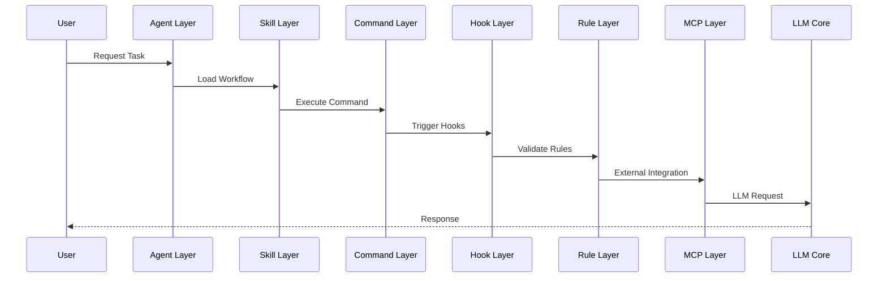
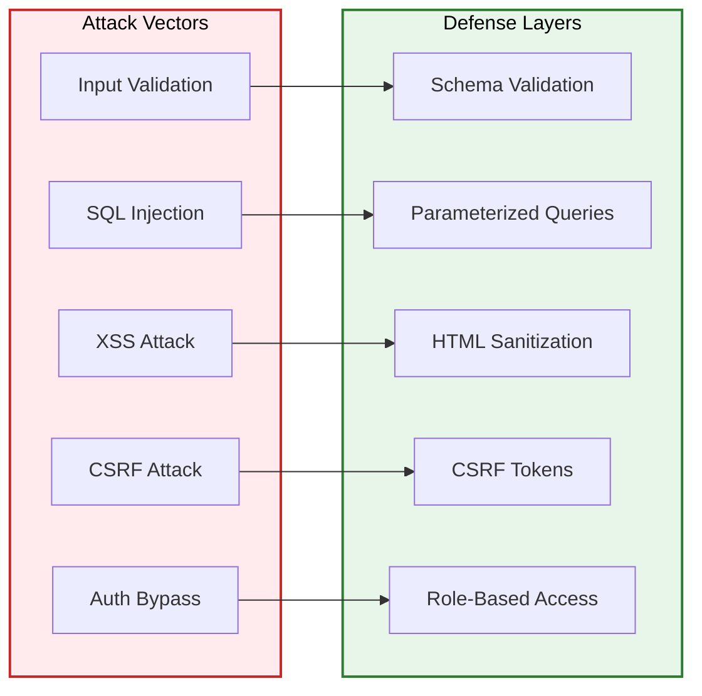
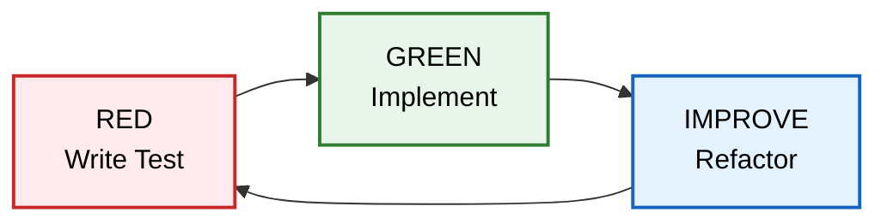

# Everything Claude Code (ECC) Architecture Analysis

## Executive Summary

This document provides a comprehensive architectural analysis of the Everything Claude Code (ECC) repository, a **production-ready AI coding plugin** providing 48 specialized agents, 182 skills, 68 commands, and automated hook workflows for software development.

**Version:** 2.0.0-rc.1

**Location:** `everything-claude-code/`
**Entry Point:** [`agents/`](everything-claude-code/agents/)
**Core Documentation:** [`AGENTS.md`](everything-claude-code/AGENTS.md:1), [`CLAUDE.md`](everything-claude-code/CLAUDE.md:1)

## 1. Solution Layer Architecture

### 1.1 System Architecture Diagram

```mermaid
flowchart TD
    subgraph Agents["Agents Layer (48 Agents)"]
        Planner["planner.md<br/>Implementation Planning"]
        Architect["architect.md<br/>System Design"]
        TDD["tdd-guide.md<br/>Test-Driven Development"]
        Reviewer["code-reviewer.md<br/>Code Quality"]
        Security["security-reviewer.md<br/>Vulnerability Detection"]
        BuildFix["build-error-resolver.md<br/>Build Troubleshooting"]
        E2E["e2e-runner.md<br/>Playwright Testing"]
        Loop["loop-operator.md<br/>Autonomous Loop"]
    end

    subgraph Skills["Skills Layer (182 Skills)"]
        CoreSkills["Core Skills<br/>coding-standard, patterns"]
        LangSkills["Language Skills<br/>python, rust, go, java"]
        WorkflowSkills["Workflow Skills<br/>tdd, e2e, deployment"]
        DomainSkills["Domain Skills<br/>security, performance"]
    end

    subgraph Commands["Commands Layer (68 Commands)"]
        CmdTDD["/tdd<br/>TDD Workflow"]
        CmdPlan["/plan<br/>Planning"]
        CmdReview["/code-review<br/>Review"]
        CmdBuild["/build-fix<br/>Build Fix"]
        CmdLearn["/learn<br/>Knowledge Capture"]
    end

    subgraph Hooks["Hooks Layer"]
        SessionHook["session-persistence<br/>Auto-save state"]
        PreToolHook["pre-tool-hooks<br/>Validation"]
        PostToolHook["post-tool-hooks<br/>Learning"]
    end

    subgraph Rules["Rules Layer"]
        CommonRules["Common Rules<br/>security, style"]
        LangRules["Language Rules<br/>per-language patterns"]
    end

    subgraph MCP["MCP Layer (14 Configs)"]
        MCPConfigs["MCP Configurations<br/>External Integrations"]
    end

    subgraph Core["Core Infrastructure"]
        LLM["src/llm/<br/>LLM Interface"]
        Providers["src/llm/providers/<br/>Claude, OpenAI, Ollama"]
        Prompt["src/llm/prompt/<br/>Prompt Builder"]
    end

    Agents --> Skills
    Skills --> Commands
    Commands --> Hooks
    Hooks --> Rules
    Rules --> MCP
    MCP --> Core

    style Agents fill:#e8f5e9,stroke:#2e7d32,stroke-width:2px,color:#000000
    style Skills fill:#e3f2fd,stroke:#1565c0,stroke-width:2px,color:#000000
    style Commands fill:#fff3e0,stroke:#ef6c00,stroke-width:2px,color:#000000
    style Hooks fill:#f3e5f5,stroke:#7b1fa2,stroke-width:2px,color:#000000
    style Rules fill:#fce4ec,stroke:#c2185b,stroke-width:2px,color:#000000
    style MCP fill:#e0f7fa,stroke:#006064,stroke-width:2px,color:#000000
    style Core fill:#ffebee,stroke:#c62828,stroke-width:2px,color:#000000
```



### 1.2 Directory Structure

```
everything-claude-code/
├── AGENTS.md                     # Agent instructions and orchestration
├── CLAUDE.md                     # Project overview and quick reference
├── COMMANDS-QUICK-REF.md         # Command reference
├── EVALUATION.md                 # Evaluation criteria
├── REPO-ASSESSMENT.md            # Repository assessment
├── SECURITY.md                   # Security guidelines
├── .agents/                      # Agent configurations
├── agents/                       # 48 specialized subagents
│   ├── planner.md                # Implementation planning
│   ├── architect.md              # System design
│   ├── tdd-guide.md              # Test-driven development
│   ├── code-reviewer.md          # Code quality review
│   ├── security-reviewer.md      # Vulnerability detection
│   ├── build-error-resolver.md   # Build troubleshooting
│   ├── e2e-runner.md             # Playwright testing
│   ├── loop-operator.md          # Autonomous loop execution
│   ├── rust-reviewer.md          # Rust code review
│   ├── python-reviewer.md        # Python code review
│   ├── java-reviewer.md          # Java/Spring Boot review
│   └── ... (48 total agents)
├── skills/                       # 182 workflow skills
│   ├── configure-ecc/SKILL.md    # ECC configuration
│   ├── continuous-agent-loop/    # Agent loop orchestration
│   ├── golang-testing/           # Go testing patterns
│   ├── rust-patterns/            # Rust patterns
│   ├── security-review/          # Security review process
│   └── ... (182 total skills)
├── commands/                     # 68 slash commands
│   ├── tdd/                      # TDD workflow command
│   ├── plan/                     # Planning command
│   ├── code-review/              # Review command
│   └── ... (68 total commands)
├── hooks/                        # Trigger-based automations
│   ├── session-persistence/      # Auto-save state
│   ├── pre-tool-hooks/           # Pre-execution validation
│   └── post-tool-hooks/          # Post-execution learning
├── rules/                        # Always-follow guidelines
│   ├── common/                   # Common rules
│   ├── csharp/                   # C# rules
│   ├── swift/                    # Swift rules
│   └── ... (per-language rules)
├── mcp-configs/                  # 14 MCP server configurations
│   ├── install-components.json   # Component installation
│   ├── install-modules.json      # Module installation
│   └── install-profiles.json     # Profile installation
├── schemas/                      # JSON schemas
│   ├── ecc-install-config.schema.json
│   ├── hooks.schema.json
│   └── ... (10 schemas)
├── scripts/                      # Cross-platform utilities
├── src/                          # Core infrastructure
│   └── llm/                      # LLM interface and providers
│       ├── core/                 # Core interfaces
│       ├── prompt/               # Prompt builder
│       └── providers/            # Claude, OpenAI, Ollama
├── tests/                        # Test suite
├── docs/                         # Documentation
│   ├── ANTIGRAVITY-GUIDE.md      # Advanced guide
│   ├── ECC-2.0-REFERENCE-ARCHITECTURE.md
│   └── HERMES-SETUP.md           # Setup guide
└── assets/                       # Images and media
```

### 1.3 Key Components

#### 1.3.1 Agent Layer (48 Agents)

The agent layer provides **specialized subagents** for domain-specific tasks:

| Agent | Purpose | When to Use |
|-------|---------|-------------|
| [`planner.md`](everything-claude-code/agents/planner.md) | Implementation planning | Complex features, refactoring |
| [`architect.md`](everything-claude-code/agents/architect.md) | System design | Architectural decisions |
| [`tdd-guide.md`](everything-claude-code/agents/tdd-guide.md) | Test-driven development | New features, bug fixes |
| [`code-reviewer.md`](everything-claude-code/agents/code-reviewer.md) | Code quality | After writing code |
| [`security-reviewer.md`](everything-claude-code/agents/security-reviewer.md) | Vulnerability detection | Security-sensitive code |
| [`build-error-resolver.md`](everything-claude-code/agents/build-error-resolver.md) | Build errors | When build fails |
| [`e2e-runner.md`](everything-claude-code/agents/e2e-runner.md) | E2E testing | Critical user flows |
| [`loop-operator.md`](everything-claude-code/agents/loop-operator.md) | Autonomous loops | Run loops safely |
| [`harness-optimizer.md`](everything-claude-code/agents/harness-optimizer.md) | Config tuning | Reliability, cost |

**Language-Specific Agents:**
- `rust-reviewer.md`, `rust-build-resolver.md`
- `python-reviewer.md`, `pytorch-build-resolver.md`
- `java-reviewer.md`, `java-build-resolver.md`
- `go-reviewer.md`, `go-build-resolver.md`
- `typescript-reviewer.md`
- `kotlin-reviewer.md`, `kotlin-build-resolver.md`
- `cpp-reviewer.md`, `cpp-build-resolver.md`
- `flutter-reviewer.md`, `dart-build-resolver.md`
- `csharp-reviewer.md`

#### 1.3.2 Skills Layer (182 Skills)

Skills define **workflow patterns** and **domain knowledge**:

```markdown
# Example Skill Structure
skills/golang-testing/SKILL.md

## When to Use
- Running Go tests
- Setting up test coverage
- Mocking dependencies

## How It Works
1. Initialize test environment
2. Run tests with coverage
3. Generate report

## Examples
```bash
go test -v -cover ./...
```
```

**Key Skills:**
- [`configure-ecc/SKILL.md`](everything-claude-code/skills/configure-ecc/SKILL.md) - ECC configuration
- [`continuous-agent-loop/SKILL.md`](everything-claude-code/skills/continuous-agent-loop/SKILL.md) - Agent loop orchestration
- [`golang-testing/SKILL.md`](everything-claude-code/skills/golang-testing/SKILL.md) - Go testing patterns
- [`rust-patterns/SKILL.md`](everything-claude-code/skills/rust-patterns/SKILL.md) - Rust patterns
- [`security-review/SKILL.md`](everything-claude-code/skills/security-review/SKILL.md) - Security review process

#### 1.3.3 Commands Layer (68 Commands)

Slash commands provide **user-facing entry points**:

| Command | Purpose | Agent Used |
|---------|---------|------------|
| `/tdd` | Test-driven development | tdd-guide |
| `/plan` | Implementation planning | planner |
| `/e2e` | E2E test generation | e2e-runner |
| `/code-review` | Quality review | code-reviewer |
| `/build-fix` | Build troubleshooting | build-error-resolver |
| `/learn` | Knowledge capture | loop-operator |
| `/skill-create` | Skill generation | - |

#### 1.3.4 Hooks Layer

Hooks provide **trigger-based automation**:

```json
// Example Hook Configuration
{
  "matcher": {
    "type": "file_change",
    "pattern": "*.ts"
  },
  "hooks": [
    {
      "type": "command",
      "command": "/code-review"
    }
  ]
}
```

**Hook Types:**
- Session persistence hooks
- Pre-tool validation hooks
- Post-tool learning hooks

#### 1.3.5 Rules Layer

Rules define **always-follow guidelines**:

```markdown
# rules/common/security.md

## Input Validation
- Validate all user inputs
- Use schema-based validation
- Fail fast with clear messages

## Secret Management
- Never hardcode secrets
- Use environment variables
- Rotate exposed secrets
```

**Rule Categories:**
- Common rules (security, style, testing)
- Language-specific rules (C#, Swift, etc.)

#### 1.3.6 MCP Layer (14 Configs)

MCP configurations enable **external integrations**:

```json
{
  "name": "install-components",
  "type": "installation",
  "components": ["agent", "skill", "command"]
}
```

**Config Types:**
- Component installation
- Module installation
- Profile installation

### 1.4 Core Infrastructure (src/llm/)

```
src/llm/
├── __init__.py
├── __main__.py
├── cli/
│   ├── __init__.py
│   └── selector.py          # Model selector
├── core/
│   ├── __init__.py
│   ├── interface.py         # LLM interface
│   └── types.py             # Type definitions
├── prompt/
│   ├── __init__.py
│   ├── builder.py           # Prompt builder
│   └── templates/
│       └── __init__.py
└── providers/
    ├── __init__.py
    ├── claude.py            # Claude provider
    ├── ollama.py            # Ollama provider
    └── openai.py            # OpenAI provider
```

### 1.5 Data Flow



## 2. Agent Layer Architecture

### 2.1 Agent System Overview

The Agent layer consists of **48 specialized Markdown-based agents** with YAML frontmatter:

```markdown
---
name: planner
description: Implementation planning agent
tools: Task, Glob, Read, Write
model: claude-sonnet-4-20250514
---

# Planner Agent

You are an implementation planning specialist...
```

### 2.2 Agent Architecture Diagram

```mermaid
flowchart TD
    subgraph CoreAgents["Core Agents"]
        Planner["planner.md<br/>Implementation Planning"]
        Architect["architect.md<br/>System Design"]
        Loop["loop-operator.md<br/>Autonomous Loop"]
        Harness["harness-optimizer.md<br/>Config Tuning"]
    end

    subgraph DevAgents["Development Agents"]
        TDD["tdd-guide.md<br/>TDD Workflow"]
        Reviewer["code-reviewer.md<br/>Code Review"]
        Security["security-reviewer.md<br/>Security"]
        BuildFix["build-error-resolver.md<br/>Build Fix"]
        E2E["e2e-runner.md<br/>E2E Testing"]
        Cleaner["refactor-cleaner.md<br/>Dead Code"]
    end

    subgraph LangAgents["Language Agents"]
        Rust["rust-reviewer.md<br/>Rust Review"]
        Python["python-reviewer.md<br/>Python Review"]
        Java["java-reviewer.md<br/>Java Review"]
        Go["go-reviewer.md<br/>Go Review"]
        TS["typescript-reviewer.md<br/>TypeScript Review"]
        Kotlin["kotlin-reviewer.md<br/>Kotlin Review"]
        CPP["cpp-reviewer.md<br/>C++ Review"]
        CSharp["csharp-reviewer.md<br/>C# Review"]
        Dart["dart-build-resolver.md<br/>Dart/Flutter"]
    end

    subgraph DomainAgents["Domain Agents"]
        Database["database-reviewer.md<br/>PostgreSQL"]
        Healthcare["healthcare-reviewer.md<br/>Healthcare"]
        Performance["performance-optimizer.md<br/>Performance"]
        Silent["silent-failure-hunter.md<br/>Debugging"]
    end

    subgraph OSSAgents["Open Source Agents"]
        OSFork["opensource-forker.md<br/>Fork Management"]
        OSPack["opensource-packager.md<br/>Package Prep"]
        OSSanitize["opensource-sanitizer.md<br/>Code Sanitization"]
    end

    CoreAgents --> DevAgents
    DevAgents --> LangAgents
    LangAgents --> DomainAgents
    DomainAgents --> OSSAgents

    style CoreAgents fill:#e8f5e9,stroke:#2e7d32,stroke-width:2px,color:#000000
    style DevAgents fill:#e3f2fd,stroke:#1565c0,stroke-width:2px,color:#000000
    style LangAgents fill:#fff3e0,stroke:#ef6c00,stroke-width:2px,color:#000000
    style DomainAgents fill:#f3e5f5,stroke:#7b1fa2,stroke-width:2px,color:#000000
    style OSSAgents fill:#e0f7fa,stroke:#006064,stroke-width:2px,color:#000000
```



### 2.3 Agent Format

```markdown
---
name: agent-name
description: Agent purpose
tools: Tool1, Tool2, Tool3
model: claude-sonnet-4-20250514
---

# Agent Name

Agent instructions including:
1. When to use
2. How to execute
3. Success criteria
4. Examples
```

### 2.4 Agent Orchestration

From [`AGENTS.md`](everything-claude-code/AGENTS.md:46):

```markdown
## Agent Orchestration

Use agents proactively without user prompt:
- Complex feature requests → planner
- Code just written → code-reviewer
- Bug fix or new feature → tdd-guide
- Architectural decision → architect
- Security-sensitive code → security-reviewer
- Autonomous loops → loop-operator
- Harness config → harness-optimizer

Use parallel execution for independent operations.
```

## 3. Key Design Patterns

### 3.1 Agent Pattern

```markdown
# Standard Agent Format
---
name: agent-name
description: Single responsibility
tools: Required tools
model: Target model
---

## When to Use
Clear trigger conditions

## How to Execute
Step-by-step instructions

## Success Criteria
Measurable outcomes
```

### 3.2 Skill Pattern

```markdown
# Standard Skill Format
## When to Use
Trigger conditions

## How It Works
Workflow steps

## Examples
Concrete examples
```

### 3.3 Hook Pattern

```json
{
  "matcher": {
    "type": "file_change",
    "pattern": "*.ts"
  },
  "hooks": [
    {
      "type": "command",
      "command": "/code-review"
    }
  ]
}
```

### 3.4 Rule Pattern

```markdown
# Rule Category

## Principle
High-level guideline

## Examples
- Good example
- Bad example

## Checklist
- [ ] Verification item
```

## 4. Security Architecture

### 4.1 Security Guidelines

From [`AGENTS.md`](everything-claude-code/AGENTS.md:59):

**Before ANY commit:**
- No hardcoded secrets
- All user inputs validated
- SQL injection prevention
- XSS prevention
- CSRF protection
- Authentication verified
- Rate limiting enabled

**Secret management:**
- Use environment variables
- Secret manager integration
- Rotate exposed secrets

### 4.2 Security Attack Vectors



## 5. Performance Optimizations

### 5.1 Context Management

From [`AGENTS.md`](everything-claude-code/AGENTS.md:141):

> Avoid last 20% of context window for large refactoring.
> Lower-sensitivity tasks tolerate higher utilization.

### 5.2 Parallel Agent Execution

```bash
# Launch multiple agents simultaneously
claude @planner @architect @security-reviewer
```

### 5.3 Build Troubleshooting

Use `build-error-resolver` agent:
1. Analyze errors
2. Fix incrementally
3. Verify after each fix

## 6. Testing Strategy

### 6.1 Test Requirements

**Minimum coverage: 80%**

Test types:
1. Unit tests - Individual functions
2. Integration tests - API endpoints
3. E2E tests - Critical user flows

### 6.2 TDD Workflow



### 6.3 Running Tests

```bash
# Run all tests
node tests/run-all.js

# Run individual test files
node tests/lib/utils.test.js
node tests/lib/package-manager.test.js
node tests/hooks/hooks.test.js
```

## 7. Extension Points

### 7.1 Adding New Agents

1. Create `agents/agent-name.md`
2. Add YAML frontmatter
3. Define when-to-use conditions
4. Document execution steps

### 7.2 Adding New Skills

1. Create `skills/skill-name/SKILL.md`
2. Follow standard format
3. Include examples
4. Add to skill registry

### 7.3 Adding New Commands

1. Create `commands/command-name/`
2. Define command interface
3. Link to agent or skill
4. Update documentation

## 8. Known Limitations

1. **Agent Count:** 48 agents may overwhelm new users
2. **Skill Discovery:** 182 skills require good documentation
3. **Hook Complexity:** JSON format may be error-prone
4. **Language Coverage:** Not all languages covered

## 9. Recommendations

1. **Agent Grouping:** Organize agents by category in UI
2. **Skill Search:** Add search functionality for skills
3. **Hook Editor:** Visual hook editor for non-technical users
4. **Language Expansion:** Add more language-specific agents

## Appendix A: File Reference

| File | Purpose |
|------|---------|
| [`AGENTS.md`](everything-claude-code/AGENTS.md:1) | Agent instructions and orchestration |
| [`CLAUDE.md`](everything-claude-code/CLAUDE.md:1) | Project overview |
| [`COMMANDS-QUICK-REF.md`](everything-claude-code/COMMANDS-QUICK-REF.md) | Command reference |
| [`EVALUATION.md`](everything-claude-code/EVALUATION.md) | Evaluation criteria |
| [`SECURITY.md`](everything-claude-code/SECURITY.md) | Security guidelines |

## Appendix B: Hierarchical Task Network (DAG)

### Phase 1: Environment Discovery

**Entry Criteria:** Repository access granted
**Exit Criteria:** Complete file structure map

| Task ID | Task Name | Dependencies | Est. Time |
|---------|-----------|--------------|-----------|
| T1.1 | List root directory structure | None | 2 min |
| T1.2 | Enumerate agents/ directory | T1.1 | 5 min |
| T1.3 | Catalog skills/ directory | T1.1 | 10 min |
| T1.4 | Map commands/ structure | T1.1 | 5 min |

### Phase 2: Agent Layer Analysis

**Entry Criteria:** Phase 1 complete
**Exit Criteria:** All 48 agents documented

| Task ID | Task Name | Dependencies | Est. Time |
|---------|-----------|--------------|-----------|
| T2.1 | Analyze core agents | T1.2 | 10 min |
| T2.2 | Document dev agents | T2.1 | 10 min |
| T2.3 | Map language agents | T2.1 | 15 min |
| T2.4 | Analyze domain agents | T2.1 | 8 min |

### Phase 3: Skills Layer Analysis

**Entry Criteria:** Phase 2 complete
**Exit Criteria:** 182 skills cataloged

| Task ID | Task Name | Dependencies | Est. Time |
|---------|-----------|--------------|-----------|
| T3.1 | Document core skills | T2.1 | 10 min |
| T3.2 | Map language skills | T2.3 | 15 min |
| T3.3 | Analyze workflow skills | T2.2 | 10 min |

### Phase 4: Infrastructure Analysis

**Entry Criteria:** Phase 3 complete
**Exit Criteria:** Core infrastructure documented

| Task ID | Task Name | Dependencies | Est. Time |
|---------|-----------|--------------|-----------|
| T4.1 | Analyze LLM interface | T3.1 | 10 min |
| T4.2 | Document providers | T4.1 | 8 min |
| T4.3 | Map prompt builder | T4.1 | 8 min |

## Appendix C: Anti-Hallucination Checklist

### File Path Verification
- [x] All file paths relative to `everything-claude-code/`
- [x] Line numbers specified for key files
- [x] Directory structure matches repository

### Command Specification
- [x] Commands include exact flags
- [x] Expected output documented
- [x] Fallback paths specified

### Context Boundaries
- [x] Each task specifies exact files
- [x] Out-of-scope items excluded
- [x] No assumptions about undocumented behavior

## Appendix D: Context Firewalls

### Task T1: Environment Discovery
**Required:**
- Root directory files
- `agents/`, `skills/`, `commands/`

**Excluded:**
- `node_modules/`
- `.git/`
- Test files

### Task T2: Agent Layer
**Required:**
- `agents/*.md` files
- `AGENTS.md`

**Excluded:**
- Skills layer
- Commands layer

### Task T3: Skills Layer
**Required:**
- `skills/*/SKILL.md` files
- Skills documentation

**Excluded:**
- Agent files
- Core infrastructure

## Appendix E: Glossary

- **ECC:** Everything Claude Code
- **Agent:** Markdown file with YAML frontmatter defining a specialized subagent
- **Skill:** Workflow definition and domain knowledge
- **Command:** Slash command entry point
- **Hook:** Trigger-based automation
- **MCP:** Model Context Protocol
- **LLM:** Large Language Model
- **TDD:** Test-Driven Development
- **E2E:** End-to-End Testing
- **RBAC:** Role-Based Access Control
