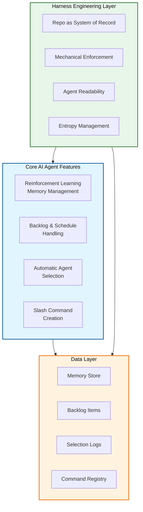
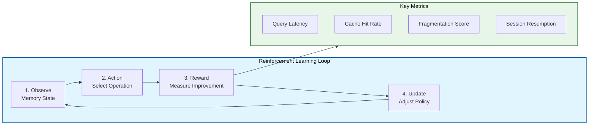
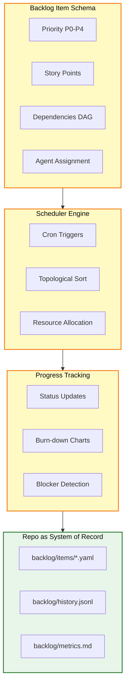
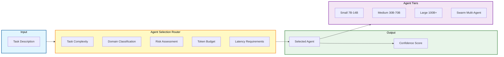
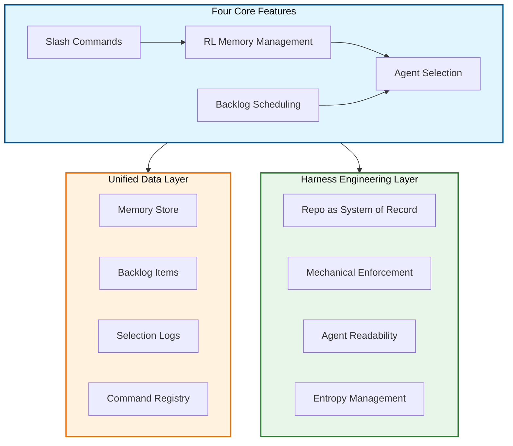

# AI Agent Deep-Dive Analysis: Four Core Features with Harness Engineering Integration

## Executive Summary

This document provides an in-depth analysis of four critical AI agent capabilities for autonomous enterprise development:

1. **Reinforcement Learning for Memory Management**
2. **Planned Coding Backlog & Schedule Handling**
3. **Automatic Agent Selection (Large vs Small)**
4. **Automatic Slash Command Creation from RL**

Each feature is analyzed through the lens of Torro's AGENT.md principles and Harness Engineering practices, with concrete implementation recommendations.

---

## Architecture Overview



## Table of Contents

1. [Feature 1: Reinforcement Learning for Memory Management](#1-feature-1-reinforcement-learning-for-memory-management)
2. [Feature 2: Planned Coding Backlog & Schedule Handling](#2-feature-2-planned-coding-backlog--schedule-handling)
3. [Feature 3: Automatic Agent Selection](#3-feature-3-automatic-agent-selection)
4. [Feature 4: Automatic Slash Command Creation](#4-feature-4-automatic-slash-command-creation)
5. [Cross-Feature Integration](#5-cross-feature-integration)
6. [Implementation Roadmap](#6-implementation-roadmap)
7. [Risk Assessment](#7-risk-assessment)

---

## 1. Feature 1: Reinforcement Learning for Memory Management

### 1.1 Current State Analysis

**Hermes Agent** currently leads in memory system sophistication with:
- 8+ memory providers (honcho, mem0, supermemory)
- SQLite + FTS5 for persistent storage (~2,095 LOC)
- `curator.py` (~927 LOC) for memory consolidation
- RL training environments via Atropos for self-improvement

**Claude Code** has:
- `autoDream` service with Orient → Gather → Consolidate → Prune flow
- Session-scoped memory + daily logs
- Team memory synchronization

**Everything Claude Code** has:
- Session persistence hooks
- No built-in RL for memory optimization

### 1.2 Reinforcement Learning Architecture

Based on the [`autoresearch`](.roo/skills/autoresearch/SKILL.md) skill pattern, we propose:



**Key Metrics for RL Optimization:**
- Query latency (ms)
- Cache hit rate (%)
- Memory fragmentation score
- Session resumption accuracy
- User satisfaction (implicit via re-query frequency)

### 1.3 Harness Engineering Integration

**Golden Rules for Memory Management:**

1. **No Orphan Memories**: Every memory must have a parent session or be marked as consolidated
2. **Age-Weighted Relevance**: Memory relevance decays exponentially with age unless reinforced
3. **Query-Driven Consolidation**: Consolidation triggered by query patterns, not arbitrary timers
4. **Traceable Decisions**: Every memory operation logged with decision rationale

**Mechanical Enforcement:**

```python
# Memory quality scoring (0-100)
def calculate_memory_quality(memory: Memory) -> int:
    score = 100
    if not memory.parent_session and not memory.is_consolidated:
        score -= 40  # Orphan penalty
    if memory.age_days > 30 and not memory.accessed_recently:
        score -= 30  # Age decay
    if memory.fragmentation_score > 0.5:
        score -= 20  # Fragmentation penalty
    return max(0, score)
```

**Entropy Management:**

- Background agent scans memory quality daily
- Memories below quality threshold are auto-archived
- Quality trends tracked over time (improving vs degrading)

### 1.4 Implementation Recommendation

**Phase 1: Memory Instrumentation**
- Add telemetry to all memory operations
- Define reward signals (latency improvement, hit rate)
- Create memory quality scoring system

**Phase 2: RL Agent Training**
- Implement Q-learning or policy gradient agent
- Train on historical memory access patterns
- Validate in sandbox environment

**Phase 3: Production Deployment**
- A/B test RL-managed vs rule-based memory
- Monitor for unintended behaviors
- Gradual rollout with kill switch

---

## 2. Feature 2: Planned Coding Backlog & Schedule Handling

### 2.1 Current State Analysis

**Hermes Agent** has:
- `cron/` module for scheduled tasks
- Batch mode execution
- `cron/scheduler.py` and `cron/jobs.py`

**Roo-Code** has:
- `TodoList` management in `Task.ts`
- Task dependency tracking
- No native scheduling

**Everything Claude Code** has:
- 48 specialized agents
- No explicit backlog/scheduling system

### 2.2 Backlog Architecture Design

**Core Components:**



**Backlog Item Schema:**

```python
@dataclass
class BacklogItem:
    id: str
    title: str
    description: str
    priority: Priority  # P0-P4
    estimated_points: int
    dependencies: List[str]  # IDs of dependent items
    assigned_agent: Optional[str]
    status: Status  # TODO, IN_PROGRESS, BLOCKED, DONE
    created_at: datetime
    due_date: Optional[datetime]
    tags: List[str]
```

### 2.3 Harness Engineering Integration

**Repo as System of Record:**

- Backlog stored in `backlog/items/` as YAML files
- State transitions logged in `backlog/history.jsonl`
- Metrics exported to `backlog/metrics.md`

**Mechanical Enforcement:**

```yaml
# backlog/items/ITEM-001.yaml
id: ITEM-001
title: Implement JWT authentication
priority: P1
estimated_points: 5
dependencies: []
assigned_agent: auth-agent
status: IN_PROGRESS
created_at: 2026-04-30T10:00:00Z
due_date: 2026-05-02T18:00:00Z
tags:
  - security
  - authentication
---
# State transitions automatically logged
# 2026-04-30T10:00:00Z: TODO → IN_PROGRESS (assigned to auth-agent)
```

**Agent Readability:**

- Backlog items use `FN:` prefix for functions
- Clear entry/exit criteria per item
- Test verification commands specified

### 2.4 Schedule Handling Patterns

**Pattern 1: Time-Boxed Sprints**

```python
class SprintScheduler:
    def __init__(self, sprint_duration_days: int = 14):
        self.sprint_duration = sprint_duration_days
        self.capacity_points = 40  # Per sprint
    
    def plan_sprint(self, backlog: List[BacklogItem]) -> SprintPlan:
        # Select items by priority until capacity filled
        # Respect dependencies
        # Return sprint plan with daily breakdown
```

**Pattern 2: Continuous Flow**

```python
class ContinuousFlowScheduler:
    def __init__(self, wip_limit: int = 3):
        self.wip_limit = wip_limit
    
    def assign_next(self, backlog: List[BacklogItem]) -> Optional[BacklogItem]:
        # Pull-based: assign when capacity available
        # Respect WIP limits
        # Return next item or None
```

**Pattern 3: Deadline-Driven**

```python
class DeadlineScheduler:
    def schedule(self, items: List[BacklogItem]) -> Schedule:
        # Critical path analysis
        # Resource leveling
        # Buffer time for unknowns
```

### 2.5 Implementation Recommendation

**Phase 1: Backlog Schema & Storage**
- Define YAML schema for backlog items
- Create `backlog/` directory structure
- Implement CRUD operations

**Phase 2: Scheduler Engine**
- Implement dependency resolution (topological sort)
- Create scheduling algorithms (sprint, flow, deadline)
- Add conflict detection

**Phase 3: Agent Integration**
- Agent assignment logic
- Progress tracking hooks
- Status reporting

**Phase 4: Metrics & Visualization**
- Burn-down charts
- Velocity tracking
- Blocker alerts

---

## 3. Feature 3: Automatic Agent Selection (Large vs Small)

### 3.1 Current State Analysis

**Everything Claude Code** has:
- 48 specialized agents
- Manual selection via slash commands
- No automatic routing

**Hermes Agent** has:
- Single-task and batch modes
- `delegate_tool.py` for subagent spawning
- No intelligent task-to-agent matching

**Roo-Code** has:
- `NewTaskTool` for spawning
- Task mode selection
- No automatic agent routing

### 3.2 Agent Selection Architecture

**Decision Matrix:**



**Agent Tiers:**

| Tier | Model Size | Use Case | Cost | Latency |
|------|------------|----------|------|---------|
| Small | 7B-14B | Simple lookups, formatting, validation | $ | <1s |
| Medium | 30B-70B | Code generation, refactoring, debugging | $$ | 1-5s |
| Large | 100B+ | Architecture decisions, complex debugging | $$$ | 5-30s |
| Swarm | Multiple | Multi-file refactoring, system design | $$$$ | 30s+ |

### 3.3 Selection Algorithm

```python
class AgentRouter:
    def __init__(self):
        self.agents = {
            "small": AgentConfig(model="Qwen-14B", max_tokens=4096),
            "medium": AgentConfig(model="Qwen-72B", max_tokens=16384),
            "large": AgentConfig(model="Qwen-110B", max_tokens=32768),
            "swarm": AgentConfig(model="multi-agent", max_tokens=131072),
        }
    
    def select_agent(self, task: Task) -> AgentSelection:
        # Factor 1: Complexity
        complexity = self._estimate_complexity(task)
        
        # Factor 2: Domain
        domain = self._classify_domain(task)
        
        # Factor 3: Risk
        risk = self._assess_risk(task)
        
        # Factor 4: Token budget
        token_estimate = self._estimate_tokens(task)
        
        # Decision logic
        if token_estimate > 100000 or complexity == "very_high":
            return AgentSelection(agent="swarm", confidence=0.9)
        elif complexity == "high" or risk == "high":
            return AgentSelection(agent="large", confidence=0.85)
        elif complexity == "medium":
            return AgentSelection(agent="medium", confidence=0.8)
        else:
            return AgentSelection(agent="small", confidence=0.75)
```

**Complexity Estimation:**

```python
def _estimate_complexity(self, task: Task) -> str:
    indicators = {
        "file_count": len(task.files),
        "line_count": sum(f.line_count for f in task.files),
        "dependency_depth": self._calc_dependency_depth(task),
    }
    
    if indicators["file_count"] > 10 or indicators["line_count"] > 500:
        return "very_high"
    elif indicators["file_count"] > 5 or indicators["line_count"] > 200:
        return "high"
    elif indicators["file_count"] > 2:
        return "medium"
    else:
        return "low"
```

### 3.4 Harness Engineering Integration

**Repo as System of Record:**

- Agent selection decisions logged to `agent/selections.jsonl`
- Performance metrics tracked per agent tier
- Historical data for ML training

**Mechanical Enforcement:**

```python
# Agent selection validation
def validate_agent_selection(task: Task, selection: AgentSelection):
    # Rule 1: High-risk tasks require large agent or human review
    if task.risk_level == "high" and selection.agent not in ["large", "swarm"]:
        raise ValidationError("High-risk task requires large agent")
    
    # Rule 2: Token budget must not exceed agent capacity
    if task.estimated_tokens > selection.max_tokens:
        raise ValidationError("Task exceeds agent token capacity")
    
    # Rule 3: Domain-specific agents preferred
    if task.domain in DOMAIN_AGENTS:
        expected_agent = DOMAIN_AGENTS[task.domain]
        if selection.agent != expected_agent:
            logger.warning(f"Non-standard agent for domain {task.domain}")
```

**Agent Readability:**

- Selection rationale logged with each decision
- Confidence scores exposed for debugging
- Fallback paths documented

### 3.5 Implementation Recommendation

**Phase 1: Agent Registry**
- Define agent catalog with capabilities
- Implement agent health monitoring
- Create selection API

**Phase 2: Decision Engine**
- Implement complexity estimation
- Build domain classifier
- Create risk assessment logic

**Phase 3: Routing Logic**
- Implement selection algorithm
- Add confidence scoring
- Create fallback mechanisms

**Phase 4: Learning Loop**
- Track selection outcomes
- Adjust weights based on success rate
- A/B test selection strategies

---

## 4. Feature 4: Automatic Slash Command Creation

### 4.1 Current State Analysis

**Everything Claude Code** has:
- 68 slash commands
- Manual creation process
- No automatic generation from patterns

**Hermes Agent** has:
- CLI commands
- Skill system with `SKILL.md` format
- No automatic command generation

**Roo-Code** has:
- VS Code commands
- No slash command system

### 4.2 Automatic Command Generation Architecture

**Pattern Detection:**

```mermaid
flowchart LR
    subgraph Pipeline["Command Generation Pipeline"]
        Analyze[1. Analyze History]
        Identify[2. Identify Patterns]
        Extract[3. Extract Pattern]
        Generate[4. Generate SKILL.md]
        Register[5. Register Command]
        Test[6. Test Input]
        Store[7. Store Command]
    end
    
    subgraph Storage["Repo as System of Record"]
        CmdDir[commands/]
        Metrics[metrics.jsonl]
        Training[training/]
    end
    
    Analyze --> Identify
    Identify --> Extract
    Extract --> Generate
    Generate --> Register
    Register --> Test
    Test --> Store
    Store --> Storage
    
    style Pipeline fill:#f3e5f5,stroke:#7b1fa2,stroke-width:2px,color:#000000
    style Storage fill:#e8f5e9,stroke:#2e7d32,stroke-width:2px,color:#000000
```



**Command Pattern Schema:**

```yaml
command: /refactor-component
description: Refactor React component into smaller units
trigger_pattern:
  - "split this component"
  - "make this more modular"
  - "extract helper functions"
execution_flow:
  - analyze_component_structure
  - identify_extraction_points
  - create_new_files
  - update_imports
  - run_tests
parameters:
  - name: component_path
    type: string
    required: true
  - name: max_file_size
    type: integer
    default: 200
```

### 4.3 Reinforcement Learning Integration

**Reward Signals:**

| Signal | Measurement | Weight |
|--------|-------------|--------|
| Command usage frequency | Commands per day | 0.3 |
| User satisfaction | Thumbs up/down | 0.4 |
| Time saved | Estimated vs actual | 0.2 |
| Error rate | Failures per 100 uses | -0.5 |

**Learning Algorithm:**

```python
class CommandLearningAgent:
    def __init__(self):
        self.command_patterns = {}
        self.usage_history = []
        self.reward_history = []
    
    def observe(self, conversation: Conversation):
        # Detect repeated patterns
        patterns = self._extract_patterns(conversation)
        
        # Calculate reward
        reward = self._calculate_reward(patterns)
        
        # Update policy
        if reward > threshold:
            self._generate_command(patterns)
    
    def _calculate_reward(self, patterns: List[Pattern]) -> float:
        # Frequency component
        freq_score = min(1.0, len(patterns) / 10)
        
        # Time saved component
        time_saved = self._estimate_time_saved(patterns)
        time_score = min(1.0, time_saved / 60)  # Normalize to 1 hour
        
        # User satisfaction component
        satisfaction = self._get_user_satisfaction(patterns)
        
        return 0.3 * freq_score + 0.4 * satisfaction + 0.3 * time_score
```

**Command Generation:**

```python
def _generate_command(self, patterns: List[Pattern]) -> SlashCommand:
    # Analyze pattern structure
    common_steps = self._find_common_steps(patterns)
    
    # Generate SKILL.md
    skill_content = f"""---
name: {self._infer_command_name(patterns)}
description: {self._infer_description(patterns)}
---

# {self._infer_command_name(patterns)}

## When to Use

{self._generate_when_to_use(patterns)}

## Steps

{self._generate_steps(common_steps)}
"""
    
    # Generate command registration
    command = SlashCommand(
        name=self._infer_command_name(patterns),
        skill_content=skill_content,
        trigger_patterns=self._extract_triggers(patterns),
    )
    
    return command
```

### 4.4 Harness Engineering Integration

**Repo as System of Record:**

- Commands stored in `commands/` directory
- Usage metrics in `commands/metrics.jsonl`
- Training data in `commands/training/`

**Mechanical Enforcement:**

```python
# Command validation
def validate_command(command: SlashCommand) -> ValidationResult:
    errors = []
    
    # Rule 1: Command name must be kebab-case
    if not re.match(r'^/[a-z]+-[a-z]+$', command.name):
        errors.append("Command name must be kebab-case")
    
    # Rule 2: Must have at least 3 trigger patterns
    if len(command.trigger_patterns) < 3:
        errors.append("Need at least 3 trigger patterns")
    
    # Rule 3: Must have execution flow
    if not command.execution_flow:
        errors.append("Missing execution flow")
    
    return ValidationResult(success=len(errors) == 0, errors=errors)
```

**Entropy Management:**

- Commands with low usage flagged for review
- Duplicate commands detected and merged
- Outdated commands auto-archived

### 4.5 Implementation Recommendation

**Phase 1: Pattern Detection**
- Conversation history analyzer
- Pattern extraction algorithm
- Frequency tracking

**Phase 2: Command Generation**
- SKILL.md template generator
- Command registration automation
- Test case generation

**Phase 3: RL Training**
- Reward signal implementation
- Policy update logic
- A/B testing framework

**Phase 4: Production Deployment**
- Gradual rollout
- Human review gate
- Metrics dashboard

---

## 5. Cross-Feature Integration

### 5.1 Feature Interdependencies



### 5.2 Unified Data Model

```python
@dataclass
class AgentEcosystem:
    # Core components
    memory_system: MemorySystem
    backlog: BacklogManager
    agent_router: AgentRouter
    command_generator: CommandGenerator
    
    # Shared state
    metrics: MetricsCollector
    config: EcosystemConfig
    
    # Integration points
    def process_task(self, task: Task) -> TaskResult:
        # 1. Check memory for similar tasks
        similar = self.memory_system.search_similar(task)
        
        # 2. Select appropriate agent
        agent = self.agent_router.select_agent(task)
        
        # 3. Execute with selected agent
        result = agent.execute(task)
        
        # 4. Store in memory
        self.memory_system.store(task, result)
        
        # 5. Update metrics
        self.metrics.record(task, result, agent)
        
        return result
```

### 5.3 Harness Engineering Principles Applied

**Repo as System of Record:**

- All state stored in repository (`memory/`, `backlog/`, `agents/`, `commands/`)
- State transitions logged as JSONL
- Metrics exported to markdown reports

**Mechanical Enforcement:**

- Lint rules for data schemas
- Validation on state transitions
- CI checks for data integrity

**Agent Readability:**

- `FN:` prefixes on all functions
- Type hints throughout
- Clear entry/exit criteria

**Entropy Management:**

- Background agents for each feature
- Quality scoring and auto-archival
- Trend tracking (improving vs degrading)

---

## 6. Implementation Roadmap

### 6.1 Phase 1: Foundation (Weeks 1-4)

**Week 1-2: Memory Instrumentation**
- Add telemetry to memory operations
- Define reward signals
- Create quality scoring

**Week 3-4: Backlog Schema**
- Define YAML schema
- Create directory structure
- Implement CRUD operations

### 6.2 Phase 2: Core Features (Weeks 5-8)

**Week 5-6: Agent Router**
- Implement complexity estimation
- Build domain classifier
- Create selection algorithm

**Week 7-8: Command Generator**
- Pattern detection algorithm
- SKILL.md template generator
- Command registration

### 6.3 Phase 3: RL Integration (Weeks 9-12)

**Week 9-10: RL for Memory**
- Q-learning implementation
- Training on historical data
- Validation in sandbox

**Week 11-12: RL for Commands**
- Reward signal implementation
- Policy update logic
- A/B testing framework

### 6.4 Phase 4: Integration & Deployment (Weeks 13-16)

**Week 13-14: Feature Integration**
- Unified data model
- Cross-feature APIs
- End-to-end testing

**Week 15-16: Production Deployment**
- Gradual rollout
- Monitoring setup
- Documentation

---

## 7. Risk Assessment

### 7.1 Technical Risks

| Risk | Probability | Impact | Mitigation |
|------|-------------|--------|------------|
| RL agent learns suboptimal policy | Medium | High | Human review gate, kill switch |
| Agent selection bias | Medium | Medium | A/B testing, regular audits |
| Command generation quality | High | Medium | Human review for first 100 commands |
| Memory corruption | Low | High | Transactional updates, rollback |

### 7.2 Operational Risks

| Risk | Probability | Impact | Mitigation |
|------|-------------|--------|------------|
| Increased token costs | High | Medium | Token budgets, cost monitoring |
| Latency increase | Medium | Medium | Caching, async processing |
| User confusion | Low | Low | Clear documentation, gradual rollout |

### 7.3 Security Risks

| Risk | Probability | Impact | Mitigation |
|------|-------------|--------|------------|
| Prompt injection via commands | Low | High | Input validation, sandboxing |
| Memory data leakage | Low | High | Encryption, access controls |
| Agent privilege escalation | Low | High | Permission boundaries, audit logs |

---

## 8. Conclusion

This analysis provides a comprehensive blueprint for implementing four critical AI agent features:

1. **RL for Memory Management**: Optimize memory operations through reinforcement learning, with quality scoring and entropy management.

2. **Backlog & Scheduling**: Implement time-boxed sprints, continuous flow, and deadline-driven scheduling with dependency resolution.

3. **Automatic Agent Selection**: Route tasks to appropriate agent tiers based on complexity, domain, risk, and token budget.

4. **Automatic Command Creation**: Generate slash commands from repeated patterns using RL to optimize for user satisfaction.

Each feature integrates with Harness Engineering principles:
- **Repo as System of Record**: All state stored in repository
- **Mechanical Enforcement**: Validation rules and CI checks
- **Agent Readability**: Clear interfaces and documentation
- **Entropy Management**: Background agents for quality maintenance

**Next Steps:**
1. Review and approve this analysis
2. Create detailed implementation plan
3. Begin Phase 1: Foundation

---

*Document generated: 2026-04-30 by Qwen3.5-397B-A17B-int4-AutoRound via Roo Code Agentic Planner*
