# Legacy Architecture Gap Analysis

## Executive Summary

This document provides a detailed gap analysis between the current Torro Agent Enterprise Architecture and the proven design patterns observed in four industry-leading frameworks:

1. **Claude-Code** (CC) - Multi-agent coordination and memory consolidation
2. **Roo-Code** (RC) - VSCode extension architecture and task management
3. **Hermes-Agent** (HA) - Multi-platform gateway and tool registry patterns
4. **Everything-Claude-Code** (ECC) - YAML-based agent definitions and skill system

## 1. Architecture Pattern Comparison

### 1.1 Multi-Agent Coordination

| Framework | Pattern | Torro Gap |
|-----------|---------|-----------|
| **Claude-Code** | Coordinator mode with worker agents spawned via AgentTool | Torro uses Airflow DAGs instead of dynamic agent spawning |
| **Roo-Code** | Task-based orchestration with ClineProvider | Torro lacks VSCode-style webview integration |
| **Hermes-Agent** | Gateway-based platform adapters | Torro has similar Layer 0 but lacks platform-specific adapters |
| **ECC** | YAML agent definitions with tool declarations | Torro uses markdown-based agent personas |

**Gap**: Torro needs dynamic agent spawning capability similar to Claude-Code's `AgentTool` pattern.

### 1.2 Memory Architecture

| Framework | Pattern | Torro Gap |
|-----------|---------|-----------|
| **Claude-Code** | autoDream service for memory consolidation | Torro has similar Layer 4 Innovation pattern |
| **Hermes-Agent** | MemoryManager with plugin providers | Torro uses PostgreSQL/pgvector instead |
| **ECC** | MEMORY.md file-based persistence | Torro uses database-backed persistence |

**Gap**: Torro's hybrid Vector-Graph memory is more advanced but lacks the proven consolidation pipeline.

### 1.3 Tool Registry

| Framework | Pattern | Torro Gap |
|-----------|---------|-----------|
| **Hermes-Agent** | AST-based tool discovery with check_fn caching | Torro needs similar dynamic tool registration |
| **Claude-Code** | Tool.ts contract with checkPermissions/validateInput/call | Torro follows similar pattern |
| **ECC** | YAML frontmatter tool declarations | Torro uses markdown-based skill definitions |

**Gap**: Torro needs Hermes-style AST-based tool discovery for zero-friction registration.

## 2. Detailed Framework Analysis

### 2.1 Claude-Code Architecture

**Key Patterns Identified:**

1. **QueryEngine.ts** (1296 lines)
   - Central orchestration for LLM interactions
   - Handles message accumulation, token tracking, and response streaming
   - Implements circuit breaker for API rate limits

2. **Tool.ts Contract** (793 lines)
   ```typescript
   export type Tool = {
     name: string
     description: string
     inputSchema: ToolInputJSONSchema
     checkPermissions: () => PermissionResult
     validateInput: (input: unknown) => ValidationResult
     call: (input: ToolInput, context: ToolCallContext) => Promise<ToolResult>
   }
   ```

3. **Coordinator Mode** (coordinatorMode.ts)
   - Dynamic worker agent spawning
   - Tool delegation with ASYNC_AGENT_ALLOWED_TOOLS
   - MCP server integration for extended capabilities

4. **autoDream Service** (autoDream.ts)
   - Background memory consolidation
   - Time-gated and session-gated triggers
   - Forked agent execution for dream prompts

**Torro Adoption Strategy:**
- Implement similar Tool contract in Python with type hints
- Add coordinator mode for dynamic agent spawning
- Adopt autoDream-style consolidation for Layer 5 memory

### 2.2 Roo-Code Architecture

**Key Patterns Identified:**

1. **Extension.ts** (453 lines)
   - VSCode extension entry point
   - ContextProxy for configuration management
   - ClineProvider for webview communication

2. **Task.ts** (not found - likely in core/ directory)
   - Task lifecycle management
   - Tool execution tracking
   - Checkpoint system for recovery

3. **Core Directory Structure:**
   ```
   src/core/
   ├── assistant-message/
   ├── auto-approval/
   ├── checkpoints/
   ├── condense/
   ├── config/
   ├── context/
   ├── context-management/
   ├── context-tracking/
   ├── diff/
   ├── environment/
   ├── ignore/
   ├── mentions/
   ├── message-manager/
   ├── message-queue/
   ├── prompts/
   ├── protect/
   ├── task/
   ├── task-persistence/
   ├── tools/
   └── webview/
   ```

**Torro Adoption Strategy:**
- Implement checkpoint system for execution recovery
- Add context condensing similar to condense/ directory
- Adopt message queue pattern for async operations

### 2.3 Hermes-Agent Architecture

**Key Patterns Identified:**

1. **ContextEngine.py** (207 lines)
   ```python
   class ContextEngine(ABC):
       """Base class all context engines must implement."""
       
       @property
       @abstractmethod
       def name(self) -> str
       
       def update_from_response(self, usage: Dict[str, Any]) -> None
       def should_compress(self, prompt_tokens: int = None) -> bool
       def compress(self, messages: List[Dict[str, Any]]) -> List[Dict[str, Any]]
   ```

2. **MemoryManager.py** (558 lines)
   - Single integration point for memory providers
   - Supports builtin + ONE external provider
   - Context fencing with memory-context tags

3. **ToolRegistry.py** (538 lines)
   - AST-based tool discovery
   - check_fn TTL caching (30 second cache)
   - Dynamic tool availability based on environment

4. **Gateway Pattern** (gateway/)
   - Platform adapters for Telegram, Discord, WhatsApp, Slack, Email
   - BasePlatformAdapter abstract interface
   - Platform registry for dynamic discovery

**Torro Adoption Strategy:**
- Adopt ContextEngine abstract base class for pluggable compression
- Implement MemoryManager-style provider orchestration
- Use gateway pattern for Layer 0 platform adapters

### 2.4 Everything-Claude-Code Architecture

**Key Patterns Identified:**

1. **Agent Definitions** (agents/*.md)
   - YAML frontmatter with name, description, tools, model
   - 48+ specialized agents (planner, code-reviewer, security-reviewer, etc.)
   - Markdown-based persona definitions

2. **Skills System** (skills/)
   - 182+ skills organized by domain
   - SKILL.md files with descriptions and triggers
   - Dynamic skill loading based on context

3. **Hooks System** (hooks/)
   - Pre-tool validation hooks
   - Post-tool learning hooks
   - Mechanical rule enforcement

**Torro Adoption Strategy:**
- Adopt YAML frontmatter for agent definitions
- Implement similar skill organization structure
- Add hooks system for mechanical enforcement

## 3. Gap Summary by Torro Layer

### Layer 0: Presentation Layer

| Gap | Priority | Reference |
|-----|----------|-----------|
| Platform adapters for Slack/Email | High | HA gateway/platforms/ |
| Interactive TUI with mode selection | High | HA ui-tui/, CC ink.ts |
| Enterprise API Gateway | Medium | HA gateway/platforms/api_server.py |

### Layer 1: Autonomous Layer

| Gap | Priority | Reference |
|-----|----------|-----------|
| Dynamic agent spawning | Critical | CC AgentTool, coordinatorMode.ts |
| Tool contract interface | High | CC Tool.ts, HA tools/registry.py |
| Context compression engine | High | HA context_engine.py |

### Layer 2: Reporting Layer

| Gap | Priority | Reference |
|-----|----------|-----------|
| Jira bi-directional sync | Medium | ECC jira-integration |
| Executive report generation | Low | ECC agents/planner.md |

### Layer 3: Execution Layer

| Gap | Priority | Reference |
|-----|----------|-----------|
| Tool validation contract | Critical | CC Tool.ts |
| AST-based tool discovery | High | HA tools/registry.py |
| Docker sandboxing | High | HA tools/environments/ |

### Layer 4: Innovation Layer

| Gap | Priority | Reference |
|-----|----------|-----------|
| autoDream consolidation | High | CC autoDream/ |
| Curator maintenance | Medium | HA curator.py |
| MCP protocol layer | Medium | HA mcp_tool.py |

### Layer 5: Memory Layer

| Gap | Priority | Reference |
|-----|----------|-----------|
| MemoryManager orchestration | High | HA memory_manager.py |
| Context fencing | High | HA memory fencing |
| Streaming context scrubber | Medium | HA StreamingContextScrubber |

### Layer 6: SRE Layer

| Gap | Priority | Reference |
|-----|----------|-----------|
| Heartbeat monitoring | High | Custom implementation needed |
| Credential pooling | Medium | HA credential_pool.py |
| Error classification | High | HA error_classifier.py |

## 4. Recommended Implementation Priority

### Phase 1: Foundation (Weeks 1-2)
1. Implement Tool contract interface (CC Tool.ts pattern)
2. Add AST-based tool discovery (HA tools/registry.py pattern)
3. Create ContextEngine abstract base (HA context_engine.py pattern)

### Phase 2: Coordination (Weeks 3-4)
1. Implement dynamic agent spawning (CC coordinatorMode.ts)
2. Add MemoryManager orchestration (HA memory_manager.py)
3. Create agent definition format (ECC agents/*.md)

### Phase 3: Memory & Learning (Weeks 5-6)
1. Implement autoDream consolidation (CC autoDream/)
2. Add context fencing (HA memory fencing)
3. Create curator maintenance (HA curator.py)

### Phase 4: Platform Integration (Weeks 7-8)
1. Build gateway platform adapters (HA gateway/platforms/)
2. Add interactive TUI (HA ui-tui/, CC ink.ts)
3. Implement error classification (HA error_classifier.py)

## 5. Code Reference Index

### Claude-Code References
- [`legacy/claude-code/src/QueryEngine.ts`](legacy/claude-code/src/QueryEngine.ts:1)
- [`legacy/claude-code/src/Tool.ts`](legacy/claude-code/src/Tool.ts:15)
- [`legacy/claude-code/src/coordinator/coordinatorMode.ts`](legacy/claude-code/src/coordinator/coordinatorMode.ts:36)
- [`legacy/claude-code/src/services/autoDream/autoDream.ts`](legacy/claude-code/src/services/autoDream/autoDream.ts:1)

### Roo-Code References
- [`legacy/Roo-Code/src/extension.ts`](legacy/Roo-Code/src/extension.ts:1)
- [`legacy/Roo-Code/src/core/`](legacy/Roo-Code/src/core/)

### Hermes-Agent References
- [`legacy/hermes-agent/agent/context_engine.py`](legacy/hermes-agent/agent/context_engine.py:32)
- [`legacy/hermes-agent/agent/memory_manager.py`](legacy/hermes-agent/agent/memory_manager.py:1)
- [`legacy/hermes-agent/tools/registry.py`](legacy/hermes-agent/tools/registry.py:1)
- [`legacy/hermes-agent/gateway/platforms/base.py`](legacy/hermes-agent/gateway/platforms/base.py:37)

### Everything-Claude-Code References
- [`legacy/everything-claude-code/agents/planner.md`](legacy/everything-claude-code/agents/planner.md:1)
- [`legacy/everything-claude-code/skills/`](legacy/everything-claude-code/skills/)

## 6. Architecture Comparison Diagram

```mermaid
flowchart TB
    subgraph CC["Claude-Code [CC]"]
        CC1["QueryEngine.ts<br/>LLM Interaction"]
        CC2["Tool.ts Contract<br/>checkPermissions/validateInput/call"]
        CC3["coordinatorMode.ts<br/>Dynamic Agent Spawning"]
        CC4["autoDream.ts<br/>Memory Consolidation"]
    end

    subgraph RC["Roo-Code [RC]"]
        RC1["extension.ts<br/>VSCode Extension Entry"]
        RC2["ClineProvider<br/>Webview Communication"]
        RC3["core/checkpoints/<br/>Recovery System"]
        RC4["core/condense/<br/>Context Compression"]
    end

    subgraph HA["Hermes-Agent [HA]"]
        HA1["context_engine.py<br/>Pluggable Compression"]
        HA2["memory_manager.py<br/>Provider Orchestration"]
        HA3["tools/registry.py<br/>AST-based Discovery"]
        HA4["gateway/platforms/<br/>Platform Adapters"]
    end

    subgraph ECC["Everything-Claude-Code [ECC]"]
        ECC1["agents/*.md<br/>YAML Agent Definitions"]
        ECC2["skills/<br/>182+ Skill Workflows"]
        ECC3["hooks/<br/>Pre/Post Tool Hooks"]
    end

    subgraph TORRO["Torro Agent [Target]"]
        T0["Layer 0: Presentation<br/>Omni-Channel Gateway"]
        T1["Layer 1: Autonomous<br/>Airflow DAG Orchestration"]
        T2["Layer 2: Reporting<br/>Jira/Enterprise Sync"]
        T3["Layer 3: Execution<br/>Docker Sandboxing"]
        T4["Layer 4: Innovation<br/>autoDream-style Learning"]
        T5["Layer 5: Memory<br/>Vector-Graph Hybrid"]
        T6["Layer 6: SRE<br/>Heartbeat Monitoring"]
    end

    CC1 --> T1
    CC2 --> T3
    CC3 --> T1
    CC4 --> T4

    RC1 --> T0
    RC2 --> T0
    RC3 --> T3
    RC4 --> T5

    HA1 --> T1
    HA2 --> T5
    HA3 --> T3
    HA4 --> T0

    ECC1 --> T1
    ECC2 --> T3
    ECC3 --> T3

    T0 --> T1
    T1 --> T3
    T3 --> T5
    T5 --> T4
    T4 --> T1
    T3 --> T2
    T3 --> T6

    style CC fill:#e3f2fd,stroke:#1565c0,stroke-width:2px,color:#000000
    style RC fill:#fff3e0,stroke:#ef6c00,stroke-width:2px,color:#000000
    style HA fill:#e8f5e9,stroke:#2e7d32,stroke-width:2px,color:#000000
    style ECC fill:#f3e5f5,stroke:#7b1fa2,stroke-width:2px,color:#000000
    style TORRO fill:#e0f2f1,stroke:#00695c,stroke-width:3px,color:#000000
```



## 7. Tool Contract Comparison

### 7.1 Claude-Code Tool.ts Pattern

```typescript
export type Tool = {
  name: string
  description: string
  inputSchema: ToolInputJSONSchema
  checkPermissions: () => PermissionResult
  validateInput: (input: unknown) => ValidationResult
  call: (input: ToolInput, context: ToolCallContext) => Promise<ToolResult>
}
```

### 7.2 Hermes-Agent Tool Registry Pattern

```python
class ToolEntry:
    """Metadata for a single registered tool."""
    
    __slots__ = (
        "name", "toolset", "schema", "handler", "check_fn",
        "requires_env", "is_async", "description", "emoji",
        "max_result_size_chars",
    )

class ToolRegistry:
    """Singleton registry that collects tool schemas + handlers."""
    
    def register(self, name, toolset, schema, handler, check_fn, ...)
    def get_definitions(self) -> List[Dict]
    def get_handler(self, name) -> Callable
```

### 7.3 Torro Recommended Tool Contract

```python
from abc import ABC, abstractmethod
from typing import Any, Dict, Optional

class Tool(ABC):
    """Abstract base class for all Torro tools."""
    
    @property
    @abstractmethod
    def name(self) -> str:
        """Tool name identifier."""
    
    @property
    @abstractmethod
    def description(self) -> str:
        """Human-readable description."""
    
    @property
    @abstractmethod
    def input_schema(self) -> Dict[str, Any]:
        """JSON Schema for input validation."""
    
    @abstractmethod
    def check_permissions(self, context: ToolContext) -> PermissionResult:
        """Verify tool execution permissions."""
    
    @abstractmethod
    def validate_input(self, input_data: Dict[str, Any]) -> ValidationResult:
        """Validate input against schema."""
    
    @abstractmethod
    async def call(self, input_data: Dict[str, Any], context: ToolContext) -> ToolResult:
        """Execute tool logic."""
```

## 8. Memory Architecture Comparison

### 8.1 Claude-Code autoDream Pattern

- **Trigger**: Time-gate (24 hours) + Session-gate (5 sessions)
- **Consolidation**: Forked agent execution with /dream prompt
- **Storage**: MEMORY.md file-based persistence
- **Lock**: File-based lock to prevent concurrent consolidation

### 8.2 Hermes-Agent MemoryManager Pattern

- **Provider Model**: BuiltinMemoryProvider + ONE external provider
- **Context Fencing**: `<memory-context>` XML tags
- **Streaming Scrubber**: Stateful scrubber for streaming text
- **Sanitization**: Strip internal context blocks from output

### 8.3 Torro Recommended Memory Architecture

```python
class MemoryManager:
    """Orchestrates Vector + Graph memory providers."""
    
    def __init__(self, vector_db: PGVector, graph_db: ApacheAGE):
        self.vector_db = vector_db
        self.graph_db = graph_db
    
    async def store(self, content: str, metadata: Dict) -> str:
        """Store content in both vector and graph stores."""
    
    async def retrieve(self, query: str, top_k: int = 5) -> List[MemoryNode]:
        """Retrieve from vector, traverse graph for context."""
    
    async def consolidate(self) -> ConsolidationResult:
        """Run autoDream-style consolidation."""
```

## 9. Next Steps

1. Review this gap analysis with stakeholders
2. Prioritize gaps based on business requirements
3. Create detailed implementation plan for Phase 1
4. Begin Tool contract interface implementation
