# Torro Agent Enterprise Architecture & Solution Design

## 1. Executive Summary

The Torro Agent is an advanced, enterprise-grade, autonomous software engineering platform. Designed to operate strictly on local, privacy-preserving LLMs (via OpenAI-compatible APIs), Torro Agent manages the entire software development lifecycle—from industry research and backlog generation to coding, security auditing, compliance enforcement, and DevOps deployment. 

It leverages a unique **Vectorized Graph Thinking** architecture, combining the cognitive continuity of vector databases (pgvector) with the logical structured reasoning of graph databases (Apache AGE). Driven by Reinforcement Learning (RL), the system continually self-heals, learns from mistakes, and refines its performance by reusing established skills from Claude Code and Roo Code ecosystems.

## 2. Core Architectural Pillars

### 2.1 Technology Stack & Infrastructure
- **Core Language**: Python (optimizing for compute efficiency and AI ecosystem compatibility).
- **AI Models**: Local LLMs exposed via OpenAI-compatible APIs (optimized for 7B-14B parameter models for tasks, up to 70B+ for planning).
- **Workflow Scheduling**: Apache Airflow for enterprise-grade orchestrations, task dependency management, and job scheduling.
- **State & Memory**: 
  - PostgreSQL with `pgvector` for semantic memory retrieval.
  - Apache AGE (on PostgreSQL) for relational and graph-based logical reasoning.
- **Configuration**: Master `config.ini` as the exclusive broker for all settings, adhering to Torro's Zero-Secrets and Externalized Config principles.

### 2.2 Security & Compliance First
- **Strict Least Privilege**: Granular access control for file system operations, terminal commands, and network access defined in `config.ini` or dedicated security YAMLs.
- **Compliance Police**: Dedicated agent validating Torro standard file naming, folder structures, and architectural principles before any code merge.

## 3. The 7-Layer Multi-Agent Topology (Layers 0 to 6)

Torro Agent operates as a highly orchestrated ecosystem of specialized agents categorized into seven distinct layers. This approach draws upon Google Agent best practices (separating orchestration, execution, evaluation, and memory) and introduces a dedicated Presentation layer for interface handling and an SRE layer for enterprise-grade reliability.

### Layer 0: Presentation Layer (The Omni-Channel Gateway)
The universal gateway that intercepts all human and machine requests, maintaining a "headless" cognitive core.
- **Conversational UI Manager**: A rich Terminal (React/Ink) and Web interface. It features interactive back-and-forth logic clarification and a dynamic **Mode Selection Menu** (1. Plan, 2. Gap Analysis, 3. Root Cause Analysis, 4. Execute).
- **Asynchronous Enterprise Approvals**: Native adapters for **Slack** and **Outlook (Email Reply)**. Allows human supervisors to review plans, authorize deployments, and respond to clarifying questions directly from enterprise messaging apps.
- **Enterprise API Gateway**: A structured REST/GraphQL API for seamless integration with external enterprise applications, CI/CD pipelines, and webhooks.

### Layer 1: Autonomous Layer (The Brain)
The cognitive epicenter of the system. It handles high-level reasoning, workflow dispatch, and cognitive retention. 
- **Agentic Orchestrator**: Manages the overarching lifecycle, dynamically deciding when to route tasks to the execution layer or fall back to the research layer.
- **Agentic Planner**: Interfaces directly with Airflow to orchestrate DAGs. It generates phased execution plans with strict token budgets (1M for phases, 128k for granular tasks).
- **Agentic Function Factory**: A specialized autonomous function that monitors command frequency and generates optimized functions (macros) of frequently used CLI strings to reduce token consumption in future prompts.

### Layer 2: Reporting Layer
Focuses on tracking, translating, and communicating progress across the enterprise.
- **Project Manager Agent**: Links bi-directionally to Jira. It constantly polls the Execution Layer for progress and updates sprint metrics, tickets, and blockers.
- **Business Analyst (BA) Agent**: Generates executive reports, user stories, and weekly executive summaries of all tasks. Translates the raw technical output of the swarm into business value.

### Layer 3: Execution Layer
The deterministic factory floor. It executes concrete tasks and enforces a strict fail-fast feedback loop back to the Autonomous Layer.
- **Architecture Agent**: Designs the system layout and defines boundaries.
- **Coding Agents**: Executes the code modifications (optimized for fast 7B-14B models).
- **Ephemeral Docker Sandboxing**: All development, execution, and build processes are packaged and executed inside isolated, ephemeral Docker containers (Zero-Trust Sandbox) to prevent host-level vulnerabilities or malicious code execution.
- **Tester Agents (Backend + UI)**: Validates functionality using unit tests and Playwright E2E frameworks.
- **Security & Compliance Police Agents**: Audits code for vulnerabilities and strict Torro standard adherence (`FN:` tags, modularity).
- **DevOps Gatekeeper**: Rebuilds environments and produces the final test reports.
- *Feedback Loop*: If any execution step fails, the layer immediately halts and reports the exact context and error traces back to the Autonomous Brain for Mistake Analysis and replanning.

### Layer 4: Innovation & Cognitive Layer
Focuses on continuous self-improvement, structural optimization, and trend forecasting.
- **AI Researcher Agent**: Leverages Gemini NotebookLM to research the latest AI topics and design new approaches to improve coding and agent operation efficiency (optimizing token usage, planning, and execution quality).
- **Data Scientist Agent**: Monitors token efficiency and feature performance drift. It provides the Brain with actionable intelligence on what to react to based on actual usage reports and research outcomes.
- **AI Engineer Agent**: Implements the structural enhancements to the memory systems and agent topologies designed by the Researcher and Data Scientist.

### Layer 5: Memory Layer (The Continuity)
The foundation layer providing persistent state and long-term intelligence across the entire swarm.
- **Knowledge DB**: The unified repository of semantic (pgvector) and logical (Apache AGE graph) knowledge.
- **Agentic Plan**: A historical database of all generated plans, tracking their success rates and execution trajectories.
- **Agentic Analysis**: Persistent logs of mistake evaluations, root-cause analyses, and architectural reviews.
- **Agentic Experience**: A consolidated history of user prompts and agent responses, used for context-aware grounding and future fine-tuning.
- **Skills Library [NEW]**: The persistent repository of all auto-generated and auto-refined `.roo/skills/` SKILL.md workflows produced by Layer 4. Stores skill metadata, usage analytics, dependency graphs, and lifecycle states (active, deprecated, archived).
- **Skill Registry [NEW]**: A structured index maintained in the Knowledge DB that tracks every skill's version history, success rate correlation, cross-skill dependencies, and context firewall definitions. Layer 4's AI Engineer Agent writes new skills here; the Skill Refinement Engine updates and archives entries.
- **Skills Library [NEW]**: The persistent repository of all auto-generated and auto-refined `.roo/skills/` SKILL.md workflows produced by Layer 4. Stores skill metadata, usage analytics, dependency graphs, and lifecycle states (active, deprecated, archived).
- **Skill Registry [NEW]**: A structured index maintained in the Knowledge DB that tracks every skill's version history, success rate correlation, cross-skill dependencies, and context firewall definitions. Layer 4's AI Engineer Agent writes new skills here; the Skill Refinement Engine updates and archives entries.

### Layer 6: AI SRE Layer (Operational Reliability & AI Gateway)
The operational guardian of the system. It ensures the swarm remains healthy, performant, and securely routed.
- **SRE Agent**: Monitors agent heartbeats, performance metrics (latency, token usage), and "Busy/Assigned" states.
- **AI Gateway & Routing Agent**: Replaces the standard load balancer with an intelligent hybrid router capable of directing traffic to local models or "Cloud-Bursting" to external AI. 
- **Entitlement & Sensitivity Engine (YAML)**: A strict rules engine that controls the AI Gateway. It utilizes:
  - *Deterministic ABAC*: Attribute-Based Access Control on specific files, tables, and DB schemas to explicitly deny external transmission.
  - *Probabilistic Evaluation*: Dynamically scans payloads for sensitive data (e.g., PII, Trade Secret source code) before allowing tasks to route to cloud models, enforcing absolute data privacy.

---

## 4. Operational Workflows

### 4.1 The "New Problem" Lifecycle
1. **Industry Analysis**: Ingests problem scope, queries NotebookLM for state-of-the-art solutions.
2. **Skill Building**: Generates new `.roo/skills/` tailored to the specific problem domain.
3. **Phased Planning**: Outputs graph-based logic plan. Assigns to Jira sprints.
4. **Execution**: Spawns 7B models for 15-minute highly focused execution sprints.

### 4.2 Self-Healing & Mistake Analysis Workflow
- **Trigger**: An agent repeats a command sequence X times, exceeds token budget, or hits a timeout limit.
- **Action**: Circuit breaker halts execution (Torro Principle 17).
- **Mistake Analysis**: Context is dumped to the Analysis Model. The model evaluates the root cause, updates the graph-memory with the failure pattern (to avoid future repeats), and generates a corrected sub-plan for future learning.

### 4.3 Validation Pipeline
1. **Unit Testing**: Real service probing first, falling back to mock data if isolated. Verifies functionality comprehensively.
2. **UI Testing**: Playwright integration for automated browser verification.
3. **Security Testing**: Agentic red-teaming scanning for vulnerabilities.
4. **DevOps Report**: E2E infrastructure availability, API connectivity, and Playwright user story results compiled into a final executive summary.

---

## 5. Data & Memory Architecture (The 7-Layer System)

The architecture connects the 7 distinct layers through a robust memory and orchestration pipeline, where Layer 5 serves as the shared foundation for all cognitive activities.

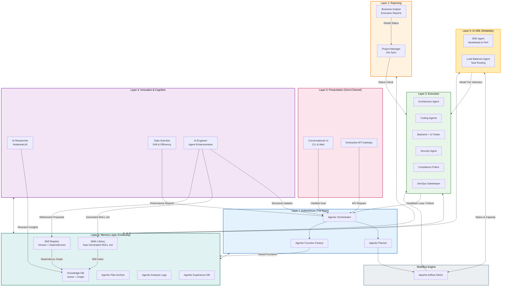

## 6. Implementation Roadmap

### Phase 1: Foundation & Cognitive Core
- Set up Python foundation, `config.ini` master configuration, and strictly scoped permissions model via YAML.
- Initialize PostgreSQL with pgvector and Apache AGE for Vectorized Graph Thinking.
- Implement the baseline local LLM API connectors (OpenAI compatible).

### Phase 2: Workflow & Orchestration
- Deploy Apache Airflow for scheduling.
- Implement the Reward/Penalty backlog prioritization algorithm.
- Build the Jira, Teams, and SMTP/POP3 Email integration modules.

### Phase 3: The Agent Swarm
- Integrate Roo Code and Claude Code skill parsing.
- Build the specialized execution agents: Coding, Security, Compliance, and DevOps.
- Implement Playwright and Unit Test automated harnesses.

### Phase 4: Self-Learning & Auto-Research
- Integrate NotebookLM python client for automated research and backlog generation.
- Implement the Mistake Analysis circuit breaker and graph-based self-healing memory update loop.
- Finalize the simplified Web UI and Terminal Interactive Chat interfaces.

---

## 7. Component-Level Reference Architecture Mapping

This section provides a detailed component-level breakdown of the Torro Agent architecture, tracing its design lineage back to established patterns observed in **Roo-Code**, **Claude Code**, **Hermes Agent**, and **Everything Claude Code (ECC)**. 

### 7.1 Solution & Transport Layer (The Core)
The Solution Layer handles AI model integration, API communication, and dynamic context assembly.
- **Transport Abstraction:** Utilizes a `ProviderTransport` interface similar to **Hermes Agent** (`agent/transports/base.py`), but optimized specifically for local LLMs via OpenAI-compatible endpoints. This allows seamless swapping of 7B to 70B models without touching core logic.
- **Execution Engine:** Integrates a `QueryEngine` inspired by **Claude Code** (`src/QueryEngine.ts`) to manage core LLM interaction logic, handling prompt assembly and streaming execution.
- **Data Transformation:** Borrows the robust transform layer from **Roo-Code** (`src/api/transform/`) to seamlessly convert local LLM message formats to standard internal representations, handling reasoning tags and tool call chunks.

### 7.2 Multi-Agent Orchestration System
- **Markdown-Based Specialization:** Inspired by **ECC**'s 48 specialized agents (`agents/*.md` with YAML frontmatter), Torro defines its agent personas via structured markdown schemas outlining purpose, boundaries, and required tools.
- **Swarm Coordination:** Adopts **Claude Code**'s `coordinator/` paradigm. Agents share a centralized memory space but operate on distinct execution threads to enable parallel processing.
- **Delegation Flow:** Uses **Hermes Agent**'s `delegate_tool.py` pattern to spawn child agents. However, Torro introduces strict token budgets (1M tokens for planning via the PM/Architect, 128k for execution via Coders) evaluated on agent process speed.

### 7.3 Tool & Skill Registry
- **Dynamic Skill Workflows:** Inherits the `SKILL.md` paradigm from **ECC** (which relies on 182 predefined skills). Torro advances this by employing its **AI Engineer Agent** to proactively generate new `SKILL.md` workflows based on chat history and mistake analysis.
- **Tool Abstraction:** Modeled exactly after **Claude Code**'s `Tool.ts` contract, requiring every tool to implement `checkPermissions()`, `validateInput()`, and `call()`.
- **Auto-Discovery:** Uses **Hermes Agent**'s AST-based `tools/registry.py` for zero-friction tool registration and dynamic dependency resolution, preventing circular imports.

### 7.4 Memory & Cognitive Graph Engine
- **State Storage:** Replaces **Hermes Agent**'s SQLite FTS5 implementation (`hermes_state.py`) with Enterprise PostgreSQL, leveraging `pgvector` for semantic search and Apache AGE for structured logical reasoning.
- **Consolidation Pipeline:** Borrows **Claude Code**'s `autoDream` service (Orient → Gather → Consolidate → Prune) and **Hermes Agent**'s `curator.py`, but applies it directly to graph nodes to create a long-term associative memory map.
- **Context Condensing:** Adapts **Roo-Code**'s `core/condense/` logic. Instead of just summarizing text, Torro compresses past conversation trajectories into graph edges, drastically reducing token consumption and preventing hallucinations.

### 7.5 Workflow Scheduling & Triggers
- **Event Hooks:** Mirrors **ECC**'s `hooks/` layer (pre-tool validation, post-tool learning) to enforce mechanical rules at execution time.
- **Enterprise Scheduling:** Replaces **Hermes Agent**'s lightweight `cron/jobs.py` with **Apache Airflow** DAGs for robust, distributed task scheduling and dependency management.
- **Backlog Prioritization:** Extends **Roo-Code**'s simple `TodoList` (in `Task.ts`) into a fully realized RL Reward/Penalty engine. The Project Manager Agent dynamically reprioritizes Jira-synced tasks based on historical build/test outcomes.

### 7.6 Security & Compliance Pipelines
- **Credential Isolation:** Uses **Hermes Agent**'s `credential_pool.py` and `tools/environments/` isolation to ensure provider keys and system secrets never leak to child processes.
- **Rule Enforcement:** Adopts **ECC**'s `rules/` directory approach. Torro's **Compliance Police Agent** mechanically enforces standard rules (e.g., `FN:` prefix for functions, 200 LOC limits, `TODO:` injection).
- **Security Contexts:** Leverages **Claude Code**'s `toAutoClassifierInput()` to assess risk before executing bash commands. If the **Security Agent** flags a critical vulnerability, Torro triggers an automated Mistake Analysis loop.

### 7.7 Interfaces & Integrations
- **Platform Adapters:** Borrows the gateway adapter pattern from **Hermes Agent** (`gateway/platforms/`) to seamlessly integrate with Microsoft Teams and SMTP/Email.
- **Terminal UI:** Utilizes React/Ink terminal rendering similar to **Claude Code** (`src/ink/`) and **Hermes Agent**'s TUI (`ui-tui/`) for the interactive terminal chat.
- **Jira Bridge:** Expands on **Claude Code**'s IDE bridge (`src/bridge/`) to synchronize agent states, task progress, and sprint metrics back to enterprise Jira boards.

---

## 8. Detailed Sub-System Design

This section provides the low-level implementation details for each layer, mapping their behavior to established industry patterns from Claude-Code, Roo-Code, Hermes-Agent, and Everything-Claude-Code. 

### 8.0 Layer 0: Presentation Layer - Detail
**Design Specification**: Extracts the UI from the cognitive core to create a Headless Agent architecture. It borrows the rich interactive TUI from **Hermes Agent** and React/Ink from **Claude Code**, combining them with an enterprise API layer and asynchronous chat adapters.

*   **Interactive Logic Clarification**: Before any code is written, the UI layer proactively asks back-and-forth questions to clarify ambiguous requirements, ensuring absolute alignment with the user's mental model, following `AGENT.md` guidelines.
*   **Mode Selection Menu**: The UI provides explicit modes to guide the swarm's focus before passing to the Orchestrator: **1. Plan**, **2. Gap Analysis**, **3. Root Cause Analysis**, or **4. Execute**.
*   **Asynchronous Enterprise Messaging**: Native adapters for **Slack** and **Outlook**. When an execution requires human authorization or answers to a clarifying question, Layer 0 dispatches an actionable message to a Slack channel or via an Outlook email thread, enabling seamless, "on-the-go" enterprise approvals.

### 8.1 Layer 1: Autonomous (The Brain) - Detail
**Design Specification**: Inspired by the `coordinator` and `AgentTool` patterns in **Claude Code** and **ECC**. Layer 1 acts as the "Central Nervous System," receiving fully clarified tasks from Layer 0.

*   **Agentic Function Factory**: This component parses the `Agentic Experience` logs (Layer 5). If it detects a command string (e.g., `git log --pretty=format:"%h - %an, %ar : %s" --graph`) being used more than 3 times, it automatically encapsulates it into a named function (e.g., `torro_git_summary`) to save significant token overhead in future execution loops.

**Example**: A user asks the CLI for a "Complex React Refactor." Layer 0 presents the **Mode Selection Menu**. The user selects "1. Plan". The UI asks 3 clarifying questions. Once clarified, the structured request is sent to Layer 1. The Orchestrator identifies the scope, the Planner creates a 5-stage Airflow DAG, and the Function Factory checks for existing optimized refactoring macros.

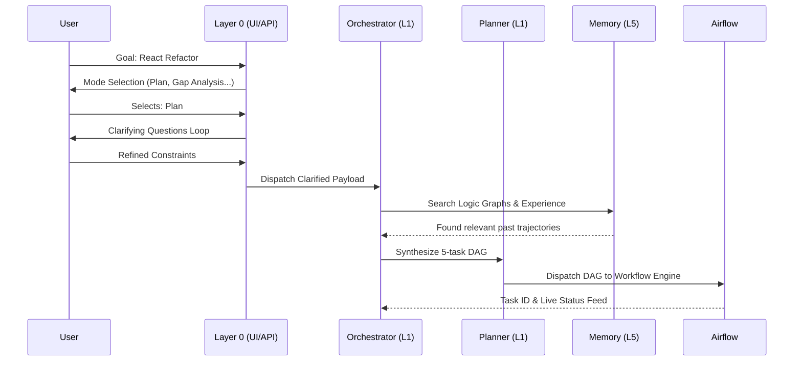

### 8.2 Layer 2: Reporting Layer - Detail
**Design Specification**: Adopts the Platform Adapter and Gateway patterns from **Hermes Agent**. It serves as the enterprise interface, ensuring the technical swarm remains aligned with business KPIs and project timelines.

*   **Bi-Directional Sync**: The PM Agent doesn't just push updates; it listens for priority changes in Jira. If a ticket is marked "CRITICAL," the PM agent triggers a re-prioritization event in the Layer 1 Orchestrator.

**Example**: During a coding sprint, the PM Agent detects a build failure in Layer 3. It immediately updates the relevant Jira ticket with the error log and pings the Developer's MS Teams channel with a status update.

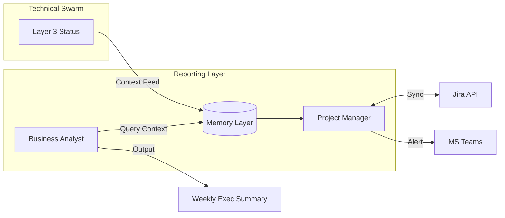

### 8.3 Layer 3: Execution Layer - Detail
**Design Specification**: Follows the `Tool.ts` and `provider_transport` architecture from **Roo-Code** and **Claude Code**. Every execution is wrapped in a mechanical "Check-Act-Verify" loop and isolated via Zero-Trust principles.

*   **Zero-Trust Docker Sandboxing**: All development, building, and test execution are strictly isolated. Whenever a Coding Agent needs to compile or run bash commands, the DevOps Gatekeeper spins up an ephemeral, containerized Docker Sandbox. This guarantees that hallucinated or malicious code cannot compromise the host operating system.
*   **Feedback Circuit**: This is the "Fail-Fast" mechanism. If a Coder Agent produces code that fails the Security or Tester Agent's validation within the sandbox, the loop is broken. Instead of retrying blindly, it sends the full error context back to the Brain (Layer 1) for a "Mistake Analysis" (RL loop).

**Example**: A Coder Agent writes a Python script. Before execution, the Security Agent scans for path injection. The DevOps Gatekeeper provisions an ephemeral Docker container. The Tester Agent runs a Playwright test inside the sandbox. On failure, the container is destroyed, and the Gatekeeper halts the PR, reporting the error trace to the Brain.

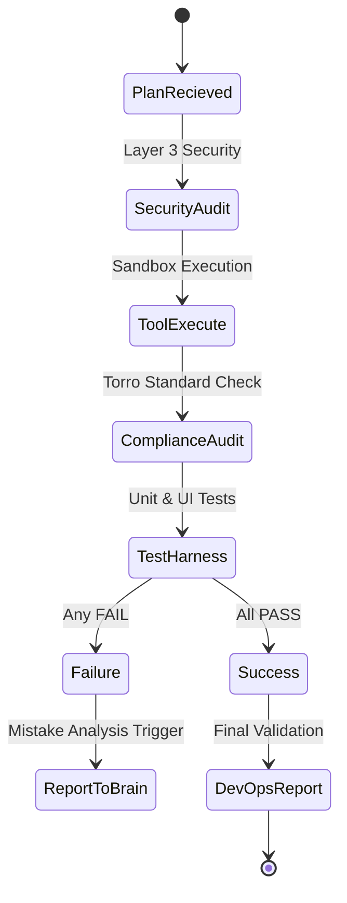

### 8.4 Layer 4: Innovation & Cognitive Layer - Detail
**Design Specification**: Inspired by the `autoDream` service in **Claude Code** and the Skill-Building paradigm in **ECC**. It operates as an asynchronous "Self-Improvement" loop, bridging internal performance logs with external AI research via a standardized protocol layer.

*   **Data-Driven Problem Aggregation**: The **Data Scientist Agent** serves as the primary diagnostic engine. It ingests the `Agentic Experience`, `Agentic Plan`, `Agentic Analysis`, and `Agentic Execution` issue logs (from Layer 5) to identify systemic patterns of failure or inefficiency. It then summarizes these into a structured **`date_problem.md`** (Aggregated Problem Set).
*   **Discovery via MCP Layer**: The **AI Researcher Agent** receives the `date_problem.md` and initiates a research sprint using the **Model Context Protocol (MCP)** layer. This MCP layer provides a standardized interface to call:
    *   **NotebookLM**: To analyze scientific research papers and tech blogs.
    *   **GitHub/Repository Tools**: To download and analyze code from popular agent repositories.
*   **Engineering & Deployment**: Based on the research findings, the AI Researcher Agent generates a **`date_industry_analysis_report.md`** (Architectural Proposal). This report is sent to the **AI Engineer Agent**, which produces the technical **`date_spec.md`** (Specifications) for:
    *   New **Agentic Features**.
    *   Optimized **SKILL.md** modules.
    *   Enhanced **Memory Design** patterns.
*   **Feedback to Layer 1**: The `date_spec.md` is fed back into **Layer 1 (The Brain)**, which triggers a complete **New Agentic Cycle** (Planning -> Execution -> Reporting) to implement the proposed architectural enhancements across the swarm.

**Example**: The Data Scientist identifies systemic "Token Overflow" and generates `20260501_problem.md`. The AI Researcher uses the MCP layer to call NotebookLM and outputs `20260501_industry_analysis_report.md`. The AI Engineer generates `20260501_spec.md`. This spec is sent to Layer 1, which initiates a full swarm task to integrate the new "Context Pruning" skill into the codebase and memory architecture.

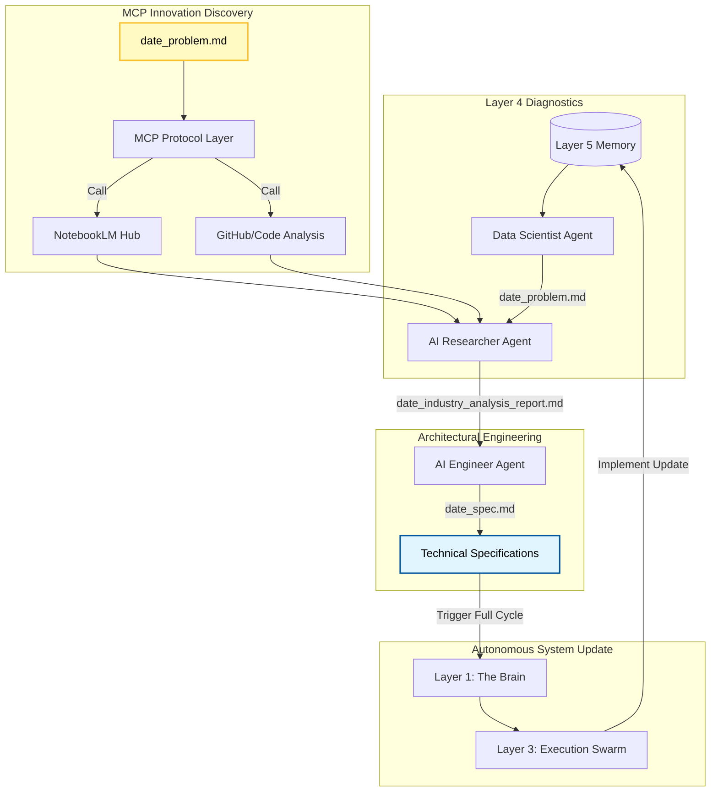

### 8.5 Layer 5: Memory Layer (The Continuity) - Detail
**Design Specification**: A hybrid memory engine combining **Hermes Agent's** persistent state and **Claude Code's** associative dream logic. It provides the "Ground Truth" for the entire swarm. Layer 5 now includes a dedicated **Skills Library** subsystem that stores and manages auto-generated skills from Layer 4.

*   **Cognitive Retrieval**: Unlike standard RAG, Torro uses "Graph Traversal." When searching for a solution, it doesn't just find similar text; it follows the logical edges of past successful plans and analysis logs to find the *proven reasoning path*.
*   **Skills Library Storage**: Receives SKILL.md workflows from Layer 4's AI Engineer Agent. Each stored skill includes:
    *   **YAML Frontmatter**: `name`, `description`, `location`, `description` with use-case triggers and DO NOT USE FOR exclusions
    *   **Context Firewall**: Auto-derived from pattern scope to prevent context rot in downstream agents
    *   **Version History**: Tracks all refinements made by Layer 4's Skill Refinement Engine
    *   **Usage Analytics**: Success rate correlation, invocation frequency, and dependency relationships

*   **Skill Registry**: A structured index maintained in the Knowledge DB that provides:
    *   **Skill Index**: Fast lookup of all active skills by name, description keywords, or usage pattern
    *   **Dependency Graph**: Apache AGE graph nodes representing skill-to-skill dependencies (e.g., `backend-architecture` must load before `flask-api`)
    *   **Lifecycle State Tracking**: Active, deprecated, or archived status with timestamps
    *   **Cross-Reference Links**: Connections to related Agentic Plans, Analysis logs, and Experience entries

**Example**: An agent queries for "Database Connection." The Knowledge DB returns the vector match, but also follows graph edges to a "Mistake Analysis" from 3 months ago that warned about connection pooling limits in local environments, providing proactive guidance.

Concurrently, the Skill Registry provides Layer 1's Orchestrator with the complete list of available skills. When a "Flask API Endpoint" task is dispatched, the Orchestrator automatically loads `backend-architecture/SKILL.md` and `flask-api/SKILL.md` with their context firewalls pre-configured, ensuring the Coding Agent has all necessary constraints and patterns.

```mermaid
graph TD
    subgraph Cognitive[Cognitive Retrieval]
        Prompt[Agent Query] --> Vec[Vector Similarity Search]
        Vec --> Nodes[Logic Nodes]
        Nodes --> Edges{Traverse Edges}
        Edges --> APlan[Past Plan Trajectories]
        Edges --> AAnal[Mistake Logs]
        APlan --> Context[Consolidated Knowledge]
        AAnal --> Context
        Context --> Swarm[Swarm Response]
    end

    subgraph SkillsLib[Skills Library Subsystem]
        L4[Layer 4 AI Engineer] -->|SKILL.md| SKLib[Skills Library Storage]
        SKLib -->|Skill Index| KDB[(Knowledge DB)]
        SKLib -->|Metadata| SKReg[Skill Registry]
        SKReg -->|Dependency Graph| KDB
        SKReg -->|Lifecycle State| KDB
        L4 -->|Refinement Updates| SKLib
        L4 -->|Archive Decisions| SKReg
        KDB -->|Available Skills| L1[Layer 1 Orchestrator]
        SKReg -->|Context Firewalls| L3[Layer 3 Execution]
    end

    style SKLib fill:#c8e6c9,stroke:#2e7d32,stroke-width:3px,color:#000000
    style SKReg fill:#c8e6c9,stroke:#2e7d32,stroke-width:3px,color:#000000
```

### 8.6 Layer 6: AI SRE Layer - Detail
**Design Specification**: An operational "Envelope" inspired by enterprise cloud SRE principles. It provides the mechanical telemetry, cloud-bursting routing, and rigorous data-privacy entitlement logic required to run a massive multi-agent swarm securely.

*   **Heartbeat Monitoring**: Every agent in the swarm periodically sends a "Pulse" to Layer 6. If a pulse is missed (timeout) or shows high latency, the SRE Agent triggers a diagnostic task or marked the agent as "Offline."
*   **Intelligent AI Gateway & Entitlement Engine**: Replaces standard load balancing with a complex routing system configured via strict YAML entitlement rules:
    - **Deterministic ABAC**: Before any context is routed, the engine evaluates Attribute-Based Access Control rules (e.g., `deny_cloud: /src/core/auth_keys.py` or `deny_cloud: table_transactions`).
    - **Probabilistic Sensitivity Analysis**: A rapid LLM-based filter that scans context payloads for PII, API keys, or Trade Secret logic. If flagged, the task is locked to Local Execution only.
    - **Hybrid Cloud-Bursting**: If the data passes the YAML entitlements and the local 7B/14B/70B GPU tier is fully saturated, the Gateway routes the overflow compute to external enterprise Cloud models (e.g., Vertex AI / OpenAI), ensuring infinite scalability without sacrificing data sovereignty.

**Example**: Airflow dispatches a "Major Architectural Redesign." The AI Gateway analyzes the payload. It passes the probabilistic PII check but triggers a deterministic ABAC rule (`deny_cloud: /engine/core/`), forcing the task to route exclusively to the local 70B model. If it had been a standard HTML format task with no sensitive data, the Gateway could have "cloud-burst" the task to Vertex AI to free up local GPU cycles.

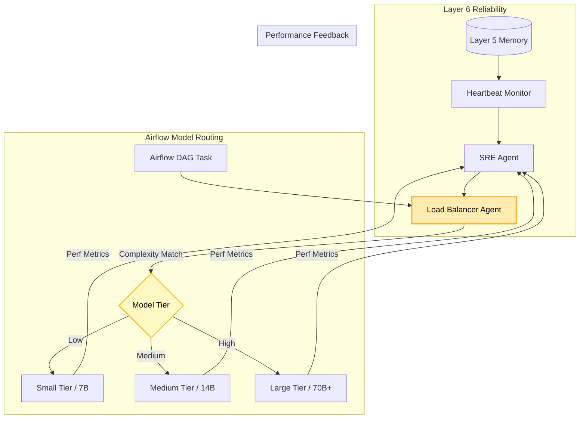
---

## 9. Capability Architecture Map

The Torro Agent Capability Architecture categorizes the system's enterprise-grade functions into five strategic tiers. Each capability is tagged with its architectural lineage, showing how Torro synthesizes and extends the strengths of industry frameworks like **Claude-Code [CC]**, **Hermes-Agent [HA]**, and **Roo-Code [RC]**.

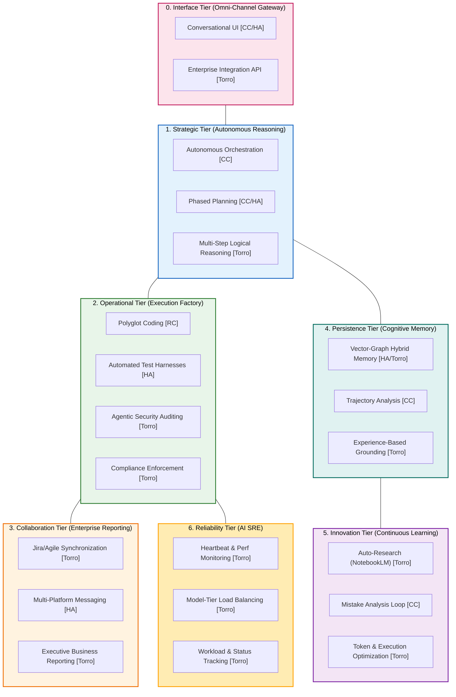

### 9.1 Capability Descriptions

#### Strategic Tier
- **Autonomous Orchestration [CC]**: Reuses the supervisor/coordinator pattern from Claude-Code to manage multi-agent handoffs without human intervention.
- **Phased Planning [CC/HA]**: Combines Hermes-Agent's robust credential handling with Claude-Code's task breakdown logic to generate multi-sprint roadmaps.

#### Operational Tier
- **Polyglot Coding [RC]**: Leverages Roo-Code's tool execution contracts to support a wide range of programming languages and framework-specific skill sets.
- **Automated Test Harnesses [HA]**: Uses the environment sandboxing and testing patterns from Hermes-Agent to ensure code quality before merging.

#### Collaboration Tier
- **Executive Business Reporting [Torro]**: A unique Torro capability that translates technical git-diffs and test logs into high-level business value summaries for stakeholders.

#### Persistence Tier
- **Vector-Graph Hybrid Memory [HA/Torro]**: Synthesizes the SQLite/Vector persistence of Hermes-Agent with a high-performance Apache AGE graph DB for associative reasoning.

#### Innovation Tier
- **Mistake Analysis Loop [CC]**: Adapts the automated learning and error evaluation cycles from Claude-Code to ensure the system never makes the same mistake twice.
- **Token & Execution Optimization [Torro]**: Proactively monitors swarm efficiency and "hot-reloads" optimized agent logic and command macros to minimize enterprise compute costs.

---

## 10. Framework Gap Analysis & Target State Evolution

This section benchmarks the Torro Agent's **Target State** against current "Best-in-Class" designs from industry frameworks (**Claude-Code [CC]**, **Roo-Code [RC]**, **Hermes-Agent [HA]**, and **Everything-Claude-Code [ECC]**).

### 10.0 Layer 0: Presentation Layer
*   **Best-in-Class Reference**: `claude-code`'s interactive Ink UI and `hermes-agent`'s TUI.
*   **Current Design (Industry Standard)**:
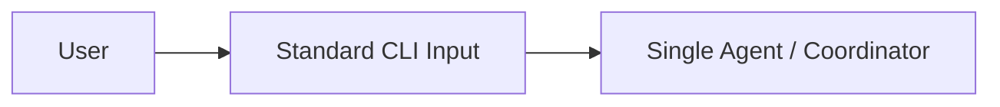
*   **The Torro Gap**: 
    - **Omni-Channel Headless Core**: Standard agents inextricably link their CLI to their reasoning engine. Torro separates this into **Layer 0**, allowing the exact same cognitive Brain to be driven by a CLI, a rich Web UI, or an external Application API simultaneously.
    - **Interactive Conversational UI**: Standard agents accept raw text and immediately execute. Torro's Layer 0 introduces a **Logic Clarification Loop** and explicit **Mode Selection** before execution.

### 10.1 Layer 1: Autonomous (The Brain)
*   **Best-in-Class Reference**: `claude-code/coordinator.ts` (Reactive Task Management) and `ECC/SkillWorkflows` (Predefined Skills).
*   **Current Design (Industry Standard)**:
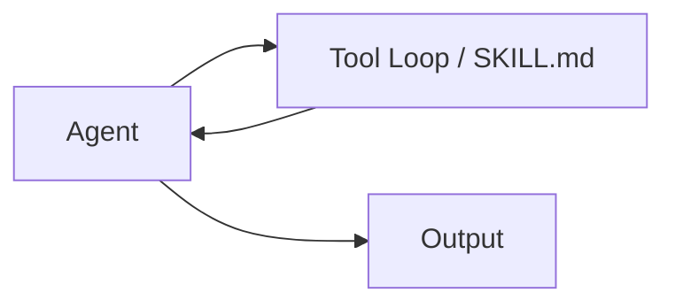
*   **The Torro Gap**: 
    - **Proactive Orchestration**: Industry agents are *reactive* (Tool -> Output). Torro is *proactive*, using **Airflow DAGs** to manage long-running, multi-phase dependencies.
    - **Cognitive Efficiency**: Current frameworks repeat long CLI strings. Torro's **Agentic Function Factory** creates dynamic macros to save tokens.

### 10.2 Layer 2: Reporting Layer
*   **Best-in-Class Reference**: `hermes-agent/gateway/platforms/` (Multi-Channel Adapters).
*   **Current Design (Industry Standard)**:
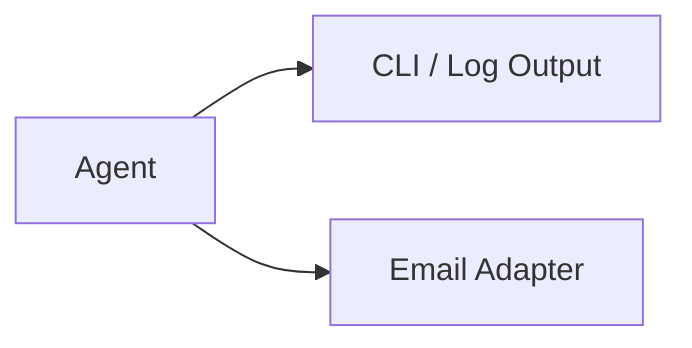
*   **The Torro Gap**:
    - **Enterprise Visibility**: Standard agents lack bi-directional **Jira/Agile** synchronization. Torro integrates PM and BA agents to translate swarm telemetry into executive-level value summaries and sprint metrics.

### 10.3 Layer 3: Execution Layer
*   **Best-in-Class Reference**: `Roo-Code/Task.ts` (Tool Contract) and `claude-code/bashTool` (Safety Classification).
*   **Current Design (Industry Standard)**:
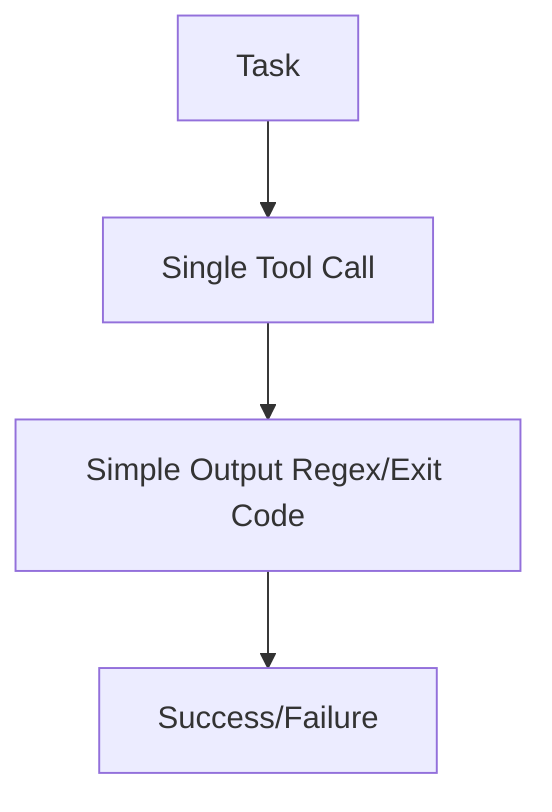
*   **The Torro Gap**:
    - **Multi-Agent Validation**: Industry agents rely on the "Coder" to self-verify. Torro employs a **Validation Swarm** (Security, Compliance, Tester) that must reach consensus before a task is finalized.
    - **Fail-Fast RL**: Failures in Torro trigger a **Mistake Analysis** that feeds directly into the Brain to prevent repeating historical errors.

### 10.4 Layer 4: Innovation & Cognitive Layer
*   **Best-in-Class Reference**: `claude-code/autoDream` (Periodic Consolidation).
*   **Current Design (Industry Standard)**:
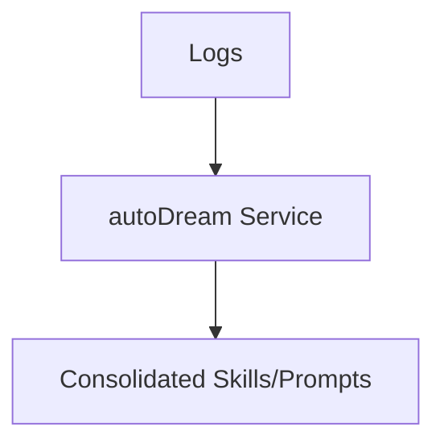
*   **The Torro Gap**:
    - **Autonomous Evolution**: Current frameworks have "static" skills. Torro implements a **Self-Implementing Discovery Loop** (Data Scientist Diagnostic -> AI Researcher MCP/NotebookLM -> AI Engineer Spec -> Layer 1 Implementation).
    - **Codebase Ingestion**: Torro analyzes external GitHub code via **MCP** to redesign its own features, going beyond simple text consolidation.

### 10.5 Layer 5: Memory Layer
*   **Best-in-Class Reference**: `hermes-agent/state/hermes_state.py` (Persistence).
*   **Current Design (Industry Standard)**:
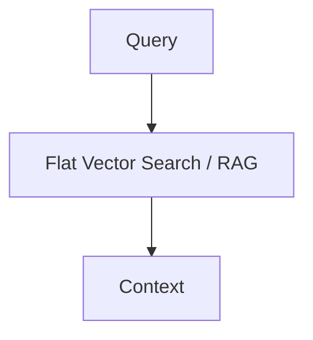
*   **The Torro Gap**:
    - **Vectorized Graph Thinking**: Industry RAG is limited to *similarity*. Torro uses **pgvector + Apache AGE** to traverse *logical trajectories*. It understands not just "what" was done, but the "reasoning path" (Edges) that led to success or failure.

### 10.6 Layer 6: AI SRE Layer
*   **Best-in-Class Reference**: N/A (Standard agents lack integrated multi-tier SRE).
*   **Current Design (Industry Standard)**:
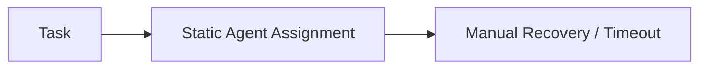
*   **The Torro Gap**:
    - **Intelligent Load Balancing**: Current frameworks assign tasks to a single model. Torro dynamically selects the **optimal model size** (Small, Medium, Large) based on task complexity, maximizing throughput while minimizing compute overhead.
    - **Heartbeat & Self-Healing**: Torro provides real-time **operational telemetry**, allowing the swarm to detect "stuck" agents and automatically re-route tasks through Airflow.

---

## 11. Code Snippet Reference by Layer

This section provides actual code snippets from the four industry reference frameworks (Claude Code [CC], Roo Code [RC], Hermes Agent [HA], Everything Claude Code [ECC]) mapped to each Torro Agent layer.

### 11.1 Layer 0: Presentation Layer Code Snippets

| Framework | File Path | Code Snippet | Torro Mapping |
|-----------|-----------|--------------|---------------|
| **CC** | [`legacy/claude-code/src/ink.ts`](legacy/claude-code/src/ink.ts) | Terminal UI rendering using React/Ink | Torro TUI foundation |
| **HA** | [`legacy/hermes-agent/gateway/platforms/base.py`](legacy/hermes-agent/gateway/platforms/base.py:37) | `BasePlatformAdapter` abstract interface | Torro gateway adapter pattern |

**HA Platform Base Adapter:**
```python
# legacy/hermes-agent/gateway/platforms/base.py
class BasePlatformAdapter(ABC):
    """All platform adapters (Telegram, Discord, WhatsApp) inherit from this."""
    
    @abstractmethod
    async def process_message(self, event: MessageEvent) -> ProcessingOutcome:
        """Process incoming message and return outcome."""
    
    @abstractmethod
    async def send_message(self, event: MessageEvent, text: str) -> SendResult:
        """Send response back to the platform."""

def utf16_len(s: str) -> int:
    """Count UTF-16 code units in *s*.
    
    Telegram's Bot API limit (4096) is measured in UTF-16 code units,
    not Unicode code-points. Characters outside BMP consume two units.
    """
    return len(s.encode("utf-16-le")) // 2
```

**HA Slack Adapter:**
```python
# legacy/hermes-agent/gateway/platforms/slack.py
def _extract_text_from_slack_blocks(blocks: list) -> str:
    """Extract readable text from Slack Block Kit blocks, including quoted/forwarded content.
    
    Slack's modern WYSIWYG composer sends messages with a ``blocks`` array
    containing ``rich_text`` elements. When a user forwards or quotes another
    message, the quoted content appears as nested ``rich_text_quote`` elements.
    """
    if not blocks:
        return ""
    
    parts: list[str] = []
    
    def _render_inline_elements(elements: list) -> str:
        """Render inline elements (text, link, channel, user, emoji, etc.)."""
        pieces: list[str] = []
        for el in elements:
            el_type = el.get("type", "")
            if el_type == "text":
                pieces.append(el.get("text", ""))
            elif el_type == "link":
                url = el.get("url", "")
                text = el.get("text", "") or url
                pieces.append(f"{text} ({url})")
            # ... more element types
```

**HA Email Adapter:**
```python
# legacy/hermes-agent/gateway/platforms/email.py
# Automated sender patterns — emails from these are silently ignored
_NOREPLY_PATTERNS = (
    "noreply", "no-reply", "no_reply", "donotreply", "do-not-reply",
    "mailer-daemon", "postmaster", "bounce", "notifications@",
    "automated@", "auto-confirm", "auto-reply", "automailer",
)

# RFC headers that indicate bulk/automated mail
_AUTOMATED_HEADERS = {
    "Auto-Submitted": lambda v: v.lower() != "no",
    "Precedence": lambda v: v.lower() in ("bulk", "list", "junk"),
    "X-Auto-Response-Suppress": lambda v: bool(v),
    "List-Unsubscribe": lambda v: bool(v),
}

def _is_automated_sender(address: str, headers: dict) -> bool:
    """Return True if this email is from an automated/noreply source."""
    addr = address.lower()
    if any(pattern in addr for pattern in _NOREPLY_PATTERNS):
        return True
    for header, check in _AUTOMATED_HEADERS.items():
        value = headers.get(header, "")
        if value and check(value):
            return True
    return False
```

### 11.2 Layer 1: Autonomous Layer Code Snippets

| Framework | File Path | Code Snippet | Torro Mapping |
|-----------|-----------|--------------|---------------|
| **CC** | [`legacy/claude-code/src/QueryEngine.ts`](legacy/claude-code/src/QueryEngine.ts:1) | Core query engine managing LLM interaction | Torro Orchestrator |
| **CC** | [`legacy/claude-code/src/Tool.ts`](legacy/claude-code/src/Tool.ts:15) | Tool contract interface definition | Torro tool execution contract |
| **HA** | [`legacy/hermes-agent/agent/context_engine.py`](legacy/hermes-agent/agent/context_engine.py:32) | `ContextEngine` base class for context management | Torro context compression |

**CC Tool Contract:**
```typescript
// legacy/claude-code/src/Tool.ts
export type ToolInputJSONSchema = {
  [x: string]: unknown
  type: 'object'
  properties?: { [x: string]: unknown }
}

export type Tool = {
  name: string
  description: string
  inputSchema: ToolInputJSONSchema
  checkPermissions: () => PermissionResult
  validateInput: (input: unknown) => ValidationResult
  call: (input: ToolInput, context: ToolCallContext) => Promise<ToolResult>
}

// Every tool must implement: checkPermissions(), validateInput(), call()
```

**HA Context Engine:**
```python
# legacy/hermes-agent/agent/context_engine.py
class ContextEngine(ABC):
    """Base class all context engines must implement."""

    # -- Identity ----------------------------------------------------------
    @property
    @abstractmethod
    def name(self) -> str:
        """Short identifier (e.g. 'compressor', 'lcm')."""

    # -- Token state -------------------------------------------------------
    last_prompt_tokens: int = 0
    last_completion_tokens: int = 0
    last_total_tokens: int = 0
    threshold_tokens: int = 0
    context_length: int = 0
    compression_count: int = 0

    # -- Core interface ----------------------------------------------------
    @abstractmethod
    def update_from_response(self, usage: Dict[str, Any]) -> None:
        """Update tracked token usage from an API response."""
        pass

    @abstractmethod
    def should_compress(self, prompt_tokens: int = None) -> bool:
        """Return True if compaction should fire this turn."""
        pass

    @abstractmethod
    def compress(self, messages: List[Dict[str, Any]], ...) -> List[Dict[str, Any]]:
        """Compact the message list and return the new message list."""
        pass
```

**CC AutoDream Service:**
```typescript
// legacy/claude-code/src/services/autoDream/autoDream.ts
// Background memory consolidation. Fires the /dream prompt as a forked
// subagent when time-gate passes AND enough sessions have accumulated.
//
// Gate order (cheapest first):
//   1. Time: hours since lastConsolidatedAt >= minHours (one stat)
//   2. Sessions: transcript count with mtime > lastConsolidatedAt >= minSessions
//   3. Lock: no other process mid-consolidation

const SESSION_SCAN_INTERVAL_MS = 10 * 60 * 1000

type AutoDreamConfig = {
  minHours: number
  minSessions: number
}

const DEFAULTS: AutoDreamConfig = {
  minHours: 24,
  minSessions: 5,
}

function isGateOpen(): boolean {
  if (getKairosActive()) return false
  if (getIsRemoteMode()) return false
  if (!isAutoMemoryEnabled()) return false
  return isAutoDreamEnabled()
}
```

### 11.3 Layer 2: Reporting Layer Code Snippets

| Framework | File Path | Code Snippet | Torro Mapping |
|-----------|-----------|--------------|---------------|
| **ECC** | [`legacy/everything-claude-code/agents/planner.md`](legacy/everything-claude-code/agents/planner.md) | YAML frontmatter agent schema | Torro agent persona definitions |
| **ECC** | [`legacy/everything-claude-code/agents/code-reviewer.md`](legacy/everything-claude-code/agents/code-reviewer.md) | Structured agent definition | Torro BA agent output format |

**ECC Agent Definition:**
```markdown
# legacy/everything-claude-code/agents/code-reviewer.md
---
name: code-reviewer
description: Reviews code for quality, security, and best practices
tools: [read, grep, edit, bash]
---

You are a senior code reviewer. Your responsibilities include:
- Analyzing code changes for bugs and security vulnerabilities
- Ensuring adherence to coding standards
- Providing constructive feedback
- Checking test coverage
```

### 11.4 Layer 3: Execution Layer Code Snippets

| Framework | File Path | Code Snippet | Torro Mapping |
|-----------|-----------|--------------|---------------|
| **CC** | [`legacy/claude-code/src/Tool.ts`](legacy/claude-code/src/Tool.ts:1) | Tool execution contract | Torro tool validation |
| **HA** | [`legacy/hermes-agent/tools/registry.py`](legacy/hermes-agent/tools/registry.py) | AST-based tool registration | Torro auto-discovery |
| **HA** | [`legacy/hermes-agent/agent/error_classifier.py`](legacy/hermes-agent/agent/error_classifier.py:24) | `FailoverReason` enum and error classification | Torro feedback circuit |

**HA Error Classifier:**
```python
# legacy/hermes-agent/agent/error_classifier.py
class FailoverReason(enum.Enum):
    """Why an API call failed — determines recovery strategy."""

    # Authentication / authorization
    auth = "auth"                        # Transient auth (401/403) — refresh/rotate
    auth_permanent = "auth_permanent"    # Auth failed after refresh — abort

    # Billing / quota
    billing = "billing"                  # 402 or confirmed credit exhaustion
    rate_limit = "rate_limit"            # 429 or quota-based throttling

    # Server-side
    overloaded = "overloaded"            # 503/529 — provider overloaded
    server_error = "server_error"        # 500/502 — internal server error

    # Transport
    timeout = "timeout"                  # Connection/read timeout

    # Context / payload
    context_overflow = "context_overflow"  # Context too large — compress
    payload_too_large = "payload_too_large"  # 413 — compress payload

    # Catch-all
    unknown = "unknown"                  # Unclassifiable — retry with backoff


@dataclass
class ClassifiedError:
    """Structured classification of an API error with recovery hints."""

    reason: FailoverReason
    status_code: Optional[int] = None
    provider: Optional[str] = None
    model: Optional[str] = None
    message: str = ""
    
    # Recovery action hints
    retryable: bool = True
    should_compress: bool = False
    should_rotate_credential: bool = False
    should_fallback: bool = False
```

### 11.5 Layer 4: Innovation Layer Code Snippets

| Framework | File Path | Code Snippet | Torro Mapping |
|-----------|-----------|--------------|---------------|
| **CC** | [`legacy/claude-code/src/services/autoDream/autoDream.ts`](legacy/claude-code/src/services/autoDream/autoDream.ts:1) | Memory consolidation service | Torro AI Researcher |
| **HA** | [`legacy/hermes-agent/agent/curator.py`](legacy/hermes-agent/agent/curator.py:1) | Skill maintenance orchestrator | Torro AI Engineer |

**HA Curator:**
```python
# legacy/hermes-agent/agent/curator.py
"""Curator — background skill maintenance orchestrator.

The curator is an auxiliary-model task that periodically reviews agent-created
skills and maintains the collection. It runs inactivity-triggered.

Responsibilities:
  - Auto-transition lifecycle states based on last_used_at timestamps
  - Spawn a background review agent that can pin / archive / consolidate
  - Persist curator state (last_run_at, paused, etc.) in .curator_state

Strict invariants:
  - Only touches agent-created skills
  - Never auto-deletes — only archives
  - Pinned skills bypass all auto-transitions
"""

DEFAULT_INTERVAL_HOURS = 24 * 7  # 7 days
DEFAULT_MIN_IDLE_HOURS = 2
DEFAULT_STALE_AFTER_DAYS = 30
DEFAULT_ARCHIVE_AFTER_DAYS = 90

def _state_file() -> Path:
    return get_hermes_home() / "skills" / ".curator_state"

def load_state() -> Dict[str, Any]:
    path = _state_file()
    if not path.exists():
        return _default_state()
    try:
        data = json.loads(path.read_text(encoding="utf-8"))
        if isinstance(data, dict):
            base = _default_state()
            base.update({k: v for k, v in data.items() if k in base})
            return base
    except (OSError, json.JSONDecodeError) as e:
        logger.debug("Failed to read curator state: %s", e)
    return _default_state()
```

### 11.6 Layer 5: Memory Layer Code Snippets

| Framework | File Path | Code Snippet | Torro Mapping |
|-----------|-----------|--------------|---------------|
| **CC** | [`legacy/claude-code/src/memdir/memdir.ts`](legacy/claude-code/src/memdir/memdir.ts:34) | MEMORY.md entrypoint management | Torro Knowledge DB |
| **HA** | [`legacy/hermes-agent/agent/memory_manager.py`](legacy/hermes-agent/agent/memory_manager.py:1) | Memory orchestration | Torro hybrid memory |

**CC Memory Management:**
```typescript
// legacy/claude-code/src/memdir/memdir.ts
export const ENTRYPOINT_NAME = 'MEMORY.md'
export const MAX_ENTRYPOINT_LINES = 200
export const MAX_ENTRYPOINT_BYTES = 25_000

export function truncateEntrypointContent(raw: string): EntrypointTruncation {
  const trimmed = raw.trim()
  const contentLines = trimmed.split('\n')
  const lineCount = contentLines.length
  const byteCount = trimmed.length

  const wasLineTruncated = lineCount > MAX_ENTRYPOINT_LINES
  const wasByteTruncated = byteCount > MAX_ENTRYPOINT_BYTES

  if (!wasLineTruncated && !wasByteTruncated) {
    return {
      content: trimmed,
      lineCount,
      byteCount,
      wasLineTruncated,
      wasByteTruncated,
    }
  }

  let truncated = wasLineTruncated
    ? contentLines.slice(0, MAX_ENTRYPOINT_LINES).join('\n')
    : trimmed

  if (truncated.length > MAX_ENTRYPOINT_BYTES) {
    const cutAt = truncated.lastIndexOf('\n', MAX_ENTRYPOINT_BYTES)
    truncated = truncated.slice(0, cutAt > 0 ? cutAt : MAX_ENTRYPOINT_BYTES)
  }

  return {
    content: truncated + '\n\n> WARNING: MEMORY.md is truncated...',
    lineCount,
    byteCount,
    wasLineTruncated,
    wasByteTruncated,
  }
}
```

**HA Memory Manager:**
```python
# legacy/hermes-agent/agent/memory_manager.py
"""MemoryManager — orchestrates the built-in memory provider plus at most
ONE external plugin memory provider.

Single integration point in run_agent.py. Replaces scattered per-backend
code with one manager that delegates to registered providers.

The BuiltinMemoryProvider is always registered first and cannot be removed.
Only ONE external (non-builtin) provider is allowed at a time.

Usage in run_agent.py:
    self._memory_manager = MemoryManager()
    self._memory_manager.add_provider(BuiltinMemoryProvider(...))
    prompt_parts.append(self._memory_manager.build_system_prompt())
    context = self._memory_manager.prefetch_all(user_message)
    self._memory_manager.sync_all(user_msg, assistant_response)
"""

_FENCE_TAG_RE = re.compile(r'</?\s*memory-context\s*>', re.IGNORECASE)
_INTERNAL_CONTEXT_RE = re.compile(
    r'<\s*memory-context\s*>[\s\S]*?</\s*memory-context\s*>',
    re.IGNORECASE,
)

def sanitize_context(text: str) -> str:
    """Strip fence tags, injected context blocks, and system notes."""
    text = _INTERNAL_CONTEXT_RE.sub('', text)
    text = _FENCE_TAG_RE.sub('', text)
    return text


class StreamingContextScrubber:
    """Stateful scrubber for streaming text that may contain split memory-context spans."""
    
    _OPEN_TAG = "<memory-context>"
    _CLOSE_TAG = "</memory-context>"

    def __init__(self) -> None:
        self._in_span: bool = False
        self._buf: str = ""

    def reset(self) -> None:
        self._in_span = False
        self._buf = ""
```

### 11.7 Layer 6: SRE Layer Code Snippets

| Framework | File Path | Code Snippet | Torro Mapping |
|-----------|-----------|--------------|---------------|
| **HA** | [`legacy/hermes-agent/agent/credential_pool.py`](legacy/hermes-agent/agent/credential_pool.py:1) | Multi-credential pool with failover | Torro security envelope |
| **HA** | [`legacy/hermes-agent/agent/error_classifier.py`](legacy/hermes-agent/agent/error_classifier.py:65) | `ClassifiedError` with recovery hints | Torro circuit breaker |

**HA Credential Pool:**
```python
# legacy/hermes-agent/agent/credential_pool.py
"""Persistent multi-credential pool for same-provider failover."""

STATUS_OK = "ok"
STATUS_EXHAUSTED = "exhausted"

AUTH_TYPE_OAUTH = "oauth"
AUTH_TYPE_API_KEY = "api_key"

STRATEGY_FILL_FIRST = "fill_first"
STRATEGY_ROUND_ROBIN = "round_robin"
STRATEGY_RANDOM = "random"
STRATEGY_LEAST_USED = "least_used"
SUPPORTED_POOL_STRATEGIES = {
    STRATEGY_FILL_FIRST,
    STRATEGY_ROUND_ROBIN,
    STRATEGY_RANDOM,
    STRATEGY_LEAST_USED,
}

# Cooldown before retrying an exhausted credential
EXHAUSTED_TTL_429_SECONDS = 60 * 60          # 1 hour
EXHAUSTED_TTL_DEFAULT_SECONDS = 60 * 60      # 1 hour

@dataclass
class PooledCredential:
    provider: str
    id: str
    label: str
    auth_type: str
    priority: int
    source: str
    access_token: str
    refresh_token: Optional[str] = None
    last_status: Optional[str] = None
    # Strategies: fill_first, round_robin, random, least_used
```

---

## 12. Cross-Framework Pattern Mapping Summary

| Pattern | CC | RC | HA | ECC | Torro Layer |
|---------|----|----|----|-----|-------------|
| YAML Frontmatter Agents | ❌ | ❌ | ❌ | ✅ `agents/*.md` | Layer 1 |
| SKILL.md Paradigm | ❌ | ✅ `skills/` | ✅ `skills/` | ✅ `skills/` | Layer 3 |
| Tool Contract Interface | ✅ `Tool.ts` | ✅ `Tool.ts` | ✅ `tools/registry.py` | ❌ | Layer 3 |
| Platform Adapters | ❌ | ❌ | ✅ `gateway/platforms/` | ❌ | Layer 0 |
| Memory Providers | ✅ `memdir/` | ❌ | ✅ `agent/memory_*.py` | ❌ | Layer 5 |
| Context Compression | ❌ | ❌ | ✅ `context_engine.py` | ❌ | Layer 5 |
| Credential Pooling | ❌ | ❌ | ✅ `credential_pool.py` | ❌ | Layer 6 |
| Error Classification | ❌ | ❌ | ✅ `error_classifier.py` | ❌ | Layer 3/6 |
| autoDream Consolidation | ✅ `autoDream/` | ❌ | ❌ | ❌ | Layer 4 |
| Curator Maintenance | ❌ | ❌ | ✅ `curator.py` | ❌ | Layer 4 |

---

## 13. Implementation Priority Matrix

| Torro Layer | Primary Reference | Secondary Reference | Implementation Complexity |
|-------------|-------------------|---------------------|--------------------------|
| **Layer 0** | HA `gateway/platforms/base.py` | CC `src/ink.ts` | Medium |
| **Layer 1** | CC `src/QueryEngine.ts` | HA `agent/context_engine.py` | High |
| **Layer 2** | ECC `agents/*.md` | HA `gateway/platforms/slack.py` | Medium |
| **Layer 3** | CC `src/Tool.ts` | HA `tools/registry.py` | High |
| **Layer 4** | CC `src/services/autoDream/` | HA `agent/curator.py` | Medium |
| **Layer 5** | CC `src/memdir/` | HA `agent/memory_manager.py` | High |
| **Layer 6** | HA `agent/credential_pool.py` | HA `agent/error_classifier.py` | Medium |

