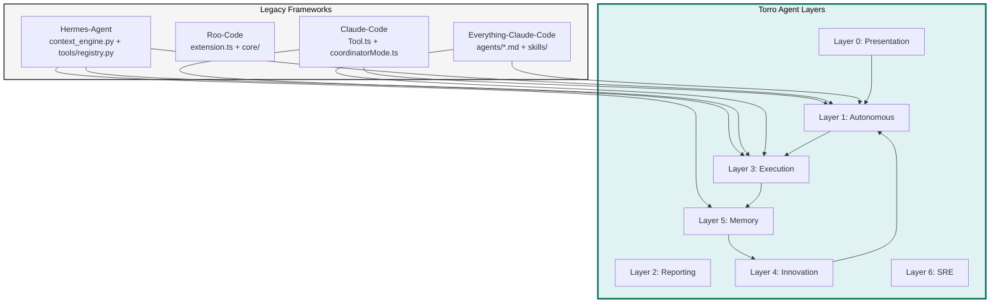

# Torro Legacy Integration Plan

## Objective

Integrate proven design patterns from Claude-Code, Roo-Code, Hermes-Agent, and Everything-Claude-Code into the Torro Agent Enterprise Architecture. This plan decomposes the integration into command-level atomic tasks with Jira-style tracking.

## Constraints

- Max context per task: 128k tokens
- Max execution time per task: 10 minutes
- Max files per task: 5 files
- Anti-hallucination: All tasks must specify exact commands and line numbers

## Architecture Diagram



## Tasks (DAG)

### Phase 1: Tool Contract Implementation
- **Token Budget:** 1M
- **Entry Criteria:** Gap analysis document reviewed and approved
- **Exit Criteria:** Tool abstract base class implemented with passing tests

### Task 1: Create Tool Abstract Base Class
- [ ] Status: Pending
- **Objective:** Create `engine/tools/base.py` with Tool ABC following Claude-Code Tool.ts pattern
- **Input Contract:**
  - Read: `agentic/analysis/20260501_182000_legacy_architecture_gap_analysis.md` (lines 305-340)
  - Read: `legacy/claude-code/src/Tool.ts` (lines 15-50)
- **Output Contract:**
  - Create: `engine/tools/base.py` (~120 lines)
  - Create: `engine/tools/__init__.py` (~30 lines)
- **Exact Commands:**
  ```bash
  # Step 1: Create tools directory
  mkdir -p engine/tools

  # Step 2: Create base.py
  touch engine/tools/base.py

  # Step 3: Run verification
  python3 -c "from engine.tools.base import Tool; print('Tool ABC imported successfully')"
  ```
- **Expected Output:** "Tool ABC imported successfully"
- **Fallback Path:** If import fails, check for syntax errors with `python3 -m py_compile engine/tools/base.py`
- **Dependencies:** None
- **Estimated Time:** 8 minutes
- **Context Firewall:**
  - Required: gap analysis document, Claude-Code Tool.ts reference
  - Excluded: legacy/hermes-agent/, legacy/Roo-Code/

### Task 2: Create PermissionResult and ValidationResult Classes
- [ ] Status: Pending
- **Objective:** Create `engine/tools/types.py` with permission and validation types
- **Input Contract:**
  - Read: `legacy/claude-code/src/Tool.ts` (lines 95-100 for ValidationResult)
  - Read: `engine/tools/base.py` (lines 1-50 for type references)
- **Output Contract:**
  - Create: `engine/tools/types.py` (~60 lines)
- **Exact Commands:**
  ```bash
  # Step 1: Create types file
  touch engine/tools/types.py

  # Step 2: Run verification
  python3 -c "from engine.tools.types import PermissionResult, ValidationResult; print('Types imported successfully')"
  ```
- **Expected Output:** "Types imported successfully"
- **Fallback Path:** If import fails, verify dataclass decorators are correct
- **Dependencies:** Task 1
- **Estimated Time:** 5 minutes
- **Context Firewall:**
  - Required: Claude-Code Tool.ts reference
  - Excluded: All other legacy directories

### Phase 2: Tool Registry Implementation
- **Token Budget:** 1M
- **Entry Criteria:** Phase 1 complete (Tool ABC implemented)
- **Exit Criteria:** Tool registry with AST-based discovery functional

### Task 3: Create Tool Registry Class
- [ ] Status: Pending
- **Objective:** Create `engine/tools/registry.py` following Hermes-Agent pattern
- **Input Contract:**
  - Read: `legacy/hermes-agent/tools/registry.py` (lines 143-250 for ToolRegistry class)
  - Read: `engine/tools/base.py` (complete file)
  - Read: `engine/tools/types.py` (complete file)
- **Output Contract:**
  - Create: `engine/tools/registry.py` (~200 lines)
- **Exact Commands:**
  ```bash
  # Step 1: Create registry file
  touch engine/tools/registry.py

  # Step 2: Run verification
  python3 -c "from engine.tools.registry import ToolRegistry; r = ToolRegistry(); print('Registry created:', len(r.tools))"
  ```
- **Expected Output:** "Registry created: 0"
- **Fallback Path:** If import fails, check circular import issues
- **Dependencies:** Task 1, Task 2
- **Estimated Time:** 10 minutes
- **Context Firewall:**
  - Required: Hermes-Agent registry.py reference, Tool ABC
  - Excluded: legacy/Roo-Code/, legacy/everything-claude-code/

### Task 4: Implement AST-based Tool Discovery
- [ ] Status: Pending
- **Objective:** Add `discover_tools()` function to registry using AST parsing
- **Input Contract:**
  - Read: `legacy/hermes-agent/tools/registry.py` (lines 57-75 for discover_builtin_tools)
  - Read: `engine/tools/registry.py` (lines 1-100)
- **Output Contract:**
  - Modify: `engine/tools/registry.py` (add discover_tools function at line 180)
- **Exact Commands:**
  ```bash
  # Step 1: Run discovery verification
  python3 -c "from engine.tools.registry import discover_tools; tools = discover_tools('engine/tools'); print('Discovered:', tools)"
  ```
- **Expected Output:** List of discovered tool modules
- **Fallback Path:** If discovery fails, verify AST parsing logic
- **Dependencies:** Task 3
- **Estimated Time:** 8 minutes
- **Context Firewall:**
  - Required: Hermes-Agent registry.py reference
  - Excluded: All legacy directories

### Phase 3: Context Engine Implementation
- **Token Budget:** 1M
- **Entry Criteria:** Phase 2 complete (Tool registry functional)
- **Exit Criteria:** ContextEngine ABC implemented with compression capability

### Task 5: Create ContextEngine Abstract Base Class
- [ ] Status: Pending
- **Objective:** Create `engine/context/base.py` following Hermes-Agent context_engine.py
- **Input Contract:**
  - Read: `legacy/hermes-agent/agent/context_engine.py` (lines 32-100)
  - Read: `agentic/analysis/20260501_182000_legacy_architecture_gap_analysis.md` (lines 340-360)
- **Output Contract:**
  - Create: `engine/context/base.py` (~100 lines)
- **Exact Commands:**
  ```bash
  # Step 1: Create context directory
  mkdir -p engine/context

  # Step 2: Create base.py
  touch engine/context/base.py

  # Step 3: Run verification
  python3 -c "from engine.context.base import ContextEngine; print('ContextEngine ABC imported')"
  ```
- **Expected Output:** "ContextEngine ABC imported"
- **Fallback Path:** If import fails, verify ABC import and abstract methods
- **Dependencies:** Task 1
- **Estimated Time:** 7 minutes
- **Context Firewall:**
  - Required: Hermes-Agent context_engine.py reference
  - Excluded: legacy/claude-code/, legacy/Roo-Code/

### Task 6: Create ContextCompressor Implementation
- [ ] Status: Pending
- **Objective:** Create `engine/context/compressor.py` implementing ContextEngine
- **Input Contract:**
  - Read: `legacy/hermes-agent/agent/context_compressor.py` (if exists)
  - Read: `engine/context/base.py` (complete file)
- **Output Contract:**
  - Create: `engine/context/compressor.py` (~150 lines)
- **Exact Commands:**
  ```bash
  # Step 1: Create compressor file
  touch engine/context/compressor.py

  # Step 2: Run verification
  python3 -c "from engine.context.compressor import ContextCompressor; c = ContextCompressor(); print('Compressor created')"
  ```
- **Expected Output:** "Compressor created"
- **Fallback Path:** If instantiation fails, verify all abstract methods implemented
- **Dependencies:** Task 5
- **Estimated Time:** 9 minutes
- **Context Firewall:**
  - Required: Hermes-Agent context_engine.py, ContextEngine ABC
  - Excluded: All other legacy directories

### Phase 4: Memory Manager Implementation
- **Token Budget:** 1M
- **Entry Criteria:** Phase 3 complete (ContextEngine functional)
- **Exit Criteria:** MemoryManager orchestrating Vector + Graph providers

### Task 7: Create MemoryManager Class
- [ ] Status: Pending
- **Objective:** Create `engine/memory/manager.py` following Hermes-Agent memory_manager.py
- **Input Contract:**
  - Read: `legacy/hermes-agent/agent/memory_manager.py` (lines 1-100)
  - Read: `agentic/analysis/20260501_182000_legacy_architecture_gap_analysis.md` (lines 360-380)
- **Output Contract:**
  - Create: `engine/memory/manager.py` (~200 lines)
  - Create: `engine/memory/__init__.py` (~30 lines)
- **Exact Commands:**
  ```bash
  # Step 1: Create memory directory
  mkdir -p engine/memory

  # Step 2: Create manager.py
  touch engine/memory/manager.py

  # Step 3: Run verification
  python3 -c "from engine.memory.manager import MemoryManager; m = MemoryManager(); print('MemoryManager created')"
  ```
- **Expected Output:** "MemoryManager created"
- **Fallback Path:** If import fails, check for missing dependencies
- **Dependencies:** Task 5
- **Estimated Time:** 10 minutes
- **Context Firewall:**
  - Required: Hermes-Agent memory_manager.py reference
  - Excluded: legacy/claude-code/, legacy/Roo-Code/

### Task 8: Create MemoryProvider Abstract Base
- [ ] Status: Pending
- **Objective:** Create `engine/memory/provider.py` with MemoryProvider ABC
- **Input Contract:**
  - Read: `legacy/hermes-agent/agent/memory_provider.py` (lines 1-80)
  - Read: `engine/memory/manager.py` (lines 1-50)
- **Output Contract:**
  - Create: `engine/memory/provider.py` (~100 lines)
- **Exact Commands:**
  ```bash
  # Step 1: Create provider file
  touch engine/memory/provider.py

  # Step 2: Run verification
  python3 -c "from engine.memory.provider import MemoryProvider; print('MemoryProvider ABC imported')"
  ```
- **Expected Output:** "MemoryProvider ABC imported"
- **Fallback Path:** If import fails, verify ABC decorators
- **Dependencies:** Task 7
- **Estimated Time:** 6 minutes
- **Context Firewall:**
  - Required: Hermes-Agent memory_provider.py reference
  - Excluded: All other legacy directories

## Verification Commands

After all phases complete, run:

```bash
# Full integration test
python3 -c "
from engine.tools.base import Tool
from engine.tools.registry import ToolRegistry
from engine.context.base import ContextEngine
from engine.memory.manager import MemoryManager

print('=== Torro Legacy Integration Complete ===')
print('Tool ABC: OK')
print('Tool Registry: OK')
print('ContextEngine ABC: OK')
print('MemoryManager: OK')
"
```

## Acceptance Criteria

- [ ] All 8 tasks completed
- [ ] All verification commands pass
- [ ] No circular import errors
- [ ] All abstract methods implemented
- [ ] Code follows Torro coding standards (FN: prefixes, type hints)

## Change Log

| Date | Change | Author |
|------|--------|--------|
| 2026-05-01 | Initial plan created | Agentic Planner |
