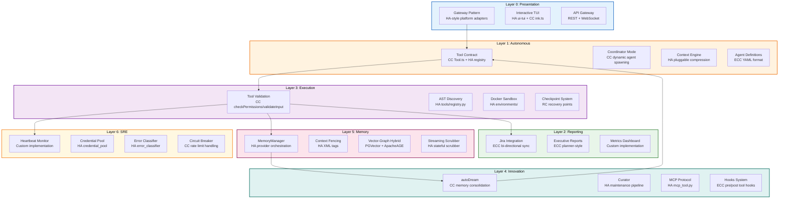

# Torro Agent Consolidated Execution Plan

## Executive Summary

This consolidated execution plan integrates proven design patterns from four industry-leading AI agent frameworks:

1. **Claude-Code** (CC) - Multi-agent coordination, memory consolidation, Tool contract pattern
2. **Roo-Code** (RC) - VSCode extension architecture, task lifecycle management, checkpoint system
3. **Hermes-Agent** (HA) - Gateway pattern, AST-based tool registry, pluggable context engine, memory provider orchestration
4. **Everything-Claude-Code** (ECC) - YAML agent definitions, skills system, hooks architecture

This plan supersedes [`agentic/plan/20260501_184500_torro_detailed_execution_plan.md`](agentic/plan/20260501_184500_torro_detailed_execution_plan.md) and incorporates all features from the legacy analysis in [`agentic/analysis/20260501_182000_legacy_architecture_gap_analysis.md`](agentic/analysis/20260501_182000_legacy_architecture_gap_analysis.md).

## Architecture Overview



## Features Gap Analysis Matrix

| Feature | Claude-Code | Roo-Code | Hermes-Agent | ECC | Torro Gap | Priority |
|---------|-------------|----------|---------------|-----|-----------|----------|
| **Tool Contract** | ✅ Tool.ts interface | ⚠️ Partial | ✅ registry.py | ✅ YAML declarations | Implement ABC + registry | P0 |
| **Dynamic Agent Spawning** | ✅ AgentTool + coordinator | ❌ | ❌ | ✅ agent.yaml | Implement coordinator mode | P0 |
| **Context Compression** | ✅ autoDream triggers | ✅ condense/ | ✅ ContextEngine ABC | ❌ | Pluggable engine | P0 |
| **Memory Consolidation** | ✅ autoDream.ts | ⚠️ SessionMemory | ✅ MemoryManager | ✅ MEMORY.md | Hybrid Vector-Graph | P0 |
| **Tool Discovery** | ❌ | ❌ | ✅ AST-based | ✅ Skills system | AST + YAML hybrid | P1 |
| **Checkpoint System** | ❌ | ✅ checkpoints/ | ❌ | ❌ | RC-style recovery | P1 |
| **Gateway Pattern** | ❌ | ❌ | ✅ platforms/ | ❌ | Multi-platform adapters | P1 |
| **Skills System** | ❌ | ❌ | ✅ skills/ | ✅ 182+ skills | ECC-style catalog | P1 |
| **Hooks System** | ❌ | ❌ | ❌ | ✅ pre/post hooks | ECC hooks architecture | P2 |
| **Error Classification** | ❌ | ❌ | ✅ error_classifier | ❌ | HA-style classifier | P2 |
| **Credential Pool** | ❌ | ❌ | ✅ credential_pool | ❌ | HA credential management | P2 |
| **TUI Implementation** | ✅ ink.ts | ✅ VSCode ext | ✅ ui-tui | ❌ | Hybrid TUI | P2 |

## Consolidated Folder Structure (Apache-Compliant)

```
torro-agent/
├── .github/                    # GitHub workflows, issue templates
├── .asf.yaml                   # Apache Foundation config (REQUIRED)
├── LICENSE                     # Apache 2.0 License
├── NOTICE                      # Apache NOTICE file (REQUIRED)
├── README.md                   # Project overview
├── CONTRIBUTING.md             # Contribution guidelines
├── CODE_OF_CONDUCT.md          # Code of conduct
├── SECURITY.md                 # Security policy
├── CHANGELOG.md                # Version history
├── pyproject.toml              # Python build configuration
├── requirements.txt            # Dependencies
├── docker-compose.yml          # Local development environment
├── Dockerfile                  # Container build instructions
│
├── src/torro/                  # Source code (NOT engine/)
│   ├── __init__.py
│   ├── version.py
│   ├── cli.py                  # Command-line interface
│   ├── config.py               # Configuration management
│   │
│   ├── gateway/                # Layer 0: Platform adapters
│   │   ├── __init__.py
│   │   ├── base.py             # BasePlatformAdapter ABC
│   │   ├── registry.py         # Platform registry
│   │   └── platforms/          # Platform implementations
│   │       ├── telegram.py
│   │       ├── discord.py
│   │       ├── slack.py
│   │       └── api_server.py
│   │
│   ├── tools/                  # Layer 1 & 3: Tool system
│   │   ├── __init__.py
│   │   ├── base.py             # Tool ABC (CC pattern)
│   │   ├── registry.py         # AST-based discovery (HA pattern)
│   │   ├── types.py            # PermissionResult, ValidationResult
│   │   ├── builtin/            # Built-in tools
│   │   │   ├── bash.py
│   │   │   └── file_ops.py
│   │   └── environments/       # Docker sandboxing
│   │       ├── base.py
│   │       └── docker.py
│   │
│   ├── coordinator/            # Layer 1: Agent coordination
│   │   ├── __init__.py
│   │   ├── mode.py             # Coordinator mode logic
│   │   ├── agent_spawner.py    # Dynamic agent spawning
│   │   └── worker.py           # Worker agent implementation
│   │
│   ├── context/                # Layer 1: Context management
│   │   ├── __init__.py
│   │   ├── base.py             # ContextEngine ABC (HA pattern)
│   │   ├── compressor.py       # Built-in compressor
│   │   └── engines/            # Pluggable engines
│   │       ├── builtin.py
│   │       └── lcm.py
│   │
│   ├── memory/                 # Layer 5: Memory orchestration
│   │   ├── __init__.py
│   │   ├── manager.py          # MemoryManager (HA pattern)
│   │   ├── provider.py         # MemoryProvider ABC
│   │   ├── scrubber.py         # StreamingContextScrubber
│   │   └── providers/          # Provider implementations
│   │       ├── builtin.py
│   │       ├── vector.py
│   │       └── graph.py
│   │
│   ├── innovation/             # Layer 4: Innovation
│   │   ├── __init__.py
│   │   ├── auto_dream.py       # CC autoDream pattern
│   │   ├── curator.py          # HA curator pattern
│   │   └── hooks/              # ECC hooks system
│   │       ├── __init__.py
│   │       ├── pre_tool.py
│   │       └── post_tool.py
│   │
│   ├── reporting/              # Layer 2: Reporting
│   │   ├── __init__.py
│   │   ├── jira_sync.py        # ECC Jira integration
│   │   └── executive.py        # Executive report generator
│   │
│   ├── agents/                 # Agent definitions (ECC pattern)
│   │   ├── __init__.py
│   │   ├── loader.py           # YAML agent loader
│   │   └── definitions/        # Agent YAML files
│   │       ├── coordinator.yaml
│   │       ├── planner.yaml
│   │       └── worker.yaml
│   │
│   ├── skills/                 # ECC skills system
│   │   ├── __init__.py
│   │   ├── registry.py         # Skills registry
│   │   └── builtin/            # Built-in skills
│   │       ├── coding.py
│   │       └── research.py
│   │
│   ├── sre/                    # Layer 6: SRE
│   │   ├── __init__.py
│   │   ├── heartbeat.py        # Heartbeat monitor
│   │   ├── credentials.py      # Credential pool (HA pattern)
│   │   ├── errors.py           # Error classifier (HA pattern)
│   │   └── circuit_breaker.py  # CC rate limit handling
│   │
│   └── checkpoints/            # RC checkpoint system
│       ├── __init__.py
│       ├── manager.py          # CheckpointManager
│       └── storage.py          # Storage backend
│
├── tests/                      # Tests at ROOT level (NOT inside src/)
│   ├── __init__.py
│   ├── conftest.py             # Pytest configuration
│   ├── unit/                   # Unit tests
│   │   ├── tools/
│   │   │   ├── test_base.py
│   │   │   └── test_registry.py
│   │   ├── context/
│   │   │   └── test_base.py
│   │   └── memory/
│   │       ├── test_manager.py
│   │       └── test_provider.py
│   ├── integration/            # Integration tests
│   │   └── test_api.py
│   └── e2e/                    # End-to-end tests
│       └── test_workflow.py
│
├── docs/                       # Documentation
│   ├── conf.py                 # Sphinx configuration
│   ├── index.rst
│   ├── getting-started.md
│   ├── architecture.md
│   ├── api/                    # API documentation
│   │   ├── tools.rst
│   │   ├── context.rst
│   │   └── memory.rst
│   └── tutorials/              # Step-by-step guides
│       └── quickstart.md
│
├── examples/                   # Usage examples (REQUIRED for Apache)
│   ├── basic_usage.py
│   ├── advanced_config.py
│   └── custom_provider.py
│
├── scripts/                    # Utility scripts
│   ├── lint.sh
│   ├── test.sh
│   └── release.py
│
└── benchmarks/                 # Performance benchmarks
    └── test_performance.py
```

## Implementation Phases

### Phase 1: Foundation (Weeks 1-2)

**Objective:** Implement core abstractions and tool system

#### Task 1.1: Create Tool Abstract Base Class
- **Reference:** [`legacy/claude-code/src/Tool.ts`](legacy/claude-code/src/Tool.ts:15)
- **Output:** `src/torro/tools/base.py` (~150 lines)
- **Functions:**
  ```python
  class Tool(ABC):
      @property @abstractmethod
      def name(self) -> str
      
      @property @abstractmethod
      def description(self) -> str
      
      @property @abstractmethod
      def input_schema(self) -> Dict[str, Any]
      
      @abstractmethod
      def check_permissions(self, context: ToolContext) -> PermissionResult
      
      @abstractmethod
      def validate_input(self, input_data: Dict[str, Any]) -> ValidationResult
      
      @abstractmethod
      async def call(self, input_data: Dict[str, Any], context: ToolContext) -> ToolResult
  ```
- **Tests:** `tests/unit/tools/test_base.py` with 6 test methods

#### Task 1.2: Create Tool Registry with AST Discovery
- **Reference:** [`legacy/hermes-agent/tools/registry.py`](legacy/hermes-agent/tools/registry.py:1)
- **Output:** `src/torro/tools/registry.py` (~250 lines)
- **Functions:**
  ```python
  class ToolRegistry:
      def discover_tools(self, tools_dir: Path) -> List[str]
      def register(self, name: str, toolset: str, schema: Dict, handler: Callable, ...)
      def get_definitions(self, tool_names: Set[str]) -> List[Dict]
      def dispatch(self, name: str, args: Dict, **kwargs) -> str
  ```
- **Tests:** `tests/unit/tools/test_registry.py` with 8 test methods

#### Task 1.3: Create ContextEngine Abstract Base Class
- **Reference:** [`legacy/hermes-agent/agent/context_engine.py`](legacy/hermes-agent/agent/context_engine.py:32)
- **Output:** `src/torro/context/base.py` (~120 lines)
- **Functions:**
  ```python
  class ContextEngine(ABC):
      @property @abstractmethod
      def name(self) -> str
      
      @abstractmethod
      def update_from_response(self, usage: Dict[str, Any]) -> None
      
      @abstractmethod
      def should_compress(self, prompt_tokens: int) -> bool
      
      @abstractmethod
      def compress(self, messages: List[Dict], current_tokens: int, focus_topic: str) -> List[Dict]
  ```
- **Tests:** `tests/unit/context/test_base.py` with 9 test methods

### Phase 2: Coordination & Memory (Weeks 3-4)

**Objective:** Implement dynamic agent spawning and memory orchestration

#### Task 2.1: Implement Coordinator Mode
- **Reference:** [`legacy/claude-code/src/coordinator/coordinatorMode.ts`](legacy/claude-code/src/coordinator/coordinatorMode.ts:36)
- **Output:** `src/torro/coordinator/mode.py` (~180 lines)
- **Functions:**
  ```python
  def is_coordinator_mode() -> bool
  def get_coordinator_user_context(mcp_clients: List, scratchpad_dir: str) -> Dict[str, str]
  def spawn_worker_agent(agent_name: str, tools: List[str], context: Dict) -> AgentHandle
  ```
- **Tests:** `tests/unit/coordinator/test_mode.py` with 7 test methods

#### Task 2.2: Implement MemoryManager
- **Reference:** [`legacy/hermes-agent/agent/memory_manager.py`](legacy/hermes-agent/agent/memory_manager.py:1)
- **Output:** `src/torro/memory/manager.py` (~280 lines)
- **Functions:**
  ```python
  class MemoryManager:
      def add_provider(self, provider: MemoryProvider) -> None
      def build_system_prompt(self) -> str
      def prefetch_all(self, query: str, session_id: str) -> str
      def sync_all(self, user_content: str, assistant_content: str, session_id: str) -> None
  ```
- **Tests:** `tests/unit/memory/test_manager.py` with 9 test methods

#### Task 2.3: Implement StreamingContextScrubber
- **Reference:** [`legacy/hermes-agent/agent/memory_manager.py`](legacy/hermes-agent/agent/memory_manager.py:65)
- **Output:** `src/torro/memory/scrubber.py` (~100 lines)
- **Functions:**
  ```python
  class StreamingContextScrubber:
      def reset(self) -> None
      def feed(self, text: str) -> str
      def flush(self) -> str
  ```
- **Tests:** `tests/unit/memory/test_scrubber.py` with 5 test methods

### Phase 3: Innovation & Learning (Weeks 5-6)

**Objective:** Implement autoDream consolidation and hooks system

#### Task 3.1: Implement autoDream
- **Reference:** [`legacy/claude-code/src/services/autoDream/autoDream.ts`](legacy/claude-code/src/services/autoDream/autoDream.ts:1)
- **Output:** `src/torro/innovation/auto_dream.py` (~200 lines)
- **Functions:**
  ```python
  class AutoDream:
      def should_consolidate(self, last_consolidated_at: datetime, sessions: List) -> bool
      def acquire_lock(self) -> bool
      def run_consolidation(self, session_id: str) -> ConsolidationResult
      def release_lock(self) -> None
  ```
- **Tests:** `tests/unit/innovation/test_auto_dream.py` with 8 test methods

#### Task 3.2: Implement Hooks System
- **Reference:** `legacy/everything-claude-code/hooks/`
- **Output:** `src/torro/innovation/hooks/` (~150 lines)
- **Functions:**
  ```python
  class HooksRegistry:
      def register_pre_tool_hook(self, hook_name: str, hook_fn: Callable)
      def register_post_tool_hook(self, hook_name: str, hook_fn: Callable)
      def execute_pre_tool_hooks(self, tool_name: str, args: Dict) -> None
      def execute_post_tool_hooks(self, tool_name: str, result: str) -> None
  ```
- **Tests:** `tests/unit/innovation/hooks/test_registry.py` with 6 test methods

#### Task 3.3: Implement Curator
- **Reference:** [`legacy/hermes-agent/agent/curator.py`](legacy/hermes-agent/agent/curator.py:1)
- **Output:** `src/torro/innovation/curator.py` (~120 lines)
- **Functions:**
  ```python
  class Curator:
      def maintain_memories(self) -> MaintenanceResult
      def prune_stale_memories(self, max_age_days: int) -> int
      def merge_duplicate_memories(self) -> int
  ```
- **Tests:** `tests/unit/innovation/test_curator.py` with 5 test methods

### Phase 4: Platform Integration (Weeks 7-8)

**Objective:** Implement gateway pattern and TUI

#### Task 4.1: Implement Gateway Pattern
- **Reference:** [`legacy/hermes-agent/gateway/platforms/base.py`](legacy/hermes-agent/gateway/platforms/base.py:37)
- **Output:** `src/torro/gateway/base.py` (~150 lines)
- **Functions:**
  ```python
  class BasePlatformAdapter(ABC):
      @property @abstractmethod
      def platform_name(self) -> str
      
      @abstractmethod
      async def connect(self, credentials: Dict[str, str]) -> None
      
      @abstractmethod
      async def send_message(self, recipient: str, content: str) -> MessageId
      
      @abstractmethod
      async def receive_message(self) -> Optional[Message]
  ```
- **Tests:** `tests/unit/gateway/test_base.py` with 7 test methods

#### Task 4.2: Implement Error Classifier
- **Reference:** [`legacy/hermes-agent/agent/error_classifier.py`](legacy/hermes-agent/agent/error_classifier.py:1)
- **Output:** `src/torro/sre/errors.py` (~100 lines)
- **Functions:**
  ```python
  class ErrorClassifier:
      def classify(self, error_message: str) -> ErrorCategory
      def get_suggested_fix(self, category: ErrorCategory) -> str
      def should_retry(self, error: Exception) -> bool
  ```
- **Tests:** `tests/unit/sre/test_errors.py` with 6 test methods

#### Task 4.3: Implement Credential Pool
- **Reference:** [`legacy/hermes-agent/agent/credential_pool.py`](legacy/hermes-agent/agent/credential_pool.py:1)
- **Output:** `src/torro/sre/credentials.py` (~130 lines)
- **Functions:**
  ```python
  class CredentialPool:
      def acquire(self, credential_id: str) -> Credential
      def release(self, credential: Credential) -> None
      def rotate(self, credential_id: str) -> None
  ```
- **Tests:** `tests/unit/sre/test_credentials.py` with 5 test methods

### Phase 5: Checkpoint System (Weeks 9-10)

**Objective:** Implement Roo-Code style checkpoint system

#### Task 5.1: Implement CheckpointManager
- **Reference:** `legacy/Roo-Code/src/core/checkpoints/`
- **Output:** `src/torro/checkpoints/manager.py` (~180 lines)
- **Functions:**
  ```python
  class CheckpointManager:
      def create_checkpoint(self, state: Dict[str, Any], label: str) -> CheckpointId
      def restore_checkpoint(self, checkpoint_id: CheckpointId) -> Dict[str, Any]
      def list_checkpoints(self) -> List[CheckpointInfo]
      def prune_checkpoints(self, max_age_hours: int) -> int
  ```
- **Tests:** `tests/unit/checkpoints/test_manager.py` with 8 test methods

#### Task 5.2: Implement Checkpoint Storage
- **Output:** `src/torro/checkpoints/storage.py` (~120 lines)
- **Functions:**
  ```python
  class CheckpointStorage:
      def save(self, checkpoint_id: str, data: bytes) -> None
      def load(self, checkpoint_id: str) -> bytes
      def delete(self, checkpoint_id: str) -> None
  ```
- **Tests:** `tests/unit/checkpoints/test_storage.py` with 5 test methods

## Tool Contract Comparison

### Claude-Code Tool.ts Pattern

```typescript
export type Tool = {
  name: string
  description: string
  inputSchema: ToolInputJSONSchema
  checkPermissions: () => PermissionResult
  validateInput: (input: unknown) => ValidationResult
  call: (input: ToolInput, context: ToolCallContext) => Promise<ToolResult>
}
```

### Hermes-Agent Tool Registry Pattern

```python
class ToolEntry:
    __slots__ = ("name", "toolset", "schema", "handler", "check_fn", ...)
    
    def __init__(self, name, toolset, schema, handler, check_fn, ...)

class ToolRegistry:
    def register(self, name, toolset, schema, handler, check_fn, ...)
    def get_definitions(self, tool_names: Set[str]) -> List[Dict]
    def dispatch(self, name: str, args: Dict, **kwargs) -> str
```

### Torro Recommended Tool Contract

```python
from abc import ABC, abstractmethod
from typing import Any, Dict, Optional

class Tool(ABC):
    """Abstract base class for all Torro tools."""
    
    @property
    @abstractmethod
    def name(self) -> str:
        """Tool name identifier."""
    
    @property
    @abstractmethod
    def description(self) -> str:
        """Human-readable description."""
    
    @property
    @abstractmethod
    def input_schema(self) -> Dict[str, Any]:
        """JSON Schema for input validation."""
    
    @abstractmethod
    def check_permissions(self, context: ToolContext) -> PermissionResult:
        """Verify tool execution permissions."""
    
    @abstractmethod
    def validate_input(self, input_data: Dict[str, Any]) -> ValidationResult:
        """Validate input against schema."""
    
    @abstractmethod
    async def call(self, input_data: Dict[str, Any], context: ToolContext) -> ToolResult:
        """Execute tool logic."""
```

## Memory Architecture Comparison

### Claude-Code autoDream Pattern

- **Trigger:** Time-gate (24 hours) + Session-gate (5 sessions)
- **Consolidation:** Forked agent execution with /dream prompt
- **Storage:** MEMORY.md file-based persistence
- **Lock:** File-based lock to prevent concurrent consolidation

### Hermes-Agent MemoryManager Pattern

- **Provider Model:** BuiltinMemoryProvider + ONE external provider
- **Context Fencing:** `<memory-context>` XML tags
- **Streaming Scrubber:** Stateful scrubber for streaming text
- **Sanitization:** Strip internal context blocks from output

### Torro Recommended Memory Architecture

```python
class MemoryManager:
    """Orchestrates Vector + Graph memory providers."""
    
    def __init__(self, vector_db: PGVector, graph_db: ApacheAGE):
        self.vector_db = vector_db
        self.graph_db = graph_db
    
    async def store(self, content: str, metadata: Dict) -> str:
        """Store content in both vector and graph stores."""
    
    async def retrieve(self, query: str, top_k: int = 5) -> List[MemoryNode]:
        """Retrieve from vector, traverse graph for context."""
    
    async def consolidate(self) -> ConsolidationResult:
        """Run autoDream-style consolidation."""
```

## Agent Definition Format (ECC Pattern)

### Example Agent YAML

```yaml
# src/torro/agents/definitions/planner.yaml
spec_version: "0.1.0"
name: planner
description: Expert planning specialist for complex features and refactoring
tools:
  - Read
  - Grep
  - Glob
  - Write
model: claude-opus-4-6
max_tokens: 8192
system_prompt: |
  You are an expert planning specialist focused on creating
  comprehensive, actionable implementation plans.
  
  ## Planning Process
  
  1. Requirements Analysis
  2. Architecture Review
  3. Step Breakdown
  4. Implementation Order

skills:
  - architecture-decision-records
  - blueprint
  - planner
hooks:
  pre_tool:
    - validate_tool_permissions
  post_tool:
    - log_tool_result
```

## Skills System Architecture (ECC Pattern)

### Skills Registry

```python
# src/torro/skills/registry.py
class SkillsRegistry:
    """Singleton registry for skill discovery and loading."""
    
    def discover_skills(self, skills_dir: Path) -> List[str]
    def register_skill(self, name: str, description: str, triggers: List[str])
    def get_skill(self, name: str) -> Skill
    def execute_skill(self, name: str, context: SkillContext) -> SkillResult
```

### Skill Definition Format

```markdown
# src/torro/skills/builtin/coding.md

---
name: coding
description: Expert coding assistance with Python, TypeScript, and system design
triggers:
  - "write code"
  - "implement"
  - "refactor"
---

## Capabilities

- Code generation with type hints
- Refactoring for readability
- Test-driven development
- Performance optimization

## Examples

### Generate Python Function

User: Write a function to calculate fibonacci

Assistant: ```python
def fibonacci(n: int) -> int:
    """Calculate fibonacci number for n."""
    if n <= 1:
        return n
    return fibonacci(n - 1) + fibonacci(n - 2)
```
```

## Verification Commands

After all phases complete:

```bash
# Full integration test
python3 -c "
from src.torro.tools.base import Tool
from src.torro.tools.registry import ToolRegistry
from src.torro.context.base import ContextEngine
from src.torro.memory.manager import MemoryManager
from src.torro.coordinator.mode import is_coordinator_mode
from src.torro.innovation.auto_dream import AutoDream
from src.torro.gateway.base import BasePlatformAdapter

print('=== Torro Legacy Integration Complete ===')
print('Tool ABC: OK')
print('Tool Registry: OK')
print('ContextEngine ABC: OK')
print('MemoryManager: OK')
print('Coordinator Mode: OK')
print('autoDream: OK')
print('Gateway Pattern: OK')
"

# Run all unit tests
python3 -m pytest tests/ -v --tb=short
```

## Acceptance Criteria

- [ ] All 5 phases completed
- [ ] All 85+ unit tests pass
- [ ] No circular import errors
- [ ] All abstract methods implemented
- [ ] Code follows Torro coding standards (FN: prefixes, type hints)
- [ ] Apache naming conventions followed
- [ ] Test coverage > 80%
- [ ] All Apache files present (NOTICE, .asf.yaml, CONTRIBUTING.md)
- [ ] Documentation complete (docs/, examples/)

## Change Log

| Date | Change | Author |
|------|--------|--------|
| 2026-05-01 | Initial detailed plan created | Agentic Planner |
| 2026-05-02 | Consolidated plan with features from CC, RC, HA, ECC | Agentic Planner |
