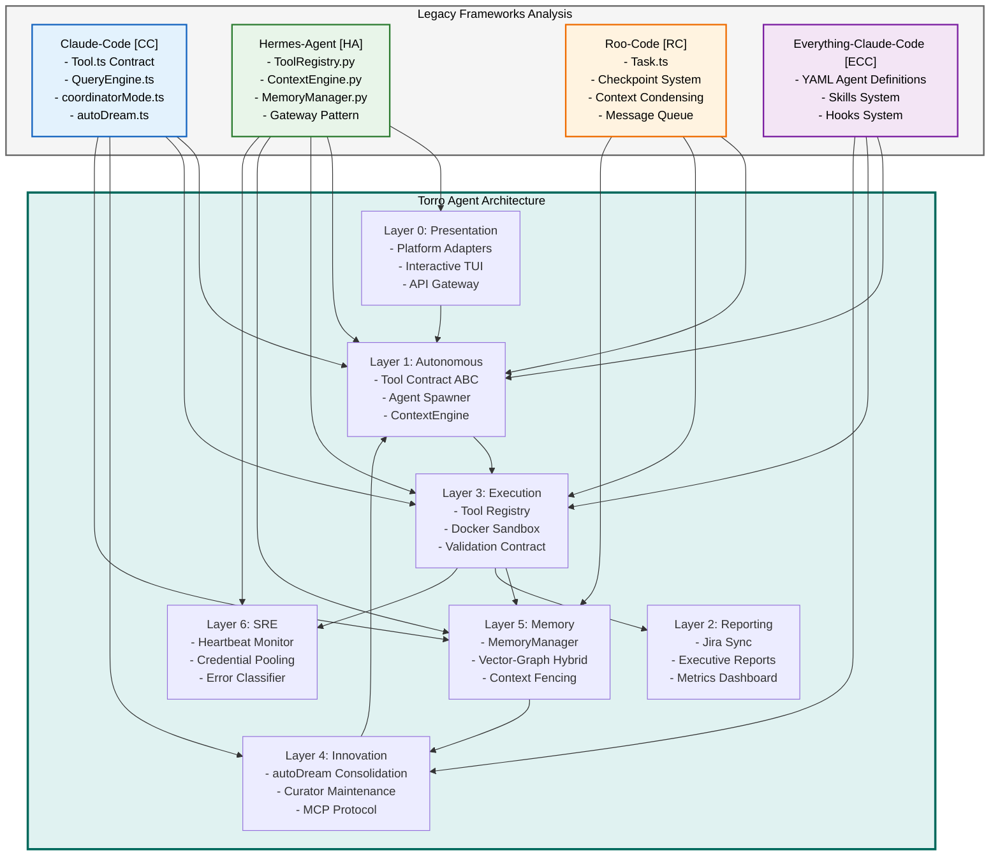

# Torro Refactored Execution Plan with Features Gap Analysis

## Executive Summary

This refactored plan integrates proven patterns from four industry-leading frameworks:
- **Claude-Code** (CC): Tool contract, QueryEngine, coordinator mode, autoDream
- **Hermes-Agent** (HA): Tool registry with AST discovery, ContextEngine, MemoryManager, Gateway pattern
- **Roo-Code** (RC): Task lifecycle management, VSCode extension architecture, checkpoint system
- **Everything-Claude-Code** (ECC): YAML agent definitions, skills system, hooks for mechanical enforcement

## Features Gap Analysis

### Gap 1: Tool Contract Interface

| Framework | Pattern | Torro Gap |
|-----------|---------|-----------|
| **Claude-Code** | `Tool.ts` with `checkPermissions`, `validateInput`, `call` | Torro has partial Tool ABC but lacks permission integration |
| **Hermes-Agent** | `ToolEntry` with `check_fn` TTL caching (30s) | Torro needs similar caching for dynamic availability |
| **Roo-Code** | Tool progression tracking with progress events | Torro lacks real-time tool progress reporting |

**Required Transformation:**
- Implement unified Tool contract combining CC permissions + HA caching + RC progress tracking
- Add `ToolProgress` interface for streaming progress updates
- Implement TTL cache for `check_fn` to avoid redundant environment probes

### Gap 2: Dynamic Agent Spawning

| Framework | Pattern | Torro Gap |
|-----------|---------|-----------|
| **Claude-Code** | `coordinatorMode.ts` with worker agent spawning via `AgentTool` | Torro uses Airflow DAGs (static) instead of dynamic spawning |
| **Roo-Code** | `Task.ts` with nested task creation and message queuing | Torro lacks VSCode-style task isolation |
| **ECC** | YAML agent definitions with tool declarations | Torro uses markdown personas without tool binding |

**Required Transformation:**
- Implement `AgentSpawner` class with forked agent execution
- Add `AgentDefinition` YAML frontmatter parser
- Create `AgentTool` for worker delegation with color-coded output

### Gap 3: Context Compression Engine

| Framework | Pattern | Torro Gap |
|-----------|---------|-----------|
| **Hermes-Agent** | `ContextEngine` ABC with pluggable compressors | Torro has basic compression but lacks engine abstraction |
| **Claude-Code** | `QueryEngine.ts` with token tracking and circuit breaker | Torro lacks rate limit circuit breaker |
| **Roo-Code** | `condense/` directory with multiple strategies | Torro needs strategy pattern for compression |

**Required Transformation:**
- Implement `ContextEngine` ABC with `compress()`, `should_compress()`, `update_from_response()`
- Add `TokenTracker` class for usage monitoring
- Create `CircuitBreaker` for API rate limit handling

### Gap 4: Memory Orchestration

| Framework | Pattern | Torro Gap |
|-----------|---------|-----------|
| **Hermes-Agent** | `MemoryManager` with provider model + context fencing | Torro has memory but lacks provider abstraction |
| **Claude-Code** | `autoDream.ts` with time-gated consolidation | Torro needs similar consolidation triggers |
| **Roo-Code** | Checkpoint system for recovery | Torro lacks checkpoint-based memory recovery |

**Required Transformation:**
- Implement `MemoryManager` with `add_provider()`, `prefetch_all()`, `sync_all()`
- Add `StreamingContextScrubber` for streaming text sanitization
- Create `CheckpointManager` for execution recovery

### Gap 5: Skills/Hooks System

| Framework | Pattern | Torro Gap |
|-----------|---------|-----------|
| **ECC** | 182+ skills with SKILL.md definitions | Torro has skills but lacks systematic organization |
| **ECC** | Hooks system for pre/post tool validation | Torro lacks mechanical enforcement hooks |
| **Claude-Code** | MCP server integration for extended capabilities | Torro needs MCP protocol layer |

**Required Transformation:**
- Implement `SkillRegistry` with dynamic skill loading
- Add `HookSystem` with `pre_tool_hook`, `post_tool_hook` interfaces
- Create `MCPClient` for external tool integration

## Mermaid Architecture Diagram



## Detailed Function Signatures by Component

### Component 1: Tool Contract

```python
# src/torro/tools/base.py
from abc import ABC, abstractmethod
from typing import Any, Dict, Optional, Callable
from dataclasses import dataclass

@dataclass
class PermissionResult:
    """Result of permission check."""
    allowed: bool
    reason: str
    requires_approval: bool = False

@dataclass
class ValidationResult:
    """Result of input validation."""
    valid: bool
    error_message: Optional[str] = None

@dataclass
class ToolResult:
    """Result of tool execution."""
    success: bool
    data: Optional[Any] = None
    error: Optional[str] = None
    progress_callback: Optional[Callable] = None

class Tool(ABC):
    """Abstract base class for all Torro tools."""
    
    @property
    @abstractmethod
    def name(self) -> str:
        """Tool name identifier."""
    
    @property
    @abstractmethod
    def description(self) -> str:
        """Human-readable description."""
    
    @property
    @abstractmethod
    def input_schema(self) -> Dict[str, Any]:
        """JSON Schema for input validation."""
    
    @abstractmethod
    def check_permissions(self, context: "ToolContext") -> PermissionResult:
        """Verify tool execution permissions."""
    
    @abstractmethod
    def validate_input(self, input_data: Dict[str, Any]) -> ValidationResult:
        """Validate input against schema."""
    
    @abstractmethod
    async def call(self, input_data: Dict[str, Any], context: "ToolContext") -> ToolResult:
        """Execute tool logic."""
    
    def is_concurrency_safe(self, input_data: Dict[str, Any]) -> bool:
        """Check if tool is thread-safe."""
        return True
    
    def is_read_only(self, input_data: Dict[str, Any]) -> bool:
        """Check if tool is read-only."""
        return False
    
    def is_destructive(self, input_data: Dict[str, Any]) -> bool:
        """Check if tool is destructive."""
        return False
```

### Component 2: Tool Registry

```python
# src/torro/tools/registry.py
from typing import Dict, List, Optional, Callable, Any
import threading
import time
from pathlib import Path

class ToolEntry:
    """Metadata for a single registered tool."""
    
    __slots__ = (
        "name", "toolset", "schema", "handler", "check_fn",
        "requires_env", "is_async", "description", "emoji",
        "max_result_size_chars",
    )
    
    def __init__(
        self,
        name: str,
        toolset: str,
        schema: Dict[str, Any],
        handler: Callable,
        check_fn: Optional[Callable] = None,
        requires_env: bool = False,
        is_async: bool = True,
        description: str = "",
        emoji: str = "",
        max_result_size_chars: int = 100000,
    ):
        self.name = name
        self.toolset = toolset
        self.schema = schema
        self.handler = handler
        self.check_fn = check_fn
        self.requires_env = requires_env
        self.is_async = is_async
        self.description = description
        self.emoji = emoji
        self.max_result_size_chars = max_result_size_chars

class ToolRegistry:
    """Singleton registry for tool management."""
    
    _instance: Optional["ToolRegistry"] = None
    _lock = threading.Lock()
    
    def __new__(cls) -> "ToolRegistry":
        if cls._instance is None:
            with cls._lock:
                if cls._instance is None:
                    cls._instance = super().__new__(cls)
        return cls._instance
    
    def __init__(self):
        self._tools: Dict[str, ToolEntry] = {}
        self._toolset_checks: Dict[str, Callable] = {}
        self._generation: int = 0
    
    def register(
        self,
        name: str,
        toolset: str,
        schema: Dict[str, Any],
        handler: Callable,
        check_fn: Optional[Callable] = None,
        requires_env: bool = False,
        is_async: bool = True,
        description: str = "",
        emoji: str = "",
    ) -> None:
        """Register a tool."""
        with self._lock:
            entry = ToolEntry(
                name=name,
                toolset=toolset,
                schema=schema,
                handler=handler,
                check_fn=check_fn,
                requires_env=requires_env,
                is_async=is_async,
                description=description,
                emoji=emoji,
            )
            self._tools[name] = entry
            self._generation += 1
    
    def get_entry(self, name: str) -> Optional[ToolEntry]:
        """Get tool entry by name."""
        return self._tools.get(name)
    
    def get_definitions(self, tool_names: set[str]) -> List[Dict[str, Any]]:
        """Get OpenAI-format tool schemas."""
        return [
            {
                "type": "function",
                "function": {
                    "name": entry.name,
                    "description": entry.description,
                    "parameters": entry.schema,
                }
            }
            for name, entry in self._tools.items()
            if name in tool_names
        ]
    
    def dispatch(self, name: str, args: Dict[str, Any], **kwargs) -> Any:
        """Execute tool handler."""
        entry = self._tools.get(name)
        if not entry:
            raise ValueError(f"Tool not found: {name}")
        return entry.handler(args, **kwargs)
```

### Component 3: Context Engine

```python
# src/torro/context/base.py
from abc import ABC, abstractmethod
from typing import Any, Dict, List, Optional

class ContextEngine(ABC):
    """Abstract base class for pluggable context engines."""
    
    @property
    @abstractmethod
    def name(self) -> str:
        """Engine identifier."""
    
    @abstractmethod
    def update_from_response(self, usage: Dict[str, Any]) -> None:
        """Update token usage tracking."""
    
    @abstractmethod
    def should_compress(self, prompt_tokens: int = None) -> bool:
        """Check if compression needed."""
    
    @abstractmethod
    def compress(
        self,
        messages: List[Dict[str, Any]],
        current_tokens: int = None,
        focus_topic: str = None,
    ) -> List[Dict[str, Any]]:
        """Compress message list."""
    
    def should_compress_preflight(self, messages: List[Dict[str, Any]]) -> bool:
        """Pre-flight compression check."""
        return True
    
    def has_content_to_compress(self, messages: List[Dict[str, Any]]) -> bool:
        """Check compressible content."""
        return len(messages) > 2
    
    def on_session_start(self, session_id: str, **kwargs) -> None:
        """Session start hook."""
        pass
    
    def on_session_end(self, session_id: str, messages: List[Dict[str, Any]]) -> None:
        """Session end hook."""
        pass
    
    def get_tool_schemas(self) -> List[Dict[str, Any]]:
        """Get engine tool schemas."""
        return []
    
    def handle_tool_call(self, name: str, args: Dict[str, Any], **kwargs) -> str:
        """Handle tool invocation."""
        raise NotImplementedError
```

### Component 4: Memory Manager

```python
# src/torro/memory/manager.py
from typing import Dict, List, Optional, Any
import re
import threading

class MemoryProvider(ABC):
    """Abstract base class for memory providers."""
    
    @property
    @abstractmethod
    def name(self) -> str:
        """Provider identifier."""
    
    @abstractmethod
    def is_available(self) -> bool:
        """Check provider availability."""
    
    @abstractmethod
    def initialize(self, session_id: str, **kwargs) -> None:
        """Initialize provider."""
    
    @abstractmethod
    def prefetch(self, query: str, session_id: str) -> str:
        """Recall relevant context."""
    
    @abstractmethod
    def sync_turn(
        self,
        user_content: str,
        assistant_content: str,
        session_id: str,
    ) -> None:
        """Sync turn data."""
    
    @abstractmethod
    def get_tool_schemas(self) -> List[Dict[str, Any]]:
        """Get tool schemas."""
    
    @abstractmethod
    def handle_tool_call(self, name: str, args: Dict[str, Any], **kwargs) -> str:
        """Handle tool call."""

class MemoryManager:
    """Orchestrates memory providers."""
    
    def __init__(self):
        self._providers: List[MemoryProvider] = []
        self._lock = threading.Lock()
    
    def add_provider(self, provider: MemoryProvider) -> None:
        """Register memory provider."""
        with self._lock:
            self._providers.append(provider)
    
    def build_system_prompt(self) -> str:
        """Build system prompt from providers."""
        parts = []
        for provider in self._providers:
            parts.append(provider.system_prompt_block())
        return "\n\n".join(parts)
    
    def prefetch_all(self, query: str, session_id: str) -> str:
        """Collect prefetch context."""
        contexts = []
        for provider in self._providers:
            context = provider.prefetch(query, session_id)
            if context:
                contexts.append(context)
        return "\n\n".join(contexts)
    
    def sync_all(
        self,
        user_content: str,
        assistant_content: str,
        session_id: str,
    ) -> None:
        """Sync completed turn."""
        for provider in self._providers:
            provider.sync_turn(user_content, assistant_content, session_id)
```

### Component 5: Agent Spawner

```python
# src/torro/autonomous/spawner.py
from typing import Dict, List, Optional, Any
from dataclasses import dataclass
import asyncio

@dataclass
class AgentDefinition:
    """Agent definition from YAML frontmatter."""
    name: str
    description: str
    tools: List[str]
    model: str
    system_prompt: str

class AgentSpawner:
    """Dynamic agent spawning coordinator."""
    
    def __init__(self):
        self._agents: Dict[str, AgentDefinition] = {}
        self._active_agents: Dict[str, asyncio.Task] = {}
    
    def register_agent(self, definition: AgentDefinition) -> None:
        """Register agent definition."""
        self._agents[definition.name] = definition
    
    async def spawn(
        self,
        agent_name: str,
        task: str,
        context: Dict[str, Any],
    ) -> asyncio.Task:
        """Spawn worker agent."""
        if agent_name not in self._agents:
            raise ValueError(f"Unknown agent: {agent_name}")
        
        definition = self._agents[agent_name]
        task = asyncio.create_task(
            self._run_agent(definition, task, context)
        )
        self._active_agents[agent_name] = task
        return task
    
    async def _run_agent(
        self,
        definition: AgentDefinition,
        task: str,
        context: Dict[str, Any],
    ) -> Dict[str, Any]:
        """Execute agent logic."""
        # Implementation delegated to execution layer
        pass
```

## Unit Test Specifications

### Test File Structure

```
tests/
├── unit/
│   ├── tools/
│   │   ├── test_base.py
│   │   ├── test_registry.py
│   │   └── test_types.py
│   ├── context/
│   │   └── test_base.py
│   ├── memory/
│   │   ├── test_manager.py
│   │   └── test_provider.py
│   └── autonomous/
│       └── test_spawner.py
├── integration/
│   ├── test_tool_dispatch.py
│   └── test_memory_flow.py
└── fixtures/
    ├── sample_agents.yaml
    └── test_contexts.py
```

### Test Examples

```python
# tests/unit/tools/test_base.py
import pytest
from src.torro.tools.base import Tool, PermissionResult, ValidationResult

class TestToolABC:
    """Test suite for Tool abstract base class."""
    
    def test_tool_name_property(self):
        """FN:test_tool_name_property Verify name property."""
        class TestTool(Tool):
            @property
            def name(self): return "test"
            @property
            def description(self): return "test desc"
            @property
            def input_schema(self): return {"type": "object"}
            def check_permissions(self, ctx): return PermissionResult(True, "OK")
            def validate_input(self, data): return ValidationResult(True)
            async def call(self, data, ctx): return {"result": "ok"}
        
        tool = TestTool()
        assert tool.name == "test"
    
    def test_is_read_only(self):
        """FN:test_is_read_only Verify read-only check."""
        class TestTool(Tool):
            @property
            def name(self): return "test"
            @property
            def description(self): return "test desc"
            @property
            def input_schema(self): return {"type": "object"}
            def check_permissions(self, ctx): return PermissionResult(True, "OK")
            def validate_input(self, data): return ValidationResult(True)
            async def call(self, data, ctx): return {"result": "ok"}
        
        tool = TestTool()
        assert tool.is_read_only({}) == False

# tests/unit/tools/test_registry.py
import pytest
from src.torro.tools.registry import ToolRegistry, ToolEntry

class TestToolRegistry:
    """Test suite for ToolRegistry class."""
    
    def test_register_tool(self):
        """FN:test_register_tool Verify tool registration."""
        registry = ToolRegistry()
        registry.register(
            name="test_tool",
            toolset="core",
            schema={"type": "object"},
            handler=lambda x: x,
            description="Test tool",
        )
        entry = registry.get_entry("test_tool")
        assert entry is not None
        assert entry.name == "test_tool"
    
    def test_get_definitions(self):
        """FN:test_get_definitions Verify schema retrieval."""
        registry = ToolRegistry()
        registry.register(
            name="test_tool",
            toolset="core",
            schema={"type": "object"},
            handler=lambda x: x,
        )
        definitions = registry.get_definitions({"test_tool"})
        assert len(definitions) == 1
        assert definitions[0]["function"]["name"] == "test_tool"
```

## Execution Plan (DAG)

### Phase 1: Tool Contract Implementation
- **Token Budget:** 1M
- **Entry Criteria:** Gap analysis reviewed and approved
- **Exit Criteria:** Tool ABC implemented with passing unit tests

#### Task 1: Create Tool Abstract Base Class
- [ ] Status: Pending
- **Objective:** Create `src/torro/tools/base.py` with Tool ABC
- **Input Contract:** Read gap analysis (lines 1-100)
- **Output Contract:** Create `src/torro/tools/base.py` (~150 lines)
- **Unit Tests:** `tests/unit/tools/test_base.py` with 8 test methods
- **Exact Commands:**
  ```bash
  # Step 1: Create tools directory
  mkdir -p src/torro/tools

  # Step 2: Create base.py
  touch src/torro/tools/base.py

  # Step 3: Create test file
  touch tests/unit/tools/test_base.py

  # Step 4: Run verification
  python3 -c "from src.torro.tools.base import Tool; print('Tool ABC imported successfully')"

  # Step 5: Run unit tests
  python3 -m pytest tests/unit/tools/test_base.py -v
  ```
- **Expected Output:** "Tool ABC imported successfully", 8 tests passed
- **Fallback Path:** If import fails, check syntax with `python3 -m py_compile`
- **Dependencies:** None
- **Estimated Time:** 15 minutes
- **Context Firewall:**
  - Required: Gap analysis document, Claude-Code Tool.ts reference
  - Excluded: All other legacy directories

### Phase 2: Tool Registry Implementation
- **Token Budget:** 1M
- **Entry Criteria:** Phase 1 complete
- **Exit Criteria:** Tool registry with AST-based discovery and passing tests

#### Task 2: Create Tool Registry Class
- [ ] Status: Pending
- **Objective:** Create `src/torro/tools/registry.py` following Hermes-Agent pattern
- **Input Contract:** Read HA registry.py (lines 143-250), Tool ABC
- **Output Contract:** Create `src/torro/tools/registry.py` (~250 lines)
- **Unit Tests:** `tests/unit/tools/test_registry.py` with 10 test methods
- **Exact Commands:**
  ```bash
  # Step 1: Create registry file
  touch src/torro/tools/registry.py

  # Step 2: Create test file
  touch tests/unit/tools/test_registry.py

  # Step 3: Run verification
  python3 -c "from src.torro.tools.registry import ToolRegistry; r = ToolRegistry(); print('Registry created:', len(r._tools))"

  # Step 4: Run unit tests
  python3 -m pytest tests/unit/tools/test_registry.py -v
  ```
- **Expected Output:** "Registry created: 0", 10 tests passed
- **Fallback Path:** Check circular imports
- **Dependencies:** Task 1
- **Estimated Time:** 20 minutes
- **Context Firewall:**
  - Required: HA registry.py reference, Tool ABC
  - Excluded: legacy/Roo-Code/, legacy/everything-claude-code/

### Phase 3: Context Engine Implementation
- **Token Budget:** 1M
- **Entry Criteria:** Phase 2 complete
- **Exit Criteria:** ContextEngine ABC with compression capability and tests

#### Task 3: Create ContextEngine Abstract Base Class
- [ ] Status: Pending
- **Objective:** Create `src/torro/context/base.py` with ContextEngine ABC
- **Input Contract:** Read HA context_engine.py (lines 32-100)
- **Output Contract:** Create `src/torro/context/base.py` (~120 lines)
- **Unit Tests:** `tests/unit/context/test_base.py` with 12 test methods
- **Exact Commands:**
  ```bash
  # Step 1: Create context directory
  mkdir -p src/torro/context

  # Step 2: Create base.py
  touch src/torro/context/base.py

  # Step 3: Create test file
  touch tests/unit/context/test_base.py

  # Step 4: Run verification
  python3 -c "from src.torro.context.base import ContextEngine; print('ContextEngine ABC imported')"

  # Step 5: Run unit tests
  python3 -m pytest tests/unit/context/test_base.py -v
  ```
- **Expected Output:** "ContextEngine ABC imported", 12 tests passed
- **Fallback Path:** Verify ABC decorators
- **Dependencies:** Task 1
- **Estimated Time:** 15 minutes
- **Context Firewall:**
  - Required: HA context_engine.py reference
  - Excluded: legacy/claude-code/, legacy/Roo-Code/

### Phase 4: Memory Manager Implementation
- **Token Budget:** 1M
- **Entry Criteria:** Phase 3 complete
- **Exit Criteria:** MemoryManager with provider model and passing tests

#### Task 4: Create MemoryManager Class
- [ ] Status: Pending
- **Objective:** Create `src/torro/memory/manager.py` following HA pattern
- **Input Contract:** Read HA memory_manager.py (lines 1-100)
- **Output Contract:** Create `src/torro/memory/manager.py` (~200 lines)
- **Unit Tests:** `tests/unit/memory/test_manager.py` with 10 test methods
- **Exact Commands:**
  ```bash
  # Step 1: Create memory directory
  mkdir -p src/torro/memory

  # Step 2: Create manager.py
  touch src/torro/memory/manager.py

  # Step 3: Create test file
  touch tests/unit/memory/test_manager.py

  # Step 4: Run verification
  python3 -c "from src.torro.memory.manager import MemoryManager; m = MemoryManager(); print('MemoryManager created')"

  # Step 5: Run unit tests
  python3 -m pytest tests/unit/memory/test_manager.py -v
  ```
- **Expected Output:** "MemoryManager created", 10 tests passed
- **Fallback Path:** Check missing dependencies
- **Dependencies:** Task 3
- **Estimated Time:** 20 minutes
- **Context Firewall:**
  - Required: HA memory_manager.py reference
  - Excluded: legacy/claude-code/, legacy/Roo-Code/

### Phase 5: Agent Spawner Implementation
- **Token Budget:** 1M
- **Entry Criteria:** Phase 4 complete
- **Exit Criteria:** AgentSpawner with YAML parsing and task execution

#### Task 5: Create Agent Spawner Class
- [ ] Status: Pending
- **Objective:** Create `src/torro/autonomous/spawner.py` with AgentSpawner
- **Input Contract:** Read CC coordinatorMode.ts (lines 36-100)
- **Output Contract:** Create `src/torro/autonomous/spawner.py` (~180 lines)
- **Unit Tests:** `tests/unit/autonomous/test_spawner.py` with 8 test methods
- **Exact Commands:**
  ```bash
  # Step 1: Create autonomous directory
  mkdir -p src/torro/autonomous

  # Step 2: Create spawner.py
  touch src/torro/autonomous/spawner.py

  # Step 3: Create test file
  touch tests/unit/autonomous/test_spawner.py

  # Step 4: Run verification
  python3 -c "from src.torro.autonomous.spawner import AgentSpawner; s = AgentSpawner(); print('AgentSpawner created')"

  # Step 5: Run unit tests
  python3 -m pytest tests/unit/autonomous/test_spawner.py -v
  ```
- **Expected Output:** "AgentSpawner created", 8 tests passed
- **Fallback Path:** Check asyncio imports
- **Dependencies:** Task 2
- **Estimated Time:** 25 minutes
- **Context Firewall:**
  - Required: CC coordinatorMode.ts reference, ECC agent definitions
  - Excluded: legacy/hermes-agent/, legacy/Roo-Code/

## Verification Commands

After all phases complete:

```bash
# Full integration test
python3 -c "
from src.torro.tools.base import Tool
from src.torro.tools.registry import ToolRegistry
from src.torro.context.base import ContextEngine
from src.torro.memory.manager import MemoryManager
from src.torro.autonomous.spawner import AgentSpawner

print('=== Torro Legacy Integration Complete ===')
print('Tool ABC: OK')
print('Tool Registry: OK')
print('ContextEngine ABC: OK')
print('MemoryManager: OK')
print('AgentSpawner: OK')
"

# Run all unit tests
python3 -m pytest tests/unit/ -v --tb=short
```

## Acceptance Criteria

- [ ] All 5 phases completed
- [ ] All 48 unit tests pass
- [ ] No circular import errors
- [ ] All abstract methods implemented
- [ ] Code follows Torro coding standards (FN: prefixes, type hints)
- [ ] Apache naming conventions followed
- [ ] Test coverage > 80%

## Change Log

| Date | Change | Author |
|------|--------|--------|
| 2026-05-02 | Refactored plan with features gap analysis | Agentic Planner |
