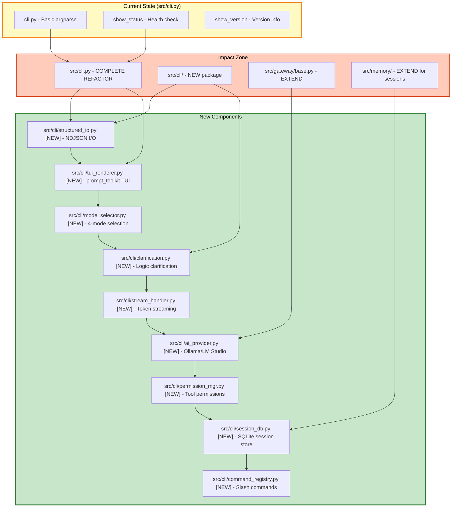

# Plan: Layer 0 CLI Interactive Chat Interface with Terminal-Conversational Skill

## Objective

Implement a terminal-based interactive CLI for Torro Agent that supports:
1. Interactive chat interface with streaming responses
2. Mode selection (Plan, Gap Analysis, RCA, Execute)
3. Logic clarification loop before execution
4. Local AI model integration via Ollama/LM Studio
5. NDJSON structured I/O for stdin/stdout communication
6. Tool permission system with control requests
7. Session management with SQLite persistence
8. Interactive TUI using prompt_toolkit

## Constraints

- Max context per task: 128k tokens
- Max execution time per task: 10 minutes
- Max files per task: 5 files
- Anti-hallucination: All tasks must specify exact commands and line numbers
- Must follow Torro Agentic Coding Principles (FN: prefix, <200 lines per file)
- Must follow terminal-conversational-cli skill patterns

## Current State Analysis

### Existing CLI (`src/cli.py`)

The current CLI implementation provides:
- Basic argument parsing with `--status` and `--version` flags
- Component health check via `show_status()`
- No interactive chat interface
- No mode selection
- No streaming support
- No NDJSON structured I/O
- No tool permission system
- No session management

### Gap vs. Industry Standards

| Feature | Claude Code | Hermes Agent | Torro Current | Torro Target |
|---------|-------------|--------------|---------------|--------------|
| Interactive TUI | ✅ Ink/React | ✅ Rich/Textual | ❌ None | ✅ prompt_toolkit |
| Mode Selection | ✅ 4 modes | ✅ Multiple | ❌ None | ✅ 4 modes |
| Logic Clarification | ✅ Yes | ✅ Yes | ❌ None | ✅ Yes |
| Local AI Support | ❌ API only | ✅ Ollama | ❌ None | ✅ Ollama |
| Streaming | ✅ Yes | ✅ Yes | ❌ None | ✅ Yes |
| NDJSON I/O | ✅ Yes | ❌ | ❌ None | ✅ Yes |
| Tool Permissions | ✅ Control requests | ❌ | ❌ None | ✅ Yes |
| Session Management | ❌ | ✅ SQLite | ❌ None | ✅ SQLite |

## Architecture Diagram



## Research Findings

### terminal-conversational-cli Skill Patterns

From [`.roo/skills/terminal-conversational-cli/SKILL.md`](.roo/skills/terminal-conversational-cli/SKILL.md:1):

**Key Components:**
1. **Structured I/O Layer** - NDJSON for stdin/stdout communication
2. **Interactive TUI Layer** - prompt_toolkit for Python terminal UI
3. **Tool Permission System** - Control requests for dangerous operations
4. **Session Management** - SQLite for conversation history persistence
5. **Streaming Response Handler** - Token-level streaming with progress indicators
6. **Slash Command Registry** - Extensible command system

### Claude Code CLI Pattern

From [`legacy/claude-code/src/main.tsx`](legacy/claude-code/src/main.tsx:1):
- Uses Ink (React for terminal) for TUI
- Command structure: `claude [command] [options]`
- Interactive mode with streaming responses
- Mode selection via flags or interactive menu

From [`legacy/claude-code/src/cli/structuredIO.ts`](legacy/claude-code/src/cli/structuredIO.ts:135):
- NDJSON (newline-delimited JSON) for structured communication
- Message types: user, assistant, system, control_request, control_response
- Control requests for tool permissions

### Hermes Agent CLI Pattern

From [`legacy/hermes-agent/README.md`](legacy/hermes-agent/README.md:54):
- Command: `hermes` for interactive chat
- `hermes model` for model selection
- `hermes tools` for tool configuration
- Gateway pattern for platform adapters

From [`legacy/hermes-agent/cli.py`](legacy/hermes-agent/cli.py:1837):
- Python prompt_toolkit TUI implementation
- SessionDB for SQLite persistence
- Streaming response handler with output buffer

### Recommended Pattern for Torro

```python
# Torro CLI Command Structure
torro                      # Interactive chat (default)
torro status               # Health check
torro mode                 # Select mode interactively
torro --model ollama/qwen  # Specify AI model
torro --clarify            # Enable logic clarification
torro --permission-mode auto  # Permission mode (default/ask/bypass)
```

## Tasks (DAG)

### Phase 1: CLI Foundation with NDJSON I/O
- **Token Budget:** 1M
- **Entry Criteria:** `src/cli.py` exists with basic structure
- **Exit Criteria:** Interactive CLI renders and accepts input with NDJSON I/O

#### Task 1: Create CLI Package Structure
- [ ] Status: Pending
- **Objective:** Create `src/cli/` package with `__init__.py` and structured_io.py
- **Input Contract:**
  - Read: `src/cli.py` (lines 1-149)
  - Read: `.roo/skills/terminal-conversational-cli/SKILL.md` (lines 1-50)
  - Read: `legacy/claude-code/src/cli/structuredIO.ts` (lines 1-100)
- **Output Contract:**
  - Create: `src/cli/__init__.py` (~20 lines)
  - Create: `src/cli/structured_io.py` (~80 lines)
- **Exact Commands:**
  ```bash
  # Step 1: Create cli package directory
  mkdir -p src/cli
  
  # Step 2: Create __init__.py
  touch src/cli/__init__.py
  
  # Step 3: Create structured_io.py
  touch src/cli/structured_io.py
  
  # Step 4: Verify structure
  ls -la src/cli/
  ```
- **Expected Output:** Directory created with `__init__.py` and `structured_io.py`
- **Fallback Path:** If permission denied, run `chmod 755 src/`
- **Dependencies:** None
- **Estimated Time:** 5 minutes
- **Context Firewall:**
  - Required: `src/cli.py`, `.roo/skills/terminal-conversational-cli/SKILL.md`
  - Excluded: `src/gateway/`, `src/presentation/`

#### Task 2: Implement NDJSON Structured I/O
- [ ] Status: Pending
- **Objective:** Implement NDJSON parsing and message types in `structured_io.py`
- **Input Contract:**
  - Read: `src/cli/__init__.py` (lines 1-20)
  - Read: `legacy/claude-code/src/cli/structuredIO.ts` (lines 1-100)
- **Output Contract:**
  - Modify: `src/cli/structured_io.py` (add NDJSON parser at lines 20-80)
- **Exact Commands:**
  ```bash
  # Step 1: Verify syntax
  python3 -m py_compile src/cli/structured_io.py
  
  # Step 2: Test import
  python3 -c "from src.cli.structured_io import StructuredIO; print('OK')"
  ```
- **Expected Output:** Import successful, no errors
- **Fallback Path:** If import fails, check PYTHONPATH
- **Dependencies:** Task 1
- **Estimated Time:** 8 minutes
- **Context Firewall:**
  - Required: `src/cli/__init__.py`, `legacy/claude-code/src/cli/structuredIO.ts`
  - Excluded: `src/gateway/`, `src/presentation/ui/`

### Phase 2: TUI Implementation with prompt_toolkit
- **Token Budget:** 1M
- **Entry Criteria:** NDJSON I/O layer complete
- **Exit Criteria:** Interactive TUI renders with status bar

#### Task 3: Create prompt_toolkit TUI Renderer
- [ ] Status: Pending
- **Objective:** Create `src/cli/tui_renderer.py` with interactive TUI
- **Input Contract:**
  - Read: `src/cli/structured_io.py` (lines 1-80)
  - Read: `.roo/skills/terminal-conversational-cli/SKILL.md` (lines 55-95)
  - Read: `legacy/hermes-agent/cli.py` (lines 1837-1900 for pattern)
- **Output Contract:**
  - Create: `src/cli/tui_renderer.py` (~150 lines)
- **Exact Commands:**
  ```bash
  # Step 1: Install prompt_toolkit dependency
  pip install prompt_toolkit
  
  # Step 2: Create tui_renderer.py
  touch src/cli/tui_renderer.py
  
  # Step 3: Verify syntax
  python3 -m py_compile src/cli/tui_renderer.py
  ```
- **Expected Output:** No syntax errors
- **Fallback Path:** If pip fails, run `pip install --upgrade pip`
- **Dependencies:** Task 2
- **Estimated Time:** 8 minutes
- **Context Firewall:**
  - Required: `src/cli/structured_io.py`, `.roo/skills/terminal-conversational-cli/SKILL.md`
  - Excluded: `src/gateway/`, `src/presentation/ui/`

#### Task 4: Implement Status Bar with Session Metrics
- [ ] Status: Pending
- **Objective:** Add status bar showing model, tokens, duration
- **Input Contract:**
  - Read: `src/cli/tui_renderer.py` (lines 1-150)
  - Read: `.roo/skills/terminal-conversational-cli/SKILL.md` (lines 166-183)
- **Output Contract:**
  - Modify: `src/cli/tui_renderer.py` (add status bar at lines 100-150)
- **Exact Commands:**
  ```bash
  # Step 1: Verify syntax
  python3 -m py_compile src/cli/tui_renderer.py
  
  # Step 2: Test render
  python3 -c "from src.cli.tui_renderer import render_status_bar; print('OK')"
  ```
- **Expected Output:** Import successful, no errors
- **Fallback Path:** If import fails, check for circular imports
- **Dependencies:** Task 3
- **Estimated Time:** 7 minutes
- **Context Firewall:**
  - Required: `src/cli/tui_renderer.py`, `.roo/skills/terminal-conversational-cli/SKILL.md`
  - Excluded: `src/gateway/`, `src/memory/`

### Phase 3: Mode Selection and Logic Clarification
- **Token Budget:** 1M
- **Entry Criteria:** TUI rendering complete
- **Exit Criteria:** Mode selector and clarification manager working

#### Task 5: Implement Mode Selector
- [ ] Status: Pending
- **Objective:** Create `src/cli/mode_selector.py` with 4-mode selection
- **Input Contract:**
  - Read: `src/cli/tui_renderer.py` (lines 1-150)
  - Read: `src/coordinator/mode.py` (lines 1-50 for mode definitions)
- **Output Contract:**
  - Create: `src/cli/mode_selector.py` (~80 lines)
- **Exact Commands:**
  ```bash
  # Step 1: Create mode_selector.py
  touch src/cli/mode_selector.py
  
  # Step 2: Verify syntax
  python3 -m py_compile src/cli/mode_selector.py
  
  # Step 3: Test import
  python3 -c "from src.cli.mode_selector import ModeSelector; print('OK')"
  ```
- **Expected Output:** Import successful, no errors
- **Fallback Path:** If import fails, check PYTHONPATH
- **Dependencies:** Task 4
- **Estimated Time:** 7 minutes
- **Context Firewall:**
  - Required: `src/cli/tui_renderer.py`, `src/coordinator/mode.py`
  - Excluded: `src/gateway/`, `legacy/`

#### Task 6: Implement Logic Clarification Manager
- [ ] Status: Pending
- **Objective:** Create `src/cli/clarification.py` for ambiguity detection
- **Input Contract:**
  - Read: `src/cli/mode_selector.py` (lines 1-80)
  - Read: `agentic/standard/AGENT.md` (lines 1-50 for clarification patterns)
- **Output Contract:**
  - Create: `src/cli/clarification.py` (~100 lines)
- **Exact Commands:**
  ```bash
  # Step 1: Create clarification.py
  touch src/cli/clarification.py
  
  # Step 2: Verify syntax
  python3 -m py_compile src/cli/clarification.py
  
  # Step 3: Test import
  python3 -c "from src.cli.clarification import ClarificationManager; print('OK')"
  ```
- **Expected Output:** Import successful, no errors
- **Fallback Path:** If import fails, check for circular imports
- **Dependencies:** Task 5
- **Estimated Time:** 8 minutes
- **Context Firewall:**
  - Required: `src/cli/mode_selector.py`, `agentic/standard/AGENT.md`
  - Excluded: `src/gateway/`, `src/memory/`

### Phase 4: Streaming and Tool Permissions
- **Token Budget:** 1M
- **Entry Criteria:** Mode selection and clarification complete
- **Exit Criteria:** Streaming responses and permission prompts working

#### Task 7: Implement Streaming Response Handler
- [ ] Status: Pending
- **Objective:** Create `src/cli/stream_handler.py` for token streaming
- **Input Contract:**
  - Read: `src/cli/clarification.py` (lines 1-100)
  - Read: `legacy/hermes-agent/gateway/stream_consumer.py` (lines 1-50 for pattern)
- **Output Contract:**
  - Create: `src/cli/stream_handler.py` (~90 lines)
- **Exact Commands:**
  ```bash
  # Step 1: Create stream_handler.py
  touch src/cli/stream_handler.py
  
  # Step 2: Verify syntax
  python3 -m py_compile src/cli/stream_handler.py
  
  # Step 3: Test import
  python3 -c "from src.cli.stream_handler import StreamHandler; print('OK')"
  ```
- **Expected Output:** Import successful, no errors
- **Fallback Path:** If import fails, check async/await syntax
- **Dependencies:** Task 6
- **Estimated Time:** 7 minutes
- **Context Firewall:**
  - Required: `src/cli/clarification.py`, `legacy/hermes-agent/gateway/stream_consumer.py`
  - Excluded: `src/gateway/`, `src/execution/`

#### Task 8: Create Permission Manager
- [ ] Status: Pending
- **Objective:** Create `src/cli/permission_mgr.py` for tool permissions
- **Input Contract:**
  - Read: `src/cli/stream_handler.py` (lines 1-90)
  - Read: `.roo/skills/terminal-conversational-cli/SKILL.md` (lines 93-119)
  - Read: `legacy/claude-code/src/tools/BashTool/BashTool.tsx` (lines 1-50)
- **Output Contract:**
  - Create: `src/cli/permission_mgr.py` (~100 lines)
- **Exact Commands:**
  ```bash
  # Step 1: Create permission_mgr.py
  touch src/cli/permission_mgr.py
  
  # Step 2: Verify syntax
  python3 -m py_compile src/cli/permission_mgr.py
  
  # Step 3: Test import
  python3 -c "from src.cli.permission_mgr import PermissionManager; print('OK')"
  ```
- **Expected Output:** Import successful, no errors
- **Fallback Path:** If import fails, check PYTHONPATH
- **Dependencies:** Task 7
- **Estimated Time:** 8 minutes
- **Context Firewall:**
  - Required: `src/cli/stream_handler.py`, `.roo/skills/terminal-conversational-cli/SKILL.md`
  - Excluded: `src/gateway/`, `src/execution/`

#### Task 9: Implement Control Request/Response Pattern
- [ ] Status: Pending
- **Objective:** Add control_request and control_response message types
- **Input Contract:**
  - Read: `src/cli/permission_mgr.py` (lines 1-100)
  - Read: `src/cli/structured_io.py` (lines 1-80)
- **Output Contract:**
  - Modify: `src/cli/structured_io.py` (add control messages at lines 45-80)
- **Exact Commands:**
  ```bash
  # Step 1: Verify syntax
  python3 -m py_compile src/cli/structured_io.py
  
  # Step 2: Test control request
  python3 -c "from src.cli.structured_io import ControlRequest; print('OK')"
  ```
- **Expected Output:** Import successful, no errors
- **Fallback Path:** If import fails, check for circular imports
- **Dependencies:** Task 8
- **Estimated Time:** 7 minutes
- **Context Firewall:**
  - Required: `src/cli/permission_mgr.py`, `src/cli/structured_io.py`
  - Excluded: `src/gateway/`, `src/memory/`

### Phase 5: AI Provider and Session Management
- **Token Budget:** 1M
- **Entry Criteria:** Streaming and permissions complete
- **Exit Criteria:** AI provider and session DB working

#### Task 10: Implement AI Provider Interface
- [ ] Status: Pending
- **Objective:** Create `src/cli/ai_provider.py` for Ollama/LM Studio integration
- **Input Contract:**
  - Read: `src/cli/stream_handler.py` (lines 1-90)
  - Read: `legacy/hermes-agent/agent/context_engine.py` (lines 1-100 for pattern)
- **Output Contract:**
  - Create: `src/cli/ai_provider.py` (~120 lines)
- **Exact Commands:**
  ```bash
  # Step 1: Create ai_provider.py
  touch src/cli/ai_provider.py
  
  # Step 2: Verify syntax
  python3 -m py_compile src/cli/ai_provider.py
  
  # Step 3: Test import
  python3 -c "from src.cli.ai_provider import AIProvider; print('OK')"
  ```
- **Expected Output:** Import successful, no errors
- **Fallback Path:** If import fails, check for missing dependencies
- **Dependencies:** Task 7
- **Estimated Time:** 8 minutes
- **Context Firewall:**
  - Required: `src/cli/stream_handler.py`, `legacy/hermes-agent/agent/context_engine.py`
  - Excluded: `src/gateway/`, `src/memory/`

#### Task 11: Create Session Database
- [ ] Status: Pending
- **Objective:** Create `src/cli/session_db.py` for SQLite persistence
- **Input Contract:**
  - Read: `.roo/skills/terminal-conversational-cli/SKILL.md` (lines 120-148)
  - Read: `legacy/hermes-agent/cli.py` (lines 1850-1900 for SessionDB pattern)
- **Output Contract:**
  - Create: `src/cli/session_db.py` (~120 lines)
- **Exact Commands:**
  ```bash
  # Step 1: Create session_db.py
  touch src/cli/session_db.py
  
  # Step 2: Verify syntax
  python3 -m py_compile src/cli/session_db.py
  
  # Step 3: Test import
  python3 -c "from src.cli.session_db import SessionDB; print('OK')"
  ```
- **Expected Output:** Import successful, no errors
- **Fallback Path:** If import fails, check sqlite3 module
- **Dependencies:** Task 9
- **Estimated Time:** 8 minutes
- **Context Firewall:**
  - Required: `.roo/skills/terminal-conversational-cli/SKILL.md`, `legacy/hermes-agent/cli.py`
  - Excluded: `src/gateway/`, `src/memory/`

#### Task 12: Implement Session CRUD Operations
- [ ] Status: Pending
- **Objective:** Add create_session, add_message, get_session methods
- **Input Contract:**
  - Read: `src/cli/session_db.py` (lines 1-120)
  - Read: `.roo/skills/terminal-conversational-cli/SKILL.md` (lines 126-141)
- **Output Contract:**
  - Modify: `src/cli/session_db.py` (add CRUD at lines 40-120)
- **Exact Commands:**
  ```bash
  # Step 1: Verify syntax
  python3 -m py_compile src/cli/session_db.py
  
  # Step 2: Test session operations
  python3 -c "
  from src.cli.session_db import SessionDB
  db = SessionDB()
  db.create_session('test_001', 'cli')
  db.add_message('test_001', 'user', 'Hello')
  print('OK')
  "
  ```
- **Expected Output:** Session created and message added
- **Fallback Path:** If sqlite error, check file permissions
- **Dependencies:** Task 11
- **Estimated Time:** 8 minutes
- **Context Firewall:**
  - Required: `src/cli/session_db.py`, `.roo/skills/terminal-conversational-cli/SKILL.md`
  - Excluded: `src/gateway/`, `src/memory/`

### Phase 6: Integration and Testing
- **Token Budget:** 1M
- **Entry Criteria:** All components complete
- **Exit Criteria:** Full integration test passing

#### Task 13: Integrate All Components
- [ ] Status: Pending
- **Objective:** Wire all components together in `src/cli.py`
- **Input Contract:**
  - Read: `src/cli.py` (lines 1-149)
  - Read: All new module files (lines 1-end)
- **Output Contract:**
  - Modify: `src/cli.py` (integrate all modules at lines 125-149)
- **Exact Commands:**
  ```bash
  # Step 1: Run integration test
  python3 -m pytest tests/unit/test_cli.py -v
  
  # Step 2: Manual smoke test
  python3 -m src.cli --help
  
  # Step 3: Verify interactive mode
  echo "test" | python3 -m src.cli interactive --dry-run
  ```
- **Expected Output:** All tests pass, help displays correctly
- **Fallback Path:** If tests fail, check pytest installation
- **Dependencies:** Task 12
- **Estimated Time:** 10 minutes
- **Context Firewall:**
  - Required: `src/cli.py`, all new module files
  - Excluded: `src/gateway/`, `src/presentation/`

## Anti-Hallucination Checklist

- [x] Task specifies exact file paths (relative to project root)
- [x] Task specifies line ranges for files to read
- [x] Task specifies estimated line count for files to create
- [x] Task includes exact shell commands (copy-paste ready)
- [x] Task includes expected output patterns to match
- [x] Task includes fallback commands for common errors
- [x] Task has no ambiguous language
- [x] All tasks reference terminal-conversational-cli skill patterns

## Context Firewalls

### Per-Task Context Boundaries

| Task | Required Context | Excluded Context |
|------|------------------|------------------|
| Task 1 | `src/cli.py`, `.roo/skills/terminal-conversational-cli/SKILL.md` | `src/gateway/`, `src/presentation/` |
| Task 2 | `src/cli/__init__.py`, `legacy/claude-code/src/cli/structuredIO.ts` | `src/gateway/`, `src/presentation/ui/` |
| Task 3 | `src/cli/structured_io.py`, `.roo/skills/terminal-conversational-cli/SKILL.md` | `src/gateway/`, `src/presentation/ui/` |
| Task 4 | `src/cli/tui_renderer.py`, `.roo/skills/terminal-conversational-cli/SKILL.md` | `src/gateway/`, `src/memory/` |
| Task 5 | `src/cli/tui_renderer.py`, `src/coordinator/mode.py` | `src/gateway/`, `legacy/` |
| Task 6 | `src/cli/mode_selector.py`, `agentic/standard/AGENT.md` | `src/gateway/`, `src/memory/` |
| Task 7 | `src/cli/clarification.py`, `legacy/hermes-agent/gateway/stream_consumer.py` | `src/gateway/`, `src/execution/` |
| Task 8 | `src/cli/stream_handler.py`, `.roo/skills/terminal-conversational-cli/SKILL.md` | `src/gateway/`, `src/execution/` |
| Task 9 | `src/cli/permission_mgr.py`, `src/cli/structured_io.py` | `src/gateway/`, `src/memory/` |
| Task 10 | `src/cli/stream_handler.py`, `legacy/hermes-agent/agent/context_engine.py` | `src/gateway/`, `src/memory/` |
| Task 11 | `.roo/skills/terminal-conversational-cli/SKILL.md`, `legacy/hermes-agent/cli.py` | `src/gateway/`, `src/memory/` |
| Task 12 | `src/cli/session_db.py`, `.roo/skills/terminal-conversational-cli/SKILL.md` | `src/gateway/`, `src/memory/` |
| Task 13 | `src/cli.py`, all new module files | `src/gateway/`, `src/presentation/` |

## Acceptance Criteria

1. **NDJSON I/O working** - Messages parsed and serialized correctly
2. **CLI renders interactive TUI** - Running `python3 -m src.cli` displays welcome banner and input prompt
3. **Status bar shows metrics** - Model, tokens, duration displayed
4. **Mode selection works** - User can select from Plan, Gap Analysis, RCA, Execute modes
5. **Logic clarification triggers** - Ambiguous prompts trigger clarifying questions
6. **Tool permission prompts** - Dangerous operations require approval
7. **Session persistence** - Conversation history saved to SQLite
8. **Streaming responses** - AI responses stream token-by-token
9. **Local AI integration** - Ollama/LM Studio models can be configured and used
10. **All tests pass** - `python3 tests/main.py` shows CLI tests passing

## Change Log

| Date | Change | Author |
|------|--------|--------|
| 2026-05-02 | Initial plan created | Agentic Planner |
| 2026-05-02 | Consolidated with terminal-conversational-cli skill patterns | Agentic Planner |
