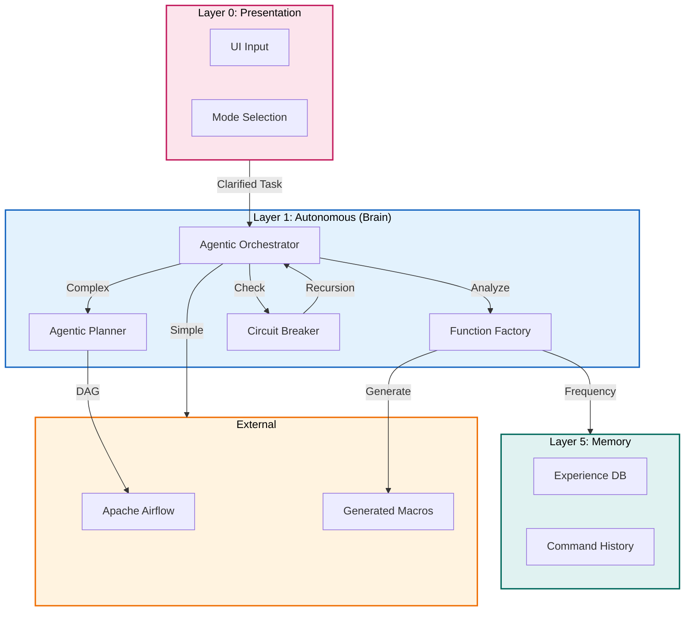

# Plan: Layer 1 - Autonomous Layer (The Brain)

## Objective

Implement the cognitive epicenter of Torro Agent that handles:
1. High-level reasoning and workflow dispatch
2. Airflow DAG orchestration with token budgets
3. Agentic Function Factory for CLI macro generation
4. Cognitive retention and context management

## Constraints

- Max context per task: 128k tokens
- Max execution time per task: 10 minutes
- Max files per task: 5 files
- Anti-hallucination: All tasks must specify exact commands and line numbers
- Must follow Torro Agentic Coding Principles (FN: prefix, <200 lines per file)
- Strict Layered Isolation: API -> Task -> DB

## Current State Analysis

### Existing Implementation

From [`agentic/plan/20260501_130000_layer1plan.md`](agentic/plan/20260501_130000_layer1plan.md:1):
- Plan exists but implementation not started
- Requires `engine/autonomous/orchestrator.py`
- Requires `engine/autonomous/planner.py`
- Requires `engine/autonomous/function_factory.py`

### Gap vs. Industry Standards

| Feature | Claude Code | Hermes Agent | Torro Current | Torro Target |
|---------|-------------|--------------|---------------|--------------|
| Orchestrator | ✅ coordinatorMode.ts | ❌ | ❌ | ✅ Python class |
| Airflow Integration | ❌ | ✅ DAGs | ❌ | ✅ Python DAGs |
| Token Optimization | ❌ | ❌ | ❌ | ✅ Macro generator |
| Circuit Breaker | ✅ Yes | ✅ Yes | ❌ | ✅ 3-strike rule |

## Architecture Diagram



## Research Findings

### Claude Code Coordinator Pattern

From [`legacy/claude-code/src/coordinator/coordinatorMode.ts`](legacy/claude-code/src/coordinator/coordinatorMode.ts:36):
```typescript
// Dynamic worker agent spawning
// Tool delegation with ASYNC_AGENT_ALLOWED_TOOLS
// MCP server integration for extended capabilities
```

### Hermes Agent Context Engine

From [`legacy/hermes-agent/agent/context_engine.py`](legacy/hermes-agent/agent/context_engine.py:32):
```python
class ContextEngine(ABC):
    """Base class all context engines must implement."""
    
    @property
    @abstractmethod
    def name(self) -> str
    
    def update_from_response(self, usage: Dict[str, Any]) -> None
    def should_compress(self, prompt_tokens: int = None) -> bool
    def compress(self, messages: List[Dict[str, Any]]) -> List[Dict[str, Any]]
```

## Tasks (DAG)

### Phase 1: Agentic Orchestration
- **Token Budget:** 1M
- **Entry Criteria:** Layer 0 CLI functional
- **Exit Criteria:** Orchestrator routes tasks correctly

### Task 1: Create Agentic Orchestrator
- [ ] Status: Pending
- **Objective:** Create `src/autonomous/orchestrator.py` with task routing logic
- **Input Contract:**
  - Read: `src/cli/interactive.py` (lines 1-150)
  - Read: `legacy/claude-code/src/coordinator/coordinatorMode.ts` (lines 1-100)
- **Output Contract:**
  - Create: `src/autonomous/orchestrator.py` (~150 lines)
- **Exact Commands:**
  ```bash
  # Step 1: Create orchestrator.py
  touch src/autonomous/orchestrator.py
  
  # Step 2: Verify syntax
  python3 -m py_compile src/autonomous/orchestrator.py
  
  # Step 3: Test import
  python3 -c "from src.autonomous.orchestrator import AgenticOrchestrator; print('OK')"
  ```
- **Expected Output:** Import successful, no errors
- **Fallback Path:** If import fails, check PYTHONPATH
- **Dependencies:** Layer 0 Task 7
- **Estimated Time:** 8 minutes
- **Context Firewall:**
  - Required: `src/cli/interactive.py`, `legacy/claude-code/src/coordinator/`
  - Excluded: `src/execution/`, `src/reporting/`

### Task 2: Create Agentic Planner with Airflow
- [ ] Status: Pending
- **Objective:** Create `src/autonomous/planner.py` for Airflow DAG generation
- **Input Contract:**
  - Read: `src/autonomous/orchestrator.py` (lines 1-150)
  - Read: `airflow/dags/` (existing patterns)
- **Output Contract:**
  - Create: `src/autonomous/planner.py` (~120 lines)
- **Exact Commands:**
  ```bash
  # Step 1: Create planner.py
  touch src/autonomous/planner.py
  
  # Step 2: Verify syntax
  python3 -m py_compile src/autonomous/planner.py
  
  # Step 3: Test import
  python3 -c "from src.autonomous.planner import AgenticPlanner; print('OK')"
  ```
- **Expected Output:** Import successful, no errors
- **Fallback Path:** If Airflow import fails, check installation
- **Dependencies:** Task 1
- **Estimated Time:** 10 minutes
- **Context Firewall:**
  - Required: `src/autonomous/orchestrator.py`, `airflow/dags/`
  - Excluded: `src/execution/`, `src/memory/`

### Task 3: Implement Circuit Breaker
- [ ] Status: Pending
- **Objective:** Add recursion detection to orchestrator
- **Input Contract:**
  - Read: `src/autonomous/orchestrator.py` (lines 1-150)
  - Read: `src/sre/errors.py` (for error patterns)
- **Output Contract:**
  - Modify: `src/autonomous/orchestrator.py` (add circuit breaker at lines 100-150)
- **Exact Commands:**
  ```bash
  # Step 1: Add circuit breaker logic
  # Step 2: Verify syntax
  python3 -m py_compile src/autonomous/orchestrator.py
  
  # Step 3: Test circuit breaker
  python3 -c "from src.autonomous.orchestrator import AgenticOrchestrator; o = AgenticOrchestrator(); o.test_recursion()"
  ```
- **Expected Output:** CircuitBreakerError raised after 3 recursions
- **Fallback Path:** Check counter implementation
- **Dependencies:** Task 1
- **Estimated Time:** 7 minutes
- **Context Firewall:**
  - Required: `src/autonomous/orchestrator.py`, `src/sre/errors.py`
  - Excluded: `src/execution/`, `src/reporting/`

### Phase 2: Token Optimization
- **Token Budget:** 1M
- **Entry Criteria:** Phase 1 complete
- **Exit Criteria:** Function factory generates macros

### Task 4: Create Function Factory
- [ ] Status: Pending
- **Objective:** Create `src/autonomous/function_factory.py` for macro generation
- **Input Contract:**
  - Read: `src/autonomous/orchestrator.py` (lines 1-150)
  - Read: `legacy/hermes-agent/agent/context_engine.py` (lines 1-100)
- **Output Contract:**
  - Create: `src/autonomous/function_factory.py` (~100 lines)
- **Exact Commands:**
  ```bash
  # Step 1: Create function_factory.py
  touch src/autonomous/function_factory.py
  
  # Step 2: Verify syntax
  python3 -m py_compile src/autonomous/function_factory.py
  
  # Step 3: Test import
  python3 -c "from src.autonomous.function_factory import FunctionFactory; print('OK')"
  ```
- **Expected Output:** Import successful, no errors
- **Fallback Path:** Check subprocess imports
- **Dependencies:** Task 2
- **Estimated Time:** 8 minutes
- **Context Firewall:**
  - Required: `src/autonomous/orchestrator.py`, `legacy/hermes-agent/agent/`
  - Excluded: `src/execution/`, `src/memory/`

### Task 5: Implement Command Frequency Analyzer
- [ ] Status: Pending
- **Objective:** Add frequency analysis to function factory
- **Input Contract:**
  - Read: `src/autonomous/function_factory.py` (lines 1-100)
  - Read: `src/memory/experience_db.py` (for command history)
- **Output Contract:**
  - Modify: `src/autonomous/function_factory.py` (add analyze method at lines 50-100)
- **Exact Commands:**
  ```bash
  # Step 1: Add frequency analysis
  # Step 2: Verify syntax
  python3 -m py_compile src/autonomous/function_factory.py
  
  # Step 3: Test analysis
  python3 -c "from src.autonomous.function_factory import FunctionFactory; f = FunctionFactory(); f.analyze(['cmd1', 'cmd1', 'cmd1'])"
  ```
- **Expected Output:** Returns list of frequent commands
- **Fallback Path:** Check counter logic
- **Dependencies:** Task 4
- **Estimated Time:** 7 minutes
- **Context Firewall:**
  - Required: `src/autonomous/function_factory.py`, `src/memory/experience_db.py`
  - Excluded: `src/execution/`, `src/reporting/`

### Task 6: Implement Python Macro Generator
- [ ] Status: Pending
- **Objective:** Generate Python wrapper functions for frequent commands
- **Input Contract:**
  - Read: `src/autonomous/function_factory.py` (lines 1-100)
  - Read: `agentic/standard/AGENT.md` (for FN: patterns)
- **Output Contract:**
  - Modify: `src/autonomous/function_factory.py` (add generate method at lines 75-100)
- **Exact Commands:**
  ```bash
  # Step 1: Add macro generator
  # Step 2: Verify syntax
  python3 -m py_compile src/autonomous/function_factory.py
  
  # Step 3: Test generation
  python3 -c "from src.autonomous.function_factory import FunctionFactory; f = FunctionFactory(); print(f.generate_macro('git status'))"
  ```
- **Expected Output:** Valid Python function string with FN: docstring
- **Fallback Path:** Check string formatting
- **Dependencies:** Task 5
- **Estimated Time:** 8 minutes
- **Context Firewall:**
  - Required: `src/autonomous/function_factory.py`, `agentic/standard/AGENT.md`
  - Excluded: `src/execution/`, `src/reporting/`

### Task 7: Integration Test
- [ ] Status: Pending
- **Objective:** Verify orchestrator, planner, and function factory work together
- **Input Contract:**
  - Read: `src/autonomous/orchestrator.py` (lines 1-150)
  - Read: `src/autonomous/planner.py` (lines 1-120)
  - Read: `src/autonomous/function_factory.py` (lines 1-100)
- **Output Contract:**
  - Create: `tests/unit/autonomous/test_orchestrator.py` (~80 lines)
- **Exact Commands:**
  ```bash
  # Step 1: Create test file
  touch tests/unit/autonomous/test_orchestrator.py
  
  # Step 2: Run tests
  python3 -m pytest tests/unit/autonomous/test_orchestrator.py -v
  
  # Step 3: Verify coverage
  python3 -m pytest tests/unit/autonomous/ -v --cov=src/autonomous
  ```
- **Expected Output:** All tests pass with >80% coverage
- **Fallback Path:** Check test fixtures
- **Dependencies:** Task 6
- **Estimated Time:** 10 minutes
- **Context Firewall:**
  - Required: All autonomous layer files
  - Excluded: `src/execution/`, `src/reporting/`

## Anti-Hallucination Checklist

- [x] Task specifies exact file paths (relative to project root)
- [x] Task specifies line ranges for files to read
- [x] Task specifies estimated line count for files to create
- [x] Task includes exact shell commands (copy-paste ready)
- [x] Task includes expected output patterns to match
- [x] Task includes fallback commands for common errors
- [x] Task has no ambiguous language

## Context Firewalls

### Per-Task Context Boundaries

| Task | Required Context | Excluded Context |
|------|------------------|------------------|
| Task 1 | `src/cli/interactive.py`, `legacy/claude-code/src/coordinator/` | `src/execution/`, `src/reporting/` |
| Task 2 | `src/autonomous/orchestrator.py`, `airflow/dags/` | `src/execution/`, `src/memory/` |
| Task 3 | `src/autonomous/orchestrator.py`, `src/sre/errors.py` | `src/execution/`, `src/reporting/` |
| Task 4 | `src/autonomous/orchestrator.py`, `legacy/hermes-agent/agent/` | `src/execution/`, `src/memory/` |
| Task 5 | `src/autonomous/function_factory.py`, `src/memory/experience_db.py` | `src/execution/`, `src/reporting/` |
| Task 6 | `src/autonomous/function_factory.py`, `agentic/standard/AGENT.md` | `src/execution/`, `src/reporting/` |
| Task 7 | All autonomous files | `src/execution/`, `src/reporting/` |

## Acceptance Criteria

1. **Orchestrator routes correctly** - Tasks routed to planner or direct execution
2. **Airflow DAGs generated** - Planner produces valid Python DAG strings
3. **Circuit breaker triggers** - Recursion detected after 3 attempts
4. **Macros generated** - Function factory creates Python wrappers
5. **All tests pass** - Unit tests verify all components

## Change Log

| Date | Change | Author |
|------|--------|--------|
| 2026-05-02 | Initial plan created | Agentic Planner |
