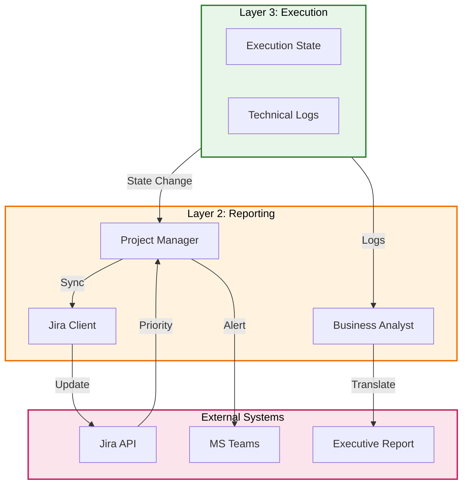

# Plan: Layer 2 - Reporting Layer (Enterprise Collaboration)

## Objective

Implement the enterprise reporting layer of Torro Agent that handles:
1. Bi-directional Jira synchronization
2. Executive report generation from technical logs
3. MS Teams/Slack status updates
4. Business value translation from technical output

## Constraints

- Max context per task: 128k tokens
- Max execution time per task: 10 minutes
- Max files per task: 5 files
- Anti-hallucination: All tasks must specify exact commands and line numbers
- Must follow Torro Agentic Coding Principles (FN: prefix, <200 lines per file)
- Strong Typing: All schemas must use Pydantic
- Configuration: Externalized Config (config.ini) only

## Current State Analysis

### Existing Implementation

From [`agentic/plan/20260501_130000_layer2plan.md`](agentic/plan/20260501_130000_layer2plan.md:1):
- Plan exists but implementation not started
- Requires `engine/reporting/jira_client.py`
- Requires `engine/reporting/project_manager.py`
- Requires `engine/reporting/business_analyst.py`

### Gap vs. Industry Standards

| Feature | Claude Code | Hermes Agent | Torro Current | Torro Target |
|---------|-------------|--------------|---------------|--------------|
| Jira Sync | ❌ | ❌ | ❌ | ✅ Bi-directional |
| Executive Reports | ❌ | ❌ | ❌ | ✅ BA Agent |
| Teams Integration | ❌ | ✅ Gateway | ❌ | ✅ Status updates |
| Business Translation | ❌ | ❌ | ❌ | ✅ Tech to business |

## Architecture Diagram



## Research Findings

### Hermes Agent Gateway Pattern

From [`legacy/hermes-agent/gateway/platforms/base.py`](legacy/hermes-agent/gateway/platforms/base.py:37):
```python
class BasePlatformAdapter(ABC):
    """All platform adapters inherit from this."""
    
    @abstractmethod
    async def process_message(self, event: MessageEvent) -> ProcessingOutcome
    
    @abstractmethod
    async def send_message(self, event: MessageEvent, text: str) -> SendResult
```

### Everything Claude Code Agent Pattern

From [`legacy/everything-claude-code/agents/planner.md`](legacy/everything-claude-code/agents/planner.md:1):
```markdown
---
name: planner
description: Creates detailed implementation plans
tools: [read, write, search]
---
```

## Tasks (DAG)

### Phase 1: Bi-Directional Jira Synchronization
- **Token Budget:** 1M
- **Entry Criteria:** Layer 1 functional
- **Exit Criteria:** Jira sync operational

### Task 1: Create Jira API Client
- [ ] Status: Pending
- **Objective:** Create `src/reporting/jira_client.py` with Pydantic schemas
- **Input Contract:**
  - Read: `config.ini` (lines 1-50 for Jira config section)
  - Read: `legacy/hermes-agent/gateway/platforms/base.py` (lines 1-100)
- **Output Contract:**
  - Create: `src/reporting/jira_client.py` (~120 lines)
  - Create: `src/reporting/schemas.py` (~80 lines)
- **Exact Commands:**
  ```bash
  # Step 1: Create schemas file
  touch src/reporting/schemas.py
  
  # Step 2: Create Jira client
  touch src/reporting/jira_client.py
  
  # Step 3: Verify syntax
  python3 -m py_compile src/reporting/jira_client.py
  
  # Step 4: Test import
  python3 -c "from src.reporting.jira_client import JiraClient; print('OK')"
  ```
- **Expected Output:** Import successful, no errors
- **Fallback Path:** If requests not found, run `pip install requests`
- **Dependencies:** Layer 1 Task 7
- **Estimated Time:** 8 minutes
- **Context Firewall:**
  - Required: `config.ini`, `legacy/hermes-agent/gateway/`
  - Excluded: `src/execution/`, `src/memory/`

### Task 2: Create Project Manager Agent
- [ ] Status: Pending
- **Objective:** Create `src/reporting/project_manager.py` for execution polling
- **Input Contract:**
  - Read: `src/reporting/jira_client.py` (lines 1-120)
  - Read: `src/autonomous/orchestrator.py` (for state patterns)
- **Output Contract:**
  - Create: `src/reporting/project_manager.py` (~100 lines)
- **Exact Commands:**
  ```bash
  # Step 1: Create project_manager.py
  touch src/reporting/project_manager.py
  
  # Step 2: Verify syntax
  python3 -m py_compile src/reporting/project_manager.py
  
  # Step 3: Test import
  python3 -c "from src.reporting.project_manager import ProjectManagerAgent; print('OK')"
  ```
- **Expected Output:** Import successful, no errors
- **Fallback Path:** Check JiraClient import
- **Dependencies:** Task 1
- **Estimated Time:** 8 minutes
- **Context Firewall:**
  - Required: `src/reporting/jira_client.py`, `src/autonomous/`
  - Excluded: `src/execution/`, `src/memory/`

### Task 3: Implement Priority Escalation
- [ ] Status: Pending
- **Objective:** Add CRITICAL ticket detection to project manager
- **Input Contract:**
  - Read: `src/reporting/project_manager.py` (lines 1-100)
  - Read: `src/sre/errors.py` (for error classification)
- **Output Contract:**
  - Modify: `src/reporting/project_manager.py` (add escalation at lines 70-100)
- **Exact Commands:**
  ```bash
  # Step 1: Add escalation logic
  # Step 2: Verify syntax
  python3 -m py_compile src/reporting/project_manager.py
  
  # Step 3: Test escalation
  python3 -c "from src.reporting.project_manager import ProjectManagerAgent; p = ProjectManagerAgent(); p.check_priority_escalation('CRITICAL')"
  ```
- **Expected Output:** Escalation triggered for CRITICAL priority
- **Fallback Path:** Check priority mapping
- **Dependencies:** Task 2
- **Estimated Time:** 7 minutes
- **Context Firewall:**
  - Required: `src/reporting/project_manager.py`, `src/sre/errors.py`
  - Excluded: `src/execution/`, `src/memory/`

### Phase 2: Executive Report Generation
- **Token Budget:** 1M
- **Entry Criteria:** Phase 1 complete
- **Exit Criteria:** BA Agent generates reports

### Task 4: Create Business Analyst Agent
- [ ] Status: Pending
- **Objective:** Create `src/reporting/business_analyst.py` for tech translation
- **Input Contract:**
  - Read: `src/reporting/project_manager.py` (lines 1-100)
  - Read: `agentic/standard/AGENT.md` (for agent patterns)
- **Output Contract:**
  - Create: `src/reporting/business_analyst.py` (~120 lines)
- **Exact Commands:**
  ```bash
  # Step 1: Create business_analyst.py
  touch src/reporting/business_analyst.py
  
  # Step 2: Verify syntax
  python3 -m py_compile src/reporting/business_analyst.py
  
  # Step 3: Test import
  python3 -c "from src.reporting.business_analyst import BusinessAnalystAgent; print('OK')"
  ```
- **Expected Output:** Import successful, no errors
- **Fallback Path:** Check jinja2 installation
- **Dependencies:** Task 3
- **Estimated Time:** 8 minutes
- **Context Firewall:**
  - Required: `src/reporting/project_manager.py`, `agentic/standard/AGENT.md`
  - Excluded: `src/execution/`, `src/memory/`

### Task 5: Implement Technical Log Parser
- [ ] Status: Pending
- **Objective:** Add log parsing to business analyst
- **Input Contract:**
  - Read: `src/reporting/business_analyst.py` (lines 1-120)
  - Read: `src/memory/analysis_logs.py` (for log format)
- **Output Contract:**
  - Modify: `src/reporting/business_analyst.py` (add parse method at lines 50-80)
- **Exact Commands:**
  ```bash
  # Step 1: Add parser logic
  # Step 2: Verify syntax
  python3 -m py_compile src/reporting/business_analyst.py
  
  # Step 3: Test parsing
  python3 -c "from src.reporting.business_analyst import BusinessAnalystAgent; b = BusinessAnalystAgent(); b.parse_technical_logs('ERROR: Connection failed')"
  ```
- **Expected Output:** Structured dict with affected systems
- **Fallback Path:** Check regex patterns
- **Dependencies:** Task 4
- **Estimated Time:** 7 minutes
- **Context Firewall:**
  - Required: `src/reporting/business_analyst.py`, `src/memory/analysis_logs.py`
  - Excluded: `src/execution/`, `src/presentation/`

### Task 6: Implement Executive Summary Generator
- [ ] Status: Pending
- **Objective:** Generate markdown reports from parsed logs
- **Input Contract:**
  - Read: `src/reporting/business_analyst.py` (lines 1-120)
  - Read: `agentic/standard/UI.md` (for report formatting)
- **Output Contract:**
  - Modify: `src/reporting/business_analyst.py` (add generate method at lines 85-120)
- **Exact Commands:**
  ```bash
  # Step 1: Add generator logic
  # Step 2: Verify syntax
  python3 -m py_compile src/reporting/business_analyst.py
  
  # Step 3: Test generation
  python3 -c "from src.reporting.business_analyst import BusinessAnalystAgent; b = BusinessAnalystAgent(); print(b.generate_executive_summary({}))"
  ```
- **Expected Output:** Formatted markdown string
- **Fallback Path:** Check template syntax
- **Dependencies:** Task 5
- **Estimated Time:** 8 minutes
- **Context Firewall:**
  - Required: `src/reporting/business_analyst.py`, `agentic/standard/UI.md`
  - Excluded: `src/execution/`, `src/presentation/`

### Task 7: Integration Test
- [ ] Status: Pending
- **Objective:** Verify all reporting components work together
- **Input Contract:**
  - Read: `src/reporting/jira_client.py` (lines 1-120)
  - Read: `src/reporting/project_manager.py` (lines 1-100)
  - Read: `src/reporting/business_analyst.py` (lines 1-120)
- **Output Contract:**
  - Create: `tests/unit/reporting/test_project_manager.py` (~80 lines)
  - Create: `tests/unit/reporting/test_business_analyst.py` (~80 lines)
- **Exact Commands:**
  ```bash
  # Step 1: Create test directory
  mkdir -p tests/unit/reporting
  
  # Step 2: Create test files
  touch tests/unit/reporting/test_project_manager.py
  touch tests/unit/reporting/test_business_analyst.py
  
  # Step 3: Run tests
  python3 -m pytest tests/unit/reporting/ -v
  
  # Step 4: Verify coverage
  python3 -m pytest tests/unit/reporting/ -v --cov=src/reporting
  ```
- **Expected Output:** All tests pass with >80% coverage
- **Fallback Path:** Check test fixtures
- **Dependencies:** Task 6
- **Estimated Time:** 10 minutes
- **Context Firewall:**
  - Required: All reporting files
  - Excluded: `src/execution/`, `src/memory/`

## Anti-Hallucination Checklist

- [x] Task specifies exact file paths (relative to project root)
- [x] Task specifies line ranges for files to read
- [x] Task specifies estimated line count for files to create
- [x] Task includes exact shell commands (copy-paste ready)
- [x] Task includes expected output patterns to match
- [x] Task includes fallback commands for common errors
- [x] Task has no ambiguous language

## Context Firewalls

### Per-Task Context Boundaries

| Task | Required Context | Excluded Context |
|------|------------------|------------------|
| Task 1 | `config.ini`, `legacy/hermes-agent/gateway/` | `src/execution/`, `src/memory/` |
| Task 2 | `src/reporting/jira_client.py`, `src/autonomous/` | `src/execution/`, `src/memory/` |
| Task 3 | `src/reporting/project_manager.py`, `src/sre/errors.py` | `src/execution/`, `src/memory/` |
| Task 4 | `src/reporting/project_manager.py`, `agentic/standard/AGENT.md` | `src/execution/`, `src/memory/` |
| Task 5 | `src/reporting/business_analyst.py`, `src/memory/analysis_logs.py` | `src/execution/`, `src/presentation/` |
| Task 6 | `src/reporting/business_analyst.py`, `agentic/standard/UI.md` | `src/execution/`, `src/presentation/` |
| Task 7 | All reporting files | `src/execution/`, `src/memory/` |

## Acceptance Criteria

1. **Jira client functional** - Can fetch and update tickets
2. **PM polls correctly** - Execution state synced to Jira
3. **Priority escalation works** - CRITICAL tickets trigger alerts
4. **BA parses logs** - Technical logs converted to structured data
5. **Executive reports generated** - Markdown reports with business value
6. **All tests pass** - Unit tests verify all components

## Change Log

| Date | Change | Author |
|------|--------|--------|
| 2026-05-02 | Initial plan created | Agentic Planner |
