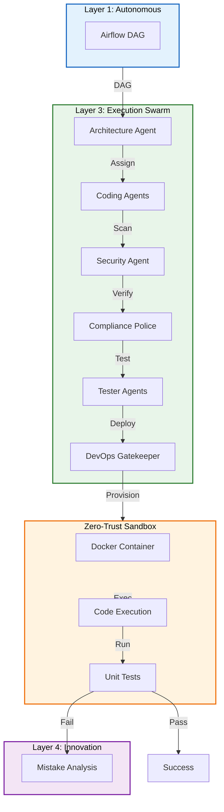

# Plan: Layer 3 - Execution Layer (Deterministic Factory Floor)

## Objective

Implement the execution swarm of Torro Agent that handles:
1. Zero-Trust Docker sandboxing for all code execution
2. Security Agent payload scanning
3. Compliance Police verification
4. Fail-fast feedback loop to Layer 1
5. Multi-agent validation (Security, Compliance, Tester)

## Constraints

- Max context per task: 128k tokens
- Max execution time per task: 10 minutes
- Max files per task: 5 files
- Anti-hallucination: All tasks must specify exact commands and line numbers
- Must follow Torro Agentic Coding Principles (FN: prefix, <200 lines per file)
- Strict Least Privilege: No execution on host OS
- Any failing test must trigger Mistake Analysis hook

## Current State Analysis

### Existing Implementation

From [`agentic/plan/20260501_130000_layer3plan.md`](agentic/plan/20260501_130000_layer3plan.md:1):
- Plan exists but implementation not started
- Requires `engine/execution/devops_gatekeeper.py`
- Requires `engine/execution/security_agent.py`
- Requires `engine/execution/compliance_agent.py`

### Gap vs. Industry Standards

| Feature | Claude Code | Hermes Agent | Torro Current | Torro Target |
|---------|-------------|--------------|---------------|--------------|
| Docker Sandboxing | ❌ | ✅ Environments | ❌ | ✅ Ephemeral |
| Security Scan | ✅ classifyForCollapse | ❌ | ❌ | ✅ Regex heuristics |
| Compliance Check | ❌ | ❌ | ❌ | ✅ FN: verification |
| Fail-Fast Loop | ✅ Yes | ✅ Yes | ❌ | ✅ Immediate |

## Architecture Diagram



## Research Findings

### Claude Code Tool Contract

From [`legacy/claude-code/src/Tool.ts`](legacy/claude-code/src/Tool.ts:15):
```typescript
export type Tool = {
  name: string
  description: string
  inputSchema: ToolInputJSONSchema
  checkPermissions: () => PermissionResult
  validateInput: (input: unknown) => ValidationResult
  call: (input: ToolInput, context: ToolCallContext) => Promise<ToolResult>
}
```

### Hermes Agent Error Classifier

From [`legacy/hermes-agent/agent/error_classifier.py`](legacy/hermes-agent/agent/error_classifier.py:24):
```python
class FailoverReason(enum.Enum):
    """Why an API call failed — determines recovery strategy."""
    auth = "auth"
    rate_limit = "rate_limit"
    context_overflow = "context_overflow"
```

## Tasks (DAG)

### Phase 1: Zero-Trust Sandboxing
- **Token Budget:** 1M
- **Entry Criteria:** Layer 2 functional
- **Exit Criteria:** Docker sandboxing operational

### Task 1: Create DevOps Gatekeeper
- [ ] Status: Pending
- **Objective:** Create `src/execution/devops_gatekeeper.py` for container management
- **Input Contract:**
  - Read: `config.ini` (lines 1-50 for Docker config)
  - Read: `legacy/hermes-agent/tools/environments/` (for sandbox patterns)
- **Output Contract:**
  - Create: `src/execution/devops_gatekeeper.py` (~150 lines)
- **Exact Commands:**
  ```bash
  # Step 1: Create devops_gatekeeper.py
  touch src/execution/devops_gatekeeper.py
  
  # Step 2: Verify syntax
  python3 -m py_compile src/execution/devops_gatekeeper.py
  
  # Step 3: Test import
  python3 -c "from src.execution.devops_gatekeeper import DevOpsGatekeeper; print('OK')"
  ```
- **Expected Output:** Import successful, no errors
- **Fallback Path:** If docker SDK not found, run `pip install docker`
- **Dependencies:** Layer 2 Task 7
- **Estimated Time:** 8 minutes
- **Context Firewall:**
  - Required: `config.ini`, `legacy/hermes-agent/tools/`
  - Excluded: `src/memory/`, `src/reporting/`

### Task 2: Implement Sandbox Provisioner
- [ ] Status: Pending
- **Objective:** Add container provisioning to DevOps Gatekeeper
- **Input Contract:**
  - Read: `src/execution/devops_gatekeeper.py` (lines 1-150)
  - Read: `src/sre/errors.py` (for error patterns)
- **Output Contract:**
  - Modify: `src/execution/devops_gatekeeper.py` (add provision method at lines 50-100)
- **Exact Commands:**
  ```bash
  # Step 1: Add provision logic
  # Step 2: Verify syntax
  python3 -m py_compile src/execution/devops_gatekeeper.py
  
  # Step 3: Test provisioning
  python3 -c "from src.execution.devops_gatekeeper import DevOpsGatekeeper; d = DevOpsGatekeeper(); d.provision_sandbox()"
  ```
- **Expected Output:** Container ID returned
- **Fallback Path:** Check Docker daemon status
- **Dependencies:** Task 1
- **Estimated Time:** 8 minutes
- **Context Firewall:**
  - Required: `src/execution/devops_gatekeeper.py`, `src/sre/errors.py`
  - Excluded: `src/memory/`, `src/reporting/`

### Task 3: Implement Sandbox Executor
- [ ] Status: Pending
- **Objective:** Add command execution inside container
- **Input Contract:**
  - Read: `src/execution/devops_gatekeeper.py` (lines 1-150)
  - Read: `agentic/standard/AGENT.md` (for FN: patterns)
- **Output Contract:**
  - Modify: `src/execution/devops_gatekeeper.py` (add execute method at lines 100-150)
- **Exact Commands:**
  ```bash
  # Step 1: Add execute logic
  # Step 2: Verify syntax
  python3 -m py_compile src/execution/devops_gatekeeper.py
  
  # Step 3: Test execution
  python3 -c "from src.execution.devops_gatekeeper import DevOpsGatekeeper; d = DevOpsGatekeeper(); d.execute_in_sandbox('container_id', 'echo test')"
  ```
- **Expected Output:** Command output captured
- **Fallback Path:** Check container permissions
- **Dependencies:** Task 2
- **Estimated Time:** 7 minutes
- **Context Firewall:**
  - Required: `src/execution/devops_gatekeeper.py`, `agentic/standard/AGENT.md`
  - Excluded: `src/memory/`, `src/reporting/`

### Phase 2: Validation Swarm
- **Token Budget:** 1M
- **Entry Criteria:** Phase 1 complete
- **Exit Criteria:** Security and Compliance agents functional

### Task 4: Create Security Agent
- [ ] Status: Pending
- **Objective:** Create `src/execution/security_agent.py` for payload scanning
- **Input Contract:**
  - Read: `src/execution/devops_gatekeeper.py` (lines 1-150)
  - Read: `legacy/claude-code/src/utils/security.ts` (for security patterns)
- **Output Contract:**
  - Create: `src/execution/security_agent.py` (~100 lines)
- **Exact Commands:**
  ```bash
  # Step 1: Create security_agent.py
  touch src/execution/security_agent.py
  
  # Step 2: Verify syntax
  python3 -m py_compile src/execution/security_agent.py
  
  # Step 3: Test import
  python3 -c "from src.execution.security_agent import SecurityAgent; print('OK')"
  ```
- **Expected Output:** Import successful, no errors
- **Fallback Path:** Check regex imports
- **Dependencies:** Task 3
- **Estimated Time:** 8 minutes
- **Context Firewall:**
  - Required: `src/execution/devops_gatekeeper.py`, `legacy/claude-code/src/utils/`
  - Excluded: `src/memory/`, `src/reporting/`

### Task 5: Implement Payload Scanner
- [ ] Status: Pending
- **Objective:** Add vulnerability detection to Security Agent
- **Input Contract:**
  - Read: `src/execution/security_agent.py` (lines 1-100)
  - Read: `src/sre/errors.py` (for SecurityViolationError)
- **Output Contract:**
  - Modify: `src/execution/security_agent.py` (add scan method at lines 50-100)
- **Exact Commands:**
  ```bash
  # Step 1: Add scanner logic
  # Step 2: Verify syntax
  python3 -m py_compile src/execution/security_agent.py
  
  # Step 3: Test scanning
  python3 -c "from src.execution.security_agent import SecurityAgent; s = SecurityAgent(); s.scan_payload('os.system(\"rm -rf /\")')"
  ```
- **Expected Output:** SecurityViolationError raised
- **Fallback Path:** Check regex patterns
- **Dependencies:** Task 4
- **Estimated Time:** 7 minutes
- **Context Firewall:**
  - Required: `src/execution/security_agent.py`, `src/sre/errors.py`
  - Excluded: `src/memory/`, `src/reporting/`

### Task 6: Create Compliance Police Agent
- [ ] Status: Pending
- **Objective:** Create `src/execution/compliance_agent.py` for Torro standard verification
- **Input Contract:**
  - Read: `src/execution/security_agent.py` (lines 1-100)
  - Read: `agentic/standard/AGENT.md` (for compliance rules)
- **Output Contract:**
  - Create: `src/execution/compliance_agent.py` (~100 lines)
- **Exact Commands:**
  ```bash
  # Step 1: Create compliance_agent.py
  touch src/execution/compliance_agent.py
  
  # Step 2: Verify syntax
  python3 -m py_compile src/execution/compliance_agent.py
  
  # Step 3: Test import
  python3 -c "from src.execution.compliance_agent import CompliancePolice; print('OK')"
  ```
- **Expected Output:** Import successful, no errors
- **Fallback Path:** Check file operations
- **Dependencies:** Task 5
- **Estimated Time:** 8 minutes
- **Context Firewall:**
  - Required: `src/execution/security_agent.py`, `agentic/standard/AGENT.md`
  - Excluded: `src/memory/`, `src/reporting/`

### Task 7: Implement Torro Standards Verifier
- [ ] Status: Pending
- **Objective:** Add FN: verification and line count check
- **Input Contract:**
  - Read: `src/execution/compliance_agent.py` (lines 1-100)
  - Read: `agentic/standard/UI.md` (for formatting rules)
- **Output Contract:**
  - Modify: `src/execution/compliance_agent.py` (add verify method at lines 50-100)
- **Exact Commands:**
  ```bash
  # Step 1: Add verifier logic
  # Step 2: Verify syntax
  python3 -m py_compile src/execution/compliance_agent.py
  
  # Step 3: Test verification
  python3 -c "from src.execution.compliance_agent import CompliancePolice; c = CompliancePolice(); c.verify_torro_standards('def test(): pass')"
  ```
- **Expected Output:** ComplianceReport with pass/fail status
- **Fallback Path:** Check docstring parsing
- **Dependencies:** Task 6
- **Estimated Time:** 7 minutes
- **Context Firewall:**
  - Required: `src/execution/compliance_agent.py`, `agentic/standard/UI.md`
  - Excluded: `src/memory/`, `src/reporting/`

### Task 8: Create Execution Orchestrator
- [ ] Status: Pending
- **Objective:** Create `src/execution/orchestrator.py` for execution loop
- **Input Contract:**
  - Read: `src/execution/devops_gatekeeper.py` (lines 1-150)
  - Read: `src/execution/security_agent.py` (lines 1-100)
  - Read: `src/execution/compliance_agent.py` (lines 1-100)
- **Output Contract:**
  - Create: `src/execution/orchestrator.py` (~120 lines)
- **Exact Commands:**
  ```bash
  # Step 1: Create orchestrator.py
  touch src/execution/orchestrator.py
  
  # Step 2: Verify syntax
  python3 -m py_compile src/execution/orchestrator.py
  
  # Step 3: Test import
  python3 -c "from src.execution.orchestrator import ExecutionOrchestrator; print('OK')"
  ```
- **Expected Output:** Import successful, no errors
- **Fallback Path:** Check circular imports
- **Dependencies:** Task 7
- **Estimated Time:** 8 minutes
- **Context Firewall:**
  - Required: All execution layer files
  - Excluded: `src/memory/`, `src/reporting/`

### Task 9: Implement Fail-Fast Loop
- [ ] Status: Pending
- **Objective:** Add mistake analysis trigger to orchestrator
- **Input Contract:**
  - Read: `src/execution/orchestrator.py` (lines 1-120)
  - Read: `src/innovation/auto_dream.py` (for mistake patterns)
- **Output Contract:**
  - Modify: `src/execution/orchestrator.py` (add fail-fast at lines 80-120)
- **Exact Commands:**
  ```bash
  # Step 1: Add fail-fast logic
  # Step 2: Verify syntax
  python3 -m py_compile src/execution/orchestrator.py
  
  # Step 3: Test failure handling
  python3 -c "from src.execution.orchestrator import ExecutionOrchestrator; e = ExecutionOrchestrator(); e.run_execution_cycle('bad_code')"
  ```
- **Expected Output:** MistakeAnalysisReport generated
- **Fallback Path:** Check error handling
- **Dependencies:** Task 8
- **Estimated Time:** 7 minutes
- **Context Firewall:**
  - Required: `src/execution/orchestrator.py`, `src/innovation/auto_dream.py`
  - Excluded: `src/memory/`, `src/reporting/`

### Task 10: Integration Test
- [ ] Status: Pending
- **Objective:** Verify all execution components work together
- **Input Contract:**
  - Read: All execution layer files
- **Output Contract:**
  - Create: `tests/unit/execution/test_devops.py` (~80 lines)
  - Create: `tests/unit/execution/test_security.py` (~80 lines)
  - Create: `tests/unit/execution/test_compliance.py` (~80 lines)
- **Exact Commands:**
  ```bash
  # Step 1: Create test directory
  mkdir -p tests/unit/execution
  
  # Step 2: Create test files
  touch tests/unit/execution/test_devops.py
  touch tests/unit/execution/test_security.py
  touch tests/unit/execution/test_compliance.py
  
  # Step 3: Run tests
  python3 -m pytest tests/unit/execution/ -v
  
  # Step 4: Verify coverage
  python3 -m pytest tests/unit/execution/ -v --cov=src/execution
  ```
- **Expected Output:** All tests pass with >80% coverage
- **Fallback Path:** Check Docker daemon
- **Dependencies:** Task 9
- **Estimated Time:** 10 minutes
- **Context Firewall:**
  - Required: All execution files
  - Excluded: `src/memory/`, `src/reporting/`

## Anti-Hallucination Checklist

- [x] Task specifies exact file paths (relative to project root)
- [x] Task specifies line ranges for files to read
- [x] Task specifies estimated line count for files to create
- [x] Task includes exact shell commands (copy-paste ready)
- [x] Task includes expected output patterns to match
- [x] Task includes fallback commands for common errors
- [x] Task has no ambiguous language

## Context Firewalls

### Per-Task Context Boundaries

| Task | Required Context | Excluded Context |
|------|------------------|------------------|
| Task 1 | `config.ini`, `legacy/hermes-agent/tools/` | `src/memory/`, `src/reporting/` |
| Task 2 | `src/execution/devops_gatekeeper.py`, `src/sre/errors.py` | `src/memory/`, `src/reporting/` |
| Task 3 | `src/execution/devops_gatekeeper.py`, `agentic/standard/AGENT.md` | `src/memory/`, `src/reporting/` |
| Task 4 | `src/execution/devops_gatekeeper.py`, `legacy/claude-code/src/utils/` | `src/memory/`, `src/reporting/` |
| Task 5 | `src/execution/security_agent.py`, `src/sre/errors.py` | `src/memory/`, `src/reporting/` |
| Task 6 | `src/execution/security_agent.py`, `agentic/standard/AGENT.md` | `src/memory/`, `src/reporting/` |
| Task 7 | `src/execution/compliance_agent.py`, `agentic/standard/UI.md` | `src/memory/`, `src/reporting/` |
| Task 8 | All execution files | `src/memory/`, `src/reporting/` |
| Task 9 | `src/execution/orchestrator.py`, `src/innovation/auto_dream.py` | `src/memory/`, `src/reporting/` |
| Task 10 | All execution files | `src/memory/`, `src/reporting/` |

## Acceptance Criteria

1. **Docker sandboxing works** - Containers provisioned and destroyed
2. **Security scan detects vulnerabilities** - Malicious code blocked
3. **Compliance check verifies FN:** - Non-compliant code rejected
4. **Fail-fast triggers** - Mistake analysis generated on failure
5. **All tests pass** - Unit tests verify all components

## Change Log

| Date | Change | Author |
|------|--------|--------|
| 2026-05-02 | Initial plan created | Agentic Planner |
