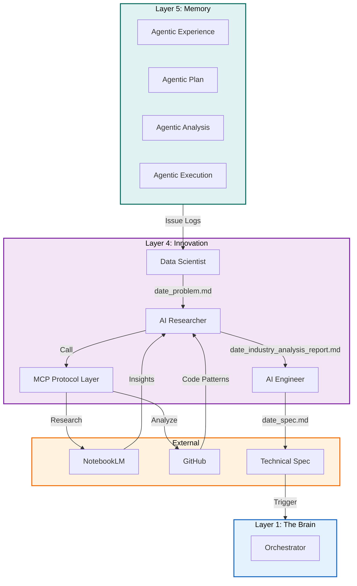

# Plan: Layer 4 - Innovation & Cognitive Layer (Self-Improvement Loop)

## Objective

Implement the self-improvement layer of Torro Agent that handles:
1. AI Researcher with NotebookLM integration for trend forecasting
2. Data Scientist monitoring token efficiency and feature drift
3. AI Engineer implementing structural enhancements
4. MCP Protocol Layer for external research
5. Skill Refinement Engine for skill lifecycle management
6. Autonomous evolution loop (Problem -> Research -> Spec -> Implementation)

## Constraints

- Max context per task: 128k tokens
- Max execution time per task: 10 minutes
- Max files per task: 5 files
- Anti-hallucination: All tasks must specify exact commands and line numbers
- Must follow Torro Agentic Coding Principles (FN: prefix, <200 lines per file)
- Data-driven problem aggregation
- MCP Layer standardized interface

## Current State Analysis

### Existing Implementation

From [`agentic/plan/20260501_130000_layer4plan.md`](agentic/plan/20260501_130000_layer4plan.md:1):
- Plan exists but implementation not started
- Requires `engine/innovation/researcher.py`
- Requires `engine/innovation/data_scientist.py`
- Requires `engine/innovation/ai_engineer.py`

### Gap vs. Industry Standards

| Feature | Claude Code | Hermes Agent | Torro Current | Torro Target |
|---------|-------------|--------------|---------------|--------------|
| autoDream | ✅ Yes | ❌ | ❌ | ✅ Enhanced |
| Curator | ❌ | ✅ Yes | ❌ | ✅ AI Engineer |
| MCP Layer | ❌ | ✅ Yes | ❌ | ✅ NotebookLM |
| Problem Aggregation | ❌ | ❌ | ❌ | ✅ date_problem.md |

## Architecture Diagram



## Research Findings

### Claude Code autoDream Pattern

From [`legacy/claude-code/src/services/autoDream/autoDream.ts`](legacy/claude-code/src/services/autoDream/autoDream.ts:1):
```typescript
// Background memory consolidation. Fires the /dream prompt as a forked
// subagent when time-gate passes AND enough sessions have accumulated.

const SESSION_SCAN_INTERVAL_MS = 10 * 60 * 1000

type AutoDreamConfig = {
  minHours: number
  minSessions: number
}
```

### Hermes Agent Curator Pattern

From [`legacy/hermes-agent/agent/curator.py`](legacy/hermes-agent/agent/curator.py:1):
```python
"""Curator — background skill maintenance orchestrator.

The curator is an auxiliary-model task that periodically reviews agent-created
skills and maintains the collection. It runs inactivity-triggered.
"""

DEFAULT_INTERVAL_HOURS = 24 * 7  # 7 days
```

## Tasks (DAG)

### Phase 1: Data-Driven Problem Aggregation
- **Token Budget:** 1M
- **Entry Criteria:** Layer 3 functional
- **Exit Criteria:** Data Scientist aggregating issues

### Task 1: Create Data Scientist Agent
- [ ] Status: Pending
- **Objective:** Create `src/innovation/data_scientist.py` for diagnostic analysis
- **Input Contract:**
  - Read: `src/memory/knowledge_db.py` (lines 1-100)
  - Read: `legacy/hermes-agent/agent/curator.py` (lines 1-100)
- **Output Contract:**
  - Create: `src/innovation/data_scientist.py` (~120 lines)
- **Exact Commands:**
  ```bash
  # Step 1: Create data_scientist.py
  touch src/innovation/data_scientist.py
  
  # Step 2: Verify syntax
  python3 -m py_compile src/innovation/data_scientist.py
  
  # Step 3: Test import
  python3 -c "from src.innovation.data_scientist import DataScientistAgent; print('OK')"
  ```
- **Expected Output:** Import successful, no errors
- **Fallback Path:** Check pandas installation
- **Dependencies:** Layer 3 Task 10
- **Estimated Time:** 8 minutes
- **Context Firewall:**
  - Required: `src/memory/knowledge_db.py`, `legacy/hermes-agent/agent/`
  - Excluded: `src/execution/`, `src/reporting/`

### Task 2: Implement Problem Aggregation
- [ ] Status: Pending
- **Objective:** Add issue log parsing to Data Scientist
- **Input Contract:**
  - Read: `src/innovation/data_scientist.py` (lines 1-120)
  - Read: `src/memory/analysis_logs.py` (for log format)
- **Output Contract:**
  - Modify: `src/innovation/data_scientist.py` (add aggregate method at lines 60-120)
- **Exact Commands:**
  ```bash
  # Step 1: Add aggregation logic
  # Step 2: Verify syntax
  python3 -m py_compile src/innovation/data_scientist.py
  
  # Step 3: Test aggregation
  python3 -c "from src.innovation.data_scientist import DataScientistAgent; d = DataScientistAgent(); d.aggregate_issues(['error1', 'error2'])"
  ```
- **Expected Output:** date_problem.md string generated
- **Fallback Path:** Check log parsing
- **Dependencies:** Task 1
- **Estimated Time:** 8 minutes
- **Context Firewall:**
  - Required: `src/innovation/data_scientist.py`, `src/memory/analysis_logs.py`
  - Excluded: `src/execution/`, `src/reporting/`

### Task 3: Implement Drift Detection
- [ ] Status: Pending
- **Objective:** Add performance drift monitoring
- **Input Contract:**
  - Read: `src/innovation/data_scientist.py` (lines 1-120)
  - Read: `src/sre/heartbeat.py` (for metrics patterns)
- **Output Contract:**
  - Modify: `src/innovation/data_scientist.py` (add detect method at lines 90-120)
- **Exact Commands:**
  ```bash
  # Step 1: Add drift detection
  # Step 2: Verify syntax
  python3 -m py_compile src/innovation/data_scientist.py
  
  # Step 3: Test detection
  python3 -c "from src.innovation.data_scientist import DataScientistAgent; d = DataScientistAgent(); d.detect_drift([1.0, 1.1, 1.5, 2.0])"
  ```
- **Expected Output:** DriftReport with severity level
- **Fallback Path:** Check statistical calculations
- **Dependencies:** Task 2
- **Estimated Time:** 7 minutes
- **Context Firewall:**
  - Required: `src/innovation/data_scientist.py`, `src/sre/heartbeat.py`
  - Excluded: `src/execution/`, `src/reporting/`

### Phase 2: MCP Research Layer
- **Token Budget:** 1M
- **Entry Criteria:** Phase 1 complete
- **Exit Criteria:** AI Researcher functional

### Task 4: Create MCP Protocol Layer
- [ ] Status: Pending
- **Objective:** Create `src/innovation/mcp_layer.py` for external research
- **Input Contract:**
  - Read: `src/innovation/data_scientist.py` (lines 1-120)
  - Read: `legacy/hermes-agent/mcp_tool.py` (for MCP patterns)
- **Output Contract:**
  - Create: `src/innovation/mcp_layer.py` (~100 lines)
- **Exact Commands:**
  ```bash
  # Step 1: Create mcp_layer.py
  touch src/innovation/mcp_layer.py
  
  # Step 2: Verify syntax
  python3 -m py_compile src/innovation/mcp_layer.py
  
  # Step 3: Test import
  python3 -c "from src.innovation.mcp_layer import MCPLayer; print('OK')"
  ```
- **Expected Output:** Import successful, no errors
- **Fallback Path:** Check httpx installation
- **Dependencies:** Task 3
- **Estimated Time:** 8 minutes
- **Context Firewall:**
  - Required: `src/innovation/data_scientist.py`, `legacy/hermes-agent/mcp_tool.py`
  - Excluded: `src/execution/`, `src/reporting/`

### Task 5: Implement NotebookLM Integration
- [ ] Status: Pending
- **Objective:** Add NotebookLM research capability
- **Input Contract:**
  - Read: `src/innovation/mcp_layer.py` (lines 1-100)
  - Read: `agentic/standard/AGENT.md` (for research patterns)
- **Output Contract:**
  - Modify: `src/innovation/mcp_layer.py` (add notebook method at lines 50-100)
- **Exact Commands:**
  ```bash
  # Step 1: Add NotebookLM logic
  # Step 2: Verify syntax
  python3 -m py_compile src/innovation/mcp_layer.py
  
  # Step 3: Test research
  python3 -c "from src.innovation.mcp_layer import MCPLayer; m = MCPLayer(); m.research_notebooklm('token optimization')"
  ```
- **Expected Output:** Research insights returned
- **Fallback Path:** Check API credentials
- **Dependencies:** Task 4
- **Estimated Time:** 8 minutes
- **Context Firewall:**
  - Required: `src/innovation/mcp_layer.py`, `agentic/standard/AGENT.md`
  - Excluded: `src/execution/`, `src/reporting/`

### Task 6: Create AI Researcher Agent
- [ ] Status: Pending
- **Objective:** Create `src/innovation/researcher.py` for analysis
- **Input Contract:**
  - Read: `src/innovation/mcp_layer.py` (lines 1-100)
  - Read: `legacy/claude-code/src/services/autoDream/autoDream.ts` (for patterns)
- **Output Contract:**
  - Create: `src/innovation/researcher.py` (~120 lines)
- **Exact Commands:**
  ```bash
  # Step 1: Create researcher.py
  touch src/innovation/researcher.py
  
  # Step 2: Verify syntax
  python3 -m py_compile src/innovation/researcher.py
  
  # Step 3: Test import
  python3 -c "from src.innovation.researcher import AIResearcherAgent; print('OK')"
  ```
- **Expected Output:** Import successful, no errors
- **Fallback Path:** Check jinja2 installation
- **Dependencies:** Task 5
- **Estimated Time:** 8 minutes
- **Context Firewall:**
  - Required: `src/innovation/mcp_layer.py`, `legacy/claude-code/src/services/`
  - Excluded: `src/execution/`, `src/reporting/`

### Task 7: Implement Industry Analysis Report Generator
- [ ] Status: Pending
- **Objective:** Generate date_industry_analysis_report.md
- **Input Contract:**
  - Read: `src/innovation/researcher.py` (lines 1-120)
  - Read: `agentic/analysis/` (for report format)
- **Output Contract:**
  - Modify: `src/innovation/researcher.py` (add generate method at lines 70-120)
- **Exact Commands:**
  ```bash
  # Step 1: Add report generator
  # Step 2: Verify syntax
  python3 -m py_compile src/innovation/researcher.py
  
  # Step 3: Test generation
  python3 -c "from src.innovation.researcher import AIResearcherAgent; r = AIResearcherAgent(); r.generate_report({})"
  ```
- **Expected Output:** Markdown report string
- **Fallback Path:** Check template syntax
- **Dependencies:** Task 6
- **Estimated Time:** 7 minutes
- **Context Firewall:**
  - Required: `src/innovation/researcher.py`, `agentic/analysis/`
  - Excluded: `src/execution/`, `src/reporting/`

### Phase 3: Engineering & Deployment
- **Token Budget:** 1M
- **Entry Criteria:** Phase 2 complete
- **Exit Criteria:** AI Engineer implementing specs and skill refinement

### Task 8: Create AI Engineer Agent
- [ ] Status: Pending
- **Objective:** Create `src/innovation/ai_engineer.py` for spec implementation
- **Input Contract:**
  - Read: `src/innovation/researcher.py` (lines 1-120)
  - Read: `agentic/standard/backend/01-architecture-and-patterns.md` (for patterns)
- **Output Contract:**
  - Create: `src/innovation/ai_engineer.py` (~100 lines)
- **Exact Commands:**
  ```bash
  # Step 1: Create ai_engineer.py
  touch src/innovation/ai_engineer.py
  
  # Step 2: Verify syntax
  python3 -m py_compile src/innovation/ai_engineer.py
  
  # Step 3: Test import
  python3 -c "from src.innovation.ai_engineer import AIEngineerAgent; print('OK')"
  ```
- **Expected Output:** Import successful, no errors
- **Fallback Path:** Check code generation deps
- **Dependencies:** Task 7
- **Estimated Time:** 8 minutes
- **Context Firewall:**
  - Required: `src/innovation/researcher.py`, `agentic/standard/backend/`
  - Excluded: `src/execution/`, `src/reporting/`

### Task 9: Implement Spec Generator
- [ ] Status: Pending
- **Objective:** Generate date_spec.md from research findings
- **Input Contract:**
  - Read: `src/innovation/ai_engineer.py` (lines 1-100)
  - Read: `agentic/standard/UI.md` (for spec format)
- **Output Contract:**
  - Modify: `src/innovation/ai_engineer.py` (add generate method at lines 50-100)
- **Exact Commands:**
  ```bash
  # Step 1: Add spec generator
  # Step 2: Verify syntax
  python3 -m py_compile src/innovation/ai_engineer.py
  
  # Step 3: Test generation
  python3 -c "from src.innovation.ai_engineer import AIEngineerAgent; e = AIEngineerAgent(); e.generate_spec({'findings': ['test']})"
  ```
- **Expected Output:** Technical specification markdown
- **Fallback Path:** Check spec template
- **Dependencies:** Task 8
- **Estimated Time:** 7 minutes
- **Context Firewall:**
  - Required: `src/innovation/ai_engineer.py`, `agentic/standard/UI.md`
  - Excluded: `src/execution/`, `src/reporting/`

### Task 10: Implement Skill Refinement Engine
- [ ] Status: Pending
- **Objective:** Add skill refinement logic to AI Engineer for SKILL.md lifecycle management
- **Input Contract:**
  - Read: `src/innovation/ai_engineer.py` (lines 1-100)
  - Read: `.roo/skills/` (for skill format)
  - Read: `legacy/hermes-agent/agent/curator.py` (for skill maintenance patterns)
- **Output Contract:**
  - Modify: `src/innovation/ai_engineer.py` (add refine_skill method at lines 80-100)
- **Exact Commands:**
  ```bash
  # Step 1: Add skill refinement logic
  # Step 2: Verify syntax
  python3 -m py_compile src/innovation/ai_engineer.py
  
  # Step 3: Test refinement
  python3 -c "from src.innovation.ai_engineer import AIEngineerAgent; e = AIEngineerAgent(); e.refine_skill('skill_name', {'usage_stats': {}})"
  ```
- **Expected Output:** Refined SKILL.md with updated metadata
- **Fallback Path:** Check yaml imports
- **Dependencies:** Task 8
- **Estimated Time:** 8 minutes
- **Context Firewall:**
  - Required: `src/innovation/ai_engineer.py`, `.roo/skills/`, `legacy/hermes-agent/agent/curator.py`
  - Excluded: `src/execution/`, `src/reporting/`

### Task 11: Integration Test
- [ ] Status: Pending
- **Objective:** Verify all innovation components work together
- **Input Contract:**
  - Read: All innovation layer files
- **Output Contract:**
  - Create: `tests/unit/innovation/test_data_scientist.py` (~80 lines)
  - Create: `tests/unit/innovation/test_researcher.py` (~80 lines)
  - Create: `tests/unit/innovation/test_ai_engineer.py` (~80 lines)
  - Create: `tests/unit/innovation/test_skill_refinement.py` (~60 lines)
- **Exact Commands:**
  ```bash
  # Step 1: Create test directory
  mkdir -p tests/unit/innovation
  
  # Step 2: Create test files
  touch tests/unit/innovation/test_data_scientist.py
  touch tests/unit/innovation/test_researcher.py
  touch tests/unit/innovation/test_ai_engineer.py
  
  # Step 3: Run tests
  python3 -m pytest tests/unit/innovation/ -v
  
  # Step 4: Verify coverage
  python3 -m pytest tests/unit/innovation/ -v --cov=src/innovation
  ```
- **Expected Output:** All tests pass with >80% coverage
- **Fallback Path:** Check test fixtures
- **Dependencies:** Task 9
- **Estimated Time:** 10 minutes
- **Context Firewall:**
  - Required: All innovation files
  - Excluded: `src/execution/`, `src/reporting/`

## Anti-Hallucination Checklist

- [x] Task specifies exact file paths (relative to project root)
- [x] Task specifies line ranges for files to read
- [x] Task specifies estimated line count for files to create
- [x] Task includes exact shell commands (copy-paste ready)
- [x] Task includes expected output patterns to match
- [x] Task includes fallback commands for common errors
- [x] Task has no ambiguous language

## Context Firewalls

### Per-Task Context Boundaries

| Task | Required Context | Excluded Context |
|------|------------------|------------------|
| Task 1 | `src/memory/knowledge_db.py`, `legacy/hermes-agent/agent/` | `src/execution/`, `src/reporting/` |
| Task 2 | `src/innovation/data_scientist.py`, `src/memory/analysis_logs.py` | `src/execution/`, `src/reporting/` |
| Task 3 | `src/innovation/data_scientist.py`, `src/sre/heartbeat.py` | `src/execution/`, `src/reporting/` |
| Task 4 | `src/innovation/data_scientist.py`, `legacy/hermes-agent/mcp_tool.py` | `src/execution/`, `src/reporting/` |
| Task 5 | `src/innovation/mcp_layer.py`, `agentic/standard/AGENT.md` | `src/execution/`, `src/reporting/` |
| Task 6 | `src/innovation/mcp_layer.py`, `legacy/claude-code/src/services/` | `src/execution/`, `src/reporting/` |
| Task 7 | `src/innovation/researcher.py`, `agentic/analysis/` | `src/execution/`, `src/reporting/` |
| Task 8 | `src/innovation/researcher.py`, `agentic/standard/backend/` | `src/execution/`, `src/reporting/` |
| Task 9 | `src/innovation/ai_engineer.py`, `agentic/standard/UI.md` | `src/execution/`, `src/reporting/` |
| Task 10 | All innovation files | `src/execution/`, `src/reporting/` |

## Acceptance Criteria

1. **Data Scientist aggregates** - Issue logs parsed into date_problem.md
2. **Drift detection works** - Performance anomalies detected
3. **MCP Layer functional** - NotebookLM integration working
4. **AI Researcher generates** - Industry analysis reports created
5. **AI Engineer specs** - Technical specifications generated
6. **All tests pass** - Unit tests verify all components

## Change Log

| Date | Change | Author |
|------|--------|--------|
| 2026-05-02 | Initial plan created | Agentic Planner |
