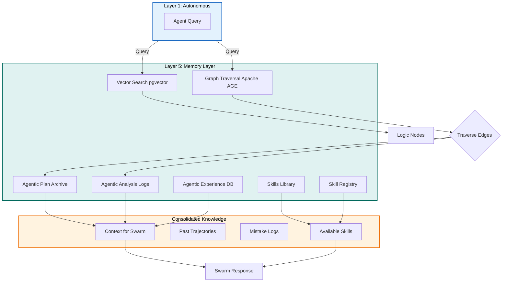

# Plan: Layer 5 - Memory Layer (The Continuity)

## Objective

Implement the hybrid memory layer of Torro Agent that handles:
1. Vector-Graph hybrid memory (pgvector + Apache AGE)
2. Agentic Plan Archive for historical trajectories
3. Agentic Analysis Logs for mistake tracking
4. Agentic Experience DB for conversation history
5. Cognitive retrieval with graph traversal
6. Skills Library for auto-generated SKILL.md workflows
7. Skill Registry for version tracking and dependency graphs

## Constraints

- Max context per task: 128k tokens
- Max execution time per task: 10 minutes
- Max files per task: 5 files
- Anti-hallucination: All tasks must specify exact commands and line numbers
- Must follow Torro Agentic Coding Principles (FN: prefix, <200 lines per file)
- SQLModel First: All DB operations use SQLModel
- Hybrid memory: Vector similarity + Graph traversal

## Current State Analysis

### Existing Implementation

From [`agentic/plan/20260501_130000_layer5plan.md`](agentic/plan/20260501_130000_layer5plan.md:1):
- Plan exists but implementation not started
- Requires `engine/memory/knowledge_db.py`
- Requires `engine/memory/plan_archive.py`
- Requires `engine/memory/analysis_logs.py`
- Requires `engine/memory/experience_db.py`

### Gap vs. Industry Standards

| Feature | Claude Code | Hermes Agent | Torro Current | Torro Target |
|---------|-------------|--------------|---------------|--------------|
| Memory Structure | MEMORY.md file | SQLite FTS5 | ❌ | ✅ Vector-Graph |
| Consolidation | autoDream | curator.py | ❌ | ✅ Graph-based |
| Context Fencing | ❌ | ✅ Yes | ❌ | ✅ Enhanced |
| Graph Traversal | ❌ | ❌ | ❌ | ✅ Apache AGE |

## Architecture Diagram



## Research Findings

### Claude Code Memory Pattern

From [`legacy/claude-code/src/memdir/memdir.ts`](legacy/claude-code/src/memdir/memdir.ts:34):
```typescript
export const ENTRYPOINT_NAME = 'MEMORY.md'
export const MAX_ENTRYPOINT_LINES = 200

export function truncateEntrypointContent(raw: string): EntrypointTruncation {
  const trimmed = raw.trim()
  const contentLines = trimmed.split('\n')
  // Truncation logic for memory consolidation
}
```

### Hermes Agent Memory Manager

From [`legacy/hermes-agent/agent/memory_manager.py`](legacy/hermes-agent/agent/memory_manager.py:1):
```python
"""MemoryManager — orchestrates the built-in memory provider plus at most
ONE external plugin memory provider.

Single integration point in run_agent.py. Replaces scattered per-backend
code with one manager that delegates to registered providers.
"""

class MemoryManager:
    def add_provider(self, provider: MemoryProvider) -> None
    def build_system_prompt(self) -> str
    def prefetch_all(self, user_message: str) -> List[str]
    def sync_all(self, user_msg: str, assistant_response: str) -> None
```

## Tasks (DAG)

### Phase 1: Vector-Graph Hybrid Database
- **Token Budget:** 1M
- **Entry Criteria:** Layer 4 functional
- **Exit Criteria:** Knowledge DB with vector + graph search

### Task 1: Create Knowledge DB Schema
- [ ] Status: Pending
- **Objective:** Create `src/memory/knowledge_db.py` with SQLModel schemas
- **Input Contract:**
  - Read: `config.ini` (lines 1-50 for database section)
  - Read: `legacy/hermes-agent/agent/memory_manager.py` (lines 1-100)
- **Output Contract:**
  - Create: `src/memory/knowledge_db.py` (~150 lines)
- **Exact Commands:**
  ```bash
  # Step 1: Create knowledge_db.py
  touch src/memory/knowledge_db.py
  
  # Step 2: Verify syntax
  python3 -m py_compile src/memory/knowledge_db.py
  
  # Step 3: Test import
  python3 -c "from src.memory.knowledge_db import KnowledgeDB; print('OK')"
  ```
- **Expected Output:** Import successful, no errors
- **Fallback Path:** If sqlmodel not found, run `pip install sqlmodel`
- **Dependencies:** Layer 4 Task 10
- **Estimated Time:** 8 minutes
- **Context Firewall:**
  - Required: `config.ini`, `legacy/hermes-agent/agent/`
  - Excluded: `src/execution/`, `src/reporting/`

### Task 2: Implement Vector Search
- [ ] Status: Pending
- **Objective:** Add pgvector similarity search to Knowledge DB
- **Input Contract:**
  - Read: `src/memory/knowledge_db.py` (lines 1-150)
  - Read: `agentic/standard/db/01-sqlmodel-foundation.md` (for SQLModel patterns)
- **Output Contract:**
  - Modify: `src/memory/knowledge_db.py` (add search method at lines 80-150)
- **Exact Commands:**
  ```bash
  # Step 1: Add vector search logic
  # Step 2: Verify syntax
  python3 -m py_compile src/memory/knowledge_db.py
  
  # Step 3: Test search
  python3 -c "from src.memory.knowledge_db import KnowledgeDB; k = KnowledgeDB(); k.search('query text', top_k=5)"
  ```
- **Expected Output:** List of similar memories
- **Fallback Path:** Check pgvector installation
- **Dependencies:** Task 1
- **Estimated Time:** 8 minutes
- **Context Firewall:**
  - Required: `src/memory/knowledge_db.py`, `agentic/standard/db/`
  - Excluded: `src/execution/`, `src/reporting/`

### Task 3: Implement Graph Traversal
- [ ] Status: Pending
- **Objective:** Add Apache AGE graph traversal
- **Input Contract:**
  - Read: `src/memory/knowledge_db.py` (lines 1-150)
  - Read: `agentic/standard/db/02-data-quality.md` (for graph patterns)
- **Output Contract:**
  - Modify: `src/memory/knowledge_db.py` (add traverse method at lines 120-150)
- **Exact Commands:**
  ```bash
  # Step 1: Add graph traversal
  # Step 2: Verify syntax
  python3 -m py_compile src/memory/knowledge_db.py
  
  # Step 3: Test traversal
  python3 -c "from src.memory.knowledge_db import KnowledgeDB; k = KnowledgeDB(); k.traverse('node_id', depth=3)"
  ```
- **Expected Output:** List of connected nodes with edges
- **Fallback Path:** Check Apache AGE installation
- **Dependencies:** Task 2
- **Estimated Time:** 8 minutes
- **Context Firewall:**
  - Required: `src/memory/knowledge_db.py`, `agentic/standard/db/`
  - Excluded: `src/execution/`, `src/reporting/`

### Phase 2: Memory Archives
- **Token Budget:** 1M
- **Entry Criteria:** Phase 1 complete
- **Exit Criteria:** All archives functional

### Task 4: Create Plan Archive
- [ ] Status: Pending
- **Objective:** Create `src/memory/plan_archive.py` for historical plans
- **Input Contract:**
  - Read: `src/memory/knowledge_db.py` (lines 1-150)
  - Read: `agentic/plan/` (for plan format)
- **Output Contract:**
  - Create: `src/memory/plan_archive.py` (~100 lines)
- **Exact Commands:**
  ```bash
  # Step 1: Create plan_archive.py
  touch src/memory/plan_archive.py
  
  # Step 2: Verify syntax
  python3 -m py_compile src/memory/plan_archive.py
  
  # Step 3: Test import
  python3 -c "from src.memory.plan_archive import PlanArchive; print('OK')"
  ```
- **Expected Output:** Import successful, no errors
- **Fallback Path:** Check json imports
- **Dependencies:** Task 3
- **Estimated Time:** 8 minutes
- **Context Firewall:**
  - Required: `src/memory/knowledge_db.py`, `agentic/plan/`
  - Excluded: `src/execution/`, `src/reporting/`

### Task 5: Create Analysis Logs
- [ ] Status: Pending
- **Objective:** Create `src/memory/analysis_logs.py` for mistake tracking
- **Input Contract:**
  - Read: `src/memory/plan_archive.py` (lines 1-100)
  - Read: `agentic/analysis/` (for analysis format)
- **Output Contract:**
  - Create: `src/memory/analysis_logs.py` (~100 lines)
- **Exact Commands:**
  ```bash
  # Step 1: Create analysis_logs.py
  touch src/memory/analysis_logs.py
  
  # Step 2: Verify syntax
  python3 -m py_compile src/memory/analysis_logs.py
  
  # Step 3: Test import
  python3 -c "from src.memory.analysis_logs import AnalysisLogs; print('OK')"
  ```
- **Expected Output:** Import successful, no errors
- **Fallback Path:** Check logging imports
- **Dependencies:** Task 4
- **Estimated Time:** 8 minutes
- **Context Firewall:**
  - Required: `src/memory/plan_archive.py`, `agentic/analysis/`
  - Excluded: `src/execution/`, `src/reporting/`

### Task 6: Create Experience DB
- [ ] Status: Pending
- **Objective:** Create `src/memory/experience_db.py` for conversation history
- **Input Contract:**
  - Read: `src/memory/analysis_logs.py` (lines 1-100)
  - Read: `legacy/hermes-agent/state/hermes_state.py` (for state patterns)
- **Output Contract:**
  - Create: `src/memory/experience_db.py` (~120 lines)
- **Exact Commands:**
  ```bash
  # Step 1: Create experience_db.py
  touch src/memory/experience_db.py
  
  # Step 2: Verify syntax
  python3 -m py_compile src/memory/experience_db.py
  
  # Step 3: Test import
  python3 -c "from src.memory.experience_db import ExperienceDB; print('OK')"
  ```
- **Expected Output:** Import successful, no errors
- **Fallback Path:** Check async imports
- **Dependencies:** Task 5
- **Estimated Time:** 8 minutes
- **Context Firewall:**
  - Required: `src/memory/analysis_logs.py`, `legacy/hermes-agent/state/`
  - Excluded: `src/execution/`, `src/reporting/`

### Task 7: Implement Memory Manager
- [ ] Status: Pending
- **Objective:** Create `src/memory/manager.py` to orchestrate all memory
- **Input Contract:**
  - Read: `src/memory/knowledge_db.py` (lines 1-150)
  - Read: `src/memory/plan_archive.py` (lines 1-100)
  - Read: `src/memory/analysis_logs.py` (lines 1-100)
  - Read: `src/memory/experience_db.py` (lines 1-120)
- **Output Contract:**
  - Create: `src/memory/manager.py` (~150 lines)
- **Exact Commands:**
  ```bash
  # Step 1: Create manager.py
  touch src/memory/manager.py
  
  # Step 2: Verify syntax
  python3 -m py_compile src/memory/manager.py
  
  # Step 3: Test import
  python3 -c "from src.memory.manager import MemoryManager; print('OK')"
  ```
- **Expected Output:** Import successful, no errors
- **Fallback Path:** Check circular imports
- **Dependencies:** Task 6
- **Estimated Time:** 8 minutes
- **Context Firewall:**
  - Required: All memory layer files
  - Excluded: `src/execution/`, `src/reporting/`

### Task 8: Implement Cognitive Retrieval
- [ ] Status: Pending
- **Objective:** Add graph-based retrieval to Memory Manager
- **Input Contract:**
  - Read: `src/memory/manager.py` (lines 1-150)
  - Read: `agentic/standard/db/01-sqlmodel-foundation.md` (for retrieval patterns)
- **Output Contract:**
  - Modify: `src/memory/manager.py` (add retrieve method at lines 80-150)
- **Exact Commands:**
  ```bash
  # Step 1: Add retrieval logic
  # Step 2: Verify syntax
  python3 -m py_compile src/memory/manager.py
  
  # Step 3: Test retrieval
  python3 -c "from src.memory.manager import MemoryManager; m = MemoryManager(); m.retrieve('query', top_k=5)"
  ```
- **Expected Output:** Consolidated memory with graph context
- **Fallback Path:** Check vector+graph combination
- **Dependencies:** Task 7
- **Estimated Time:** 8 minutes
- **Context Firewall:**
  - Required: `src/memory/manager.py`, `agentic/standard/db/`
  - Excluded: `src/execution/`, `src/reporting/`

### Task 9: Create Skills Library Storage
- [ ] Status: Pending
- **Objective:** Create `src/memory/skills_library.py` for SKILL.md storage
- **Input Contract:**
  - Read: `src/memory/knowledge_db.py` (lines 1-150)
  - Read: `.roo/skills/` (for skill format)
  - Read: `legacy/hermes-agent/skills/` (for skill patterns)
- **Output Contract:**
  - Create: `src/memory/skills_library.py` (~120 lines)
- **Exact Commands:**
  ```bash
  # Step 1: Create skills_library.py
  touch src/memory/skills_library.py
  
  # Step 2: Verify syntax
  python3 -m py_compile src/memory/skills_library.py
  
  # Step 3: Test import
  python3 -c "from src.memory.skills_library import SkillsLibrary; print('OK')"
  ```
- **Expected Output:** Import successful, no errors
- **Fallback Path:** Check yaml imports
- **Dependencies:** Task 8
- **Estimated Time:** 8 minutes
- **Context Firewall:**
  - Required: `src/memory/knowledge_db.py`, `.roo/skills/`, `legacy/hermes-agent/skills/`
  - Excluded: `src/execution/`, `src/reporting/`

### Task 10: Create Skill Registry Index
- [ ] Status: Pending
- **Objective:** Create `src/memory/skill_registry.py` for version tracking
- **Input Contract:**
  - Read: `src/memory/skills_library.py` (lines 1-120)
  - Read: `agentic/standard/AGENT.md` (for skill patterns)
- **Output Contract:**
  - Create: `src/memory/skill_registry.py` (~100 lines)
- **Exact Commands:**
  ```bash
  # Step 1: Create skill_registry.py
  touch src/memory/skill_registry.py
  
  # Step 2: Verify syntax
  python3 -m py_compile src/memory/skill_registry.py
  
  # Step 3: Test import
  python3 -c "from src.memory.skill_registry import SkillRegistry; print('OK')"
  ```
- **Expected Output:** Import successful, no errors
- **Fallback Path:** Check json imports
- **Dependencies:** Task 9
- **Estimated Time:** 8 minutes
- **Context Firewall:**
  - Required: `src/memory/skills_library.py`, `agentic/standard/`
  - Excluded: `src/execution/`, `src/reporting/`

### Task 11: Integration Test
- [ ] Status: Pending
- **Objective:** Verify all memory components work together
- **Input Contract:**
  - Read: All memory layer files
- **Output Contract:**
  - Create: `tests/unit/memory/test_knowledge_db.py` (~80 lines)
  - Create: `tests/unit/memory/test_manager.py` (~80 lines)
  - Create: `tests/unit/memory/test_skills_library.py` (~60 lines)
- **Exact Commands:**
  ```bash
  # Step 1: Create test directory
  mkdir -p tests/unit/memory
  
  # Step 2: Create test files
  touch tests/unit/memory/test_knowledge_db.py
  touch tests/unit/memory/test_manager.py
  touch tests/unit/memory/test_skills_library.py
  
  # Step 3: Run tests
  python3 -m pytest tests/unit/memory/ -v
  
  # Step 4: Verify coverage
  python3 -m pytest tests/unit/memory/ -v --cov=src/memory
  ```
- **Expected Output:** All tests pass with >80% coverage
- **Fallback Path:** Check database connection
- **Dependencies:** Task 10
- **Estimated Time:** 10 minutes
- **Context Firewall:**
  - Required: All memory files
  - Excluded: `src/execution/`, `src/reporting/`

## Anti-Hallucination Checklist

- [x] Task specifies exact file paths (relative to project root)
- [x] Task specifies line ranges for files to read
- [x] Task specifies estimated line count for files to create
- [x] Task includes exact shell commands (copy-paste ready)
- [x] Task includes expected output patterns to match
- [x] Task includes fallback commands for common errors
- [x] Task has no ambiguous language

## Context Firewalls

### Per-Task Context Boundaries

| Task | Required Context | Excluded Context |
|------|------------------|------------------|
| Task 1 | `config.ini`, `legacy/hermes-agent/agent/` | `src/execution/`, `src/reporting/` |
| Task 2 | `src/memory/knowledge_db.py`, `agentic/standard/db/` | `src/execution/`, `src/reporting/` |
| Task 3 | `src/memory/knowledge_db.py`, `agentic/standard/db/` | `src/execution/`, `src/reporting/` |
| Task 4 | `src/memory/knowledge_db.py`, `agentic/plan/` | `src/execution/`, `src/reporting/` |
| Task 5 | `src/memory/plan_archive.py`, `agentic/analysis/` | `src/execution/`, `src/reporting/` |
| Task 6 | `src/memory/analysis_logs.py`, `legacy/hermes-agent/state/` | `src/execution/`, `src/reporting/` |
| Task 7 | All memory files | `src/execution/`, `src/reporting/` |
| Task 8 | `src/memory/manager.py`, `agentic/standard/db/` | `src/execution/`, `src/reporting/` |
| Task 9 | All memory files | `src/execution/`, `src/reporting/` |

## Acceptance Criteria

1. **Knowledge DB functional** - Vector + Graph search working
2. **Plan archive stores** - Historical plans persisted
3. **Analysis logs track** - Mistake analysis recorded
4. **Experience DB stores** - Conversation history saved
5. **Cognitive retrieval** - Graph traversal returns context
6. **Skills Library stores** - SKILL.md workflows persisted
7. **Skill Registry tracks** - Version history and dependencies tracked
8. **All tests pass** - Unit tests verify all components

## Context Firewalls

### Per-Task Context Boundaries

| Task | Required Context | Excluded Context |
|------|------------------|------------------|
| Task 1 | `config.ini`, `legacy/hermes-agent/agent/` | `src/execution/`, `src/reporting/` |
| Task 2 | `src/memory/knowledge_db.py`, `agentic/standard/db/` | `src/execution/`, `src/reporting/` |
| Task 3 | `src/memory/knowledge_db.py`, `agentic/standard/db/` | `src/execution/`, `src/reporting/` |
| Task 4 | `src/memory/knowledge_db.py`, `agentic/plan/` | `src/execution/`, `src/reporting/` |
| Task 5 | `src/memory/plan_archive.py`, `agentic/analysis/` | `src/execution/`, `src/reporting/` |
| Task 6 | `src/memory/analysis_logs.py`, `legacy/hermes-agent/state/` | `src/execution/`, `src/reporting/` |
| Task 7 | All memory files | `src/execution/`, `src/reporting/` |
| Task 8 | `src/memory/manager.py`, `agentic/standard/db/` | `src/execution/`, `src/reporting/` |
| Task 9 | `src/memory/knowledge_db.py`, `.roo/skills/`, `legacy/hermes-agent/skills/` | `src/execution/`, `src/reporting/` |
| Task 10 | `src/memory/skills_library.py`, `agentic/standard/` | `src/execution/`, `src/reporting/` |
| Task 11 | All memory files | `src/execution/`, `src/reporting/` |

## Change Log

| Date | Change | Author |
|------|--------|--------|
| 2026-05-02 | Initial plan created | Agentic Planner |
| 2026-05-02 | Added Skills Library and Skill Registry tasks | Agentic Planner |
