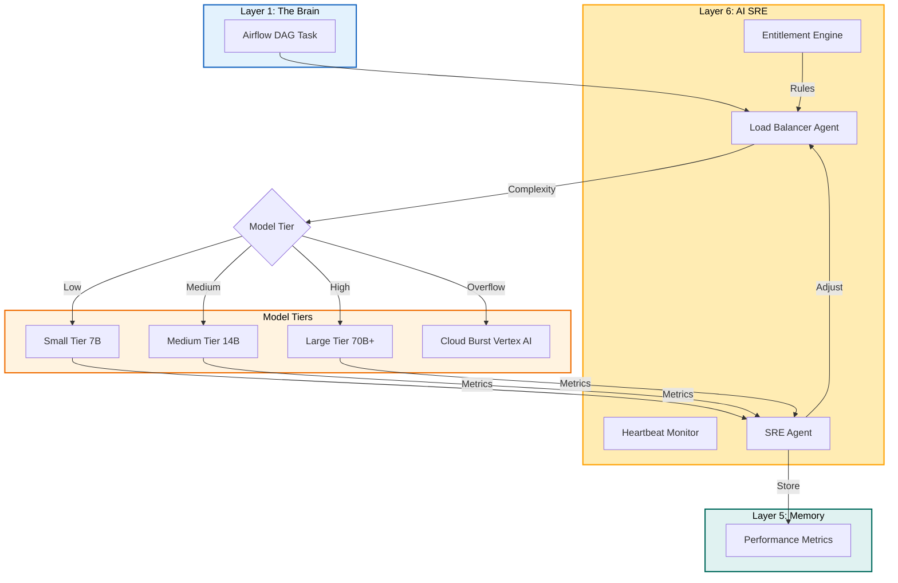

# Plan: Layer 6 - AI SRE Layer (Operational Reliability)

## Objective

Implement the operational reliability layer of Torro Agent that handles:
1. Heartbeat monitoring for all agents
2. Performance metrics tracking (latency, token usage)
3. Intelligent AI Gateway with model-tier routing
4. Entitlement Engine with YAML-based ABAC rules
5. Hybrid cloud-bursting for overflow compute
6. Load balancing across 7B/14B/70B model tiers

## Constraints

- Max context per task: 128k tokens
- Max execution time per task: 10 minutes
- Max files per task: 5 files
- Anti-hallucination: All tasks must specify exact commands and line numbers
- Must follow Torro Agentic Coding Principles (FN: prefix, <200 lines per file)
- Deterministic ABAC: Attribute-Based Access Control
- Probabilistic sensitivity analysis for PII detection

## Current State Analysis

### Existing Implementation

From [`agentic/plan/20260501_130000_layer6plan.md`](agentic/plan/20260501_130000_layer6plan.md:1):
- Plan exists but implementation not started
- Requires `engine/sre/heartbeat.py`
- Requires `engine/sre/load_balancer.py`
- Requires `engine/sre/entitlement.py`

### Gap vs. Industry Standards

| Feature | Claude Code | Hermes Agent | Torro Current | Torro Target |
|---------|-------------|--------------|---------------|--------------|
| Heartbeat | ❌ | ❌ | ❌ | ✅ Agent pulses |
| Model Tiering | ❌ | ❌ | ❌ | ✅ 7B/14B/70B |
| Entitlement Engine | ❌ | ❌ | ❌ | ✅ YAML ABAC |
| Cloud Bursting | ❌ | ❌ | ❌ | ✅ Hybrid routing |

## Architecture Diagram



## Research Findings

### Hermes Agent Credential Pool

From [`legacy/hermes-agent/agent/credential_pool.py`](legacy/hermes-agent/agent/credential_pool.py:1):
```python
"""Persistent multi-credential pool for same-provider failover."""

STATUS_OK = "ok"
STATUS_EXHAUSTED = "exhausted"

@dataclass
class PooledCredential:
    provider: str
    id: str
    label: str
    auth_type: str
    priority: int
    source: str
    access_token: str
```

### Hermes Agent Error Classifier

From [`legacy/hermes-agent/agent/error_classifier.py`](legacy/hermes-agent/agent/error_classifier.py:65):
```python
@dataclass
class ClassifiedError:
    """Structured classification of an API error with recovery hints."""
    
    reason: FailoverReason
    status_code: Optional[int] = None
    provider: Optional[str] = None
    model: Optional[str] = None
    message: str = ""
    
    # Recovery action hints
    retryable: bool = True
    should_compress: bool = False
```

## Tasks (DAG)

### Phase 1: Heartbeat & Performance Monitoring
- **Token Budget:** 1M
- **Entry Criteria:** Layer 5 functional
- **Exit Criteria:** SRE Agent tracking all agents

### Task 1: Create Heartbeat Monitor
- [ ] Status: Pending
- **Objective:** Create `src/sre/heartbeat.py` for agent pulse tracking
- **Input Contract:**
  - Read: `config.ini` (lines 1-50 for SRE section)
  - Read: `legacy/hermes-agent/agent/credential_pool.py` (for pool patterns)
- **Output Contract:**
  - Create: `src/sre/heartbeat.py` (~120 lines)
- **Exact Commands:**
  ```bash
  # Step 1: Create heartbeat.py
  touch src/sre/heartbeat.py
  
  # Step 2: Verify syntax
  python3 -m py_compile src/sre/heartbeat.py
  
  # Step 3: Test import
  python3 -c "from src.sre.heartbeat import HeartbeatMonitor; print('OK')"
  ```
- **Expected Output:** Import successful, no errors
- **Fallback Path:** If threading not found, check Python version
- **Dependencies:** Layer 5 Task 9
- **Estimated Time:** 8 minutes
- **Context Firewall:**
  - Required: `config.ini`, `legacy/hermes-agent/agent/`
  - Excluded: `src/execution/`, `src/reporting/`

### Task 2: Implement Agent Registration
- [ ] Status: Pending
- **Objective:** Add agent registration to Heartbeat Monitor
- **Input Contract:**
  - Read: `src/sre/heartbeat.py` (lines 1-120)
  - Read: `src/autonomous/orchestrator.py` (for agent patterns)
- **Output Contract:**
  - Modify: `src/sre/heartbeat.py` (add register method at lines 50-120)
- **Exact Commands:**
  ```bash
  # Step 1: Add registration logic
  # Step 2: Verify syntax
  python3 -m py_compile src/sre/heartbeat.py
  
  # Step 3: Test registration
  python3 -c "from src.sre.heartbeat import HeartbeatMonitor; h = HeartbeatMonitor(); h.register('agent1')"
  ```
- **Expected Output:** Agent registered with timestamp
- **Fallback Path:** Check thread safety
- **Dependencies:** Task 1
- **Estimated Time:** 8 minutes
- **Context Firewall:**
  - Required: `src/sre/heartbeat.py`, `src/autonomous/`
  - Excluded: `src/execution/`, `src/reporting/`

### Task 3: Implement Pulse Tracking
- [ ] Status: Pending
- **Objective:** Add periodic pulse collection
- **Input Contract:**
  - Read: `src/sre/heartbeat.py` (lines 1-120)
  - Read: `src/sre/errors.py` (for error patterns)
- **Output Contract:**
  - Modify: `src/sre/heartbeat.py` (add pulse method at lines 80-120)
- **Exact Commands:**
  ```bash
  # Step 1: Add pulse tracking
  # Step 2: Verify syntax
  python3 -m py_compile src/sre/heartbeat.py
  
  # Step 3: Test pulse
  python3 -c "from src.sre.heartbeat import HeartbeatMonitor; h = HeartbeatMonitor(); h.pulse('agent1')"
  ```
- **Expected Output:** Pulse recorded with timestamp
- **Fallback Path:** Check interval timer
- **Dependencies:** Task 2
- **Estimated Time:** 7 minutes
- **Context Firewall:**
  - Required: `src/sre/heartbeat.py`, `src/sre/errors.py`
  - Excluded: `src/execution/`, `src/reporting/`

### Task 4: Create SRE Agent
- [ ] Status: Pending
- **Objective:** Create `src/sre/sre_agent.py` for diagnostics
- **Input Contract:**
  - Read: `src/sre/heartbeat.py` (lines 1-120)
  - Read: `agentic/standard/AGENT.md` (for agent patterns)
- **Output Contract:**
  - Create: `src/sre/sre_agent.py` (~100 lines)
- **Exact Commands:**
  ```bash
  # Step 1: Create sre_agent.py
  touch src/sre/sre_agent.py
  
  # Step 2: Verify syntax
  python3 -m py_compile src/sre/sre_agent.py
  
  # Step 3: Test import
  python3 -c "from src.sre.sre_agent import SREAgent; print('OK')"
  ```
- **Expected Output:** Import successful, no errors
- **Fallback Path:** Check prometheus_client installation
- **Dependencies:** Task 3
- **Estimated Time:** 8 minutes
- **Context Firewall:**
  - Required: `src/sre/heartbeat.py`, `agentic/standard/AGENT.md`
  - Excluded: `src/execution/`, `src/reporting/`

### Phase 2: AI Gateway & Load Balancing
- **Token Budget:** 1M
- **Entry Criteria:** Phase 1 complete
- **Exit Criteria:** Model-tier routing functional

### Task 5: Create Load Balancer Agent
- [ ] Status: Pending
- **Objective:** Create `src/sre/load_balancer.py` for model routing
- **Input Contract:**
  - Read: `src/sre/heartbeat.py` (lines 1-120)
  - Read: `legacy/hermes-agent/agent/error_classifier.py` (for classification)
- **Output Contract:**
  - Create: `src/sre/load_balancer.py` (~150 lines)
- **Exact Commands:**
  ```bash
  # Step 1: Create load_balancer.py
  touch src/sre/load_balancer.py
  
  # Step 2: Verify syntax
  python3 -m py_compile src/sre/load_balancer.py
  
  # Step 3: Test import
  python3 -c "from src.sre.load_balancer import LoadBalancerAgent; print('OK')"
  ```
- **Expected Output:** Import successful, no errors
- **Fallback Path:** Check httpx installation
- **Dependencies:** Task 4
- **Estimated Time:** 8 minutes
- **Context Firewall:**
  - Required: `src/sre/heartbeat.py`, `legacy/hermes-agent/agent/`
  - Excluded: `src/execution/`, `src/reporting/`

### Task 6: Implement Model Tier Selection
- [ ] Status: Pending
- **Objective:** Add complexity-based routing
- **Input Contract:**
  - Read: `src/sre/load_balancer.py` (lines 1-150)
  - Read: `config.ini` (for model tier config)
- **Output Contract:**
  - Modify: `src/sre/load_balancer.py` (add select method at lines 80-150)
- **Exact Commands:**
  ```bash
  # Step 1: Add tier selection
  # Step 2: Verify syntax
  python3 -m py_compile src/sre/load_balancer.py
  
  # Step 3: Test selection
  python3 -c "from src.sre.load_balancer import LoadBalancerAgent; l = LoadBalancerAgent(); l.select_tier('complex task')"
  ```
- **Expected Output:** Model tier (7B/14B/70B) selected
- **Fallback Path:** Check complexity algorithm
- **Dependencies:** Task 5
- **Estimated Time:** 8 minutes
- **Context Firewall:**
  - Required: `src/sre/load_balancer.py`, `config.ini`
  - Excluded: `src/execution/`, `src/reporting/`

### Task 7: Implement Cloud Bursting
- [ ] Status: Pending
- **Objective:** Add overflow routing to external cloud
- **Input Contract:**
  - Read: `src/sre/load_balancer.py` (lines 1-150)
  - Read: `agentic/standard/security/01-security-and-dependencies.md` (for security)
- **Output Contract:**
  - Modify: `src/sre/load_balancer.py` (add burst method at lines 120-150)
- **Exact Commands:**
  ```bash
  # Step 1: Add cloud burst logic
  # Step 2: Verify syntax
  python3 -m py_compile src/sre/load_balancer.py
  
  # Step 3: Test bursting
  python3 -c "from src.sre.load_balancer import LoadBalancerAgent; l = LoadBalancerAgent(); l.cloud_burst('overflow task')"
  ```
- **Expected Output:** Cloud endpoint selected
- **Fallback Path:** Check cloud credentials
- **Dependencies:** Task 6
- **Estimated Time:** 7 minutes
- **Context Firewall:**
  - Required: `src/sre/load_balancer.py`, `agentic/standard/security/`
  - Excluded: `src/execution/`, `src/reporting/`

### Phase 3: Entitlement Engine
- **Token Budget:** 1M
- **Entry Criteria:** Phase 2 complete
- **Exit Criteria:** ABAC rules enforced

### Task 8: Create Entitlement Engine
- [ ] Status: Pending
- **Objective:** Create `src/sre/entitlement.py` for YAML rules
- **Input Contract:**
  - Read: `src/sre/load_balancer.py` (lines 1-150)
  - Read: `config.ini` (for entitlement section)
- **Output Contract:**
  - Create: `src/sre/entitlement.py` (~120 lines)
- **Exact Commands:**
  ```bash
  # Step 1: Create entitlement.py
  touch src/sre/entitlement.py
  
  # Step 2: Verify syntax
  python3 -m py_compile src/sre/entitlement.py
  
  # Step 3: Test import
  python3 -c "from src.sre.entitlement import EntitlementEngine; print('OK')"
  ```
- **Expected Output:** Import successful, no errors
- **Fallback Path:** Check pyyaml installation
- **Dependencies:** Task 7
- **Estimated Time:** 8 minutes
- **Context Firewall:**
  - Required: `src/sre/load_balancer.py`, `config.ini`
  - Excluded: `src/execution/`, `src/reporting/`

### Task 9: Implement ABAC Rules Engine
- [ ] Status: Pending
- **Objective:** Add attribute-based access control
- **Input Contract:**
  - Read: `src/sre/entitlement.py` (lines 1-120)
  - Read: `agentic/standard/security/02-operations-and-assets.md` (for rules)
- **Output Contract:**
  - Modify: `src/sre/entitlement.py` (add evaluate method at lines 60-120)
- **Exact Commands:**
  ```bash
  # Step 1: Add ABAC logic
  # Step 2: Verify syntax
  python3 -m py_compile src/sre/entitlement.py
  
  # Step 3: Test evaluation
  python3 -c "from src.sre.entitlement import EntitlementEngine; e = EntitlementEngine(); e.evaluate({'user': 'admin', 'resource': 'db'})"
  ```
- **Expected Output:** Access granted/denied decision
- **Fallback Path:** Check rule parsing
- **Dependencies:** Task 8
- **Estimated Time:** 8 minutes
- **Context Firewall:**
  - Required: `src/sre/entitlement.py`, `agentic/standard/security/`
  - Excluded: `src/execution/`, `src/reporting/`

### Task 10: Implement PII Detection
- [ ] Status: Pending
- **Objective:** Add probabilistic sensitivity analysis
- **Input Contract:**
  - Read: `src/sre/entitlement.py` (lines 1-120)
  - Read: `agentic/standard/security/01-security-and-dependencies.md` (for PII patterns)
- **Output Contract:**
  - Modify: `src/sre/entitlement.py` (add detect method at lines 90-120)
- **Exact Commands:**
  ```bash
  # Step 1: Add PII detection
  # Step 2: Verify syntax
  python3 -m py_compile src/sre/entitlement.py
  
  # Step 3: Test detection
  python3 -c "from src.sre.entitlement import EntitlementEngine; e = EntitlementEngine(); e.detect_pii('SSN: 123-45-6789')"
  ```
- **Expected Output:** PII detected with confidence score
- **Fallback Path:** Check regex patterns
- **Dependencies:** Task 9
- **Estimated Time:** 7 minutes
- **Context Firewall:**
  - Required: `src/sre/entitlement.py`, `agentic/standard/security/`
  - Excluded: `src/execution/`, `src/reporting/`

### Task 11: Integration Test
- [ ] Status: Pending
- **Objective:** Verify all SRE components work together
- **Input Contract:**
  - Read: All SRE layer files
- **Output Contract:**
  - Create: `tests/unit/sre/test_heartbeat.py` (~80 lines)
  - Create: `tests/unit/sre/test_load_balancer.py` (~80 lines)
  - Create: `tests/unit/sre/test_entitlement.py` (~80 lines)
- **Exact Commands:**
  ```bash
  # Step 1: Create test directory
  mkdir -p tests/unit/sre
  
  # Step 2: Create test files
  touch tests/unit/sre/test_heartbeat.py
  touch tests/unit/sre/test_load_balancer.py
  touch tests/unit/sre/test_entitlement.py
  
  # Step 3: Run tests
  python3 -m pytest tests/unit/sre/ -v
  
  # Step 4: Verify coverage
  python3 -m pytest tests/unit/sre/ -v --cov=src/sre
  ```
- **Expected Output:** All tests pass with >80% coverage
- **Fallback Path:** Check test fixtures
- **Dependencies:** Task 10
- **Estimated Time:** 10 minutes
- **Context Firewall:**
  - Required: All SRE files
  - Excluded: `src/execution/`, `src/reporting/`

## Anti-Hallucination Checklist

- [x] Task specifies exact file paths (relative to project root)
- [x] Task specifies line ranges for files to read
- [x] Task specifies estimated line count for files to create
- [x] Task includes exact shell commands (copy-paste ready)
- [x] Task includes expected output patterns to match
- [x] Task includes fallback commands for common errors
- [x] Task has no ambiguous language

## Context Firewalls

### Per-Task Context Boundaries

| Task | Required Context | Excluded Context |
|------|------------------|------------------|
| Task 1 | `config.ini`, `legacy/hermes-agent/agent/` | `src/execution/`, `src/reporting/` |
| Task 2 | `src/sre/heartbeat.py`, `src/autonomous/` | `src/execution/`, `src/reporting/` |
| Task 3 | `src/sre/heartbeat.py`, `src/sre/errors.py` | `src/execution/`, `src/reporting/` |
| Task 4 | `src/sre/heartbeat.py`, `agentic/standard/AGENT.md` | `src/execution/`, `src/reporting/` |
| Task 5 | `src/sre/heartbeat.py`, `legacy/hermes-agent/agent/` | `src/execution/`, `src/reporting/` |
| Task 6 | `src/sre/load_balancer.py`, `config.ini` | `src/execution/`, `src/reporting/` |
| Task 7 | `src/sre/load_balancer.py`, `agentic/standard/security/` | `src/execution/`, `src/reporting/` |
| Task 8 | `src/sre/load_balancer.py`, `config.ini` | `src/execution/`, `src/reporting/` |
| Task 9 | `src/sre/entitlement.py`, `agentic/standard/security/` | `src/execution/`, `src/reporting/` |
| Task 10 | `src/sre/entitlement.py`, `agentic/standard/security/` | `src/execution/`, `src/reporting/` |
| Task 11 | All SRE files | `src/execution/`, `src/reporting/` |

## Acceptance Criteria

1. **Heartbeat monitoring** - Agent pulses tracked
2. **Performance metrics** - Latency and token usage recorded
3. **Model tier selection** - 7B/14B/70B routing working
4. **Cloud bursting** - Overflow routed to external
5. **ABAC rules** - Attribute-based access control enforced
6. **PII detection** - Sensitivity analysis functional
7. **All tests pass** - Unit tests verify all components

## Change Log

| Date | Change | Author |
|------|--------|--------|
| 2026-05-02 | Initial plan created | Agentic Planner |
