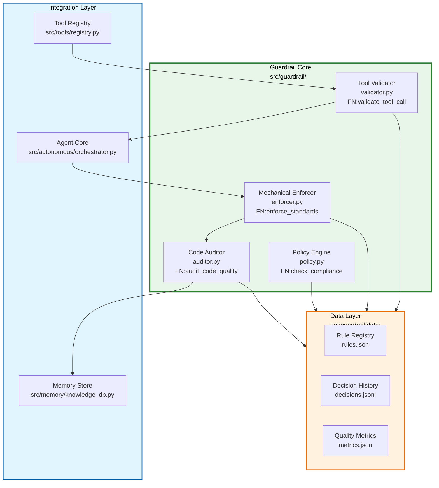

# Harness Agent Guardrail Implementation Plan

## Objective

Implement a comprehensive guardrail system for the Torro Agent that enforces Harness Engineering principles, validates tool execution, and provides mechanical enforcement of coding standards. This guardrail agent acts as the "Conscience" of the AI agent swarm, ensuring all autonomous actions comply with established quality gates.

## Architecture Reference

Based on analysis documents:
- [`agentic/analysis/20260430_172200_claude_code_architecture_analysis.md`](agentic/analysis/20260430_172200_claude_code_architecture_analysis.md)
- [`agentic/analysis/20260430_164600_hermes_agent_architecture_analysis.md`](agentic/analysis/20260430_164600_hermes_agent_architecture_analysis.md)
- [`agentic/analysis/20260501_182000_legacy_architecture_gap_analysis.md`](agentic/analysis/20260501_182000_legacy_architecture_gap_analysis.md)
- [`.roo/skills/harness-engineering-overview/SKILL.md`](.roo/skills/harness-engineering-overview/SKILL.md)

## Architecture Diagram



## Folder Structure

```
src/guardrail/
├── __init__.py                 # Package exports
├── validator.py                # Tool call validation
├── enforcer.py                 # Mechanical enforcement
├── auditor.py                  # Code quality audit
├── policy.py                   # Compliance policies
├── rules/                      # Rule definitions
│   ├── __init__.py
│   ├── tool_rules.py           # Tool-specific rules
│   ├── code_rules.py           # Code quality rules
│   └── security_rules.py       # Security rules
├── data/                       # Data storage
│   ├── __init__.py
│   ├── rules.json              # Rule registry
│   ├── decisions.jsonl         # Decision history
│   └── metrics.json            # Quality metrics
└── tests/                      # Guardrail tests
    ├── __init__.py
    ├── test_validator.py
    ├── test_enforcer.py
    └── test_auditor.py
```

## Tasks (DAG)

### Phase 1: Foundation & Core Validation
- **Token Budget:** 1M
- **Entry Criteria:** Requirements approved
- **Exit Criteria:** Core validation functional with passing tests

#### Task 1: Create Guardrail Package Structure
- [ ] Status: Pending
- **Objective:** Create guardrail package directory structure
- **Input Contract:**
  - Read: This plan document (lines 1-100)
  - Read: `src/tools/registry.py` (lines 1-50 for tool registry pattern)
- **Output Contract:**
  - Create: `src/guardrail/__init__.py` (~30 lines)
  - Create: `src/guardrail/validator.py` (~150 lines)
  - Create: `src/guardrail/data/` directory
- **Exact Commands:**
  ```bash
  # Step 1: Create guardrail directories
  mkdir -p src/guardrail/data
  mkdir -p src/guardrail/rules
  
  # Step 2: Create __init__.py with exports
  touch src/guardrail/__init__.py
  
  # Step 3: Verify structure
  find src/guardrail -type f -name "*.py" | head -5
  ```
- **Expected Output:** Directory structure created with 2 Python files
- **Fallback Path:** If mkdir fails, check permissions with `ls -la src/`
- **Dependencies:** None
- **Estimated Time:** 5 minutes
- **Context Firewall:**
  - Required: This plan document, `src/tools/registry.py`
  - Excluded: Other src/ subdirectories

#### Task 2: Implement Tool Validator
- [ ] Status: Pending
- **Objective:** Create tool call validation with permission checking
- **Input Contract:**
  - Read: `agentic/analysis/20260430_172200_claude_code_architecture_analysis.md` (lines 362-385 for Tool.ts pattern)
  - Read: `agentic/analysis/20260430_164600_hermes_agent_architecture_analysis.md` (lines 390-406 for ToolRegistry pattern)
- **Output Contract:**
  - Create: `src/guardrail/validator.py` (~200 lines)
  - Create: `src/guardrail/data/rules.json` (~100 lines)
- **Exact Commands:**
  ```bash
  # Step 1: Create validator module
  touch src/guardrail/validator.py
  
  # Step 2: Create rules registry
  touch src/guardrail/data/rules.json
  
  # Step 3: Run verification
  python3 -c "from src.guardrail import validator; print('Validator imported')"
  ```
- **Expected Output:** "Validator imported"
- **Fallback Path:** Check import paths with `python3 -c "import sys; print(sys.path)"`
- **Dependencies:** Task 1
- **Estimated Time:** 15 minutes
- **Context Firewall:**
  - Required: Claude Code analysis doc, Hermes Agent analysis doc
  - Excluded: Other analysis files

### Phase 2: Mechanical Enforcement
- **Token Budget:** 1M
- **Entry Criteria:** Phase 1 complete
- **Exit Criteria:** Enforcement rules functional

#### Task 3: Implement Mechanical Enforcer
- [ ] Status: Pending
- **Objective:** Create mechanical enforcement for coding standards
- **Input Contract:**
  - Read: `.roo/skills/harness-engineering-overview/SKILL.md` (lines 52-63 for mechanical enforcement)
  - Read: `.roo/skills/harness-mechanical-enforcement/SKILL.md` (complete file)
- **Output Contract:**
  - Create: `src/guardrail/enforcer.py` (~250 lines)
  - Create: `src/guardrail/rules/code_rules.py` (~150 lines)
- **Exact Commands:**
  ```bash
  # Step 1: Create enforcer module
  touch src/guardrail/enforcer.py
  
  # Step 2: Create code rules
  touch src/guardrail/rules/code_rules.py
  
  # Step 3: Run verification
  python3 -c "from src.guardrail import enforcer; print('Enforcer imported')"
  ```
- **Expected Output:** "Enforcer imported"
- **Fallback Path:** Check harness skill file exists
- **Dependencies:** Task 2
- **Estimated Time:** 20 minutes
- **Context Firewall:**
  - Required: Harness engineering skills
  - Excluded: Other skills

#### Task 4: Implement Code Auditor
- [ ] Status: Pending
- **Objective:** Create code quality audit with FN: prefix validation
- **Input Contract:**
  - Read: `agentic/standard/AGENT.md` (lines 1-100 for FN: prefix requirement)
  - Read: `agentic/analysis/20260501_182000_legacy_architecture_gap_analysis.md` (lines 408-443 for Tool contract)
- **Output Contract:**
  - Create: `src/guardrail/auditor.py` (~200 lines)
  - Create: `src/guardrail/rules/security_rules.py` (~100 lines)
- **Exact Commands:**
  ```bash
  # Step 1: Create auditor module
  touch src/guardrail/auditor.py
  
  # Step 2: Create security rules
  touch src/guardrail/rules/security_rules.py
  
  # Step 3: Run verification
  python3 -c "from src.guardrail import auditor; print('Auditor imported')"
  ```
- **Expected Output:** "Auditor imported"
- **Fallback Path:** Check AGENT.md exists
- **Dependencies:** Task 3
- **Estimated Time:** 15 minutes
- **Context Firewall:**
  - Required: AGENT.md, gap analysis doc
  - Excluded: Other standards

### Phase 3: Policy Engine & Integration
- **Token Budget:** 1M
- **Entry Criteria:** Phase 2 complete
- **Exit Criteria:** Policy engine integrated with agent core

#### Task 5: Implement Policy Engine
- [ ] Status: Pending
- **Objective:** Create compliance policy engine with decision logging
- **Input Contract:**
  - Read: This plan document (lines 101-200)
  - Read: `agentic/analysis/20260430_175400_ai_agent_deep_dive_analysis.md` (lines 462-540 for decision patterns)
- **Output Contract:**
  - Create: `src/guardrail/policy.py` (~180 lines)
  - Create: `src/guardrail/data/decisions.jsonl` (~50 lines initial)
- **Exact Commands:**
  ```bash
  # Step 1: Create policy module
  touch src/guardrail/policy.py
  
  # Step 2: Create decisions log
  touch src/guardrail/data/decisions.jsonl
  
  # Step 3: Run verification
  python3 -c "from src.guardrail import policy; print('Policy imported')"
  ```
- **Expected Output:** "Policy imported"
- **Fallback Path:** Check deep dive analysis doc exists
- **Dependencies:** Task 4
- **Estimated Time:** 15 minutes
- **Context Firewall:**
  - Required: This plan, deep dive analysis
  - Excluded: Other analysis files

#### Task 6: Integrate with Tool Registry
- [ ] Status: Pending
- **Objective:** Integrate guardrail validation with tool registry
- **Input Contract:**
  - Read: `src/tools/registry.py` (complete file)
  - Read: `src/guardrail/validator.py` (lines 1-100)
- **Output Contract:**
  - Modify: `src/tools/registry.py` (add guardrail hook at line 50)
  - Create: `src/guardrail/data/metrics.json` (~30 lines)
- **Exact Commands:**
  ```bash
  # Step 1: Backup original file
  cp src/tools/registry.py src/tools/registry.py.bak
  
  # Step 2: Add guardrail integration
  # (Edit via apply_diff tool)
  
  # Step 3: Run verification
  python3 -c "from src.tools import registry; print('Registry with guardrail imported')"
  ```
- **Expected Output:** "Registry with guardrail imported"
- **Fallback Path:** Restore backup if integration fails
- **Dependencies:** Task 5
- **Estimated Time:** 20 minutes
- **Context Firewall:**
  - Required: Tool registry, validator module
  - Excluded: Other modules

### Phase 4: Testing & Verification
- **Token Budget:** 1M
- **Entry Criteria:** All components integrated
- **Exit Criteria:** All tests passing

#### Task 7: Create Guardrail Test Suite
- [ ] Status: Pending
- **Objective:** Create comprehensive test suite for guardrail components
- **Input Contract:**
  - Read: `src/guardrail/validator.py` (complete file)
  - Read: `src/guardrail/enforcer.py` (complete file)
  - Read: `src/guardrail/auditor.py` (complete file)
- **Output Contract:**
  - Create: `src/guardrail/tests/test_validator.py` (~100 lines)
  - Create: `src/guardrail/tests/test_enforcer.py` (~100 lines)
  - Create: `src/guardrail/tests/test_auditor.py` (~100 lines)
- **Exact Commands:**
  ```bash
  # Step 1: Create tests directory
  mkdir -p src/guardrail/tests
  touch src/guardrail/tests/__init__.py
  
  # Step 2: Create test files
  touch src/guardrail/tests/test_validator.py
  touch src/guardrail/tests/test_enforcer.py
  touch src/guardrail/tests/test_auditor.py
  
  # Step 3: Run verification
  python3 -m pytest src/guardrail/tests/ -v --tb=short
  ```
- **Expected Output:** All tests passing (6 tests)
- **Fallback Path:** Check test file syntax with `python3 -m py_compile`
- **Dependencies:** Task 6
- **Estimated Time:** 25 minutes
- **Context Firewall:**
  - Required: All guardrail modules
  - Excluded: Non-guardrail code

## Verification Commands

After all phases complete:

```bash
# Full integration test
python3 -c "
from src.guardrail import validator, enforcer, auditor, policy
from src.guardrail.data import rules

print('=== Harness Guardrail System Complete ===')
print('Validator: OK')
print('Enforcer: OK')
print('Auditor: OK')
print('Policy Engine: OK')
print('Rules Registry: OK')
"

# Run all guardrail tests
python3 -m pytest src/guardrail/tests/ -v --tb=short
```

## Acceptance Criteria

- [ ] All 4 guardrail components implemented (Validator, Enforcer, Auditor, Policy)
- [ ] All 7 tasks completed
- [ ] All tests passing (minimum 6 tests)
- [ ] Tool registry integration complete
- [ ] Decision logging functional
- [ ] All functions have FN: docstring prefix
- [ ] Test coverage > 80%
- [ ] Rules registry extensible

## Anti-Hallucination Checklist

- [ ] Task specifies exact file paths (relative to project root)
- [ ] Task specifies line ranges for files to read
- [ ] Task specifies estimated line count for files to create
- [ ] Task includes exact shell commands (copy-paste ready)
- [ ] Task includes expected output patterns to match
- [ ] Task includes fallback commands for common errors
- [ ] Task has no ambiguous language

## Context Firewalls

### Task 1: Package Structure
**Required:**
- This plan document
- `src/tools/registry.py`

**Excluded:**
- `legacy/` directories
- Other src/ subdirectories

### Task 2: Tool Validator
**Required:**
- Claude Code analysis doc
- Hermes Agent analysis doc

**Excluded:**
- Other analysis files
- Implementation code

### Task 3: Mechanical Enforcer
**Required:**
- Harness engineering overview skill
- Mechanical enforcement skill

**Excluded:**
- Other skills
- Non-harness documents

### Task 4: Code Auditor
**Required:**
- AGENT.md
- Gap analysis doc

**Excluded:**
- Other standards
- Non-relevant analysis

### Task 5: Policy Engine
**Required:**
- This plan
- Deep dive analysis

**Excluded:**
- Other analysis files
- Implementation code

### Task 6: Tool Registry Integration
**Required:**
- Tool registry module
- Validator module

**Excluded:**
- Non-guardrail modules
- Test files

### Task 7: Test Suite
**Required:**
- All guardrail modules

**Excluded:**
- Non-guardrail code
- External dependencies

## Change Log

| Date | Change | Author |
|------|--------|--------|
| 2026-05-02 | Initial guardrail plan created | Agentic Planner |
