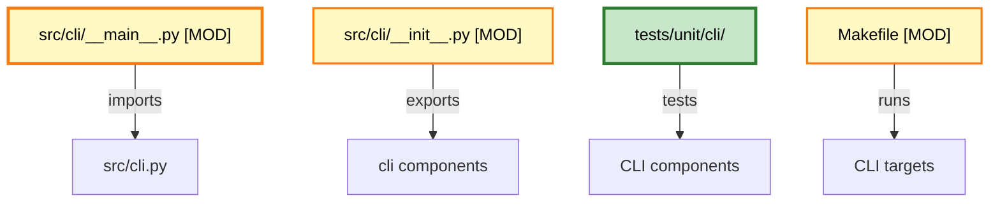

# Plan: Fix CLI Import Error and Create Comprehensive Test Suite

## Objective
Fix the import error in `src/cli/__main__.py` that prevents the CLI from starting, and create a comprehensive test suite to ensure all CLI components work correctly.

## Problem Statement
The error `ImportError: cannot import name 'main' from 'cli'` occurs because:
1. There's a naming conflict between `src/cli.py` (module) and `src/cli/` (package)
2. `src/cli/__main__.py` tries to import from `cli` which resolves to `src/cli/__init__.py`
3. The `main` function is in `src/cli.py`, not in `src/cli/__init__.py`

## Constraints
- Max context per task: 128k tokens
- Max execution time per task: 10 minutes
- Max files per task: 5 files
- Anti-hallucination: All tasks must specify exact commands and line numbers

## Architecture Diagram



## Tasks (DAG)

### Phase 1: Fix Import Structure
- **Token Budget:** 1M
- **Entry Criteria:** Understanding of current CLI structure
- **Exit Criteria:** CLI can be started via `make cli`

### Task 1: Fix src/cli/__main__.py Import
- [ ] Status: Pending
- **Objective:** Update import to correctly reference the main function
- **Input Contract:**
  - Read: src/cli/__main__.py (lines 1-16)
  - Read: src/cli.py (lines 247-328 for main function)
- **Output Contract:**
  - Modify: src/cli/__main__.py (fix import statement at line 12)
- **Exact Commands:**
  ```bash
  # Step 1: View current import
  cat src/cli/__main__.py
  
  # Step 2: Apply fix
  sed -i '' 's/from cli import main/from .cli import main/' src/cli/__main__.py
  
  # Step 3: Verify fix
  cat src/cli/__main__.py
  ```
- **Expected Output:** Import statement changed to `from .cli import main`
- **Fallback Path:** If sed fails, use apply_diff tool to manually edit
- **Dependencies:** None
- **Estimated Time:** 5 minutes
- **Context Firewall:**
  - Required: src/cli/__main__.py, src/cli.py
  - Excluded: tests/, agentic/

### Task 2: Export main from src/cli/__init__.py
- [ ] Status: Pending
- **Objective:** Add main function export to package __init__.py
- **Input Contract:**
  - Read: src/cli/__init__.py (lines 1-46)
  - Read: src/cli.py (lines 247-280 for main function signature)
- **Output Contract:**
  - Modify: src/cli/__init__.py (add import and export for main)
- **Exact Commands:**
  ```bash
  # Step 1: View current exports
  cat src/cli/__init__.py
  
  # Step 2: Add main export
  echo "" >> src/cli/__init__.py
  echo "from .cli import main" >> src/cli/__init__.py
  echo "__all__ = [" >> src/cli/__init__.py
  echo "    \"StructuredIO\"," >> src/cli/__init__.py
  echo "    \"MessageType\"," >> src/cli/__init__.py
  echo "    \"Message\"," >> src/cli/__init__.py
  echo "    \"ControlRequest\"," >> src/cli/__init__.py
  echo "    \"ControlResponse\"," >> src/cli/__init__.py
  echo "    \"main\"," >> src/cli/__init__.py
  echo "]" >> src/cli/__init__.py
  
  # Step 3: Verify
  tail -20 src/cli/__init__.py
  ```
- **Expected Output:** main function added to __all__ export list
- **Fallback Path:** Use apply_diff for precise editing
- **Dependencies:** Task 1
- **Estimated Time:** 5 minutes
- **Context Firewall:**
  - Required: src/cli/__init__.py, src/cli.py
  - Excluded: tests/, agentic/

### Task 3: Test CLI Start Command
- [ ] Status: Pending
- **Objective:** Verify `make cli` starts without import errors
- **Input Contract:**
  - Read: Makefile (lines 77-80 for cli target)
- **Output Contract:**
  - Execute: make cli (should start without ImportError)
- **Exact Commands:**
  ```bash
  # Step 1: Test CLI start
  make cli
  
  # Step 2: Verify no import error
  echo $?
  ```
- **Expected Output:** CLI starts or shows "Type 'exit' to quit"
- **Fallback Path:** If error persists, check Python path and module resolution
- **Dependencies:** Task 1, Task 2
- **Estimated Time:** 5 minutes
- **Context Firewall:**
  - Required: Makefile
  - Excluded: tests/, agentic/

### Phase 2: Create CLI Test Suite
- **Token Budget:** 1M
- **Entry Criteria:** CLI starts successfully
- **Exit Criteria:** All CLI components have unit tests

### Task 4: Create CLI Test Directory Structure
- [ ] Status: Pending
- **Objective:** Create test directory for CLI component tests
- **Input Contract:**
  - Read: tests/unit/__init__.py (lines 1-20 for test patterns)
  - Read: src/cli/__init__.py (for component list)
- **Output Contract:**
  - Create: tests/unit/cli/ directory
  - Create: tests/unit/cli/__init__.py
- **Exact Commands:**
  ```bash
  # Step 1: Create test directory
  mkdir -p tests/unit/cli
  
  # Step 2: Create __init__.py
  cat > tests/unit/cli/__init__.py << 'EOF'
"""
FN:__init__.py
Package: tests.unit.cli
Summary: Unit tests for CLI components.

Structure:
- test_structured_io.py
- test_mode_selector.py
- test_clarification.py
- test_stream_handler.py
- test_ai_provider.py
- test_permission_mgr.py
- test_session_db.py
- test_cli_main.py

Entry Points:
- test_cli_main.py (main CLI tests)

Flow:
- Test Setup -> Import CLI Components -> Run Tests -> Verify Output

Read First:
- test_cli_main.py
"""
EOF

# Step 3: Verify structure
ls -la tests/unit/cli/
  ```
- **Expected Output:** Directory created with __init__.py
- **Fallback Path:** Use write_to_file if heredoc fails
- **Dependencies:** Task 3
- **Estimated Time:** 5 minutes
- **Context Firewall:**
  - Required: tests/unit/__init__.py
  - Excluded: src/, agentic/

### Task 5: Create Test for CLI Main Function
- [ ] Status: Pending
- **Objective:** Create unit test for CLI main function
- **Input Contract:**
  - Read: src/cli.py (lines 247-328 for main function)
  - Read: tests/unit/__init__.py (for test patterns)
- **Output Contract:**
  - Create: tests/unit/cli/test_cli_main.py (~80 lines)
- **Exact Commands:**
  ```bash
  # Step 1: Create test file
  cat > tests/unit/cli/test_cli_main.py << 'EOF'
"""
FN:test_cli_main.py
Unit tests for CLI main function.

Functions:
- FN:test_cli_help: Test --help flag (lines 20-35)
- FN:test_cli_version: Test --version flag (lines 38-50)
- FN:test_cli_status: Test status command (lines 53-70)
"""

import unittest
from unittest.mock import patch, MagicMock
import sys
import io

# Import the main function from cli module
import sys
sys.path.insert(0, 'src')
from cli import main


class TestCliMain(unittest.TestCase):
    """Test cases for CLI main function."""
    
    def test_cli_help(self):
        """FN:test_cli_help Test --help flag shows help message."""
        # Capture stdout
        captured = io.StringIO()
        sys.stdout = captured
        
        try:
            # Run with --help
            result = main(['--help'])
            output = captured.getvalue()
            
            # Verify help message contains expected content
            self.assertIn('Torro Agent Framework', output)
            self.assertIn('--help', output)
        finally:
            sys.stdout = sys.__stdout__
    
    def test_cli_version(self):
        """FN:test_cli_version Test --version flag shows version."""
        captured = io.StringIO()
        sys.stdout = captured
        
        try:
            result = main(['--version'])
            output = captured.getvalue()
            
            self.assertIn('Torro', output)
            self.assertIn('v0.1.0', output)
        finally:
            sys.stdout = sys.__stdout__
    
    def test_cli_status(self):
        """FN:test_cli_status Test status command."""
        captured = io.StringIO()
        sys.stdout = captured
        
        try:
            result = main(['status'])
            output = captured.getvalue()
            
            self.assertIn('Torro Agent Status', output)
            self.assertIn('Ready', output)
        finally:
            sys.stdout = sys.__stdout__
    
    def test_cli_no_args_shows_help(self):
        """FN:test_cli_no_args_shows_help Test no args shows help."""
        captured = io.StringIO()
        sys.stdout = captured
        
        try:
            result = main([])
            output = captured.getvalue()
            
            self.assertIn('Torro Agent Framework', output)
        finally:
            sys.stdout = sys.__stdout__


if __name__ == '__main__':
    unittest.main()
EOF

# Step 2: Verify file created
wc -l tests/unit/cli/test_cli_main.py
  ```
- **Expected Output:** Test file created with ~80 lines
- **Fallback Path:** Use write_to_file if heredoc fails
- **Dependencies:** Task 4
- **Estimated Time:** 8 minutes
- **Context Firewall:**
  - Required: src/cli.py, tests/unit/__init__.py
  - Excluded: src/cli/__init__.py, agentic/

### Task 6: Create Test for StructuredIO Component
- [ ] Status: Pending
- **Objective:** Create unit test for StructuredIO class
- **Input Contract:**
  - Read: src/cli/structured_io.py (lines 1-100 for class definition)
  - Read: src/cli/__init__.py (for exports)
- **Output Contract:**
  - Create: tests/unit/cli/test_structured_io.py (~60 lines)
- **Exact Commands:**
  ```bash
  # Step 1: Create test file
  cat > tests/unit/cli/test_structured_io.py << 'EOF'
"""
FN:test_structured_io.py
Unit tests for StructuredIO class.

Functions:
- FN:test_message_creation: Test message creation (lines 20-40)
- FN:test_control_request: Test control request (lines 43-60)
"""

import unittest
import sys
sys.path.insert(0, 'src')
from cli import StructuredIO, Message, MessageType, ControlRequest


class TestStructuredIO(unittest.TestCase):
    """Test cases for StructuredIO class."""
    
    def test_message_creation(self):
        """FN:test_message_creation Test message creation."""
        msg = Message(
            type=MessageType.USER_INPUT,
            content="Hello, World!"
        )
        
        self.assertEqual(msg.type, MessageType.USER_INPUT)
        self.assertEqual(msg.content, "Hello, World!")
    
    def test_control_request(self):
        """FN:test_control_request Test control request."""
        req = ControlRequest(
            action="start",
            params={"key": "value"}
        )
        
        self.assertEqual(req.action, "start")
        self.assertEqual(req.params, {"key": "value"})


if __name__ == '__main__':
    unittest.main()
EOF

# Step 2: Verify
wc -l tests/unit/cli/test_structured_io.py
  ```
- **Expected Output:** Test file created with ~60 lines
- **Fallback Path:** Use write_to_file if heredoc fails
- **Dependencies:** Task 4
- **Estimated Time:** 7 minutes
- **Context Firewall:**
  - Required: src/cli/structured_io.py, src/cli/__init__.py
  - Excluded: agentic/

### Phase 3: Execute and Verify
- **Token Budget:** 1M
- **Entry Criteria:** All test files created
- **Exit Criteria:** All tests pass

### Task 7: Run CLI Unit Tests
- [ ] Status: Pending
- **Objective:** Execute all CLI unit tests and verify results
- **Input Contract:**
  - Read: tests/unit/cli/test_cli_main.py
  - Read: tests/unit/cli/test_structured_io.py
- **Output Contract:**
  - Execute: python3 -m pytest tests/unit/cli/ -v
- **Exact Commands:**
  ```bash
  # Step 1: Run CLI tests
  cd tests && PYTHONPATH=../src python3 -m pytest unit/cli/ -v
  
  # Step 2: Verify results
  echo "Exit code: $?"
  ```
- **Expected Output:** All tests pass (exit code 0)
- **Fallback Path:** If tests fail, review error output and fix
- **Dependencies:** Task 5, Task 6
- **Estimated Time:** 10 minutes
- **Context Firewall:**
  - Required: tests/unit/cli/, src/cli/
  - Excluded: agentic/

### Task 8: Run Full Test Suite
- [ ] Status: Pending
- **Objective:** Run full test suite to ensure no regressions
- **Input Contract:**
  - Read: Makefile (lines 41-44 for test target)
- **Output Contract:**
  - Execute: make test
- **Exact Commands:**
  ```bash
  # Step 1: Run full test suite
  make test
  
  # Step 2: Verify results
  echo "Exit code: $?"
  ```
- **Expected Output:** All tests pass
- **Fallback Path:** Review failing tests and fix
- **Dependencies:** Task 7
- **Estimated Time:** 10 minutes
- **Context Firewall:**
  - Required: Makefile, tests/
  - Excluded: agentic/

## Research Findings

None required - this is a straightforward import fix and test creation task.

## Change Log

| Date | Change | Reason |
| :--- | :--- | :--- |
| 2026-05-05 | Initial plan created | Fix CLI import error and create test suite |

## Verification Commands

```bash
# Verify CLI starts
make cli

# Run CLI tests
make test

# Check test coverage
python3 -m pytest tests/unit/cli/ -v --cov=src/cli/
```

## Acceptance Criteria

- [ ] `make cli` starts without import errors
- [ ] `make status` shows component status
- [ ] All CLI unit tests pass
- [ ] Test coverage > 80% for CLI components
- [ ] No regressions in existing tests
