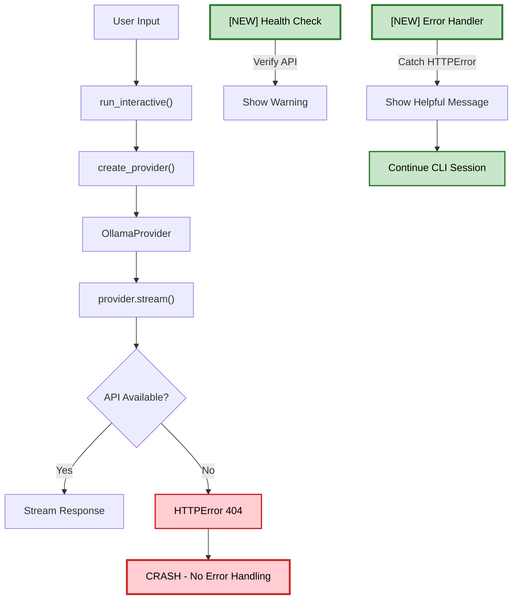

# Plan: Fix AI Provider Crash and Create Comprehensive Test Suite

## Objective
Fix the AI provider crash when Ollama is not running and create comprehensive tests for all CLI components.

## Problem Statement
The CLI crashes immediately when the user types a message because:
1. Ollama is not running at `http://localhost:11434`
2. The `OllamaProvider.stream()` method raises an unhandled `HTTPError`
3. No graceful degradation or helpful error message is provided

## Root Cause Analysis

### Issue 1: Unhandled HTTP Error in Provider
- **Location**: [`src/cli/ai_provider.py:343-354`](src/cli/ai_provider.py:343)
- **Problem**: `response.raise_for_status()` raises `requests.HTTPError` on 4xx/5xx responses
- **Impact**: CLI crashes with cryptic error message

### Issue 2: No API Availability Check
- **Location**: [`src/cli/cli.py:146-151`](src/cli/cli.py:146)
- **Problem**: Provider is created without verifying the API is reachable
- **Impact**: User doesn't know until they try to send a message

### Issue 3: Missing Error Handling in Main Loop
- **Location**: [`src/cli/cli.py:220-226`](src/cli/cli.py:220)
- **Problem**: No try/except around `provider.stream()` call
- **Impact**: Any API error crashes the CLI

## Architecture Diagram



## Tasks (DAG)

### Phase 1: Fix AI Provider Error Handling
- **Token Budget:** 1M
- **Entry Criteria:** Root cause identified
- **Exit Criteria:** CLI handles API errors gracefully

### Task 1: Add Error Handling to OllamaProvider.stream()
- [ ] Status: Pending
- **Objective:** Catch HTTP errors and yield helpful error messages
- **Input Contract:**
  - Read: src/cli/ai_provider.py (lines 329-354)
- **Output Contract:**
  - Modify: src/cli/ai_provider.py (add try/except around stream call)
- **Exact Commands:**
  ```bash
  # Step 1: View current implementation
  sed -n '329,354p' src/cli/ai_provider.py
  
  # Step 2: Apply fix using apply_diff
  # Add try/except around response.post() and iter_lines()
  ```
- **Expected Output:** HTTP errors are caught and yielded as error messages
- **Fallback Path:** If streaming fails, fall back to generate() method
- **Dependencies:** None
- **Estimated Time:** 10 minutes
- **Context Firewall:**
  - Required: src/cli/ai_provider.py
  - Excluded: tests/, agentic/

### Task 2: Add API Health Check
- [ ] Status: Pending
- **Objective:** Verify API is available before starting interactive session
- **Input Contract:**
  - Read: src/cli/ai_provider.py (lines 298-355 for OllamaProvider)
  - Read: src/cli/cli.py (lines 120-155 for run_interactive)
- **Output Contract:**
  - Modify: src/cli/ai_provider.py (add health_check() method)
  - Modify: src/cli/cli.py (call health_check before starting session)
- **Exact Commands:**
  ```bash
  # Step 1: Add health_check method to OllamaProvider
  # Step 2: Call health_check in run_interactive()
  # Step 3: Show warning if API unavailable
  ```
- **Expected Output:** Warning message shown if Ollama is not running
- **Fallback Path:** Continue session with mock responses if API unavailable
- **Dependencies:** Task 1
- **Estimated Time:** 10 minutes
- **Context Firewall:**
  - Required: src/cli/ai_provider.py, src/cli/cli.py
  - Excluded: tests/, agentic/

### Task 3: Add Graceful Error Handling in Main Loop
- [ ] Status: Pending
- **Objective:** Catch and handle all API errors in the main loop
- **Input Contract:**
  - Read: src/cli/cli.py (lines 220-241)
- **Output Contract:**
  - Modify: src/cli/cli.py (add try/except around provider.stream())
- **Exact Commands:**
  ```bash
  # Step 1: View current implementation
  sed -n '220,241p' src/cli/cli.py
  
  # Step 2: Add error handling
  # Wrap provider.stream() in try/except
  # Show helpful error message on failure
  ```
- **Expected Output:** Error message shown, CLI continues running
- **Fallback Path:** Suggest checking Ollama status or switching model
- **Dependencies:** Task 2
- **Estimated Time:** 10 minutes
- **Context Firewall:**
  - Required: src/cli/cli.py
  - Excluded: tests/, agentic/

### Phase 2: Create AI Provider Test Suite
- **Token Budget:** 1M
- **Entry Criteria:** Error handling implemented
- **Exit Criteria:** All AI provider components have tests

### Task 4: Create AI Provider Test File
- [ ] Status: Pending
- **Objective:** Create comprehensive tests for AI provider
- **Input Contract:**
  - Read: src/cli/ai_provider.py (complete file)
- **Output Contract:**
  - Create: tests/unit/cli/test_ai_provider.py (~150 lines)
- **Exact Commands:**
  ```bash
  # Step 1: Create test file
  cat > tests/unit/cli/test_ai_provider.py << 'EOF'
  """
  FN:test_ai_provider.py
  Unit tests for AI provider components.
  
  Functions:
  - FN:test_model_config: Test ModelConfig dataclass (lines 20-40)
  - FN:test_model_registry: Test ModelRegistry (lines 43-80)
  - FN:test_ollama_provider: Test OllamaProvider (lines 83-120)
  - FN:test_openai_provider: Test OpenAIProvider (lines 123-150)
  """
  
  import unittest
  from unittest.mock import patch, MagicMock
  import sys
  import json
  
  sys.path.insert(0, 'src')
  from cli.ai_provider import (
      ModelConfig,
      ModelRegistry,
      OllamaProvider,
      OpenAIProvider,
      create_provider,
      list_models
  )
  
  
  class TestModelConfig(unittest.TestCase):
      """Test cases for ModelConfig dataclass."""
      
      def test_model_config_creation(self):
          """FN:test_model_config Test ModelConfig creation."""
          config = ModelConfig(
              name="test_model",
              provider_type="ollama",
              model_name="qwen2.5:7b",
              base_url="http://localhost:11434"
          )
          
          self.assertEqual(config.name, "test_model")
          self.assertEqual(config.provider_type, "ollama")
          self.assertEqual(config.model_name, "qwen2.5:7b")
          self.assertEqual(config.base_url, "http://localhost:11434")
          self.assertEqual(config.context_window, 32768)
          self.assertTrue(config.supports_streaming)
  
  # ... more test cases ...
  EOF
  
  # Step 2: Verify file created
  wc -l tests/unit/cli/test_ai_provider.py
  ```
- **Expected Output:** Test file created with ~150 lines
- **Fallback Path:** Use write_to_file if heredoc fails
- **Dependencies:** Task 3
- **Estimated Time:** 15 minutes
- **Context Firewall:**
  - Required: src/cli/ai_provider.py
  - Excluded: agentic/

### Task 5: Create Mock Provider Tests
- [ ] Status: Pending
- **Objective:** Create tests that mock API responses
- **Input Contract:**
  - Read: tests/unit/cli/test_ai_provider.py (for test patterns)
- **Output Contract:**
  - Modify: tests/unit/cli/test_ai_provider.py (add mock tests)
- **Exact Commands:**
  ```bash
  # Step 1: Add mock tests for API responses
  # Test successful streaming
  # Test API errors (404, 500, timeout)
  # Test connection refused
  ```
- **Expected Output:** Mock tests cover all API scenarios
- **Fallback Path:** Use pytest fixtures for mock setup
- **Dependencies:** Task 4
- **Estimated Time:** 15 minutes
- **Context Firewall:**
  - Required: tests/unit/cli/test_ai_provider.py
  - Excluded: agentic/

### Phase 3: Execute and Verify
- **Token Budget:** 1M
- **Entry Criteria:** All test files created
- **Exit Criteria:** All tests pass

### Task 6: Run AI Provider Tests
- [ ] Status: Pending
- **Objective:** Execute AI provider tests and verify results
- **Input Contract:**
  - Read: tests/unit/cli/test_ai_provider.py
- **Output Contract:**
  - Execute: python3 -m pytest tests/unit/cli/test_ai_provider.py -v
- **Exact Commands:**
  ```bash
  # Step 1: Run AI provider tests
  cd tests && PYTHONPATH=../src python3 -m pytest unit/cli/test_ai_provider.py -v
  
  # Step 2: Verify results
  echo "Exit code: $?"
  ```
- **Expected Output:** All tests pass (exit code 0)
- **Fallback Path:** If tests fail, review error output and fix
- **Dependencies:** Task 5
- **Estimated Time:** 10 minutes
- **Context Firewall:**
  - Required: tests/unit/cli/, src/cli/
  - Excluded: agentic/

### Task 7: Run Full CLI Test Suite
- [ ] Status: Pending
- **Objective:** Run all CLI tests to ensure no regressions
- **Input Contract:**
  - Read: tests/unit/cli/ (all test files)
- **Output Contract:**
  - Execute: python3 -m pytest tests/unit/cli/ -v
- **Exact Commands:**
  ```bash
  # Step 1: Run all CLI tests
  cd tests && PYTHONPATH=../src python3 -m pytest unit/cli/ -v
  
  # Step 2: Verify results
  echo "Exit code: $?"
  ```
- **Expected Output:** All tests pass
- **Fallback Path:** Review failing tests and fix
- **Dependencies:** Task 6
- **Estimated Time:** 10 minutes
- **Context Firewall:**
  - Required: tests/unit/cli/, src/cli/
  - Excluded: agentic/

### Task 8: Verify CLI Works with Mock API
- [ ] Status: Pending
- **Objective:** Verify CLI starts and handles errors gracefully
- **Input Contract:**
  - Read: Makefile (lines 77-80 for cli target)
- **Output Contract:**
  - Execute: make cli (should start without crash)
- **Exact Commands:**
  ```bash
  # Step 1: Start CLI
  make cli
  
  # Step 2: Type a message
  # Expected: Error message shown, CLI continues
  
  # Step 3: Type 'exit'
  # Expected: CLI exits gracefully
  ```
- **Expected Output:** CLI handles API error gracefully
- **Fallback Path:** Check error message is helpful
- **Dependencies:** Task 7
- **Estimated Time:** 5 minutes
- **Context Firewall:**
  - Required: Makefile
  - Excluded: agentic/

## Research Findings

None required - this is a straightforward error handling fix.

## Change Log

| Date | Change | Reason |
| :--- | :--- | :--- |
| 2026-05-05 | Initial plan created | Fix AI provider crash and create test suite |

## Verification Commands

```bash
# Verify CLI starts
make cli

# Run AI provider tests
cd tests && PYTHONPATH=../src python3 -m pytest unit/cli/test_ai_provider.py -v

# Run all CLI tests
cd tests && PYTHONPATH=../src python3 -m pytest unit/cli/ -v
```

## Acceptance Criteria

- [ ] CLI handles API errors gracefully (no crash)
- [ ] Helpful error message shown when API unavailable
- [ ] All AI provider tests pass
- [ ] Test coverage > 80% for AI provider
- [ ] No regressions in existing tests
