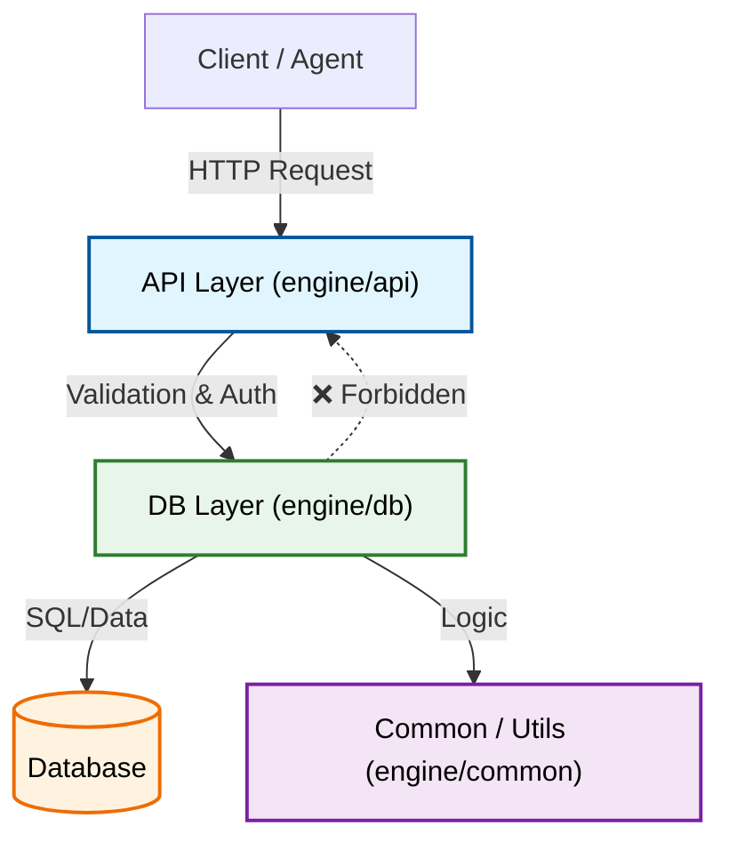

# Backend Architecture & Patterns

## Layered Architecture (3-Tier)

Torro follows a strict 3-tier layered architecture to ensure separation of concerns and testability.

### 1. API Layer (engine/api)
- **Role**: Handles HTTP entry points, request validation, and response formatting.
- **Rules**:
  - Thin handlers only.
  - MUST use `Pydantic V2` for validation.
  - All logic MUST be decoupled into a `tasks/` sub-directory.
  - Dependency: Calls Task Layer.

### 2. Task Layer (engine/api/*/tasks)
- **Role**: Orchestrates business logic.
- **Rules**:
  - Framework-agnostic (no `request` or `flask` objects).
  - If a task exceeds 200 lines, it MUST be split (Principle 1).
  - Dependency: Calls DB Layer.

### 3. DB Layer (engine/db)
- **Role**: Data persistence and retrieval.
- **Rules**:
  - Use `SQLModel` exclusively.
  - CRUD operations in `utils/`.
  - Dependency: Calls Common/Utils.

## Dependency Direction
API -> Task -> DB -> Common/Utils. **DB should NEVER import API.**

